05 CSI online typing: Plotting and analysis
================
Kirsten Stark
19 März, 2021

## Load packages

``` r
library(dplyr)
```

    ## 
    ## Attaching package: 'dplyr'

    ## The following objects are masked from 'package:stats':
    ## 
    ##     filter, lag

    ## The following objects are masked from 'package:base':
    ## 
    ##     intersect, setdiff, setequal, union

``` r
library(tidyr)
library(lme4)
```

    ## Loading required package: Matrix

    ## 
    ## Attaching package: 'Matrix'

    ## The following objects are masked from 'package:tidyr':
    ## 
    ##     expand, pack, unpack

``` r
library(lmerTest)
```

    ## 
    ## Attaching package: 'lmerTest'

    ## The following object is masked from 'package:lme4':
    ## 
    ##     lmer

    ## The following object is masked from 'package:stats':
    ## 
    ##     step

``` r
library(Rmisc)
```

    ## Loading required package: lattice

    ## Loading required package: plyr

    ## ------------------------------------------------------------------------------

    ## You have loaded plyr after dplyr - this is likely to cause problems.
    ## If you need functions from both plyr and dplyr, please load plyr first, then dplyr:
    ## library(plyr); library(dplyr)

    ## ------------------------------------------------------------------------------

    ## 
    ## Attaching package: 'plyr'

    ## The following objects are masked from 'package:dplyr':
    ## 
    ##     arrange, count, desc, failwith, id, mutate, rename, summarise,
    ##     summarize

``` r
library(Cairo)
#library(strengejacke)
library(ggplot2)
library(sjPlot)

options(scipen=999)

rm(list = ls())
options( "encoding" = "UTF-8" )
```

## Load and preprocess data

``` r
# input 
input = "data_long_final.csv"

# load data
df <- read.csv(here::here("data", input))
```

Check amount of participants and trials

``` r
# no. of participants: 
length(unique(df$subject))
```

    ## [1] 30

``` r
# no. of trials is 160 per participant? 
nrow(df) == 160 * length(unique(df$subject))
```

    ## [1] TRUE

Factorize columns

``` r
# factorize columns
is.numeric(df$timing.01)
```

    ## [1] TRUE

``` r
df$PosOr <- as.factor(df$PosOr)
df$subject <- as.factor(df$subject)
```

# Plotting

Make plots suitable for APA format, font sizes can be adjusted

``` r
apatheme <- theme_bw()+
  theme(plot.title=element_text(family="Arial",size=22,hjust = .5),
        panel.grid.major=element_blank(), panel.grid.minor=element_blank(),
        panel.border=element_blank(),axis.line=element_line(),
        text=element_text(family="Arial",size=16))
```

### Descriptives

``` r
(means_final<- df %>% filter(!is.na(correct)) %>% 
   filter(category != "Filler") %>% 
   Rmisc::summarySEwithin(.,"timing.01",idvar = "subject",
                          withinvars = "PosOr", na.rm = T))
```

    ##   PosOr   N timing.01       sd       se       ci
    ## 1     1 648  1151.499 442.9892 17.40226 34.17172
    ## 2     2 637  1224.975 548.8173 21.74493 42.70055
    ## 3     3 642  1247.021 523.0775 20.64422 40.53847
    ## 4     4 637  1285.339 593.7701 23.52603 46.19808
    ## 5     5 628  1319.104 561.7945 22.41804 44.02354

``` r
# Export as word file
library(flextable)
huxt_word <- huxtable::huxtable(means_final)
huxt_word <- huxtable::set_number_format(huxt_word, round(2))
huxtable::quick_docx(huxt_word, 
                     file = here::here("tables",
                                       "CSI_online_typing_RT_summary.docx"), 
                                       open = FALSE)
```

### RTs by ordinal position

``` r
(plot_rt <- df %>% filter(!is.na(correct)) %>% 
   filter(category != "Filler") %>% 
    ggplot(., aes(x=PosOr, y=timing.01, group = correct)) +
    stat_summary(fun=mean,  geom="point", size = 2)+
    stat_summary(fun=mean,  geom="line", size = 1) +
    apatheme+
    labs(x="Ordinal Position ",y ="RT (ms)")+
   annotate(geom="text", x=1.5, y=1330, label="n = 30", 
           color="black", size = 8))
```

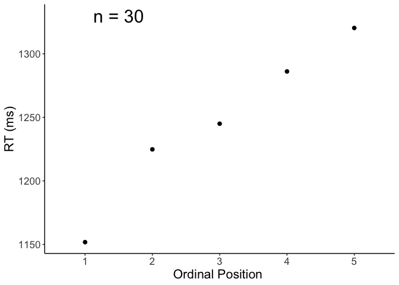<!-- -->

``` r
filename <- "CSI_online_typing_plot_rt.pdf"
ggsave(plot_rt, filename = 
         here::here("figures", filename),
       width = 18, height = 13, units = "cm", 
       dpi = 300, device = cairo_pdf)
embedFonts(file = here::here("figures", filename))
```

### … with fillers for control

``` r
(plot_rt_fillers <- df %>% filter(!is.na(correct)) %>% 
    mutate(kind = case_when(category == "Filler" ~"Filler",
                          category != "Filler" ~"Experimental")) %>%
    ggplot(., aes(x=PosOr, y=timing.01, group=kind, color=kind)) +
    stat_summary(fun=mean,  geom="point", size = 2)+
    stat_summary(fun=mean,  geom="line", size = 1) +
    apatheme+
    labs(x="Ordinal Position ",y ="RT (ms)", color = "Trial type")+
  annotate(geom="text", x=1.5, y=1350, label="n = 30", 
           color="black", size = 8))
```

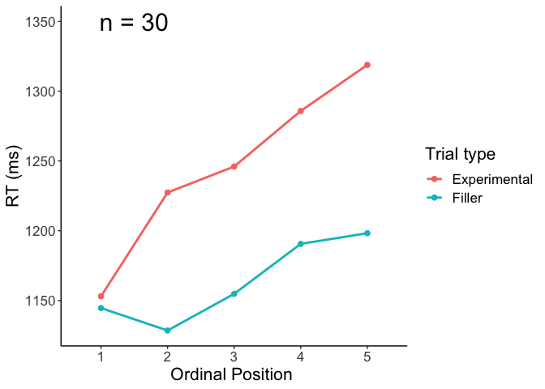<!-- -->

``` r
filename <- "CSI_online_typing_plot_rt_with_fillers.pdf"
ggsave(plot_rt_fillers, filename = 
         here::here("figures", filename),
       width = 18, height = 13, units = "cm", 
       dpi = 300, device = cairo_pdf)
embedFonts(file = here::here("figures", filename))
```

### Plot by subcategory

``` r
(plot_rt_by_cat <- df %>% filter(!is.na(correct)) %>% 
   filter(category != "Filler") %>% 
    ggplot(., aes(x=PosOr, y=timing.01)) +
    stat_summary(fun=mean,  geom="point", size = 2)+
    stat_summary(fun=mean,  geom="line", size = 1) +
    facet_wrap(~category) +
    apatheme+
    labs(x="Ordinal Position ",y ="RT (ms)"))
```

    ## geom_path: Each group consists of only one observation. Do you need to adjust
    ## the group aesthetic?
    ## geom_path: Each group consists of only one observation. Do you need to adjust
    ## the group aesthetic?
    ## geom_path: Each group consists of only one observation. Do you need to adjust
    ## the group aesthetic?
    ## geom_path: Each group consists of only one observation. Do you need to adjust
    ## the group aesthetic?
    ## geom_path: Each group consists of only one observation. Do you need to adjust
    ## the group aesthetic?
    ## geom_path: Each group consists of only one observation. Do you need to adjust
    ## the group aesthetic?
    ## geom_path: Each group consists of only one observation. Do you need to adjust
    ## the group aesthetic?
    ## geom_path: Each group consists of only one observation. Do you need to adjust
    ## the group aesthetic?
    ## geom_path: Each group consists of only one observation. Do you need to adjust
    ## the group aesthetic?
    ## geom_path: Each group consists of only one observation. Do you need to adjust
    ## the group aesthetic?
    ## geom_path: Each group consists of only one observation. Do you need to adjust
    ## the group aesthetic?
    ## geom_path: Each group consists of only one observation. Do you need to adjust
    ## the group aesthetic?
    ## geom_path: Each group consists of only one observation. Do you need to adjust
    ## the group aesthetic?
    ## geom_path: Each group consists of only one observation. Do you need to adjust
    ## the group aesthetic?
    ## geom_path: Each group consists of only one observation. Do you need to adjust
    ## the group aesthetic?
    ## geom_path: Each group consists of only one observation. Do you need to adjust
    ## the group aesthetic?
    ## geom_path: Each group consists of only one observation. Do you need to adjust
    ## the group aesthetic?
    ## geom_path: Each group consists of only one observation. Do you need to adjust
    ## the group aesthetic?
    ## geom_path: Each group consists of only one observation. Do you need to adjust
    ## the group aesthetic?
    ## geom_path: Each group consists of only one observation. Do you need to adjust
    ## the group aesthetic?
    ## geom_path: Each group consists of only one observation. Do you need to adjust
    ## the group aesthetic?
    ## geom_path: Each group consists of only one observation. Do you need to adjust
    ## the group aesthetic?
    ## geom_path: Each group consists of only one observation. Do you need to adjust
    ## the group aesthetic?
    ## geom_path: Each group consists of only one observation. Do you need to adjust
    ## the group aesthetic?

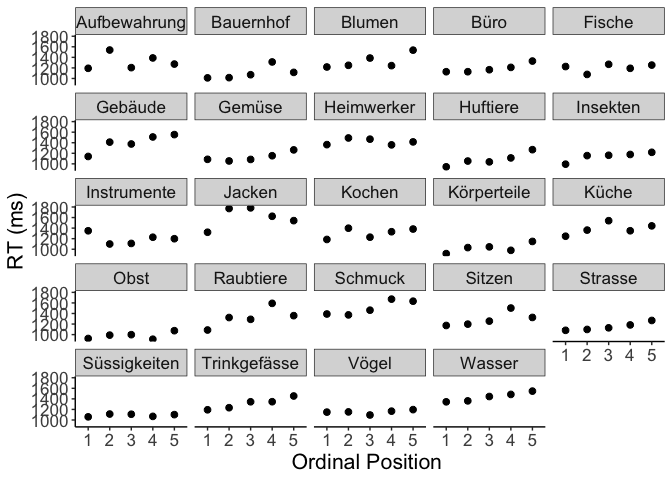<!-- -->

``` r
filename <- "CSI_online_typing_plot_rt_by_category.pdf"
ggsave(plot_rt_by_cat, filename = 
         here::here("figures", filename),
       width = 18, height = 19, units = "cm", 
       dpi = 300, device = cairo_pdf)
```

    ## geom_path: Each group consists of only one observation. Do you need to adjust
    ## the group aesthetic?
    ## geom_path: Each group consists of only one observation. Do you need to adjust
    ## the group aesthetic?
    ## geom_path: Each group consists of only one observation. Do you need to adjust
    ## the group aesthetic?
    ## geom_path: Each group consists of only one observation. Do you need to adjust
    ## the group aesthetic?
    ## geom_path: Each group consists of only one observation. Do you need to adjust
    ## the group aesthetic?
    ## geom_path: Each group consists of only one observation. Do you need to adjust
    ## the group aesthetic?
    ## geom_path: Each group consists of only one observation. Do you need to adjust
    ## the group aesthetic?
    ## geom_path: Each group consists of only one observation. Do you need to adjust
    ## the group aesthetic?
    ## geom_path: Each group consists of only one observation. Do you need to adjust
    ## the group aesthetic?
    ## geom_path: Each group consists of only one observation. Do you need to adjust
    ## the group aesthetic?
    ## geom_path: Each group consists of only one observation. Do you need to adjust
    ## the group aesthetic?
    ## geom_path: Each group consists of only one observation. Do you need to adjust
    ## the group aesthetic?
    ## geom_path: Each group consists of only one observation. Do you need to adjust
    ## the group aesthetic?
    ## geom_path: Each group consists of only one observation. Do you need to adjust
    ## the group aesthetic?
    ## geom_path: Each group consists of only one observation. Do you need to adjust
    ## the group aesthetic?
    ## geom_path: Each group consists of only one observation. Do you need to adjust
    ## the group aesthetic?
    ## geom_path: Each group consists of only one observation. Do you need to adjust
    ## the group aesthetic?
    ## geom_path: Each group consists of only one observation. Do you need to adjust
    ## the group aesthetic?
    ## geom_path: Each group consists of only one observation. Do you need to adjust
    ## the group aesthetic?
    ## geom_path: Each group consists of only one observation. Do you need to adjust
    ## the group aesthetic?
    ## geom_path: Each group consists of only one observation. Do you need to adjust
    ## the group aesthetic?
    ## geom_path: Each group consists of only one observation. Do you need to adjust
    ## the group aesthetic?
    ## geom_path: Each group consists of only one observation. Do you need to adjust
    ## the group aesthetic?
    ## geom_path: Each group consists of only one observation. Do you need to adjust
    ## the group aesthetic?

``` r
embedFonts(file = here::here("figures", filename))
```

### Plot by subject

``` r
(plot_rt_by_subject <- df %>% filter(!is.na(correct)) %>% 
   filter(category != "Filler") %>% 
    ggplot(., aes(x=PosOr, y=timing.01)) +
    stat_summary(fun=mean,  geom="point", size = 2) +  
    stat_summary(fun=mean,  geom="line", size = 1) +  
    facet_wrap(~subject) +
    apatheme+
    labs(x="Ordinal Position ",y ="RT (ms)"))
```

    ## geom_path: Each group consists of only one observation. Do you need to adjust
    ## the group aesthetic?
    ## geom_path: Each group consists of only one observation. Do you need to adjust
    ## the group aesthetic?
    ## geom_path: Each group consists of only one observation. Do you need to adjust
    ## the group aesthetic?
    ## geom_path: Each group consists of only one observation. Do you need to adjust
    ## the group aesthetic?
    ## geom_path: Each group consists of only one observation. Do you need to adjust
    ## the group aesthetic?
    ## geom_path: Each group consists of only one observation. Do you need to adjust
    ## the group aesthetic?
    ## geom_path: Each group consists of only one observation. Do you need to adjust
    ## the group aesthetic?
    ## geom_path: Each group consists of only one observation. Do you need to adjust
    ## the group aesthetic?
    ## geom_path: Each group consists of only one observation. Do you need to adjust
    ## the group aesthetic?
    ## geom_path: Each group consists of only one observation. Do you need to adjust
    ## the group aesthetic?
    ## geom_path: Each group consists of only one observation. Do you need to adjust
    ## the group aesthetic?
    ## geom_path: Each group consists of only one observation. Do you need to adjust
    ## the group aesthetic?
    ## geom_path: Each group consists of only one observation. Do you need to adjust
    ## the group aesthetic?
    ## geom_path: Each group consists of only one observation. Do you need to adjust
    ## the group aesthetic?
    ## geom_path: Each group consists of only one observation. Do you need to adjust
    ## the group aesthetic?
    ## geom_path: Each group consists of only one observation. Do you need to adjust
    ## the group aesthetic?
    ## geom_path: Each group consists of only one observation. Do you need to adjust
    ## the group aesthetic?
    ## geom_path: Each group consists of only one observation. Do you need to adjust
    ## the group aesthetic?
    ## geom_path: Each group consists of only one observation. Do you need to adjust
    ## the group aesthetic?
    ## geom_path: Each group consists of only one observation. Do you need to adjust
    ## the group aesthetic?
    ## geom_path: Each group consists of only one observation. Do you need to adjust
    ## the group aesthetic?
    ## geom_path: Each group consists of only one observation. Do you need to adjust
    ## the group aesthetic?
    ## geom_path: Each group consists of only one observation. Do you need to adjust
    ## the group aesthetic?
    ## geom_path: Each group consists of only one observation. Do you need to adjust
    ## the group aesthetic?
    ## geom_path: Each group consists of only one observation. Do you need to adjust
    ## the group aesthetic?
    ## geom_path: Each group consists of only one observation. Do you need to adjust
    ## the group aesthetic?
    ## geom_path: Each group consists of only one observation. Do you need to adjust
    ## the group aesthetic?
    ## geom_path: Each group consists of only one observation. Do you need to adjust
    ## the group aesthetic?
    ## geom_path: Each group consists of only one observation. Do you need to adjust
    ## the group aesthetic?
    ## geom_path: Each group consists of only one observation. Do you need to adjust
    ## the group aesthetic?

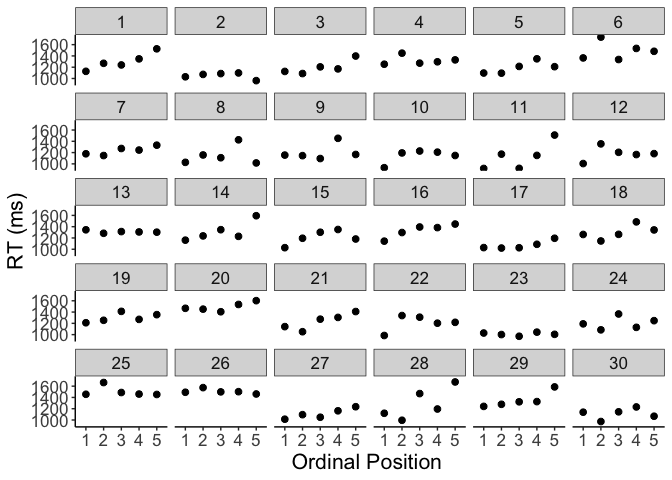<!-- -->

``` r
filename <- "CSI_online_typing_plot_rt_by_subject.pdf"
ggsave(plot_rt_by_subject, filename = 
         here::here("figures", filename),
       width = 18, height = 19, units = "cm", 
       dpi = 300, device = cairo_pdf)
```

    ## geom_path: Each group consists of only one observation. Do you need to adjust
    ## the group aesthetic?
    ## geom_path: Each group consists of only one observation. Do you need to adjust
    ## the group aesthetic?
    ## geom_path: Each group consists of only one observation. Do you need to adjust
    ## the group aesthetic?
    ## geom_path: Each group consists of only one observation. Do you need to adjust
    ## the group aesthetic?
    ## geom_path: Each group consists of only one observation. Do you need to adjust
    ## the group aesthetic?
    ## geom_path: Each group consists of only one observation. Do you need to adjust
    ## the group aesthetic?
    ## geom_path: Each group consists of only one observation. Do you need to adjust
    ## the group aesthetic?
    ## geom_path: Each group consists of only one observation. Do you need to adjust
    ## the group aesthetic?
    ## geom_path: Each group consists of only one observation. Do you need to adjust
    ## the group aesthetic?
    ## geom_path: Each group consists of only one observation. Do you need to adjust
    ## the group aesthetic?
    ## geom_path: Each group consists of only one observation. Do you need to adjust
    ## the group aesthetic?
    ## geom_path: Each group consists of only one observation. Do you need to adjust
    ## the group aesthetic?
    ## geom_path: Each group consists of only one observation. Do you need to adjust
    ## the group aesthetic?
    ## geom_path: Each group consists of only one observation. Do you need to adjust
    ## the group aesthetic?
    ## geom_path: Each group consists of only one observation. Do you need to adjust
    ## the group aesthetic?
    ## geom_path: Each group consists of only one observation. Do you need to adjust
    ## the group aesthetic?
    ## geom_path: Each group consists of only one observation. Do you need to adjust
    ## the group aesthetic?
    ## geom_path: Each group consists of only one observation. Do you need to adjust
    ## the group aesthetic?
    ## geom_path: Each group consists of only one observation. Do you need to adjust
    ## the group aesthetic?
    ## geom_path: Each group consists of only one observation. Do you need to adjust
    ## the group aesthetic?
    ## geom_path: Each group consists of only one observation. Do you need to adjust
    ## the group aesthetic?
    ## geom_path: Each group consists of only one observation. Do you need to adjust
    ## the group aesthetic?
    ## geom_path: Each group consists of only one observation. Do you need to adjust
    ## the group aesthetic?
    ## geom_path: Each group consists of only one observation. Do you need to adjust
    ## the group aesthetic?
    ## geom_path: Each group consists of only one observation. Do you need to adjust
    ## the group aesthetic?
    ## geom_path: Each group consists of only one observation. Do you need to adjust
    ## the group aesthetic?
    ## geom_path: Each group consists of only one observation. Do you need to adjust
    ## the group aesthetic?
    ## geom_path: Each group consists of only one observation. Do you need to adjust
    ## the group aesthetic?
    ## geom_path: Each group consists of only one observation. Do you need to adjust
    ## the group aesthetic?
    ## geom_path: Each group consists of only one observation. Do you need to adjust
    ## the group aesthetic?

``` r
embedFonts(file = here::here("figures", filename))
```

### Control: Plot RTs accross the experiment

All trials including uncorrect trials

``` r
(plot_RTs_all <- ggplot(data=df, aes(x=trial, y=timing.01)) +
  stat_summary(fun=mean,  geom="point", size = 2)+
  stat_summary(fun=mean,  geom="line", size = 1) +
  apatheme+
  labs(x="Trial ",y ="RT (ms)")+
  annotate(geom="text", x=20, y=1570, label="n = 30", 
           color="black", size = 8))
```

    ## Warning: Removed 93 rows containing non-finite values (stat_summary).
    
    ## Warning: Removed 93 rows containing non-finite values (stat_summary).

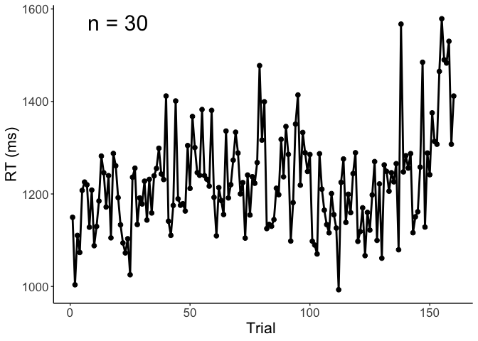<!-- -->

``` r
filename <- "CSI_online_typing_plot_rts_across_experiment.pdf"
ggsave(plot_RTs_all, filename = 
         here::here("figures", filename),
       width = 18, height = 13, units = "cm", 
       dpi = 300, device = cairo_pdf)
```

    ## Warning: Removed 93 rows containing non-finite values (stat_summary).
    
    ## Warning: Removed 93 rows containing non-finite values (stat_summary).

``` r
embedFonts(file = here::here("figures", filename))
```

Correct non-filler trials only:

``` r
(plot_RTs_correct <- df %>% filter(!is.na(correct)) %>% 
   filter(category != "Filler") %>% 
    ggplot(., aes(x=trial, y=timing.01)) +
    stat_summary(fun=mean,  geom="point", size = 2)+
    stat_summary(fun=mean,  geom="line", size = 1) +
    apatheme+
    labs(x="Trial ",y ="RT ms")+
    annotate(geom="text", x=20, y=1570, label="n = 30", 
             color="black", size = 8))
```

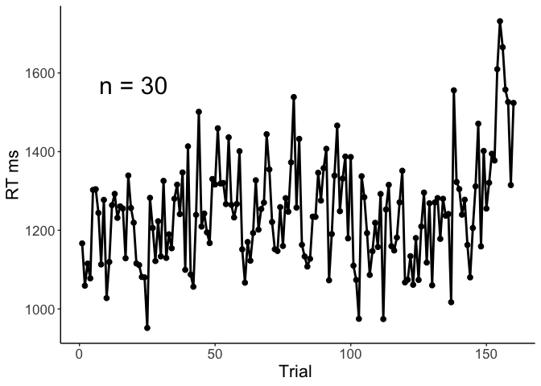<!-- -->

``` r
filename <- "CSI_online_typing_plot_rts_across_experiment_correct_experimental_trials.pdf"
ggsave(plot_RTs_correct, filename = 
         here::here("figures", filename),
       width = 18, height = 13, units = "cm", 
       dpi = 300, device = cairo_pdf)
embedFonts(file = here::here("figures", filename))
```

# Regression analyses

Check distribution

``` r
df_final <- df %>% filter(category != "Filler"  & correct == 1)

# check distribution of RTs (by eyeballing)
# 1) density plot of RTs
qplot(data=df_final, timing.01,
      geom="density", na.rm=TRUE)+ theme_bw() 
```

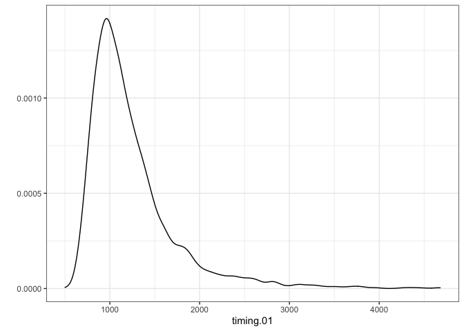<!-- -->

``` r
# 2) plot data against real normal distribution -> is it way off?
qqnorm(df_final$timing.01); qqline(df_final$timing.01)
```

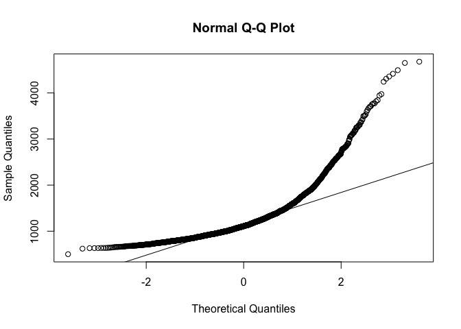<!-- -->

``` r
# check distribution of logRTs (by eyeballing)
df$ltiming.01 <- log(df$timing.01)
# 1) density plot of logRTs
qplot(data=df_final,
      log(timing.01), geom="density", na.rm=TRUE)+ theme_bw() 
```

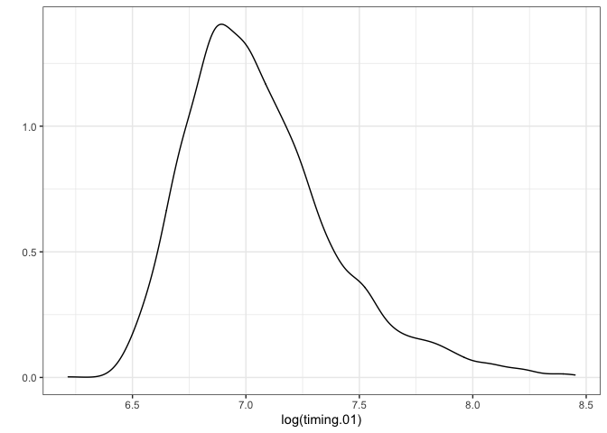<!-- -->

``` r
# 2) plot data against real normal distribution -> is it way off?
qqnorm(log(df_final$timing.01)); qqline(log(df_final$timing.01))
```

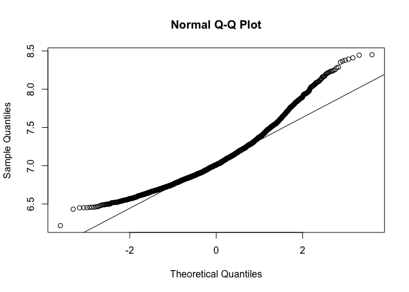<!-- -->

``` r
hist(df$timing.01)
```

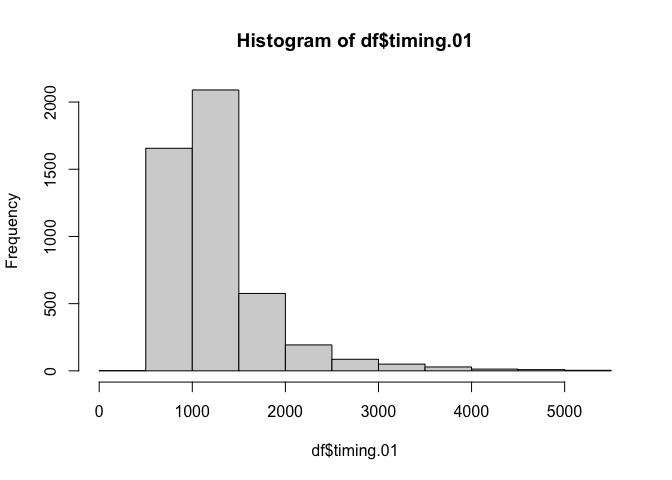<!-- -->

Ordinal position as a continuous predictor variable

``` r
df$PosOr.cont <- scale(as.numeric(as.character(df$PosOr)), 
                       center = T, scale = F)
m1 <- glmer(timing.01 ~ PosOr.cont + 
               (PosOr.cont|subject) +(PosOr.cont|category),
             data = df[df$category != "Filler"  & df$correct == 1,], 
            family =Gamma(link ="identity"), 
            control=glmerControl(optimizer = "bobyqa"))
summary(m1)
```

    ## Generalized linear mixed model fit by maximum likelihood (Laplace
    ##   Approximation) [glmerMod]
    ##  Family: Gamma  ( identity )
    ## Formula: timing.01 ~ PosOr.cont + (PosOr.cont | subject) + (PosOr.cont |  
    ##     category)
    ##    Data: df[df$category != "Filler" & df$correct == 1, ]
    ## Control: glmerControl(optimizer = "bobyqa")
    ## 
    ##      AIC      BIC   logLik deviance df.resid 
    ##  46748.4  46803.1 -23365.2  46730.4     3183 
    ## 
    ## Scaled residuals: 
    ##     Min      1Q  Median      3Q     Max 
    ## -1.5334 -0.5804 -0.2603  0.2555  8.4459 
    ## 
    ## Random effects:
    ##  Groups   Name        Variance  Std.Dev. Corr 
    ##  subject  (Intercept) 8202.6667 90.569        
    ##           PosOr.cont   655.1035 25.595   -0.02
    ##  category (Intercept) 9771.1170 98.849        
    ##           PosOr.cont   471.0233 21.703   0.26 
    ##  Residual                0.1282  0.358        
    ## Number of obs: 3192, groups:  subject, 30; category, 24
    ## 
    ## Fixed effects:
    ##             Estimate Std. Error t value             Pr(>|z|)    
    ## (Intercept) 1296.418     10.270  126.23 < 0.0000000000000002 ***
    ## PosOr.cont    42.627      6.568    6.49      0.0000000000856 ***
    ## ---
    ## Signif. codes:  0 '***' 0.001 '**' 0.01 '*' 0.05 '.' 0.1 ' ' 1
    ## 
    ## Correlation of Fixed Effects:
    ##            (Intr)
    ## PosOr.cont 0.096

``` r
# save model output
tab_model(m1,transform = NULL,
          show.re.var = F, show.stat = T,show.r2 = F,show.icc = F,
          title = "GLMM (Gamma distribution) with continuous predictor",
          pred.labels = c("(Intercept)", "Ordinal Position"),
          dv.labels = "Typing Onset Latency",
          #string.pred = "",
          string.stat = "t-Value",
          file = here::here("tables", "CSI_online_typing_glmm_cont.html"))
```

<table style="border-collapse:collapse; border:none;">

<caption style="font-weight: bold; text-align:left;">

GLMM (Gamma distribution) with continuous predictor

</caption>

<tr>

<th style="border-top: double; text-align:center; font-style:normal; font-weight:bold; padding:0.2cm;  text-align:left; ">

 

</th>

<th colspan="4" style="border-top: double; text-align:center; font-style:normal; font-weight:bold; padding:0.2cm; ">

Typing Onset Latency

</th>

</tr>

<tr>

<td style=" text-align:center; border-bottom:1px solid; font-style:italic; font-weight:normal;  text-align:left; ">

Predictors

</td>

<td style=" text-align:center; border-bottom:1px solid; font-style:italic; font-weight:normal;  ">

Estimates

</td>

<td style=" text-align:center; border-bottom:1px solid; font-style:italic; font-weight:normal;  ">

CI

</td>

<td style=" text-align:center; border-bottom:1px solid; font-style:italic; font-weight:normal;  ">

t-Value

</td>

<td style=" text-align:center; border-bottom:1px solid; font-style:italic; font-weight:normal;  ">

p

</td>

</tr>

<tr>

<td style=" padding:0.2cm; text-align:left; vertical-align:top; text-align:left; ">

(Intercept)

</td>

<td style=" padding:0.2cm; text-align:left; vertical-align:top; text-align:center;  ">

1296.42

</td>

<td style=" padding:0.2cm; text-align:left; vertical-align:top; text-align:center;  ">

1276.29 – 1316.55

</td>

<td style=" padding:0.2cm; text-align:left; vertical-align:top; text-align:center;  ">

126.23

</td>

<td style=" padding:0.2cm; text-align:left; vertical-align:top; text-align:center;  ">

<strong>\<0.001

</td>

</tr>

<tr>

<td style=" padding:0.2cm; text-align:left; vertical-align:top; text-align:left; ">

Ordinal Position

</td>

<td style=" padding:0.2cm; text-align:left; vertical-align:top; text-align:center;  ">

42.63

</td>

<td style=" padding:0.2cm; text-align:left; vertical-align:top; text-align:center;  ">

29.75 – 55.50

</td>

<td style=" padding:0.2cm; text-align:left; vertical-align:top; text-align:center;  ">

6.49

</td>

<td style=" padding:0.2cm; text-align:left; vertical-align:top; text-align:center;  ">

<strong>\<0.001

</td>

</tr>

<tr>

<td style=" padding:0.2cm; text-align:left; vertical-align:top; text-align:left; padding-top:0.1cm; padding-bottom:0.1cm;">

N <sub>subject</sub>

</td>

<td style=" padding:0.2cm; text-align:left; vertical-align:top; padding-top:0.1cm; padding-bottom:0.1cm; text-align:left;" colspan="4">

30

</td>

<tr>

<td style=" padding:0.2cm; text-align:left; vertical-align:top; text-align:left; padding-top:0.1cm; padding-bottom:0.1cm;">

N <sub>category</sub>

</td>

<td style=" padding:0.2cm; text-align:left; vertical-align:top; padding-top:0.1cm; padding-bottom:0.1cm; text-align:left;" colspan="4">

24

</td>

<tr>

<td style=" padding:0.2cm; text-align:left; vertical-align:top; text-align:left; padding-top:0.1cm; padding-bottom:0.1cm; border-top:1px solid;">

Observations

</td>

<td style=" padding:0.2cm; text-align:left; vertical-align:top; padding-top:0.1cm; padding-bottom:0.1cm; text-align:left; border-top:1px solid;" colspan="4">

3192

</td>

</tr>

</table>

# ———————————————

# Other

# Plotting before data preprocessing

# ALL TRIALS

### Plot RTs by OrPos

``` r
# is.numeric(df$timing.01)
# df$PosOr <- as.factor(df$PosOr)
# df$subject <- as.factor(df$subject)
# # descriptives 
# (means <- Rmisc::summarySEwithin(df[df$category != "Filler" ,],"timing.01",idvar = "subject",withinvars = "PosOr", na.rm = T))
```

``` r
# plotting <- df %>%
#   mutate(kind = case_when(category == "Filler" ~"Filler",
#                           category != "Filler" ~"Experimental"))
# (plot <- ggplot(data=df[df$category != "Filler" ,], aes(x=PosOr, y=timing.01)) +
#   stat_summary(fun=mean,  geom="point", size = 2)+
#   stat_summary(fun=mean,  geom="line", size = 1) +
#   apatheme+
#   labs(x="Ordinal Position ",y ="RT ms")+
#   annotate(geom="text", x=2, y=1200, label="n = 4", color="black", size = 8))
# 
# (plot <- ggplot(data=plotting, aes(x=PosOr, y=timing.01, group = kind, color = kind)) +
#   stat_summary(fun=mean,  geom="point", size = 2)+
#   stat_summary(fun=mean,  geom="line", size = 1) +
#   apatheme+
#   labs(x="Ordinal Position ",y ="RT ms", color = "Trial type")+
#   annotate(geom="text", x=2, y=1380, label="n = 30", color="black", size = 8))
# 
# 
# # ggsave(plot = plot, file = "figures/RT_across_conditions.pdf", device = cairo_pdf, dpi = 300)
# # embedFonts(file = "figures/RT_across_conditions_CSI_online_typing.pdf")
```

Plot by subcategory

``` r
# (plot_by_cat <- ggplot(data=df[df$category != "Filler" ,], aes(x=PosOr, y=timing.01)) +
#   stat_summary(fun=mean,  geom="point", size = 2)+
#   stat_summary(fun=mean,  geom="line", size = 1) +
#   facet_wrap(~category) +
#   apatheme+
#   labs(x="Ordinal Position ",y ="RT ms"))
# #ggsave(plot = plot30_facet, file = "Plots/CSI_subcats.pdf", device = cairo_pdf,dpi = 300)
# #embedFonts(file = "Plots/CSI_online30_subcats.pdf")
```

Plot by subject:

``` r
# 
# (plot_by_cat <- ggplot(data=df[df$category != "Filler" ,], aes(x=PosOr, y=timing.01)) +
#   stat_summary(fun=mean,  geom="point", size = 2)+
#   stat_summary(fun=mean,  geom="line", size = 1) +
#   facet_wrap(~subject) +
#   apatheme+
#   labs(x="Ordinal Position ",y ="RT ms"))
# #ggsave(plot = plot30_facet, file = "Plots/CSI_subcats.pdf", device = cairo_pdf,dpi = 300)
# #embedFonts(file = "Plots/CSI_online30_subcats.pdf")
```

# Other

Full GLMM with polynomial contrasts

``` r
# contrasts(df$PosOr) <- contr.poly(5)
# # m1 <- glmer(timing.01 ~ PosOr + (PosOr|subject) +(PosOr|category) ,
# #              data = df[df$category != "Filler"  & df$correct == 1,], family =Gamma(link ="identity"), control=glmerControl(optimizer = "bobyqa"))
# #model does not converge
# m1 <- afex::lmer_alt(timing.01 ~ PosOr + (PosOr||subject) +(1|category), 
#                   df[df$category != "Filler"  & df$correct == 1,],
#                   family =Gamma(link ="identity"),
#                   control=glmerControl(optimizer = "bobyqa", 
#                                        optCtrl = list(maxfun = 2*10^5)))
# summary(m1)
```

Linear trend only

``` r
# contrasts(df$PosOr) <- contr.poly(5)
# fixef_terms <- model.matrix( ~ PosOr,df) 
# df$PosOr.L <- fixef_terms[,2]
# m2 <- glmer(timing.01 ~ PosOr.L + (PosOr.L|subject) +(PosOr.L|category) ,
#              data = df[df$category != "Filler"  & df$correct == 1,], 
#             family =Gamma(link ="identity"), 
#             control=glmerControl(optimizer = "bobyqa"))
# summary(m2)
```
