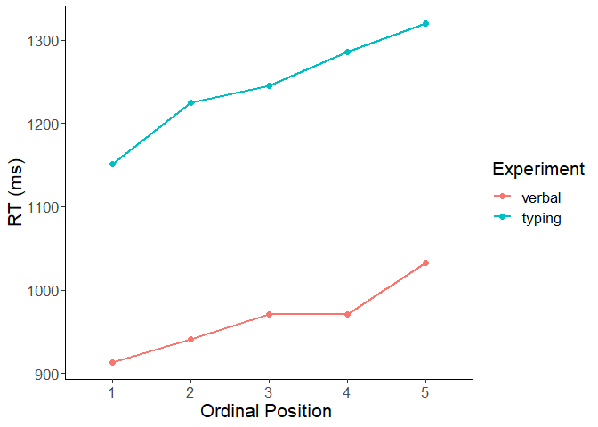

06 CSI online typing: Comparison to verbal naming
================
Kirsten Stark
17 März, 2021

# Load packages

``` r
library(dplyr)
```

    ## 
    ## Attaching package: 'dplyr'

    ## The following objects are masked from 'package:stats':
    ## 
    ##     filter, lag

    ## The following objects are masked from 'package:base':
    ## 
    ##     intersect, setdiff, setequal, union

``` r
library(tidyr)
library(lme4)
```

    ## Loading required package: Matrix

    ## 
    ## Attaching package: 'Matrix'

    ## The following objects are masked from 'package:tidyr':
    ## 
    ##     expand, pack, unpack

``` r
library(lmerTest)
```

    ## 
    ## Attaching package: 'lmerTest'

    ## The following object is masked from 'package:lme4':
    ## 
    ##     lmer

    ## The following object is masked from 'package:stats':
    ## 
    ##     step

``` r
library(Rmisc)
```

    ## Loading required package: lattice

    ## Loading required package: plyr

    ## ------------------------------------------------------------------------------

    ## You have loaded plyr after dplyr - this is likely to cause problems.
    ## If you need functions from both plyr and dplyr, please load plyr first, then dplyr:
    ## library(plyr); library(dplyr)

    ## ------------------------------------------------------------------------------

    ## 
    ## Attaching package: 'plyr'

    ## The following objects are masked from 'package:dplyr':
    ## 
    ##     arrange, count, desc, failwith, id, mutate, rename, summarise,
    ##     summarize

``` r
library(Cairo)
#library(strengejacke)
library(ggplot2)

options(scipen=999)

rm(list = ls())
options( "encoding" = "UTF-8" )
```

# Load data

Load data from both the verbal online CSI experiment and the typing
online CSI experiment.

Load typing data

``` r
df_typing <- read.csv(here::here("data", "data_long_final.csv"))
```

Load verbal data

``` r
load(here::here("data", "verbal_CSI", "CSI_online_Conny_df_correct.RData"))
df_verbal <- df_correct
```

# Combine both data frames into one

1)  Subset relevant columns and give identical names

<!-- end list -->

``` r
df_typing <- df_typing %>% 
  select(subject, item, category, timing.01, PosOr, correct) %>%
  dplyr::rename(RT = timing.01, Pos = PosOr) %>%
  mutate(experiment = "typing")

df_verbal <- df_verbal %>%
  select(VP, Item, subcat, VOT, correct, Pos) %>%
  dplyr::rename(subject = VP, item = Item, category = subcat, RT = VOT) %>%
  mutate(experiment = "verbal")
```

2)  Give subjects from both experiments different names

<!-- end list -->

``` r
df_typing <- df_typing %>% mutate(subject = subject + 200)
df_verbal <- df_verbal %>% mutate(subject = subject + 100)
```

3)  Put columns into correct format

<!-- end list -->

``` r
df_typing <- df_typing %>% 
  mutate(subject = as.factor(subject)) %>%
  mutate(item = as.character(item)) %>%
  mutate(category = as.factor(category)) %>% 
  mutate(RT = as.numeric(RT)) %>%
  mutate(Pos = as.factor(Pos)) %>% 
  mutate(experiment = factor(experiment, levels = c("verbal", "typing")))

df_verbal <- df_verbal %>% 
  mutate(subject = as.factor(subject)) %>%
  mutate(item = as.character(item)) %>%
  mutate(category = as.factor(category)) %>% 
  mutate(RT = as.numeric(RT)) %>%
  mutate(Pos = as.factor(Pos)) %>% 
  mutate(experiment = factor(experiment, levels = c("verbal", "typing")))
```

4)  Bind both data frames into one

<!-- end list -->

``` r
df <- bind_rows(df_typing, df_verbal)
```

3)  Drop incorrect trials

<!-- end list -->

``` r
df <- df %>% filter(!is.na(correct)) %>% select(-correct)
```

4)  Drop filler trials

<!-- end list -->

``` r
df <- df %>% filter(category != "Filler") %>% droplevels()
```

# Descriptives

``` r
(descriptives <- df %>% 
   Rmisc::summarySEwithin(.,"RT",idvar = "subject",
                          withinvars = "Pos",
                          betweenvars = "experiment",
                          na.rm = T))
```

    ##    experiment Pos   N       RT       sd       se       ci
    ## 1      verbal   1 670 1051.537 273.0161 10.54753 20.71025
    ## 2      verbal   2 651 1078.658 293.7729 11.51387 22.60887
    ## 3      verbal   3 662 1110.323 307.4410 11.94903 23.46264
    ## 4      verbal   4 650 1108.158 308.8411 12.11374 23.78686
    ## 5      verbal   5 631 1172.032 335.0839 13.33948 26.19522
    ## 6      typing   1 648 1009.880 442.9892 17.40226 34.17172
    ## 7      typing   2 637 1083.356 548.8173 21.74493 42.70055
    ## 8      typing   3 642 1105.401 523.0775 20.64422 40.53847
    ## 9      typing   4 637 1143.720 593.7701 23.52603 46.19808
    ## 10     typing   5 628 1177.485 561.7945 22.41804 44.02354

# Plotting

Make plots suitable for APA format

``` r
apatheme <- theme_bw()+
  theme(plot.title=element_text(family="Arial",size=22,hjust = .5),
        panel.grid.major=element_blank(), panel.grid.minor=element_blank(),
        panel.border=element_blank(),axis.line=element_line(),
        text=element_text(family="Arial",size=16))
```

Plot RTs by ordinal position for both experiments

``` r
(plot <- df %>% 
    ggplot(., aes(x=Pos, y=RT, 
                  group=experiment, color=experiment)) +
    stat_summary(fun=mean,  geom="point", size = 2)+
    stat_summary(fun=mean,  geom="line", size = 1) +
    apatheme+
    labs(x="Ordinal Position ",y ="RT (ms)", color = "Experiment"))
```

<!-- -->

# GLMMs

Check distribution

``` r
hist(df$RT)
```

<!-- -->

Full GLMM with polynomial contrasts (linear trend only)

``` r
# define sliding difference contrast for factor experiment: 
# contrast is verbal - typing, intercept being the grand mean 
levels(df$experiment)
```

    ## [1] "verbal" "typing"

``` r
contrasts(df$experiment) <- MASS::contr.sdif(2)

# define polynomial contrasts for factor Position
contrasts(df$Pos) <- contr.poly(5)
# select linear trend
fixef_terms <- model.matrix( ~ Pos,df) 
df$Pos.L <- fixef_terms[,2]

# define model
m1 <- glmer(RT ~ Pos.L*experiment +
                       (Pos.L|subject) + (Pos.L*experiment|category),
            data = df,
            family =Gamma(link ="identity"),
            control=glmerControl(optimizer = "bobyqa"))
summary(m1)
```

    ## Generalized linear mixed model fit by maximum likelihood (Laplace
    ##   Approximation) [glmerMod]
    ##  Family: Gamma  ( identity )
    ## Formula: RT ~ Pos.L * experiment + (Pos.L | subject) + (Pos.L * experiment |  
    ##     category)
    ##    Data: df
    ## Control: glmerControl(optimizer = "bobyqa")
    ## 
    ##      AIC      BIC   logLik deviance df.resid 
    ##  91687.8  91809.7 -45825.9  91651.8     6438 
    ## 
    ## Scaled residuals: 
    ##     Min      1Q  Median      3Q     Max 
    ## -2.0742 -0.6078 -0.2341  0.3207  9.6093 
    ## 
    ## Random effects:
    ##  Groups   Name                Variance   Std.Dev. Corr             
    ##  subject  (Intercept)         5629.84977 75.0323                   
    ##           Pos.L               4100.51845 64.0353  0.01             
    ##  category (Intercept)         4644.62935 68.1515                   
    ##           Pos.L               2332.18638 48.2927   0.37            
    ##           experiment2-1       3476.51573 58.9620   0.67  0.20      
    ##           Pos.L:experiment2-1 5260.91295 72.5322  -0.02  0.29  0.14
    ##  Residual                        0.09852  0.3139                   
    ## Number of obs: 6456, groups:  subject, 60; category, 32
    ## 
    ## Fixed effects:
    ##                     Estimate Std. Error t value             Pr(>|z|)    
    ## (Intercept)         1137.605     12.801  88.871 < 0.0000000000000002 ***
    ## Pos.L                114.054     15.749   7.242    0.000000000000442 ***
    ## experiment2-1        277.552      8.482  32.721 < 0.0000000000000002 ***
    ## Pos.L:experiment2-1   39.347     19.639   2.003               0.0451 *  
    ## ---
    ## Signif. codes:  0 '***' 0.001 '**' 0.01 '*' 0.05 '.' 0.1 ' ' 1
    ## 
    ## Correlation of Fixed Effects:
    ##             (Intr) Pos.L  exp2-1
    ## Pos.L       -0.861              
    ## expermnt2-1  0.703 -0.775       
    ## Ps.L:xpr2-1  0.586 -0.710  0.629

Ordinal position as a continuous predictor variable

``` r
# table(df$Pos)
# df$Pos.cont <- scale(as.numeric(as.character(df$Pos)), 
#                        center = T, scale = F)
# table(df$Pos.cont)
# m3 <- glmer(timing.01 ~ PosOr.cont + 
#                (PosOr.cont|subject) +(PosOr.cont|category),
#              data = df[df$category != "Filler"  & df$correct == 1,], 
#             family =Gamma(link ="identity"), 
#             control=glmerControl(optimizer = "bobyqa"))
# summary(m3)
```
