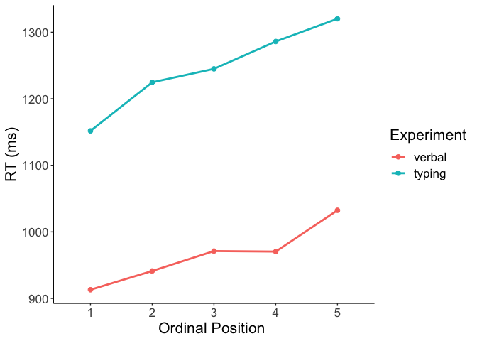
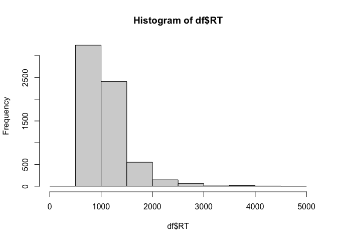

Load packages
=============

    library(dplyr)

    ## 
    ## Attaching package: 'dplyr'

    ## The following objects are masked from 'package:stats':
    ## 
    ##     filter, lag

    ## The following objects are masked from 'package:base':
    ## 
    ##     intersect, setdiff, setequal, union

    library(tidyr)
    library(lme4)

    ## Loading required package: Matrix

    ## 
    ## Attaching package: 'Matrix'

    ## The following objects are masked from 'package:tidyr':
    ## 
    ##     expand, pack, unpack

    library(lmerTest)

    ## 
    ## Attaching package: 'lmerTest'

    ## The following object is masked from 'package:lme4':
    ## 
    ##     lmer

    ## The following object is masked from 'package:stats':
    ## 
    ##     step

    library(Rmisc)

    ## Loading required package: lattice

    ## Loading required package: plyr

    ## ------------------------------------------------------------------------------

    ## You have loaded plyr after dplyr - this is likely to cause problems.
    ## If you need functions from both plyr and dplyr, please load plyr first, then dplyr:
    ## library(plyr); library(dplyr)

    ## ------------------------------------------------------------------------------

    ## 
    ## Attaching package: 'plyr'

    ## The following objects are masked from 'package:dplyr':
    ## 
    ##     arrange, count, desc, failwith, id, mutate, rename, summarise,
    ##     summarize

    library(Cairo)
    #library(strengejacke)
    library(ggplot2)
    library(sjPlot)

    ## Install package "strengejacke" from GitHub (`devtools::install_github("strengejacke/strengejacke")`) to load all sj-packages at once!

    options(scipen=999)

    rm(list = ls())
    options( "encoding" = "UTF-8" )

Load data
=========

Load data from both the verbal online CSI experiment and the typing
online CSI experiment.

Load typing data

    df_typing <- read.csv(here::here("data", "data_long_final.csv"))

Load verbal data

    load(here::here("data", "verbal_CSI", "CSI_online_verbal_df_full.RData"))
    df_verbal <- df_full

Combine both data frames into one
=================================

1.  Subset relevant columns and give identical names

<!-- -->

    df_typing <- df_typing %>% 
      select(subject, item, category, timing.01, PosOr, correct) %>%
      dplyr::rename(RT = timing.01, Pos = PosOr) %>%
      mutate(experiment = "typing")

    df_verbal <- df_verbal %>%
      select(VP, Item, subcat, VOT, correct, Pos) %>%
      dplyr::rename(subject = VP, item = Item, category = subcat, RT = VOT) %>%
      mutate(experiment = "verbal")

1.  Give subjects from both experiments different names

<!-- -->

    df_typing <- df_typing %>% mutate(subject = subject + 200)
    df_verbal <- df_verbal %>% mutate(subject = subject + 100)

1.  Put columns into correct format

<!-- -->

    df_typing <- df_typing %>% 
      mutate(subject = as.factor(subject)) %>%
      mutate(item = as.character(item)) %>%
      mutate(category = as.factor(category)) %>% 
      mutate(RT = as.numeric(RT)) %>%
      mutate(Pos = as.factor(Pos)) %>% 
      mutate(experiment = factor(experiment, levels = c("verbal", "typing")))

    df_verbal <- df_verbal %>% 
      mutate(subject = as.factor(subject)) %>%
      mutate(item = as.character(item)) %>%
      mutate(category = as.factor(category)) %>% 
      mutate(RT = as.numeric(RT)) %>%
      mutate(Pos = as.factor(Pos)) %>% 
      mutate(experiment = factor(experiment, levels = c("verbal", "typing")))

1.  Bind both data frames into one

<!-- -->

    df <- bind_rows(df_typing, df_verbal)

1.  Give identical category names in both experiments

<!-- -->

    df <- df %>% dplyr::mutate(category = case_when(category == "Buero" ~ "Büro",
                                      category == "Gebaeude" ~ "Gebäude",
                                      category == "Gemuese" ~ "Gemüse",
                                      category == 
                                        "Koerperteile" ~ "Körperteile",
                                      category == "Kueche" ~ "Küche",
                                      category == 
                                        "Suessigkeiten" ~ "Süssigkeiten",
                                      category == 
                                        "Trinkgefaesse" ~ "Trinkgefässe",
                                      category == "Voegel" ~ "Vögel",
                                      TRUE ~ as.character(category))) %>%
      mutate(category == as.factor(category)) %>% droplevels()
    table(df$category)

    ## 
    ## Aufbewahrung    Bauernhof       Blumen         Büro       Filler      Filler1 
    ##          300          300          300          300         1200          600 
    ##      Filler2       Fische      Gebäude       Gemüse   Heimwerker     Huftiere 
    ##          600          300          300          300          300          300 
    ##     Insekten  Instrumente       Jacken       Kochen  Körperteile        Küche 
    ##          300          300          300          300          300          300 
    ##         Obst    Raubtiere      Schmuck       Sitzen      Strasse Süssigkeiten 
    ##          300          300          300          300          300          300 
    ## Trinkgefässe        Vögel       Wasser 
    ##          300          300          300

1.  Drop filler trials

<!-- -->

     df <- df %>% filter(category != "Filler" & 
                          category != "Filler1" & category != "Filler2") %>%
      droplevels()

1.  Add ordinal position as continuous predictor variable

<!-- -->

    df$Pos.cont <- scale(as.numeric(as.character(df$Pos)),
                           center = T, scale = F)

1.  Drop incorrect trials

<!-- -->

    df <- df %>% filter(!is.na(correct) & correct != 0) %>% 
      select(-correct) %>%
      droplevels()

Descriptives
============

    (descriptives <- df %>% 
       Rmisc::summarySEwithin(.,"RT",idvar = "subject",
                              withinvars = "Pos",
                              betweenvars = "experiment",
                              na.rm = T))

    ##    experiment Pos   N       RT       sd       se       ci
    ## 1      verbal   1 670 1051.537 273.0161 10.54753 20.71025
    ## 2      verbal   2 651 1078.658 293.7729 11.51387 22.60887
    ## 3      verbal   3 662 1110.323 307.4410 11.94903 23.46264
    ## 4      verbal   4 650 1108.158 308.8411 12.11374 23.78686
    ## 5      verbal   5 631 1172.032 335.0839 13.33948 26.19522
    ## 6      typing   1 648 1009.880 442.9892 17.40226 34.17172
    ## 7      typing   2 637 1083.356 548.8173 21.74493 42.70055
    ## 8      typing   3 642 1105.401 523.0775 20.64422 40.53847
    ## 9      typing   4 637 1143.720 593.7701 23.52603 46.19808
    ## 10     typing   5 628 1177.485 561.7945 22.41804 44.02354

Plotting
========

Make plots suitable for APA format

    apatheme <- theme_bw()+
      theme(plot.title=element_text(family="Arial",size=22,hjust = .5),
            panel.grid.major=element_blank(), panel.grid.minor=element_blank(),
            panel.border=element_blank(),axis.line=element_line(),
            text=element_text(family="Arial",size=16))

Plot RTs by ordinal position for both experiments

    (plot <- df %>% 
        ggplot(., aes(x=Pos, y=RT, 
                      group=experiment, color=experiment)) +
        stat_summary(fun=mean,  geom="point", size = 2)+
        stat_summary(fun=mean,  geom="line", size = 1) +
        apatheme+
        labs(x="Ordinal Position ",y ="RT (ms)", color = "Experiment"))

    filename <- "CSI_online_exp_comparison_plot_rt.pdf"
    ggsave(plot, filename = 
             here::here("figures", filename),
           width = 18, height = 12, units = "cm", 
           dpi = 300, device = cairo_pdf)
    embedFonts(file = here::here("figures", filename))

GLMMs
=====

Check distribution

    hist(df$RT)

Set contrasts

    # define sliding difference contrast for factor experiment: 
    # contrast is verbal - typing, intercept being the grand mean 
    levels(df$experiment)

    ## [1] "verbal" "typing"

    contrasts(df$experiment) <- MASS::contr.sdif(2)

### Ordinal position as a continuous predictor variable

    m1 <- glmer(RT ~ Pos.cont*experiment +
                   (Pos.cont|subject) +(Pos.cont*experiment|category),
                 data = df,
                family =Gamma(link ="identity"),
                control=glmerControl(optimizer = "bobyqa"))
    summary(m1)

    ## Generalized linear mixed model fit by maximum likelihood (Laplace
    ##   Approximation) [glmerMod]
    ##  Family: Gamma  ( identity )
    ## Formula: RT ~ Pos.cont * experiment + (Pos.cont | subject) + (Pos.cont *  
    ##     experiment | category)
    ##    Data: df
    ## Control: glmerControl(optimizer = "bobyqa")
    ## 
    ##      AIC      BIC   logLik deviance df.resid 
    ##  91678.6  91800.5 -45821.3  91642.6     6438 
    ## 
    ## Scaled residuals: 
    ##     Min      1Q  Median      3Q     Max 
    ## -2.0824 -0.6079 -0.2318  0.3183  9.5418 
    ## 
    ## Random effects:
    ##  Groups   Name                   Variance   Std.Dev. Corr             
    ##  subject  (Intercept)            5616.55034 74.9436                   
    ##           Pos.cont                407.48135 20.1862  0.01             
    ##  category (Intercept)            4303.89710 65.6041                   
    ##           Pos.cont                226.20803 15.0402   0.35            
    ##           experiment2-1          2764.15751 52.5753   0.68  0.13      
    ##           Pos.cont:experiment2-1  515.05613 22.6948  -0.02  0.29  0.05
    ##  Residual                           0.09839  0.3137                   
    ## Number of obs: 6456, groups:  subject, 60; category, 24
    ## 
    ## Fixed effects:
    ##                        Estimate Std. Error t value            Pr(>|z|)    
    ## (Intercept)            1152.560      8.102 142.262 <0.0000000000000002 ***
    ## Pos.cont                 37.008      4.193   8.827 <0.0000000000000002 ***
    ## experiment2-1           294.493      4.065  72.438 <0.0000000000000002 ***
    ## Pos.cont:experiment2-1   12.791      6.222   2.056              0.0398 *  
    ## ---
    ## Signif. codes:  0 '***' 0.001 '**' 0.01 '*' 0.05 '.' 0.1 ' ' 1
    ## 
    ## Correlation of Fixed Effects:
    ##             (Intr) Ps.cnt exp2-1
    ## Pos.cont    -0.423              
    ## expermnt2-1 -0.143  0.057       
    ## Ps.cnt:x2-1 -0.420  0.264  0.221

    # save model output
    tab_model(m1,transform = NULL,
              show.re.var = F, show.stat = T,show.r2 = F,show.icc = F,
              title = "GLMM (Gamma distribution) with continuous predictor",
              pred.labels = c("(Intercept)", "Ordinal Position", 
                              "Experiment", "(Ordinal Position) x 
                              \n (Experiment)"),
              wrap.labels = 10,
              dv.labels = "Typing Onset Latency",
              #string.pred = "",
              string.stat = "t-Value",
              file = here::here("tables",
                                "CSI_online_experiment_comp_glmm_cont.html"))

<table style="border-collapse:collapse; border:none;">
<caption style="font-weight: bold; text-align:left;">
GLMM (Gamma distribution) with continuous predictor
</caption>
<tr>
<th style="border-top: double; text-align:center; font-style:normal; font-weight:bold; padding:0.2cm;  text-align:left; ">
 
</th>
<th colspan="4" style="border-top: double; text-align:center; font-style:normal; font-weight:bold; padding:0.2cm; ">
Typing Onset Latency
</th>
</tr>
<tr>
<td style=" text-align:center; border-bottom:1px solid; font-style:italic; font-weight:normal;  text-align:left; ">
Predictors
</td>
<td style=" text-align:center; border-bottom:1px solid; font-style:italic; font-weight:normal;  ">
Estimates
</td>
<td style=" text-align:center; border-bottom:1px solid; font-style:italic; font-weight:normal;  ">
CI
</td>
<td style=" text-align:center; border-bottom:1px solid; font-style:italic; font-weight:normal;  ">
t-Value
</td>
<td style=" text-align:center; border-bottom:1px solid; font-style:italic; font-weight:normal;  ">
p
</td>
</tr>
<tr>
<td style=" padding:0.2cm; text-align:left; vertical-align:top; text-align:left; ">
(Intercept)
</td>
<td style=" padding:0.2cm; text-align:left; vertical-align:top; text-align:center;  ">
1152.56
</td>
<td style=" padding:0.2cm; text-align:left; vertical-align:top; text-align:center;  ">
1136.68 – 1168.44
</td>
<td style=" padding:0.2cm; text-align:left; vertical-align:top; text-align:center;  ">
142.26
</td>
<td style=" padding:0.2cm; text-align:left; vertical-align:top; text-align:center;  ">
<strong>&lt;0.001
</td>
</tr>
<tr>
<td style=" padding:0.2cm; text-align:left; vertical-align:top; text-align:left; ">
Ordinal Position
</td>
<td style=" padding:0.2cm; text-align:left; vertical-align:top; text-align:center;  ">
37.01
</td>
<td style=" padding:0.2cm; text-align:left; vertical-align:top; text-align:center;  ">
28.79 – 45.22
</td>
<td style=" padding:0.2cm; text-align:left; vertical-align:top; text-align:center;  ">
8.83
</td>
<td style=" padding:0.2cm; text-align:left; vertical-align:top; text-align:center;  ">
<strong>&lt;0.001
</td>
</tr>
<tr>
<td style=" padding:0.2cm; text-align:left; vertical-align:top; text-align:left; ">
Experiment
</td>
<td style=" padding:0.2cm; text-align:left; vertical-align:top; text-align:center;  ">
294.49
</td>
<td style=" padding:0.2cm; text-align:left; vertical-align:top; text-align:center;  ">
286.52 – 302.46
</td>
<td style=" padding:0.2cm; text-align:left; vertical-align:top; text-align:center;  ">
72.44
</td>
<td style=" padding:0.2cm; text-align:left; vertical-align:top; text-align:center;  ">
<strong>&lt;0.001
</td>
</tr>
<tr>
<td style=" padding:0.2cm; text-align:left; vertical-align:top; text-align:left; ">

(Ordinal Position) x

(Experiment)
</td>
<td style=" padding:0.2cm; text-align:left; vertical-align:top; text-align:center;  ">
12.79
</td>
<td style=" padding:0.2cm; text-align:left; vertical-align:top; text-align:center;  ">
0.60 – 24.99
</td>
<td style=" padding:0.2cm; text-align:left; vertical-align:top; text-align:center;  ">
2.06
</td>
<td style=" padding:0.2cm; text-align:left; vertical-align:top; text-align:center;  ">
<strong>0.040</strong>
</td>
</tr>
<tr>
<td style=" padding:0.2cm; text-align:left; vertical-align:top; text-align:left; padding-top:0.1cm; padding-bottom:0.1cm;">
N subject
</td>
<td style=" padding:0.2cm; text-align:left; vertical-align:top; padding-top:0.1cm; padding-bottom:0.1cm; text-align:left;" colspan="4">
60
</td>
<tr>
<td style=" padding:0.2cm; text-align:left; vertical-align:top; text-align:left; padding-top:0.1cm; padding-bottom:0.1cm;">
N category
</td>
<td style=" padding:0.2cm; text-align:left; vertical-align:top; padding-top:0.1cm; padding-bottom:0.1cm; text-align:left;" colspan="4">
24
</td>
<tr>
<td style=" padding:0.2cm; text-align:left; vertical-align:top; text-align:left; padding-top:0.1cm; padding-bottom:0.1cm; border-top:1px solid;">
Observations
</td>
<td style=" padding:0.2cm; text-align:left; vertical-align:top; padding-top:0.1cm; padding-bottom:0.1cm; text-align:left; border-top:1px solid;" colspan="4">
6456
</td>
</tr>
</table>

### Follow-up on the interaction with a nested model

    (nested_bonferroni <- emmeans::emmeans(m1, "Pos.cont", by = "experiment", infer = TRUE, adjust = "bonferroni"))

    ## experiment = verbal:
    ##  Pos.cont emmean   SE  df asymp.LCL asymp.UCL z.ratio p.value
    ##   -0.0184   1005 8.64 Inf       988      1022 116.332 <.0001 
    ## 
    ## experiment = typing:
    ##  Pos.cont emmean   SE  df asymp.LCL asymp.UCL z.ratio p.value
    ##   -0.0184   1299 8.12 Inf      1283      1315 159.997 <.0001 
    ## 
    ## Confidence level used: 0.95

    # m1.nested <- glmer(RT ~ experiment/Pos.cont +
    #                (Pos.cont|subject) +(Pos.cont*experiment|category),
    #              data = df,
    #             family =Gamma(link ="identity"),
    #             control=glmerControl(optimizer = "bobyqa"))
    # # Model failed to converge

    m1.nested <- afex::lmer_alt(RT ~ experiment/Pos.cont +
                   (Pos.cont||subject) +(Pos.cont*experiment||category),
                 data = df,
                family =Gamma(link ="identity"),
                control=glmerControl(optimizer = "bobyqa",
                                        optCtrl = list(maxfun = 2*10^5)))

    ## Registered S3 methods overwritten by 'car':
    ##   method                          from
    ##   influence.merMod                lme4
    ##   cooks.distance.influence.merMod lme4
    ##   dfbeta.influence.merMod         lme4
    ##   dfbetas.influence.merMod        lme4

    ## Numerical variables NOT centered on 0: Pos.cont
    ## If in interactions, interpretation of lower order (e.g., main) effects difficult.

    summary(m1.nested)

    ## Generalized linear mixed model fit by maximum likelihood (Laplace
    ##   Approximation) [glmerMod]
    ##  Family: Gamma  ( identity )
    ## Formula: RT ~ experiment/Pos.cont + (1 + re1.Pos.cont || subject) + (1 +  
    ##     re2.Pos.cont + re2.experiment2.1 + re2.Pos.cont_by_experiment2.1 ||  
    ##     category)
    ##    Data: data
    ## Control: glmerControl(optimizer = "bobyqa", optCtrl = list(maxfun = 2 *  
    ##     10^5))
    ## 
    ##      AIC      BIC   logLik deviance df.resid 
    ##  91684.8  91759.3 -45831.4  91662.8     6445 
    ## 
    ## Scaled residuals: 
    ##     Min      1Q  Median      3Q     Max 
    ## -2.0628 -0.6074 -0.2371  0.3155  9.4696 
    ## 
    ## Random effects:
    ##  Groups     Name                          Variance   Std.Dev.
    ##  subject    (Intercept)                   5647.80355 75.1519 
    ##  subject.1  re1.Pos.cont                   415.87352 20.3930 
    ##  category   (Intercept)                   4456.48585 66.7569 
    ##  category.1 re2.Pos.cont                   246.01835 15.6850 
    ##  category.2 re2.experiment2.1             4042.37610 63.5797 
    ##  category.3 re2.Pos.cont_by_experiment2.1  482.10956 21.9570 
    ##  Residual                                    0.09865  0.3141 
    ## Number of obs: 6456, groups:  subject, 60; category, 24
    ## 
    ## Fixed effects:
    ##                           Estimate Std. Error t value             Pr(>|z|)    
    ## (Intercept)               1152.523      5.755 200.263 < 0.0000000000000002 ***
    ## experiment2-1              287.511      4.444  64.701 < 0.0000000000000002 ***
    ## experimentverbal:Pos.cont   28.649      3.795   7.549   0.0000000000000439 ***
    ## experimenttyping:Pos.cont   40.679      5.557   7.320   0.0000000000002474 ***
    ## ---
    ## Signif. codes:  0 '***' 0.001 '**' 0.01 '*' 0.05 '.' 0.1 ' ' 1
    ## 
    ## Correlation of Fixed Effects:
    ##             (Intr) exp2-1 exprmntv:P.
    ## expermnt2-1  0.061                   
    ## exprmntv:P. -0.093 -0.006            
    ## exprmntt:P. -0.187 -0.107 -0.007

    # save model output
    tab_model(m1.nested,transform = NULL,
              show.re.var = F, show.stat = T,show.r2 = F,show.icc = F,
              title = "GLMM (Gamma distribution) with continuous predictor",
              pred.labels = c("(Intercept)", "Experiment", 
                              "Verbal: Ordinal Position", 
                              "Typing: Ordinal Position"),
              wrap.labels = 10,
              dv.labels = "Typing Onset Latency",
              #string.pred = "",
              string.stat = "t-Value",
              file = here::here("tables",
                                "CSI_online_experiment_comp_nested_glmm.html"))

<table style="border-collapse:collapse; border:none;">
<caption style="font-weight: bold; text-align:left;">
GLMM (Gamma distribution) with continuous predictor
</caption>
<tr>
<th style="border-top: double; text-align:center; font-style:normal; font-weight:bold; padding:0.2cm;  text-align:left; ">
 
</th>
<th colspan="4" style="border-top: double; text-align:center; font-style:normal; font-weight:bold; padding:0.2cm; ">
Typing Onset Latency
</th>
</tr>
<tr>
<td style=" text-align:center; border-bottom:1px solid; font-style:italic; font-weight:normal;  text-align:left; ">
Predictors
</td>
<td style=" text-align:center; border-bottom:1px solid; font-style:italic; font-weight:normal;  ">
Estimates
</td>
<td style=" text-align:center; border-bottom:1px solid; font-style:italic; font-weight:normal;  ">
CI
</td>
<td style=" text-align:center; border-bottom:1px solid; font-style:italic; font-weight:normal;  ">
t-Value
</td>
<td style=" text-align:center; border-bottom:1px solid; font-style:italic; font-weight:normal;  ">
p
</td>
</tr>
<tr>
<td style=" padding:0.2cm; text-align:left; vertical-align:top; text-align:left; ">
(Intercept)
</td>
<td style=" padding:0.2cm; text-align:left; vertical-align:top; text-align:center;  ">
1152.52
</td>
<td style=" padding:0.2cm; text-align:left; vertical-align:top; text-align:center;  ">
1141.24 – 1163.80
</td>
<td style=" padding:0.2cm; text-align:left; vertical-align:top; text-align:center;  ">
200.26
</td>
<td style=" padding:0.2cm; text-align:left; vertical-align:top; text-align:center;  ">
<strong>&lt;0.001
</td>
</tr>
<tr>
<td style=" padding:0.2cm; text-align:left; vertical-align:top; text-align:left; ">
Experiment
</td>
<td style=" padding:0.2cm; text-align:left; vertical-align:top; text-align:center;  ">
287.51
</td>
<td style=" padding:0.2cm; text-align:left; vertical-align:top; text-align:center;  ">
278.80 – 296.22
</td>
<td style=" padding:0.2cm; text-align:left; vertical-align:top; text-align:center;  ">
64.70
</td>
<td style=" padding:0.2cm; text-align:left; vertical-align:top; text-align:center;  ">
<strong>&lt;0.001
</td>
</tr>
<tr>
<td style=" padding:0.2cm; text-align:left; vertical-align:top; text-align:left; ">
Verbal: Ordinal Position
</td>
<td style=" padding:0.2cm; text-align:left; vertical-align:top; text-align:center;  ">
28.65
</td>
<td style=" padding:0.2cm; text-align:left; vertical-align:top; text-align:center;  ">
21.21 – 36.09
</td>
<td style=" padding:0.2cm; text-align:left; vertical-align:top; text-align:center;  ">
7.55
</td>
<td style=" padding:0.2cm; text-align:left; vertical-align:top; text-align:center;  ">
<strong>&lt;0.001
</td>
</tr>
<tr>
<td style=" padding:0.2cm; text-align:left; vertical-align:top; text-align:left; ">
Typing: Ordinal Position
</td>
<td style=" padding:0.2cm; text-align:left; vertical-align:top; text-align:center;  ">
40.68
</td>
<td style=" padding:0.2cm; text-align:left; vertical-align:top; text-align:center;  ">
29.79 – 51.57
</td>
<td style=" padding:0.2cm; text-align:left; vertical-align:top; text-align:center;  ">
7.32
</td>
<td style=" padding:0.2cm; text-align:left; vertical-align:top; text-align:center;  ">
<strong>&lt;0.001
</td>
</tr>
<tr>
<td style=" padding:0.2cm; text-align:left; vertical-align:top; text-align:left; padding-top:0.1cm; padding-bottom:0.1cm;">
N subject
</td>
<td style=" padding:0.2cm; text-align:left; vertical-align:top; padding-top:0.1cm; padding-bottom:0.1cm; text-align:left;" colspan="4">
60
</td>
<tr>
<td style=" padding:0.2cm; text-align:left; vertical-align:top; text-align:left; padding-top:0.1cm; padding-bottom:0.1cm;">
N category
</td>
<td style=" padding:0.2cm; text-align:left; vertical-align:top; padding-top:0.1cm; padding-bottom:0.1cm; text-align:left;" colspan="4">
24
</td>
<tr>
<td style=" padding:0.2cm; text-align:left; vertical-align:top; text-align:left; padding-top:0.1cm; padding-bottom:0.1cm; border-top:1px solid;">
Observations
</td>
<td style=" padding:0.2cm; text-align:left; vertical-align:top; padding-top:0.1cm; padding-bottom:0.1cm; text-align:left; border-top:1px solid;" colspan="4">
6456
</td>
</tr>
</table>

### —————————————————————-

### Full GLMM with polynomial contrasts (linear trend only)

    # # define model
    # m1 <- glmer(RT ~ Pos.L*experiment +
    #                        (Pos.L|subject) + (Pos.L*experiment|category),
    #             data = df,
    #             family =Gamma(link ="identity"),
    #             control=glmerControl(optimizer = "bobyqa"))
    # summary(m1)

### Full GLMM with polynomial contrasts (all contrasts included):

    # m2 <- afex::lmer_alt(RT ~ Pos*experiment +
    #                        (Pos||subject) + (Pos*experiment||category),
    #             data = df,
    #             family =Gamma(link ="identity"),
    #             control=glmerControl(optimizer = "bobyqa",
    #                                    optCtrl = list(maxfun = 2*10^5)))
    # summary(m2)
