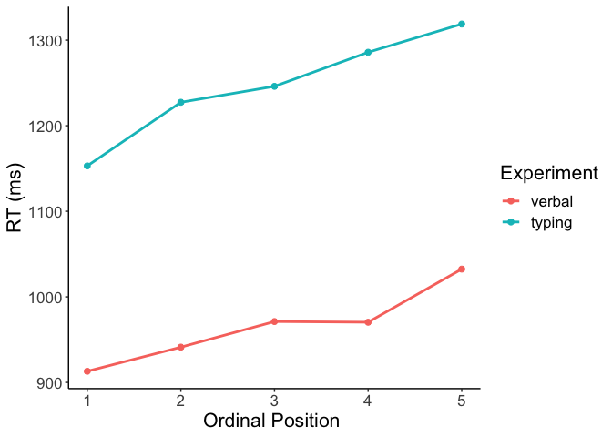

06 CSI online typing: Comparison to verbal naming
================
Kirsten Stark
18 März, 2021

# Load packages

``` r
library(dplyr)
```

    ## 
    ## Attaching package: 'dplyr'

    ## The following objects are masked from 'package:stats':
    ## 
    ##     filter, lag

    ## The following objects are masked from 'package:base':
    ## 
    ##     intersect, setdiff, setequal, union

``` r
library(tidyr)
library(lme4)
```

    ## Loading required package: Matrix

    ## 
    ## Attaching package: 'Matrix'

    ## The following objects are masked from 'package:tidyr':
    ## 
    ##     expand, pack, unpack

``` r
library(lmerTest)
```

    ## 
    ## Attaching package: 'lmerTest'

    ## The following object is masked from 'package:lme4':
    ## 
    ##     lmer

    ## The following object is masked from 'package:stats':
    ## 
    ##     step

``` r
library(Rmisc)
```

    ## Loading required package: lattice

    ## Loading required package: plyr

    ## ------------------------------------------------------------------------------

    ## You have loaded plyr after dplyr - this is likely to cause problems.
    ## If you need functions from both plyr and dplyr, please load plyr first, then dplyr:
    ## library(plyr); library(dplyr)

    ## ------------------------------------------------------------------------------

    ## 
    ## Attaching package: 'plyr'

    ## The following objects are masked from 'package:dplyr':
    ## 
    ##     arrange, count, desc, failwith, id, mutate, rename, summarise,
    ##     summarize

``` r
library(Cairo)
```

    ## Warning: package 'Cairo' was built under R version 4.0.3

``` r
#library(strengejacke)
library(ggplot2)

options(scipen=999)

rm(list = ls())
options( "encoding" = "UTF-8" )
```

# Load data

Load data from both the verbal online CSI experiment and the typing
online CSI experiment.

Load typing data

``` r
df_typing <- read.csv(here::here("data", "data_long_final.csv"))
```

Load verbal data

``` r
load(here::here("data", "verbal_CSI", "CSI_online_verbal_df_full.RData"))
df_verbal <- df_full
```

# Combine both data frames into one

1)  Subset relevant columns and give identical names

<!-- end list -->

``` r
df_typing <- df_typing %>% 
  select(subject, item, category, timing.01, PosOr, correct) %>%
  dplyr::rename(RT = timing.01, Pos = PosOr) %>%
  mutate(experiment = "typing")

df_verbal <- df_verbal %>%
  select(VP, Item, subcat, VOT, correct, Pos) %>%
  dplyr::rename(subject = VP, item = Item, category = subcat, RT = VOT) %>%
  mutate(experiment = "verbal")
```

2)  Give subjects from both experiments different names

<!-- end list -->

``` r
df_typing <- df_typing %>% mutate(subject = subject + 200)
df_verbal <- df_verbal %>% mutate(subject = subject + 100)
```

3)  Put columns into correct format

<!-- end list -->

``` r
df_typing <- df_typing %>% 
  mutate(subject = as.factor(subject)) %>%
  mutate(item = as.character(item)) %>%
  mutate(category = as.factor(category)) %>% 
  mutate(RT = as.numeric(RT)) %>%
  mutate(Pos = as.factor(Pos)) %>% 
  mutate(experiment = factor(experiment, levels = c("verbal", "typing")))

df_verbal <- df_verbal %>% 
  mutate(subject = as.factor(subject)) %>%
  mutate(item = as.character(item)) %>%
  mutate(category = as.factor(category)) %>% 
  mutate(RT = as.numeric(RT)) %>%
  mutate(Pos = as.factor(Pos)) %>% 
  mutate(experiment = factor(experiment, levels = c("verbal", "typing")))
```

4)  Bind both data frames into one

<!-- end list -->

``` r
df <- bind_rows(df_typing, df_verbal)
```

5)  Give identical category names in both experiments

<!-- end list -->

``` r
df <- df %>% mutate(category = case_when(category == "Buero" ~ "Büro",
                                  category == "Gebaeude" ~ "Gebäude",
                                  category == "Gemuese" ~ "Gemüse",
                                  category == 
                                    "Koerperteile" ~ "Körperteile",
                                  category == "Kueche" ~ "Küche",
                                  category == 
                                    "Suessigkeiten" ~ "Süssigkeiten",
                                  category == 
                                    "Trinkgefaesse" ~ "Trinkgefässe",
                                  category == "Voegel" ~ "Vögel",
                                  TRUE ~ as.character(category))) %>%
  mutate(category == as.factor(category)) %>% droplevels()
table(df$category)
```

    ## 
    ## Aufbewahrung    Bauernhof       Blumen         Büro       Filler      Filler1 
    ##          300          300          300          300         1200          600 
    ##      Filler2       Fische      Gebäude       Gemüse   Heimwerker     Huftiere 
    ##          600          300          300          300          300          300 
    ##     Insekten  Instrumente       Jacken       Kochen  Körperteile        Küche 
    ##          300          300          300          300          300          300 
    ##         Obst    Raubtiere      Schmuck       Sitzen      Strasse Süssigkeiten 
    ##          300          300          300          300          300          300 
    ## Trinkgefässe        Vögel       Wasser 
    ##          300          300          300

5)  Drop filler trials

<!-- end list -->

``` r
 df <- df %>% filter(category != "Filler" & 
                      category != "Filler1" & category != "Filler2") %>%
  droplevels()
```

5)  Add ordinal position as continuous predictor variable

<!-- end list -->

``` r
df$Pos.cont <- scale(as.numeric(as.character(df$Pos)),
                       center = T, scale = F)
```

3)  Drop incorrect trials

<!-- end list -->

``` r
df <- df %>% filter(!is.na(correct) & correct != 0) %>% 
  select(-correct) %>%
  droplevels()
```

# Descriptives

``` r
(descriptives <- df %>% 
   Rmisc::summarySEwithin(.,"RT",idvar = "subject",
                          withinvars = "Pos",
                          betweenvars = "experiment",
                          na.rm = T))
```

    ##    experiment Pos   N       RT       sd       se       ci
    ## 1      verbal   1 670 1051.537 273.0161 10.54753 20.71025
    ## 2      verbal   2 651 1078.658 293.7729 11.51387 22.60887
    ## 3      verbal   3 662 1110.323 307.4410 11.94903 23.46264
    ## 4      verbal   4 650 1108.158 308.8411 12.11374 23.78686
    ## 5      verbal   5 631 1172.032 335.0839 13.33948 26.19522
    ## 6      typing   1 648 1009.880 442.9892 17.40226 34.17172
    ## 7      typing   2 637 1083.356 548.8173 21.74493 42.70055
    ## 8      typing   3 642 1105.401 523.0775 20.64422 40.53847
    ## 9      typing   4 637 1143.720 593.7701 23.52603 46.19808
    ## 10     typing   5 628 1177.485 561.7945 22.41804 44.02354

# Plotting

Make plots suitable for APA format

``` r
apatheme <- theme_bw()+
  theme(plot.title=element_text(family="Arial",size=22,hjust = .5),
        panel.grid.major=element_blank(), panel.grid.minor=element_blank(),
        panel.border=element_blank(),axis.line=element_line(),
        text=element_text(family="Arial",size=16))
```

Plot RTs by ordinal position for both experiments

``` r
(plot <- df %>% 
    ggplot(., aes(x=Pos, y=RT, 
                  group=experiment, color=experiment)) +
    stat_summary(fun=mean,  geom="point", size = 2)+
    stat_summary(fun=mean,  geom="line", size = 1) +
    apatheme+
    labs(x="Ordinal Position ",y ="RT (ms)", color = "Experiment"))
```

    ## Warning in grid.Call(C_stringMetric, as.graphicsAnnot(x$label)):
    ## Zeichensatzfamilie in der Windows Zeichensatzdatenbank nicht gefunden
    
    ## Warning in grid.Call(C_stringMetric, as.graphicsAnnot(x$label)):
    ## Zeichensatzfamilie in der Windows Zeichensatzdatenbank nicht gefunden

    ## Warning in grid.Call(C_textBounds, as.graphicsAnnot(x$label), x$x, x$y, :
    ## Zeichensatzfamilie in der Windows Zeichensatzdatenbank nicht gefunden
    
    ## Warning in grid.Call(C_textBounds, as.graphicsAnnot(x$label), x$x, x$y, :
    ## Zeichensatzfamilie in der Windows Zeichensatzdatenbank nicht gefunden
    
    ## Warning in grid.Call(C_textBounds, as.graphicsAnnot(x$label), x$x, x$y, :
    ## Zeichensatzfamilie in der Windows Zeichensatzdatenbank nicht gefunden
    
    ## Warning in grid.Call(C_textBounds, as.graphicsAnnot(x$label), x$x, x$y, :
    ## Zeichensatzfamilie in der Windows Zeichensatzdatenbank nicht gefunden
    
    ## Warning in grid.Call(C_textBounds, as.graphicsAnnot(x$label), x$x, x$y, :
    ## Zeichensatzfamilie in der Windows Zeichensatzdatenbank nicht gefunden
    
    ## Warning in grid.Call(C_textBounds, as.graphicsAnnot(x$label), x$x, x$y, :
    ## Zeichensatzfamilie in der Windows Zeichensatzdatenbank nicht gefunden
    
    ## Warning in grid.Call(C_textBounds, as.graphicsAnnot(x$label), x$x, x$y, :
    ## Zeichensatzfamilie in der Windows Zeichensatzdatenbank nicht gefunden
    
    ## Warning in grid.Call(C_textBounds, as.graphicsAnnot(x$label), x$x, x$y, :
    ## Zeichensatzfamilie in der Windows Zeichensatzdatenbank nicht gefunden

    ## Warning in grid.Call.graphics(C_text, as.graphicsAnnot(x$label), x$x, x$y, :
    ## Zeichensatzfamilie in der Windows Zeichensatzdatenbank nicht gefunden

    ## Warning in grid.Call(C_textBounds, as.graphicsAnnot(x$label), x$x, x$y, :
    ## Zeichensatzfamilie in der Windows Zeichensatzdatenbank nicht gefunden
    
    ## Warning in grid.Call(C_textBounds, as.graphicsAnnot(x$label), x$x, x$y, :
    ## Zeichensatzfamilie in der Windows Zeichensatzdatenbank nicht gefunden

<!-- -->

# GLMMs

Check distribution

``` r
hist(df$RT)
```

<!-- -->

Set contrasts

``` r
# define sliding difference contrast for factor experiment: 
# contrast is verbal - typing, intercept being the grand mean 
levels(df$experiment)
```

    ## [1] "verbal" "typing"

``` r
contrasts(df$experiment) <- MASS::contr.sdif(2)

# define polynomial contrasts for factor Position
contrasts(df$Pos) <- contr.poly(5)
# select linear trend
fixef_terms <- model.matrix( ~ Pos,df) 
df$Pos.L <- fixef_terms[,2]
```

### Full GLMM with polynomial contrasts (linear trend only)

``` r
# define model
m1 <- glmer(RT ~ Pos.L*experiment +
                       (Pos.L|subject) + (Pos.L*experiment|category),
            data = df,
            family =Gamma(link ="identity"),
            control=glmerControl(optimizer = "bobyqa"))
summary(m1)
```

    ## Generalized linear mixed model fit by maximum likelihood (Laplace
    ##   Approximation) [glmerMod]
    ##  Family: Gamma  ( identity )
    ## Formula: RT ~ Pos.L * experiment + (Pos.L | subject) + (Pos.L * experiment |  
    ##     category)
    ##    Data: df
    ## Control: glmerControl(optimizer = "bobyqa")
    ## 
    ##      AIC      BIC   logLik deviance df.resid 
    ##  91678.6  91800.5 -45821.3  91642.6     6438 
    ## 
    ## Scaled residuals: 
    ##     Min      1Q  Median      3Q     Max 
    ## -2.0824 -0.6079 -0.2318  0.3183  9.5419 
    ## 
    ## Random effects:
    ##  Groups   Name                Variance   Std.Dev. Corr             
    ##  subject  (Intercept)         5616.57778 74.9438                   
    ##           Pos.L               4074.79684 63.8341  0.01             
    ##  category (Intercept)         4303.98398 65.6048                   
    ##           Pos.L               2262.09940 47.5615   0.35            
    ##           experiment2-1       2764.23780 52.5760   0.68  0.13      
    ##           Pos.L:experiment2-1 5150.70487 71.7684  -0.02  0.29  0.05
    ##  Residual                        0.09839  0.3137                   
    ## Number of obs: 6456, groups:  subject, 60; category, 24
    ## 
    ## Fixed effects:
    ##                     Estimate Std. Error t value            Pr(>|z|)    
    ## (Intercept)         1152.558      9.803  117.58 <0.0000000000000002 ***
    ## Pos.L                117.028      4.414   26.52 <0.0000000000000002 ***
    ## experiment2-1        294.495      7.531   39.11 <0.0000000000000002 ***
    ## Pos.L:experiment2-1   40.449      3.555   11.38 <0.0000000000000002 ***
    ## ---
    ## Signif. codes:  0 '***' 0.001 '**' 0.01 '*' 0.05 '.' 0.1 ' ' 1
    ## 
    ## Correlation of Fixed Effects:
    ##             (Intr) Pos.L  exp2-1
    ## Pos.L       -0.019              
    ## expermnt2-1  0.395  0.077       
    ## Ps.L:xpr2-1 -0.046 -0.031  0.069

### Full GLMM with polynomial contrasts (all contrasts included):

``` r
m2 <- afex::lmer_alt(RT ~ Pos*experiment +
                       (Pos||subject) + (Pos*experiment||category),
            data = df,
            family =Gamma(link ="identity"),
            control=glmerControl(optimizer = "bobyqa",
                                   optCtrl = list(maxfun = 2*10^5)))
```

    ## Registered S3 methods overwritten by 'car':
    ##   method                          from
    ##   influence.merMod                lme4
    ##   cooks.distance.influence.merMod lme4
    ##   dfbeta.influence.merMod         lme4
    ##   dfbetas.influence.merMod        lme4

``` r
summary(m2)
```

    ## Generalized linear mixed model fit by maximum likelihood (Laplace
    ##   Approximation) [glmerMod]
    ##  Family: Gamma  ( identity )
    ## Formula: RT ~ Pos * experiment + (1 + re1.Pos.L + re1.Pos.Q + re1.Pos.C +  
    ##     re1.Pos.4 || subject) + (1 + re2.Pos.L + re2.Pos.Q + re2.Pos.C +  
    ##     re2.Pos.4 + re2.experiment2.1 + re2.Pos.L_by_experiment2.1 +  
    ##     re2.Pos.Q_by_experiment2.1 + re2.Pos.C_by_experiment2.1 +  
    ##     re2.Pos.4_by_experiment2.1 || category)
    ##    Data: data
    ## Control: glmerControl(optimizer = "bobyqa", optCtrl = list(maxfun = 2 *  
    ##     10^5))
    ## 
    ##      AIC      BIC   logLik deviance df.resid 
    ##  91604.3  91780.4 -45776.2  91552.3     6430 
    ## 
    ## Scaled residuals: 
    ##     Min      1Q  Median      3Q     Max 
    ## -2.0524 -0.6041 -0.2288  0.3175  8.9528 
    ## 
    ## Random effects:
    ##  Groups     Name                       Variance   Std.Dev.
    ##  subject    (Intercept)                5564.04623 74.5925 
    ##  subject.1  re1.Pos.L                  4146.56026 64.3938 
    ##  subject.2  re1.Pos.Q                  3385.18820 58.1824 
    ##  subject.3  re1.Pos.C                  4541.72039 67.3923 
    ##  subject.4  re1.Pos.4                  3207.65549 56.6362 
    ##  category   (Intercept)                4226.95991 65.0151 
    ##  category.1 re2.Pos.L                  2403.02818 49.0207 
    ##  category.2 re2.Pos.Q                  1298.32168 36.0322 
    ##  category.3 re2.Pos.C                  1357.50092 36.8443 
    ##  category.4 re2.Pos.4                  1134.08328 33.6762 
    ##  category.5 re2.experiment2.1          3851.74673 62.0624 
    ##  category.6 re2.Pos.L_by_experiment2.1 4392.36248 66.2749 
    ##  category.7 re2.Pos.Q_by_experiment2.1 2171.74784 46.6020 
    ##  category.8 re2.Pos.C_by_experiment2.1 3662.81673 60.5212 
    ##  category.9 re2.Pos.4_by_experiment2.1 5046.00107 71.0352 
    ##  Residual                                 0.09447  0.3074 
    ## Number of obs: 6456, groups:  subject, 60; category, 24
    ## 
    ## Fixed effects:
    ##                      Estimate Std. Error t value             Pr(>|z|)    
    ## (Intercept)         1158.5946     5.7539 201.359 < 0.0000000000000002 ***
    ## Pos.L                108.8093     4.0262  27.025 < 0.0000000000000002 ***
    ## Pos.Q                 -0.1705     5.0331  -0.034               0.9730    
    ## Pos.C                 17.1070     4.0664   4.207 0.000025884279943370 ***
    ## Pos^4                  1.1772     4.0283   0.292               0.7701    
    ## experiment2-1        281.1490     4.5685  61.541 < 0.0000000000000002 ***
    ## Pos.L:experiment2-1   35.6401     4.3927   8.113 0.000000000000000492 ***
    ## Pos.Q:experiment2-1  -24.3964     3.9231  -6.219 0.000000000501246420 ***
    ## Pos.C:experiment2-1   -8.9570     4.6228  -1.938               0.0527 .  
    ## Pos^4:experiment2-1  -24.6678     4.3707  -5.644 0.000000016625995799 ***
    ## ---
    ## Signif. codes:  0 '***' 0.001 '**' 0.01 '*' 0.05 '.' 0.1 ' ' 1
    ## 
    ## Correlation of Fixed Effects:
    ##             (Intr) Pos.L  Pos.Q  Pos.C  Pos^4  exp2-1 P.L:2- P.Q:2- P.C:2-
    ## Pos.L        0.098                                                        
    ## Pos.Q        0.360  0.052                                                 
    ## Pos.C        0.138  0.047  0.222                                          
    ## Pos^4        0.284 -0.010  0.216  0.099                                   
    ## expermnt2-1  0.044 -0.040  0.091 -0.134  0.115                            
    ## Ps.L:xpr2-1  0.095  0.103  0.010  0.022 -0.065 -0.054                     
    ## Ps.Q:xpr2-1  0.097  0.008  0.007 -0.031  0.036  0.018  0.070              
    ## Ps.C:xpr2-1  0.209  0.150  0.030 -0.052 -0.036 -0.084  0.178 -0.058       
    ## Ps^4:xpr2-1 -0.155  0.123  0.002  0.048  0.006  0.097 -0.090 -0.080 -0.053

### Ordinal position as a continuous predictor variable

``` r
m4 <- glmer(RT ~ Pos.cont*experiment +
               (Pos.cont|subject) +(Pos.cont*experiment|category),
             data = df,
            family =Gamma(link ="identity"),
            control=glmerControl(optimizer = "bobyqa"))
summary(m4)
```

    ## Generalized linear mixed model fit by maximum likelihood (Laplace
    ##   Approximation) [glmerMod]
    ##  Family: Gamma  ( identity )
    ## Formula: RT ~ Pos.cont * experiment + (Pos.cont | subject) + (Pos.cont *  
    ##     experiment | category)
    ##    Data: df
    ## Control: glmerControl(optimizer = "bobyqa")
    ## 
    ##      AIC      BIC   logLik deviance df.resid 
    ##  91678.6  91800.5 -45821.3  91642.6     6438 
    ## 
    ## Scaled residuals: 
    ##     Min      1Q  Median      3Q     Max 
    ## -2.0824 -0.6079 -0.2318  0.3183  9.5419 
    ## 
    ## Random effects:
    ##  Groups   Name                   Variance   Std.Dev. Corr             
    ##  subject  (Intercept)            5616.57817 74.9438                   
    ##           Pos.cont                407.48027 20.1861  0.01             
    ##  category (Intercept)            4303.97748 65.6047                   
    ##           Pos.cont                226.20997 15.0403   0.35            
    ##           experiment2-1          2764.19566 52.5756   0.68  0.13      
    ##           Pos.cont:experiment2-1  515.06061 22.6949  -0.02  0.29  0.05
    ##  Residual                           0.09839  0.3137                   
    ## Number of obs: 6456, groups:  subject, 60; category, 24
    ## 
    ## Fixed effects:
    ##                        Estimate Std. Error t value             Pr(>|z|)    
    ## (Intercept)            1152.558      4.768 241.719 < 0.0000000000000002 ***
    ## Pos.cont                 37.007      3.527  10.493 < 0.0000000000000002 ***
    ## experiment2-1           294.497      6.381  46.153 < 0.0000000000000002 ***
    ## Pos.cont:experiment2-1   12.791      3.869   3.306             0.000946 ***
    ## ---
    ## Signif. codes:  0 '***' 0.001 '**' 0.01 '*' 0.05 '.' 0.1 ' ' 1
    ## 
    ## Correlation of Fixed Effects:
    ##             (Intr) Ps.cnt exp2-1
    ## Pos.cont    -0.177              
    ## expermnt2-1 -0.114  0.118       
    ## Ps.cnt:x2-1  0.183 -0.093  0.199
