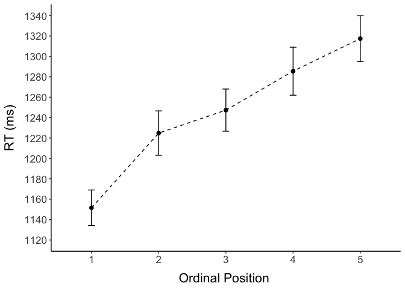
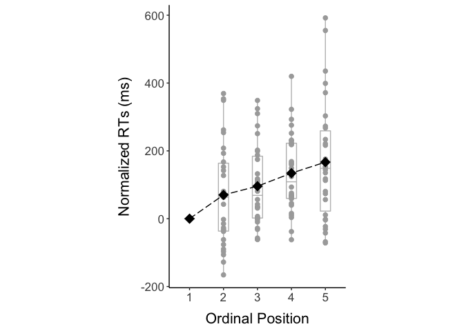
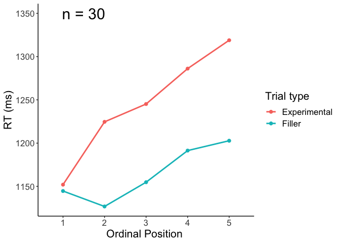
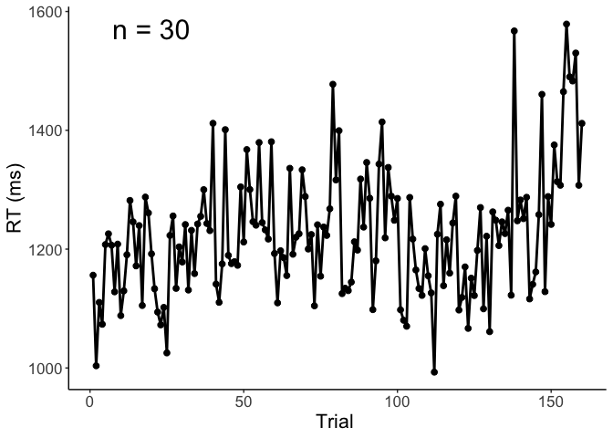
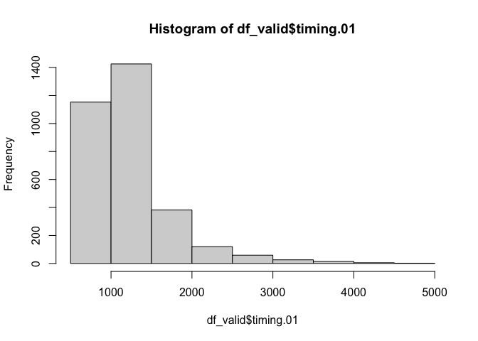
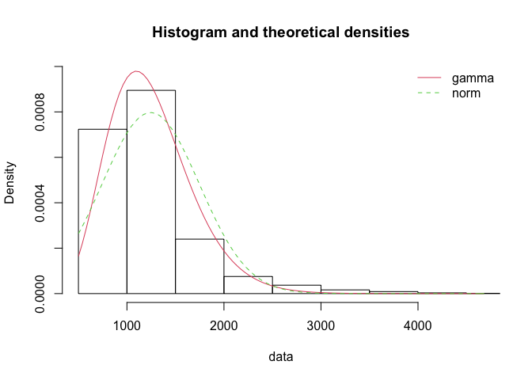

05 CSI online typing APPENDIX: Plotting and analysis with manual
classification
================
Kirsten Stark
23 Mai, 2021

## Load packages

``` r
library(dplyr)
```

    ## 
    ## Attaching package: 'dplyr'

    ## The following objects are masked from 'package:stats':
    ## 
    ##     filter, lag

    ## The following objects are masked from 'package:base':
    ## 
    ##     intersect, setdiff, setequal, union

``` r
library(tidyr)
library(lme4)
```

    ## Loading required package: Matrix

    ## 
    ## Attaching package: 'Matrix'

    ## The following objects are masked from 'package:tidyr':
    ## 
    ##     expand, pack, unpack

``` r
library(lmerTest)
```

    ## 
    ## Attaching package: 'lmerTest'

    ## The following object is masked from 'package:lme4':
    ## 
    ##     lmer

    ## The following object is masked from 'package:stats':
    ## 
    ##     step

``` r
library(Rmisc)
```

    ## Loading required package: lattice

    ## Loading required package: plyr

    ## ------------------------------------------------------------------------------

    ## You have loaded plyr after dplyr - this is likely to cause problems.
    ## If you need functions from both plyr and dplyr, please load plyr first, then dplyr:
    ## library(plyr); library(dplyr)

    ## ------------------------------------------------------------------------------

    ## 
    ## Attaching package: 'plyr'

    ## The following objects are masked from 'package:dplyr':
    ## 
    ##     arrange, count, desc, failwith, id, mutate, rename, summarise,
    ##     summarize

``` r
library(Cairo)
#library(strengejacke)
library(ggplot2)
library(sjPlot)

options(scipen=999)

rm(list = ls())
options( "encoding" = "UTF-8" )
set.seed(99)
```

## Load and preprocess data

``` r
# input 
#input = "data_long_final.csv"
input = "data_long_anonymous.csv"
classification_type = "manual" # select "manual" or "automatic"

# load data
df <- read.csv(here::here("data", input))
```

Check amount of participants and trials

``` r
# no. of participants: 
length(unique(df$subject))
```

    ## [1] 30

``` r
# no. of trials is 160 per participant? 
nrow(df) == 160 * length(unique(df$subject))
```

    ## [1] TRUE

Factorize columns

``` r
# factorize columns
is.numeric(df$timing.01)
```

    ## [1] TRUE

``` r
df$PosOr <- as.factor(df$PosOr)
df$subject <- as.factor(df$subject)
```

# Select correct classification column

``` r
if(classification_type == "automatic") {
  df$answercode <- df$answer_auto_jaro
  df$correct <- df$correct_auto_jaro
} else if(classification_type == "manual") {
  df$answercode <- df$answercode
  df$correct <- df$correct_manual
} else {
  print("Select a correct type!")
}
```

``` r
as.data.frame(table(df$correct, df$answercode)) %>% filter(Freq != 0) 
```

    ##   Var1                   Var2 Freq
    ## 1    1          almostcorrect  772
    ## 2    0  backspace_space_enter   25
    ## 3    1                correct 3520
    ## 4    0 first_letter_incorrect  192
    ## 5    0                   isna  153
    ## 6    0      semantic_relation  115
    ## 7    0            shift_start   10
    ## 8    0        unrelated_other   13

``` r
as.data.frame(table(df$correct, df$answercode)) %>% filter(Freq != 0) %>% 
  mutate(Percentage = case_when(Var1 == 1 ~ Freq/sum(df$correct == 1),
                                Var1 == 0 ~ Freq/sum(df$correct == 0)))
```

    ##   Var1                   Var2 Freq Percentage
    ## 1    1          almostcorrect  772 0.17986952
    ## 2    0  backspace_space_enter   25 0.04921260
    ## 3    1                correct 3520 0.82013048
    ## 4    0 first_letter_incorrect  192 0.37795276
    ## 5    0                   isna  153 0.30118110
    ## 6    0      semantic_relation  115 0.22637795
    ## 7    0            shift_start   10 0.01968504
    ## 8    0        unrelated_other   13 0.02559055

``` r
# raw
table(df$correct)
```

    ## 
    ##    0    1 
    ##  508 4292

``` r
# in percent
round(table(df$correct)/nrow(df)*100,2)
```

    ## 
    ##     0     1 
    ## 10.58 89.42

``` r
## How many correct/incorrect non-filler trials?
table(df$correct[df$category != "Filler"])
```

    ## 
    ##    0    1 
    ##  413 3187

Show amount of incorrect trials per ordinal position (excluding
fillers):

``` r
## How many correct/incorrect non-filler trials per ordinal position?
table(df$PosOr[df$category != "Filler" & df$correct == 0], 
      df$correct[df$category != "Filler" & df$correct == 0])
```

    ##    
    ##      0
    ##   1 73
    ##   2 84
    ##   3 79
    ##   4 83
    ##   5 94

Drop incorrect trials:

``` r
df <- df %>% filter(df$correct == 1)
```

# Plotting

Make plots suitable for APA format, font sizes can be adjusted

``` r
apatheme <- theme_bw()+
  theme(plot.title=element_text(family="Arial",size=22,hjust = .5),
        panel.grid.major=element_blank(), panel.grid.minor=element_blank(),
        panel.border=element_blank(),axis.line=element_line(),
        text=element_text(family="Arial",size=16))
```

### Descriptives

``` r
(means_final<- df %>% 
   filter(category != "Filler") %>% 
   Rmisc::summarySEwithin(.,"timing.01",idvar = "subject",
                          withinvars = "PosOr", na.rm = T))
```

    ##   PosOr   N timing.01       sd       se       ci
    ## 1     1 647  1151.609 443.3882 17.43139 34.22902
    ## 2     2 636  1224.805 549.0747 21.77223 42.75427
    ## 3     3 641  1247.348 523.4455 20.67485 40.59875
    ## 4     4 637  1285.511 593.8831 23.53050 46.20687
    ## 5     5 626  1317.456 561.4240 22.43902 44.06499

``` r
# Export as word file
library(flextable)
huxt_word <- huxtable::huxtable(means_final)
huxt_word <- huxtable::set_number_format(huxt_word, round(2))
huxtable::quick_docx(huxt_word, 
                     file = here::here("results", "tables",
                                       "CSI_online_typing__APPENDIX_RT_summary.docx"), 
                                       open = FALSE)
```

### RTs by ordinal position

Line graph (only correct trials, without fillers)

``` r
(plot_rt <- means_final %>% 
    ggplot(., aes(x=PosOr, y=timing.01)) +
    geom_point(size = 2)+
    stat_summary(fun=mean,  geom="line", size = 0.5, group = 1, linetype = "dashed") +
    geom_errorbar(aes(ymin=timing.01-se, ymax=timing.01+se), width =.1) +
    apatheme+
    scale_y_continuous(limits = c(1120, 1340), breaks =seq(1120,1340, by = 20)) +
                       #breaks = c(1100, 1150, 1200, 1250, 1300, 1350)) + 
    labs(x="Ordinal Position ",y ="RT (ms)") +
    theme(
    axis.title.y = element_text(margin = margin(0,10,0,0)),
    axis.title.x = element_text(margin = margin(10,0,0,0))))
```

<!-- -->

Normalized boxplot

``` r
means_subject <- df %>% 
   filter(category != "Filler") %>% 
   summarySEwithin(.,"timing.01",withinvars = c("subject","PosOr"))
(means_subject <- means_subject %>%
  group_by(subject) %>%
  dplyr::mutate(timing.01_norm = timing.01 - first(timing.01)))
```

    ## # A tibble: 150 x 8
    ## # Groups:   subject [30]
    ##    subject PosOr     N timing.01    sd    se    ci timing.01_norm
    ##    <fct>   <fct> <dbl>     <dbl> <dbl> <dbl> <dbl>          <dbl>
    ##  1 1       1        24     1127.  250.  51.1  106.            0  
    ##  2 1       2        22     1269.  325.  69.3  144.          142. 
    ##  3 1       3        22     1240.  277.  59.1  123.          113. 
    ##  4 1       4        24     1348.  491. 100.   207.          221. 
    ##  5 1       5        24     1526.  586. 120.   247.          399. 
    ##  6 2       1        23     1030   332.  69.2  144.            0  
    ##  7 2       2        22     1073.  478. 102.   212.           42.5
    ##  8 2       3        23     1087.  470.  97.9  203.           56.7
    ##  9 2       4        21     1098.  538. 117.   245.           68.3
    ## 10 2       5        24      962.  260.  53.0  110.          -68.1
    ## # … with 140 more rows

``` r
(boxplot <- 
  ggplot() + 
  
  ## boxplot
  geom_boxplot(data=means_subject, aes(x = PosOr,y =timing.01_norm),
               colour = "grey", width = 0.3,fatten = 1)+
  ### individual means
  geom_jitter(data=means_subject, aes(x = PosOr,y =timing.01_norm),
              position = position_dodge(0.6),
              shape=19,color = "dark grey", size=2)+
  ### group means
  stat_summary(data=means_subject, aes(x = PosOr,y =timing.01_norm),
               fun=mean, geom="point",colour = "black", shape=18, size=5)+
  ### line
  stat_summary(data=means_subject, aes(x = PosOr,y =timing.01_norm),
               fun=mean, geom="line",colour = "black", linetype = "longdash", group = 1)+
  
  ## other stuff
  #scale_y_continuous(breaks = seq(600, 1300, by = 50))+
  labs(x="Ordinal Position",y ="Normalized RTs (ms)")+
  apatheme +
  theme(
    axis.title.y = element_text(margin = margin(0,10,0,0)),
    axis.title.x = element_text(margin = margin(10,0,0,0))) +
  coord_equal(ratio = 1/100))
```

<!-- -->

### CONTROL: with fillers

``` r
(plot_rt_fillers <- df %>% 
    mutate(kind = case_when(category == "Filler" ~"Filler",
                          category != "Filler" ~"Experimental")) %>%
    ggplot(., aes(x=PosOr, y=timing.01, group=kind, color=kind)) +
    stat_summary(fun=mean,  geom="point", size = 2)+
    stat_summary(fun=mean,  geom="line", size = 1) +
    apatheme+
    labs(x="Ordinal Position ",y ="RT (ms)", color = "Trial type")+
  annotate(geom="text", x=1.5, y=1350, label="n = 30", 
           color="black", size = 8))
```

<!-- -->

### Control: Plot RTs accross the experiment

All correct trials (including fillers)

``` r
(plot_RTs_all <- ggplot(data=df, aes(x=trial, y=timing.01)) +
  stat_summary(fun=mean,  geom="point", size = 2)+
  stat_summary(fun=mean,  geom="line", size = 1) +
  apatheme+
  labs(x="Trial ",y ="RT (ms)")+
  annotate(geom="text", x=20, y=1570, label="n = 30", 
           color="black", size = 8))
```

<!-- -->

# Check distribution of data

Are the data normally distributed or does a gamma distribution fit the
data better?  
*Subset data to correct trials only and exclude fillers*

``` r
df_valid <- df %>% filter(category != "Filler") %>% 
  filter(correct == 1) %>% droplevels()
```

*Center predictor variable*

``` r
df_valid$PosOr.cont <- scale(as.numeric(as.character(df_valid$PosOr)),
                                        center = T, scale = F)
# table(df_valid$PosOr.cont)
# mean(df_valid$PosOr.cont)
```

*Histogram of the reaction time data*

``` r
hist(df_valid$timing.01)
```

<!-- -->

*Check fit of normal vs gamma distribution in histograms, q-q-plots and
using objective criteria:*  
1\) Fit normal and gamma distributions to the reaction time data

``` r
library(fitdistrplus)
```

    ## Loading required package: MASS

    ## 
    ## Attaching package: 'MASS'

    ## The following object is masked from 'package:dplyr':
    ## 
    ##     select

    ## Loading required package: survival

``` r
fit.normal<- fitdist(df_valid$timing.01, distr = "norm", method = "mle")
summary(fit.normal)
```

    ## Fitting of the distribution ' norm ' by maximum likelihood 
    ## Parameters : 
    ##      estimate Std. Error
    ## mean 1244.812   8.865251
    ## sd    500.474   6.268567
    ## Loglikelihood:  -24331.13   AIC:  48666.27   BIC:  48678.4 
    ## Correlation matrix:
    ##      mean sd
    ## mean    1  0
    ## sd      0  1

``` r
#plot(fit.normal)
```

``` r
fit.gamma <- fitdist(df_valid$timing.01, distr = "gamma", method = "mle")
summary(fit.gamma)
```

    ## Fitting of the distribution ' gamma ' by maximum likelihood 
    ## Parameters : 
    ##          estimate   Std. Error
    ## shape 8.419774650 0.1695036366
    ## rate  0.006763458 0.0001371497
    ## Loglikelihood:  -23710.19   AIC:  47424.38   BIC:  47436.52 
    ## Correlation matrix:
    ##           shape      rate
    ## shape 1.0000000 0.9557166
    ## rate  0.9557166 1.0000000

``` r
#plot(fit.gamma)
```

2)  Compare the fit of the two distributions  
    Visually compare fit of both distributions in histogram

<!-- end list -->

``` r
denscomp(list(fit.gamma, fit.normal))
```

<!-- -->

Visually compare fit of both distributions in Q-Q-plots

``` r
qqcomp(list(fit.gamma, fit.normal))
```

<!-- -->

Compare information criteria

``` r
gofstat(list(fit.gamma, fit.normal),
        fitnames = c("Gamma", "Normal"))
```

    ## Goodness-of-fit statistics
    ##                                    Gamma     Normal
    ## Kolmogorov-Smirnov statistic  0.09601246   0.143611
    ## Cramer-von Mises statistic   11.68311163  27.368833
    ## Anderson-Darling statistic   70.47206277 158.559608
    ## 
    ## Goodness-of-fit criteria
    ##                                   Gamma   Normal
    ## Akaike's Information Criterion 47424.38 48666.27
    ## Bayesian Information Criterion 47436.52 48678.40

**Conclusion:** Both the visual inspection and the objective criteria
suggest that a gamma distribution fits the data better (although not
that well). Therefore, we fit a Gamma distribution in a GLMM with the
continuous predictor ordinal position (Pos.cont), the factorial
predictor (experiment), and their interaction. We compute the maximal
random effects structure.

# Inferential analyses: GLMM (Gamma distribution) with ordinal position as a continuous predictor

``` r
m1 <- glmer(timing.01 ~ PosOr.cont + 
               (PosOr.cont|subject) +(PosOr.cont|category),
             data = df_valid, 
            family =Gamma(link ="identity"), 
            control=glmerControl(optimizer = "bobyqa"))
summary(m1)
```

    ## Generalized linear mixed model fit by maximum likelihood (Laplace
    ##   Approximation) [glmerMod]
    ##  Family: Gamma  ( identity )
    ## Formula: timing.01 ~ PosOr.cont + (PosOr.cont | subject) + (PosOr.cont |  
    ##     category)
    ##    Data: df_valid
    ## Control: glmerControl(optimizer = "bobyqa")
    ## 
    ##      AIC      BIC   logLik deviance df.resid 
    ##  46676.9  46731.5 -23329.4  46658.9     3178 
    ## 
    ## Scaled residuals: 
    ##     Min      1Q  Median      3Q     Max 
    ## -1.5341 -0.5803 -0.2605  0.2551  8.4390 
    ## 
    ## Random effects:
    ##  Groups   Name        Variance  Std.Dev. Corr 
    ##  subject  (Intercept) 8209.9951 90.6090       
    ##           PosOr.cont   660.5950 25.7020  -0.02
    ##  category (Intercept) 9785.2051 98.9202       
    ##           PosOr.cont   468.2029 21.6380  0.25 
    ##  Residual                0.1284  0.3583       
    ## Number of obs: 3187, groups:  subject, 30; category, 24
    ## 
    ## Fixed effects:
    ##             Estimate Std. Error t value             Pr(>|z|)    
    ## (Intercept) 1296.048     12.264 105.677 < 0.0000000000000002 ***
    ## PosOr.cont    42.320      7.213   5.867        0.00000000442 ***
    ## ---
    ## Signif. codes:  0 '***' 0.001 '**' 0.01 '*' 0.05 '.' 0.1 ' ' 1
    ## 
    ## Correlation of Fixed Effects:
    ##            (Intr)
    ## PosOr.cont 0.057

``` r
# save model output
tab_model(m1,transform = NULL,
          show.re.var = F, show.stat = T,show.r2 = F,show.icc = F,
          title = "GLMM (Gamma distribution) with continuous predictor",
          pred.labels = c("(Intercept)", "Ordinal Position"),
          dv.labels = "Typing Onset Latency",
          #string.pred = "",
          string.stat = "t-Value",
          file = here::here("results", "tables", "CSI_online_typing_APPENDIX_glmm_cont.html"))
```

<table style="border-collapse:collapse; border:none;">

<caption style="font-weight: bold; text-align:left;">

GLMM (Gamma distribution) with continuous predictor

</caption>

<tr>

<th style="border-top: double; text-align:center; font-style:normal; font-weight:bold; padding:0.2cm;  text-align:left; ">

 

</th>

<th colspan="4" style="border-top: double; text-align:center; font-style:normal; font-weight:bold; padding:0.2cm; ">

Typing Onset Latency

</th>

</tr>

<tr>

<td style=" text-align:center; border-bottom:1px solid; font-style:italic; font-weight:normal;  text-align:left; ">

Predictors

</td>

<td style=" text-align:center; border-bottom:1px solid; font-style:italic; font-weight:normal;  ">

Estimates

</td>

<td style=" text-align:center; border-bottom:1px solid; font-style:italic; font-weight:normal;  ">

CI

</td>

<td style=" text-align:center; border-bottom:1px solid; font-style:italic; font-weight:normal;  ">

t-Value

</td>

<td style=" text-align:center; border-bottom:1px solid; font-style:italic; font-weight:normal;  ">

p

</td>

</tr>

<tr>

<td style=" padding:0.2cm; text-align:left; vertical-align:top; text-align:left; ">

(Intercept)

</td>

<td style=" padding:0.2cm; text-align:left; vertical-align:top; text-align:center;  ">

1296.05

</td>

<td style=" padding:0.2cm; text-align:left; vertical-align:top; text-align:center;  ">

1272.01 – 1320.09

</td>

<td style=" padding:0.2cm; text-align:left; vertical-align:top; text-align:center;  ">

105.68

</td>

<td style=" padding:0.2cm; text-align:left; vertical-align:top; text-align:center;  ">

<strong>\<0.001

</td>

</tr>

<tr>

<td style=" padding:0.2cm; text-align:left; vertical-align:top; text-align:left; ">

Ordinal Position

</td>

<td style=" padding:0.2cm; text-align:left; vertical-align:top; text-align:center;  ">

42.32

</td>

<td style=" padding:0.2cm; text-align:left; vertical-align:top; text-align:center;  ">

28.18 – 56.46

</td>

<td style=" padding:0.2cm; text-align:left; vertical-align:top; text-align:center;  ">

5.87

</td>

<td style=" padding:0.2cm; text-align:left; vertical-align:top; text-align:center;  ">

<strong>\<0.001

</td>

</tr>

<tr>

<td style=" padding:0.2cm; text-align:left; vertical-align:top; text-align:left; padding-top:0.1cm; padding-bottom:0.1cm;">

N <sub>subject</sub>

</td>

<td style=" padding:0.2cm; text-align:left; vertical-align:top; padding-top:0.1cm; padding-bottom:0.1cm; text-align:left;" colspan="4">

30

</td>

<tr>

<td style=" padding:0.2cm; text-align:left; vertical-align:top; text-align:left; padding-top:0.1cm; padding-bottom:0.1cm;">

N <sub>category</sub>

</td>

<td style=" padding:0.2cm; text-align:left; vertical-align:top; padding-top:0.1cm; padding-bottom:0.1cm; text-align:left;" colspan="4">

24

</td>

<tr>

<td style=" padding:0.2cm; text-align:left; vertical-align:top; text-align:left; padding-top:0.1cm; padding-bottom:0.1cm; border-top:1px solid;">

Observations

</td>

<td style=" padding:0.2cm; text-align:left; vertical-align:top; padding-top:0.1cm; padding-bottom:0.1cm; text-align:left; border-top:1px solid;" colspan="4">

3187

</td>

</tr>

</table>
