05 CSI online typing: Plotting and analysis
================
Kirsten Stark
01 November, 2021

## Load packages

``` r
library(dplyr)
```

    ## 
    ## Attaching package: 'dplyr'

    ## The following objects are masked from 'package:stats':
    ## 
    ##     filter, lag

    ## The following objects are masked from 'package:base':
    ## 
    ##     intersect, setdiff, setequal, union

``` r
library(tidyr)
library(lme4)
```

    ## Loading required package: Matrix

    ## 
    ## Attaching package: 'Matrix'

    ## The following objects are masked from 'package:tidyr':
    ## 
    ##     expand, pack, unpack

``` r
#library(lmerTest)
library(Rmisc)
```

    ## Loading required package: lattice

    ## Loading required package: plyr

    ## ------------------------------------------------------------------------------

    ## You have loaded plyr after dplyr - this is likely to cause problems.
    ## If you need functions from both plyr and dplyr, please load plyr first, then dplyr:
    ## library(plyr); library(dplyr)

    ## ------------------------------------------------------------------------------

    ## 
    ## Attaching package: 'plyr'

    ## The following objects are masked from 'package:dplyr':
    ## 
    ##     arrange, count, desc, failwith, id, mutate, rename, summarise,
    ##     summarize

``` r
library(Cairo)
#library(strengejacke)
library(ggplot2)
library(sjPlot)
```

    ## Learn more about sjPlot with 'browseVignettes("sjPlot")'.

``` r
options(scipen=999)

rm(list = ls())
options( "encoding" = "UTF-8" )
set.seed(99)
```

## Load and preprocess data

``` r
# input 
#input = "data_long_final.csv"
input = "data_long_anonymous.csv"
classification_type = "automatic" # select "manual" or "automatic"

# load data
df <- read.csv(here::here("data", input))
```

Check amount of participants and trials

``` r
# no. of participants: 
length(unique(df$subject))
```

    ## [1] 30

``` r
# no. of trials is 160 per participant? 
nrow(df) == 160 * length(unique(df$subject))
```

    ## [1] TRUE

Factorize columns

``` r
# factorize columns
is.numeric(df$timing.01)
```

    ## [1] TRUE

``` r
df$PosOr <- as.factor(df$PosOr)
df$subject <- as.factor(df$subject)
```

# Select correct classification column

``` r
if(classification_type == "automatic") {
  df$answercode <- df$answer_auto_jaro
  df$correct <- df$correct_auto_jaro
} else if(classification_type == "manual") {
  df$answercode <- df$answercode
  df$correct <- df$correct_manual
} else {
  print("Select a correct type!")
}
```

``` r
as.data.frame(table(df$correct, df$answercode)) %>% filter(Freq != 0) 
```

    ##    Var1                  Var2 Freq
    ## 1     1 alternative_corrected  302
    ## 2     1    approx_alternative   24
    ## 3     1        approx_correct  133
    ## 4     0 backspace_space_enter   25
    ## 5     1               correct 3519
    ## 6     1    correctedtocorrect  301
    ## 7     0  distance_based_error   12
    ## 8     0    first_letter_error  231
    ## 9     0                  isna  153
    ## 10    0           not_correct   90
    ## 11    0           shift_start   10

``` r
as.data.frame(table(df$correct, df$answercode)) %>% filter(Freq != 0) %>% 
  mutate(Percentage = case_when(Var1 == 1 ~ Freq/sum(df$correct == 1),
                                Var1 == 0 ~ Freq/sum(df$correct == 0)))
```

    ##    Var1                  Var2 Freq  Percentage
    ## 1     1 alternative_corrected  302 0.070577238
    ## 2     1    approx_alternative   24 0.005608787
    ## 3     1        approx_correct  133 0.031082029
    ## 4     0 backspace_space_enter   25 0.047984645
    ## 5     1               correct 3519 0.822388409
    ## 6     1    correctedtocorrect  301 0.070343538
    ## 7     0  distance_based_error   12 0.023032630
    ## 8     0    first_letter_error  231 0.443378119
    ## 9     0                  isna  153 0.293666027
    ## 10    0           not_correct   90 0.172744722
    ## 11    0           shift_start   10 0.019193858

``` r
# raw
table(df$correct)
```

    ## 
    ##    0    1 
    ##  521 4279

``` r
# in percent
round(table(df$correct)/nrow(df)*100,2)
```

    ## 
    ##     0     1 
    ## 10.85 89.15

``` r
## How many correct/incorrect non-filler trials?
table(df$correct[df$category != "Filler"])
```

    ## 
    ##    0    1 
    ##  422 3178

Show amount of incorrect trials per ordinal position (excluding
fillers):

``` r
## How many correct/incorrect non-filler trials per ordinal position?
table(df$PosOr[df$category != "Filler" & df$correct == 0], 
      df$correct[df$category != "Filler" & df$correct == 0])
```

    ##    
    ##      0
    ##   1 75
    ##   2 87
    ##   3 82
    ##   4 83
    ##   5 95

Mean and SD by participant:

``` r
# error sum including fillers: 
df <- df %>% 
    mutate(error_sum = (correct-1)*(-1))
correctness_by_ppt <- summarySE(df, measurevar="error_sum", groupvars="subject")$error_sum
print("Mean:"); round(mean(correctness_by_ppt)*100,2)
```

    ## [1] "Mean:"

    ## [1] 10.85

``` r
print("Subject:"); round(sd(correctness_by_ppt)*100,2)
```

    ## [1] "Subject:"

    ## [1] 4.73

Drop incorrect trials:

``` r
df <- df %>% filter(df$correct == 1)
```

# Plotting

Make plots suitable for APA format, font sizes can be adjusted

``` r
apatheme <- theme_bw()+
  theme(plot.title=element_text(family="Arial",size=22,hjust = .5),
        panel.grid.major=element_blank(), panel.grid.minor=element_blank(),
        panel.border=element_blank(),axis.line=element_line(),
        text=element_text(family="Arial",size=16))
```

### Descriptives

``` r
(means_final<- df %>% 
   filter(category != "Filler") %>% 
   Rmisc::summarySEwithin(.,"timing.01",idvar = "subject",
                          withinvars = "PosOr", na.rm = T))
```

    ##   PosOr   N timing.01       sd       se       ci
    ## 1     1 645  1152.220 444.1659 17.48902 34.34238
    ## 2     2 633  1228.071 553.3236 21.99264 43.18749
    ## 3     3 638  1247.875 525.8232 20.81754 40.87930
    ## 4     4 637  1285.638 593.4891 23.51489 46.17622
    ## 5     5 625  1317.224 562.0187 22.48075 44.14708

``` r
(means_final_cat<- df %>% 
   filter(category != "Filler") %>% 
   Rmisc::summarySEwithin(.,"timing.01",idvar = "category",
                          withinvars = "PosOr", na.rm = T))
```

    ##   PosOr   N timing.01       sd       se       ci
    ## 1     1 645  1150.122 453.7537 17.86654 35.08370
    ## 2     2 633  1231.018 544.5825 21.64521 42.50524
    ## 3     3 638  1243.083 505.9424 20.03045 39.33370
    ## 4     4 637  1286.604 573.9345 22.74011 44.65478
    ## 5     5 625  1320.310 562.7194 22.50878 44.20213

``` r
# Export as word file
library(flextable)
huxt_word <- huxtable::huxtable(means_final)
huxt_word <- huxtable::set_number_format(huxt_word, round(2))
huxtable::quick_docx(huxt_word, 
                     file = here::here("results", "tables",
                                       "CSI_online_typing_RT_summary.docx"), 
                                       open = FALSE)
```

### RTs by ordinal position

Line graph (only correct trials, without fillers)

``` r
(plot_rt <- means_final %>% 
    ggplot(., aes(x=PosOr, y=timing.01)) +
    geom_point(size = 2)+
    stat_summary(fun=mean,  geom="line", size = 0.5, group = 1, linetype = "dashed") +
    geom_errorbar(aes(ymin=timing.01-se, ymax=timing.01+se), width =.1) +
    apatheme+
    scale_y_continuous(limits = c(1120, 1340), breaks =seq(1120,1340, by = 20)) +
                       #breaks = c(1100, 1150, 1200, 1250, 1300, 1350)) + 
    labs(x="Ordinal Position ",y ="RT (ms)") + #+
  # annotate(geom="text", x=1.5, y=1330, label="n = 30", 
  #         color="black", size = 8))
    theme(
    axis.title.y = element_text(margin = margin(0,10,0,0)),
    axis.title.x = element_text(margin = margin(10,0,0,0))))
```

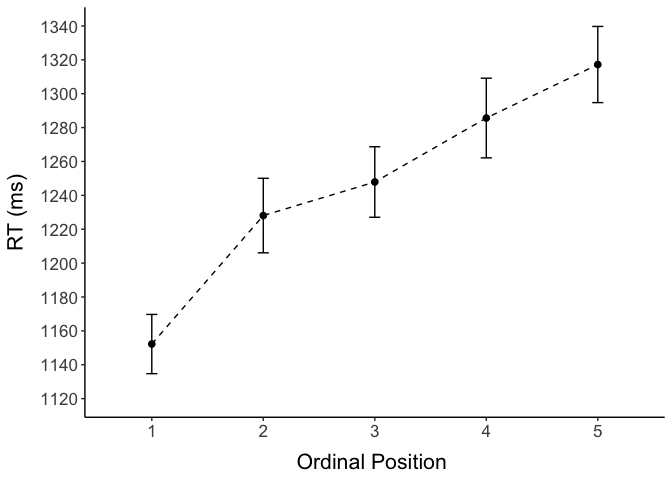<!-- -->

``` r
filename <- "CSI_online_typing_plot_rt.pdf"
ggsave(plot_rt, filename = 
         here::here("results", "figures", filename),
       width = 18, height = 13, units = "cm", 
       dpi = 300, device = cairo_pdf)
embedFonts(file = here::here("results", "figures", filename))
```

Normalized boxplot

``` r
means_subject <- df %>% 
   filter(category != "Filler") %>% 
   summarySEwithin(.,"timing.01",withinvars = c("subject","PosOr"))
(means_subject <- means_subject %>%
  group_by(subject) %>%
  dplyr::mutate(timing.01_norm = timing.01 - first(timing.01)))
```

    ## # A tibble: 150 x 8
    ## # Groups:   subject [30]
    ##    subject PosOr     N timing.01    sd    se    ci timing.01_norm
    ##    <fct>   <fct> <dbl>     <dbl> <dbl> <dbl> <dbl>          <dbl>
    ##  1 1       1        24     1127.  250.  51.1  106.            0  
    ##  2 1       2        22     1269.  325.  69.3  144.          142. 
    ##  3 1       3        22     1240.  277.  59.1  123.          113. 
    ##  4 1       4        24     1348.  491. 100.   207.          221. 
    ##  5 1       5        24     1526.  586. 120.   247.          399. 
    ##  6 2       1        23     1030   332.  69.2  144.            0  
    ##  7 2       2        22     1073.  478. 102.   212.           42.5
    ##  8 2       3        23     1087.  470.  97.9  203.           56.7
    ##  9 2       4        21     1098.  538. 117.   245.           68.3
    ## 10 2       5        24      962.  260.  53.0  110.          -68.1
    ## # … with 140 more rows

``` r
(boxplot <- 
  ggplot() + 
  
  ## boxplot
  geom_boxplot(data=means_subject, aes(x = PosOr,y =timing.01_norm),
               colour = "grey", width = 0.3,fatten = 1)+
  ### individual means
  geom_jitter(data=means_subject, aes(x = PosOr,y =timing.01_norm),
              position = position_dodge(0.6),
              shape=19,color = "dark grey", size=2)+
  ### group means
  stat_summary(data=means_subject, aes(x = PosOr,y =timing.01_norm),
               fun=mean, geom="point",colour = "black", shape=18, size=5)+
  ### line
  stat_summary(data=means_subject, aes(x = PosOr,y =timing.01_norm),
               fun=mean, geom="line",colour = "black", linetype = "longdash", group = 1)+
  
  ## other stuff
  #scale_y_continuous(breaks = seq(600, 1300, by = 50))+
  labs(x="Ordinal Position",y ="Normalized RTs (ms)")+
  apatheme +
  theme(
    axis.title.y = element_text(margin = margin(0,10,0,0)),
    axis.title.x = element_text(margin = margin(10,0,0,0))) +
  coord_equal(ratio = 1/100))
```

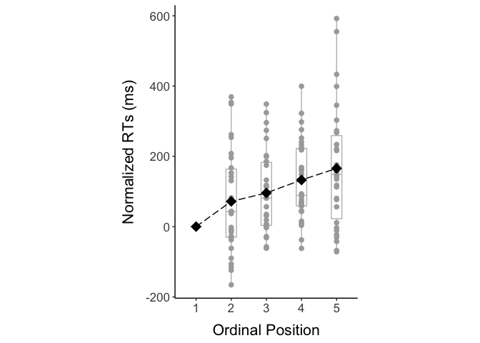<!-- -->

``` r
filename <- "CSI_online_typing_boxplot.pdf"
ggsave(boxplot, filename = 
         here::here("results", "figures", filename),
       width = 13, height = 18, units = "cm", 
       dpi = 300, device = cairo_pdf)
embedFonts(file = here::here("results", "figures", filename))
```

### Export plot grid

``` r
cowplot::plot_grid(plot_rt, boxplot,
          nrow = 1, labels = c("A", "B")) %>%
  ggsave(filename = here::here("results", "figures",
                               "CSI_online_typing_RTs_and_normalized_RTs"),
         width = 18, height = 13, units = "cm", dpi = 300, 
         device = cairo_pdf)
```

    ## Warning in grid.Call(C_stringMetric, as.graphicsAnnot(x$label)):
    ## Zeichensatzfamilie 'Arial' in der PostScript-Zeichensatzdatenbank nicht gefunden
    
    ## Warning in grid.Call(C_stringMetric, as.graphicsAnnot(x$label)):
    ## Zeichensatzfamilie 'Arial' in der PostScript-Zeichensatzdatenbank nicht gefunden
    
    ## Warning in grid.Call(C_stringMetric, as.graphicsAnnot(x$label)):
    ## Zeichensatzfamilie 'Arial' in der PostScript-Zeichensatzdatenbank nicht gefunden
    
    ## Warning in grid.Call(C_stringMetric, as.graphicsAnnot(x$label)):
    ## Zeichensatzfamilie 'Arial' in der PostScript-Zeichensatzdatenbank nicht gefunden
    
    ## Warning in grid.Call(C_stringMetric, as.graphicsAnnot(x$label)):
    ## Zeichensatzfamilie 'Arial' in der PostScript-Zeichensatzdatenbank nicht gefunden
    
    ## Warning in grid.Call(C_stringMetric, as.graphicsAnnot(x$label)):
    ## Zeichensatzfamilie 'Arial' in der PostScript-Zeichensatzdatenbank nicht gefunden
    
    ## Warning in grid.Call(C_stringMetric, as.graphicsAnnot(x$label)):
    ## Zeichensatzfamilie 'Arial' in der PostScript-Zeichensatzdatenbank nicht gefunden
    
    ## Warning in grid.Call(C_stringMetric, as.graphicsAnnot(x$label)):
    ## Zeichensatzfamilie 'Arial' in der PostScript-Zeichensatzdatenbank nicht gefunden
    
    ## Warning in grid.Call(C_stringMetric, as.graphicsAnnot(x$label)):
    ## Zeichensatzfamilie 'Arial' in der PostScript-Zeichensatzdatenbank nicht gefunden
    
    ## Warning in grid.Call(C_stringMetric, as.graphicsAnnot(x$label)):
    ## Zeichensatzfamilie 'Arial' in der PostScript-Zeichensatzdatenbank nicht gefunden
    
    ## Warning in grid.Call(C_stringMetric, as.graphicsAnnot(x$label)):
    ## Zeichensatzfamilie 'Arial' in der PostScript-Zeichensatzdatenbank nicht gefunden
    
    ## Warning in grid.Call(C_stringMetric, as.graphicsAnnot(x$label)):
    ## Zeichensatzfamilie 'Arial' in der PostScript-Zeichensatzdatenbank nicht gefunden
    
    ## Warning in grid.Call(C_stringMetric, as.graphicsAnnot(x$label)):
    ## Zeichensatzfamilie 'Arial' in der PostScript-Zeichensatzdatenbank nicht gefunden
    
    ## Warning in grid.Call(C_stringMetric, as.graphicsAnnot(x$label)):
    ## Zeichensatzfamilie 'Arial' in der PostScript-Zeichensatzdatenbank nicht gefunden
    
    ## Warning in grid.Call(C_stringMetric, as.graphicsAnnot(x$label)):
    ## Zeichensatzfamilie 'Arial' in der PostScript-Zeichensatzdatenbank nicht gefunden
    
    ## Warning in grid.Call(C_stringMetric, as.graphicsAnnot(x$label)):
    ## Zeichensatzfamilie 'Arial' in der PostScript-Zeichensatzdatenbank nicht gefunden
    
    ## Warning in grid.Call(C_stringMetric, as.graphicsAnnot(x$label)):
    ## Zeichensatzfamilie 'Arial' in der PostScript-Zeichensatzdatenbank nicht gefunden
    
    ## Warning in grid.Call(C_stringMetric, as.graphicsAnnot(x$label)):
    ## Zeichensatzfamilie 'Arial' in der PostScript-Zeichensatzdatenbank nicht gefunden
    
    ## Warning in grid.Call(C_stringMetric, as.graphicsAnnot(x$label)):
    ## Zeichensatzfamilie 'Arial' in der PostScript-Zeichensatzdatenbank nicht gefunden
    
    ## Warning in grid.Call(C_stringMetric, as.graphicsAnnot(x$label)):
    ## Zeichensatzfamilie 'Arial' in der PostScript-Zeichensatzdatenbank nicht gefunden
    
    ## Warning in grid.Call(C_stringMetric, as.graphicsAnnot(x$label)):
    ## Zeichensatzfamilie 'Arial' in der PostScript-Zeichensatzdatenbank nicht gefunden
    
    ## Warning in grid.Call(C_stringMetric, as.graphicsAnnot(x$label)):
    ## Zeichensatzfamilie 'Arial' in der PostScript-Zeichensatzdatenbank nicht gefunden
    
    ## Warning in grid.Call(C_stringMetric, as.graphicsAnnot(x$label)):
    ## Zeichensatzfamilie 'Arial' in der PostScript-Zeichensatzdatenbank nicht gefunden
    
    ## Warning in grid.Call(C_stringMetric, as.graphicsAnnot(x$label)):
    ## Zeichensatzfamilie 'Arial' in der PostScript-Zeichensatzdatenbank nicht gefunden
    
    ## Warning in grid.Call(C_stringMetric, as.graphicsAnnot(x$label)):
    ## Zeichensatzfamilie 'Arial' in der PostScript-Zeichensatzdatenbank nicht gefunden
    
    ## Warning in grid.Call(C_stringMetric, as.graphicsAnnot(x$label)):
    ## Zeichensatzfamilie 'Arial' in der PostScript-Zeichensatzdatenbank nicht gefunden
    
    ## Warning in grid.Call(C_stringMetric, as.graphicsAnnot(x$label)):
    ## Zeichensatzfamilie 'Arial' in der PostScript-Zeichensatzdatenbank nicht gefunden
    
    ## Warning in grid.Call(C_stringMetric, as.graphicsAnnot(x$label)):
    ## Zeichensatzfamilie 'Arial' in der PostScript-Zeichensatzdatenbank nicht gefunden

``` r
#embedFonts(file = here::here("results", "figures", "CSI_online_typing_RTs_and_normalized_RTs"))
```

### … with fillers for control

``` r
(plot_rt_fillers <- df %>% 
    mutate(kind = case_when(category == "Filler" ~"Filler",
                          category != "Filler" ~"Experimental")) %>%
    ggplot(., aes(x=PosOr, y=timing.01, group=kind, color=kind)) +
    stat_summary(fun=mean,  geom="point", size = 2)+
    stat_summary(fun=mean,  geom="line", size = 1) +
    apatheme+
    labs(x="Ordinal Position ",y ="RT (ms)", color = "Trial type")+
  annotate(geom="text", x=1.5, y=1350, label="n = 30", 
           color="black", size = 8))
```

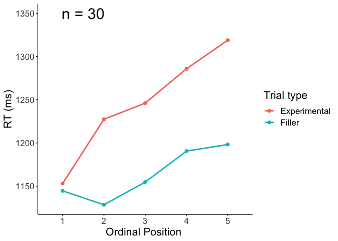<!-- -->

``` r
filename <- "CSI_online_typing_plot_rt_with_fillers.pdf"
ggsave(plot_rt_fillers, filename = 
         here::here("results", "figures", filename),
       width = 18, height = 13, units = "cm", 
       dpi = 300, device = cairo_pdf)
embedFonts(file = here::here("results", "figures", filename))
```

### Plot by subcategory

See nicer plot below

``` r
# (plot_rt_by_cat <- df %>%  
#    filter(category != "Filler") %>% 
#     ggplot(., aes(x=PosOr, y=timing.01)) +
#     stat_summary(fun=mean,  geom="point", size = 2)+
#     stat_summary(fun=mean,  geom="line", size = 1) +
#     facet_wrap(~category) +
#     apatheme+
#     labs(x="Ordinal Position ",y ="RT (ms)"))
# 
# filename <- "CSI_online_typing_plot_rt_by_category.pdf"
# ggsave(plot_rt_by_cat, filename = 
#          here::here("results", "figures", filename),
#        width = 18, height = 19, units = "cm", 
#        dpi = 300, device = cairo_pdf)
# embedFonts(file = here::here("results", "figures", filename))
```

### Plot by subject

See nicer plot below

``` r
# (plot_rt_by_subject <- df %>% 
#    filter(category != "Filler") %>% 
#     ggplot(., aes(x=PosOr, y=timing.01)) +
#     stat_summary(fun=mean,  geom="point", size = 2) +  
#     stat_summary(fun=mean,  geom="line", size = 1) +  
#     facet_wrap(~subject) +
#     apatheme+
#     labs(x="Ordinal Position ",y ="RT (ms)"))
# 
# filename <- "CSI_online_typing_plot_rt_by_subject.pdf"
# ggsave(plot_rt_by_subject, filename = 
#          here::here("results", "figures", filename),
#        width = 18, height = 19, units = "cm", 
#        dpi = 300, device = cairo_pdf)
# embedFonts(file = here::here("results", "figures", filename))
```

### Control: Plot RTs accross the experiment

All trials correct trials

``` r
(plot_RTs_all <- ggplot(data=df, aes(x=trial, y=timing.01)) +
  stat_summary(fun=mean,  geom="point", size = 2)+
  stat_summary(fun=mean,  geom="line", size = 1) +
  apatheme+
  labs(x="Trial ",y ="RT (ms)")+
  annotate(geom="text", x=20, y=1570, label="n = 30", 
           color="black", size = 8))
```

<!-- -->

``` r
filename <- "CSI_online_typing_plot_rts_across_experiment.pdf"
ggsave(plot_RTs_all, filename = 
         here::here("results", "figures", filename),
       width = 18, height = 13, units = "cm", 
       dpi = 300, device = cairo_pdf)
embedFonts(file = here::here("results", "figures", filename))
```

Correct non-filler trials only:

``` r
(plot_RTs_correct <- df %>% 
   filter(category != "Filler") %>% 
    ggplot(., aes(x=trial, y=timing.01)) +
    stat_summary(fun=mean,  geom="point", size = 2)+
    stat_summary(fun=mean,  geom="line", size = 1) +
    apatheme+
    labs(x="Trial ",y ="RT ms")+
    annotate(geom="text", x=20, y=1570, label="n = 30", 
             color="black", size = 8))
```

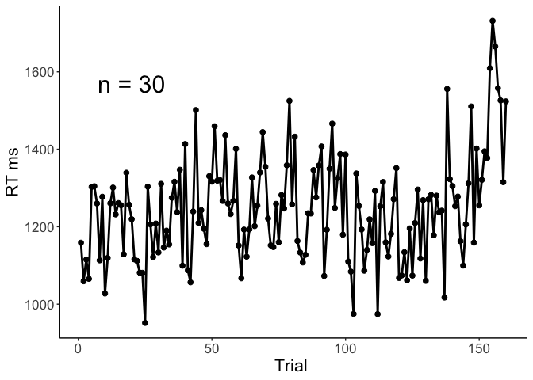<!-- -->

``` r
filename <- "CSI_online_typing_plot_rts_across_experiment_correct_experimental_trials.pdf"
ggsave(plot_RTs_correct, filename = 
         here::here("results", "figures", filename),
       width = 18, height = 13, units = "cm", 
       dpi = 300, device = cairo_pdf)
embedFonts(file = here::here("results", "figures", filename))
```

# Check distribution of data

Are the data normally distributed or does a gamma distribution fit the
data better?  
*Subset data to correct trials only and exclude fillers*

``` r
df_valid <- df %>% filter(category != "Filler") %>% 
  filter(correct == 1) %>% droplevels()
```

*Center predictor variable*

``` r
df_valid$PosOr.cont <- scale(as.numeric(as.character(df_valid$PosOr)),
                                        center = T, scale = F)
# table(df_valid$PosOr.cont)
# mean(df_valid$PosOr.cont)
```

*Histogram of the reaction time data*

``` r
hist(df_valid$timing.01)
```

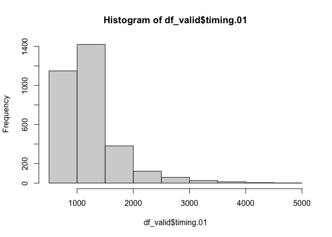<!-- -->

*Check fit of normal vs gamma distribution in histograms, q-q-plots and
using objective criteria:*  
1\) Fit normal and gamma distributions to the reaction time data

``` r
library(fitdistrplus)
```

    ## Loading required package: MASS

    ## 
    ## Attaching package: 'MASS'

    ## The following object is masked from 'package:dplyr':
    ## 
    ##     select

    ## Loading required package: survival

``` r
fit.normal<- fitdist(df_valid$timing.01, distr = "norm", method = "mle")
summary(fit.normal)
```

    ## Fitting of the distribution ' norm ' by maximum likelihood 
    ## Parameters : 
    ##       estimate Std. Error
    ## mean 1245.7240   8.896466
    ## sd    501.5297   6.290638
    ## Loglikelihood:  -24269.12   AIC:  48542.24   BIC:  48554.37 
    ## Correlation matrix:
    ##      mean sd
    ## mean    1  0
    ## sd      0  1

``` r
#plot(fit.normal)
```

``` r
fit.gamma <- fitdist(df_valid$timing.01, distr = "gamma", method = "mle")
summary(fit.gamma)
```

    ## Fitting of the distribution ' gamma ' by maximum likelihood 
    ## Parameters : 
    ##          estimate   Std. Error
    ## shape 8.393507247 0.1690773662
    ## rate  0.006738114 0.0001367073
    ## Loglikelihood:  -23650.2   AIC:  47304.39   BIC:  47316.52 
    ## Correlation matrix:
    ##           shape      rate
    ## shape 1.0000000 0.9555099
    ## rate  0.9555099 1.0000000

``` r
#plot(fit.gamma)
```

2)  Compare the fit of the two distributions  
    Visually compare fit of both distributions in histogram

<!-- end list -->

``` r
denscomp(list(fit.gamma, fit.normal))
```

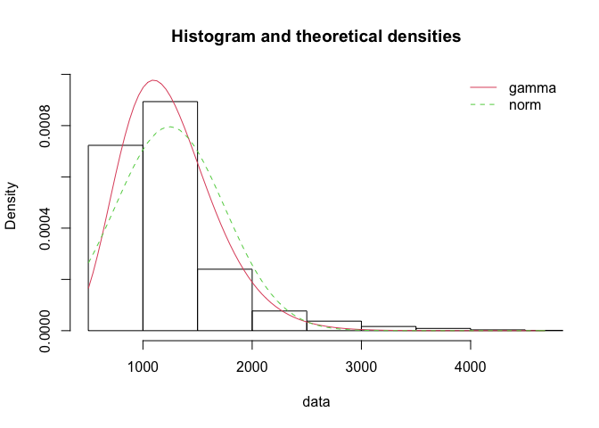<!-- -->

Visually compare fit of both distributions in Q-Q-plots

``` r
qqcomp(list(fit.gamma, fit.normal))
```

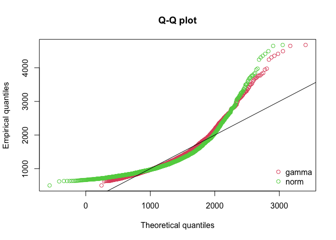<!-- -->

Compare information criteria

``` r
gofstat(list(fit.gamma, fit.normal),
        fitnames = c("Gamma", "Normal"))
```

    ## Goodness-of-fit statistics
    ##                                  Gamma      Normal
    ## Kolmogorov-Smirnov statistic  0.096902   0.1443542
    ## Cramer-von Mises statistic   11.704816  27.3854717
    ## Anderson-Darling statistic   70.527683 158.4631104
    ## 
    ## Goodness-of-fit criteria
    ##                                   Gamma   Normal
    ## Akaike's Information Criterion 47304.39 48542.24
    ## Bayesian Information Criterion 47316.52 48554.37

**Conclusion:** Both the visual inspection and the objective criteria
suggest that a gamma distribution fits the data better (although not
that well). Therefore, we fit a Gamma distribution in a GLMM with the
continuous predictor ordinal position (Pos.cont), the factorial
predictor (experiment), and their interaction. We compute the maximal
random effects structure.

# Inferential analyses: GLMM (Gamma distribution) with ordinal position as a continuous predictor

``` r
m1 <- glmer(timing.01 ~ PosOr.cont + 
               (PosOr.cont|subject) +(PosOr.cont|category),
             data = df_valid, 
            family =Gamma(link ="identity"), 
            control=glmerControl(optimizer = "bobyqa"))
summary(m1)
```

    ## Generalized linear mixed model fit by maximum likelihood (Laplace
    ##   Approximation) [glmerMod]
    ##  Family: Gamma  ( identity )
    ## Formula: timing.01 ~ PosOr.cont + (PosOr.cont | subject) + (PosOr.cont |  
    ##     category)
    ##    Data: df_valid
    ## Control: glmerControl(optimizer = "bobyqa")
    ## 
    ##      AIC      BIC   logLik deviance df.resid 
    ##  46561.2  46615.7 -23271.6  46543.2     3169 
    ## 
    ## Scaled residuals: 
    ##     Min      1Q  Median      3Q     Max 
    ## -1.5333 -0.5849 -0.2585  0.2562  8.4387 
    ## 
    ## Random effects:
    ##  Groups   Name        Variance  Std.Dev. Corr 
    ##  subject  (Intercept) 8171.0578  90.3939      
    ##           PosOr.cont   661.5039  25.7197 -0.02
    ##  category (Intercept) 9999.1073  99.9955      
    ##           PosOr.cont   491.0824  22.1604 0.22 
    ##  Residual                0.1286   0.3586      
    ## Number of obs: 3178, groups:  subject, 30; category, 24
    ## 
    ## Fixed effects:
    ##             Estimate Std. Error t value             Pr(>|z|)    
    ## (Intercept) 1298.489     11.434 113.561 < 0.0000000000000002 ***
    ## PosOr.cont    41.678      6.829   6.103        0.00000000104 ***
    ## ---
    ## Signif. codes:  0 '***' 0.001 '**' 0.01 '*' 0.05 '.' 0.1 ' ' 1
    ## 
    ## Correlation of Fixed Effects:
    ##            (Intr)
    ## PosOr.cont -0.072

``` r
# save model output
tab_model(m1,transform = NULL,
          show.re.var = T, show.stat = T,show.r2 = F,show.icc = F,
          title = "GLMM (Gamma distribution) with continuous predictor",
          pred.labels = c("(Intercept)", "Ordinal Position"),
          dv.labels = "Typing Onset Latency",
          #string.pred = "",
          string.stat = "t-Value",
          file = here::here("results", "tables", "CSI_online_typing_glmm_cont.html"))
```

<table style="border-collapse:collapse; border:none;">

<caption style="font-weight: bold; text-align:left;">

GLMM (Gamma distribution) with continuous predictor

</caption>

<tr>

<th style="border-top: double; text-align:center; font-style:normal; font-weight:bold; padding:0.2cm;  text-align:left; ">

 

</th>

<th colspan="4" style="border-top: double; text-align:center; font-style:normal; font-weight:bold; padding:0.2cm; ">

Typing Onset Latency

</th>

</tr>

<tr>

<td style=" text-align:center; border-bottom:1px solid; font-style:italic; font-weight:normal;  text-align:left; ">

Predictors

</td>

<td style=" text-align:center; border-bottom:1px solid; font-style:italic; font-weight:normal;  ">

Estimates

</td>

<td style=" text-align:center; border-bottom:1px solid; font-style:italic; font-weight:normal;  ">

CI

</td>

<td style=" text-align:center; border-bottom:1px solid; font-style:italic; font-weight:normal;  ">

t-Value

</td>

<td style=" text-align:center; border-bottom:1px solid; font-style:italic; font-weight:normal;  ">

p

</td>

</tr>

<tr>

<td style=" padding:0.2cm; text-align:left; vertical-align:top; text-align:left; ">

(Intercept)

</td>

<td style=" padding:0.2cm; text-align:left; vertical-align:top; text-align:center;  ">

1298.49

</td>

<td style=" padding:0.2cm; text-align:left; vertical-align:top; text-align:center;  ">

1276.08 – 1320.90

</td>

<td style=" padding:0.2cm; text-align:left; vertical-align:top; text-align:center;  ">

113.56

</td>

<td style=" padding:0.2cm; text-align:left; vertical-align:top; text-align:center;  ">

<strong>\<0.001

</td>

</tr>

<tr>

<td style=" padding:0.2cm; text-align:left; vertical-align:top; text-align:left; ">

Ordinal Position

</td>

<td style=" padding:0.2cm; text-align:left; vertical-align:top; text-align:center;  ">

41.68

</td>

<td style=" padding:0.2cm; text-align:left; vertical-align:top; text-align:center;  ">

28.29 – 55.06

</td>

<td style=" padding:0.2cm; text-align:left; vertical-align:top; text-align:center;  ">

6.10

</td>

<td style=" padding:0.2cm; text-align:left; vertical-align:top; text-align:center;  ">

<strong>\<0.001

</td>

</tr>

<tr>

<td colspan="5" style="font-weight:bold; text-align:left; padding-top:.8em;">

Random Effects

</td>

</tr>

<tr>

<td style=" padding:0.2cm; text-align:left; vertical-align:top; text-align:left; padding-top:0.1cm; padding-bottom:0.1cm;">

σ<sup>2</sup>

</td>

<td style=" padding:0.2cm; text-align:left; vertical-align:top; padding-top:0.1cm; padding-bottom:0.1cm; text-align:left;" colspan="4">

0.13

</td>

<tr>

<td style=" padding:0.2cm; text-align:left; vertical-align:top; text-align:left; padding-top:0.1cm; padding-bottom:0.1cm;">

τ<sub>00</sub> <sub>subject</sub>

</td>

<td style=" padding:0.2cm; text-align:left; vertical-align:top; padding-top:0.1cm; padding-bottom:0.1cm; text-align:left;" colspan="4">

8171.06

</td>

<tr>

<td style=" padding:0.2cm; text-align:left; vertical-align:top; text-align:left; padding-top:0.1cm; padding-bottom:0.1cm;">

τ<sub>00</sub> <sub>category</sub>

</td>

<td style=" padding:0.2cm; text-align:left; vertical-align:top; padding-top:0.1cm; padding-bottom:0.1cm; text-align:left;" colspan="4">

9999.11

</td>

<tr>

<td style=" padding:0.2cm; text-align:left; vertical-align:top; text-align:left; padding-top:0.1cm; padding-bottom:0.1cm;">

τ<sub>11</sub> <sub>subject.PosOr.cont</sub>

</td>

<td style=" padding:0.2cm; text-align:left; vertical-align:top; padding-top:0.1cm; padding-bottom:0.1cm; text-align:left;" colspan="4">

661.50

</td>

<tr>

<td style=" padding:0.2cm; text-align:left; vertical-align:top; text-align:left; padding-top:0.1cm; padding-bottom:0.1cm;">

τ<sub>11</sub> <sub>category.PosOr.cont</sub>

</td>

<td style=" padding:0.2cm; text-align:left; vertical-align:top; padding-top:0.1cm; padding-bottom:0.1cm; text-align:left;" colspan="4">

491.08

</td>

<tr>

<td style=" padding:0.2cm; text-align:left; vertical-align:top; text-align:left; padding-top:0.1cm; padding-bottom:0.1cm;">

ρ<sub>01</sub> <sub>subject</sub>

</td>

<td style=" padding:0.2cm; text-align:left; vertical-align:top; padding-top:0.1cm; padding-bottom:0.1cm; text-align:left;" colspan="4">

\-0.02

</td>

<tr>

<td style=" padding:0.2cm; text-align:left; vertical-align:top; text-align:left; padding-top:0.1cm; padding-bottom:0.1cm;">

ρ<sub>01</sub> <sub>category</sub>

</td>

<td style=" padding:0.2cm; text-align:left; vertical-align:top; padding-top:0.1cm; padding-bottom:0.1cm; text-align:left;" colspan="4">

0.22

</td>

<tr>

<td style=" padding:0.2cm; text-align:left; vertical-align:top; text-align:left; padding-top:0.1cm; padding-bottom:0.1cm;">

N <sub>subject</sub>

</td>

<td style=" padding:0.2cm; text-align:left; vertical-align:top; padding-top:0.1cm; padding-bottom:0.1cm; text-align:left;" colspan="4">

30

</td>

<tr>

<td style=" padding:0.2cm; text-align:left; vertical-align:top; text-align:left; padding-top:0.1cm; padding-bottom:0.1cm;">

N <sub>category</sub>

</td>

<td style=" padding:0.2cm; text-align:left; vertical-align:top; padding-top:0.1cm; padding-bottom:0.1cm; text-align:left;" colspan="4">

24

</td>

<tr>

<td style=" padding:0.2cm; text-align:left; vertical-align:top; text-align:left; padding-top:0.1cm; padding-bottom:0.1cm; border-top:1px solid;">

Observations

</td>

<td style=" padding:0.2cm; text-align:left; vertical-align:top; padding-top:0.1cm; padding-bottom:0.1cm; text-align:left; border-top:1px solid;" colspan="4">

3178

</td>

</tr>

</table>

Just for control reasosns: Additionally, as the p-value based on the
Wald-Z statistic is only partly reliable, we estimate the significance
using likelikood ratio tests

``` r
# Step 1: Compute a reduced model without the fixed predictor variable PosOr.cont,
#         the random effects structure being kept identical
m1_red <- glmer(timing.01 ~ 1 + 
               (PosOr.cont|subject) +(PosOr.cont|category),
             data = df_valid, 
            family =Gamma(link ="identity"), 
            control=glmerControl(optimizer = "bobyqa"))
summary(m1_red)
```

    ## Generalized linear mixed model fit by maximum likelihood (Laplace
    ##   Approximation) [glmerMod]
    ##  Family: Gamma  ( identity )
    ## Formula: timing.01 ~ 1 + (PosOr.cont | subject) + (PosOr.cont | category)
    ##    Data: df_valid
    ## Control: glmerControl(optimizer = "bobyqa")
    ## 
    ##      AIC      BIC   logLik deviance df.resid 
    ##  46570.1  46618.6 -23277.1  46554.1     3170 
    ## 
    ## Scaled residuals: 
    ##     Min      1Q  Median      3Q     Max 
    ## -1.5179 -0.5830 -0.2562  0.2474  8.4759 
    ## 
    ## Random effects:
    ##  Groups   Name        Variance  Std.Dev. Corr 
    ##  subject  (Intercept) 8213.3914 90.6278       
    ##           PosOr.cont  1008.0384 31.7496  -0.10
    ##  category (Intercept) 9887.8670 99.4378       
    ##           PosOr.cont   870.4076 29.5027  0.09 
    ##  Residual                0.1289  0.3591       
    ## Number of obs: 3178, groups:  subject, 30; category, 24
    ## 
    ## Fixed effects:
    ##             Estimate Std. Error t value            Pr(>|z|)    
    ## (Intercept) 1300.769      8.869   146.7 <0.0000000000000002 ***
    ## ---
    ## Signif. codes:  0 '***' 0.001 '**' 0.01 '*' 0.05 '.' 0.1 ' ' 1

``` r
(tab <- tab_model(m1_red,transform = NULL,
          show.re.var = F, show.stat = T,show.r2 = F,show.icc = F,
          title = "GLMM (Gamma distribution) with continuous predictor",
          pred.labels = c("(Intercept)"),
          dv.labels = "Typing Onset Latency",
          #string.pred = "",
          string.stat = "t-Value"))
```

<table style="border-collapse:collapse; border:none;">

<caption style="font-weight: bold; text-align:left;">

GLMM (Gamma distribution) with continuous predictor

</caption>

<tr>

<th style="border-top: double; text-align:center; font-style:normal; font-weight:bold; padding:0.2cm;  text-align:left; ">

 

</th>

<th colspan="4" style="border-top: double; text-align:center; font-style:normal; font-weight:bold; padding:0.2cm; ">

Typing Onset Latency

</th>

</tr>

<tr>

<td style=" text-align:center; border-bottom:1px solid; font-style:italic; font-weight:normal;  text-align:left; ">

Predictors

</td>

<td style=" text-align:center; border-bottom:1px solid; font-style:italic; font-weight:normal;  ">

Estimates

</td>

<td style=" text-align:center; border-bottom:1px solid; font-style:italic; font-weight:normal;  ">

CI

</td>

<td style=" text-align:center; border-bottom:1px solid; font-style:italic; font-weight:normal;  ">

t-Value

</td>

<td style=" text-align:center; border-bottom:1px solid; font-style:italic; font-weight:normal;  ">

p

</td>

</tr>

<tr>

<td style=" padding:0.2cm; text-align:left; vertical-align:top; text-align:left; ">

(Intercept)

</td>

<td style=" padding:0.2cm; text-align:left; vertical-align:top; text-align:center;  ">

1300.77

</td>

<td style=" padding:0.2cm; text-align:left; vertical-align:top; text-align:center;  ">

1283.39 – 1318.15

</td>

<td style=" padding:0.2cm; text-align:left; vertical-align:top; text-align:center;  ">

146.67

</td>

<td style=" padding:0.2cm; text-align:left; vertical-align:top; text-align:center;  ">

<strong>\<0.001

</td>

</tr>

<tr>

<td style=" padding:0.2cm; text-align:left; vertical-align:top; text-align:left; padding-top:0.1cm; padding-bottom:0.1cm;">

N <sub>subject</sub>

</td>

<td style=" padding:0.2cm; text-align:left; vertical-align:top; padding-top:0.1cm; padding-bottom:0.1cm; text-align:left;" colspan="4">

30

</td>

<tr>

<td style=" padding:0.2cm; text-align:left; vertical-align:top; text-align:left; padding-top:0.1cm; padding-bottom:0.1cm;">

N <sub>category</sub>

</td>

<td style=" padding:0.2cm; text-align:left; vertical-align:top; padding-top:0.1cm; padding-bottom:0.1cm; text-align:left;" colspan="4">

24

</td>

<tr>

<td style=" padding:0.2cm; text-align:left; vertical-align:top; text-align:left; padding-top:0.1cm; padding-bottom:0.1cm; border-top:1px solid;">

Observations

</td>

<td style=" padding:0.2cm; text-align:left; vertical-align:top; padding-top:0.1cm; padding-bottom:0.1cm; text-align:left; border-top:1px solid;" colspan="4">

3178

</td>

</tr>

</table>

``` r
# Step 2: Compare the two models using LRT based on the Chi^2 statistic
anova(m1, m1_red)
```

    ## Data: df_valid
    ## Models:
    ## m1_red: timing.01 ~ 1 + (PosOr.cont | subject) + (PosOr.cont | category)
    ## m1: timing.01 ~ PosOr.cont + (PosOr.cont | subject) + (PosOr.cont | 
    ## m1:     category)
    ##        npar   AIC   BIC logLik deviance  Chisq Df Pr(>Chisq)    
    ## m1_red    8 46570 46619 -23277    46554                         
    ## m1        9 46561 46616 -23272    46543 10.978  1  0.0009218 ***
    ## ---
    ## Signif. codes:  0 '***' 0.001 '**' 0.01 '*' 0.05 '.' 0.1 ' ' 1

# ———————————————

# Exploratory analyses: Error rates per ordinal position

Get errors by ordinal position:

``` r
df_full <- read.csv(here::here("data", input))
df_errors <- df_full %>% filter(category != "Filler")
df_errors <- df_errors %>% 
  mutate(error_sum = (correct_auto_jaro-1)*(-1))
(means_error_subject <- df_errors %>% 
   summarySEwithin(.,"error_sum",withinvars = c("PosOr"), idvar="subject"))
```

    ## Automatically converting the following non-factors to factors: PosOr

    ##   PosOr   N error_sum        sd         se         ci
    ## 1     1 720 0.1041667 0.3344948 0.01246589 0.02447389
    ## 2     2 720 0.1208333 0.3628653 0.01352319 0.02654966
    ## 3     3 720 0.1138889 0.3503972 0.01305853 0.02563741
    ## 4     4 720 0.1152778 0.3518543 0.01311284 0.02574402
    ## 5     5 720 0.1319444 0.3722542 0.01387309 0.02723661

``` r
summarySE( df_errors, "error_sum")
```

    ##    .id    N error_sum        sd         se         ci
    ## 1 <NA> 3600 0.1172222 0.3217296 0.00536216 0.01051318

Mean and SD per subject:

``` r
# error sum including fillers: 
df_full <- df_full %>% 
    mutate(error_sum = (correct_auto_jaro-1)*(-1))
correctness_by_ppt <- summarySE(df_full, measurevar="error_sum", groupvars="subject")$error_sum
print("Mean:"); round(mean(correctness_by_ppt)*100,2)
```

    ## [1] "Mean:"

    ## [1] 10.85

``` r
print("Subject:"); round(sd(correctness_by_ppt)*100,2)
```

    ## [1] "Subject:"

    ## [1] 4.73

By ordinal position

``` r
correctness_by_ppt_and_ord_pos <- 
  summarySE(df_full[df_full$category != "Filler",],
            measurevar="error_sum",groupvars=c("subject","PosOr")) %>%
  dplyr::select(c("subject", "PosOr", "error_sum")) %>% 
  mutate(error_sum = error_sum*100)
(means_errors_final <- summarySEwithin(correctness_by_ppt_and_ord_pos, 
                      measurevar="error_sum", withinvars = "PosOr",
                      idvar="subject") %>% 
    mutate(error_sum = round(error_sum,2)) %>%
    mutate(sd = round(sd,2)))
```

    ## Automatically converting the following non-factors to factors: PosOr

    ##   PosOr  N error_sum   sd       se       ci
    ## 1     1 30     10.42 7.32 1.336176 2.732788
    ## 2     2 30     12.08 6.40 1.168037 2.388904
    ## 3     3 30     11.39 7.39 1.348749 2.758502
    ## 4     4 30     11.53 6.92 1.264036 2.585244
    ## 5     5 30     13.19 9.71 1.772661 3.625499

Plotting

``` r
(plot <- ggplot(data=means_error_subject, aes(x=PosOr, y=error_sum)) +
  geom_point( size = 2)+
  geom_errorbar(aes(ymin=error_sum-se, ymax=error_sum+se), width =.1) +
  stat_summary(fun=mean,  geom="line", size = 0.5, group = 1, linetype = "dashed") +
  apatheme+
  scale_y_continuous(breaks = seq(0.06, 0.14, by = 0.02), limits = c(0.055, 0.15))+
  labs(x="Ordinal Position ",y ="Percentage of errors"))
```

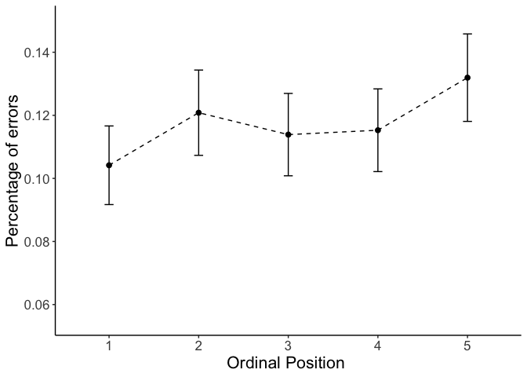<!-- -->

``` r
filename <- "CSI_online_typing_errors.pdf"
ggsave(plot, filename = 
         here::here("results", "figures", filename),
       width = 18, height = 13, units = "cm", 
       dpi = 300, device = cairo_pdf)
embedFonts(file = here::here("results", "figures", filename))
```

Analyse whether amount of errors differs between ordinal positions

``` r
# center ordinal position
df_errors$PosOr.cont <- scale(as.numeric(as.character(df_errors$PosOr)), 
                     center = T, scale = F)

# m1_error <- glmer(error_sum ~ PosOr.cont + 
#                     (PosOr.cont|subject) +(PosOr.cont|category) ,
#                   data =df_errors, family = "binomial",
#                   control=glmerControl(optimizer = "bobyqa"))
# model has singular fit --> Increase number of iterations
# m1_error <- glmer(error_sum ~ PosOr.cont +
#                     (PosOr.cont|subject) +(PosOr.cont|category) ,
#                   data =df_errors, family = "binomial",
#                   control=glmerControl(optimizer = "bobyqa",
#                                        optCtrl = list(maxfun = 2e5)))
# model still has singular fit --> delete correlation parameters
m1_error <- glmer(error_sum ~ PosOr.cont +
                    (PosOr.cont||subject) +(PosOr.cont||category) ,
                  data =df_errors, family = "binomial",
                  control=glmerControl(optimizer = "bobyqa",
                                       optCtrl = list(maxfun = 2e5)))
summary(m1_error)
```

    ## Generalized linear mixed model fit by maximum likelihood (Laplace
    ##   Approximation) [glmerMod]
    ##  Family: binomial  ( logit )
    ## Formula: error_sum ~ PosOr.cont + (PosOr.cont || subject) + (PosOr.cont ||  
    ##     category)
    ##    Data: df_errors
    ## Control: glmerControl(optimizer = "bobyqa", optCtrl = list(maxfun = 200000))
    ## 
    ##      AIC      BIC   logLik deviance df.resid 
    ##   2493.4   2530.6  -1240.7   2481.4     3594 
    ## 
    ## Scaled residuals: 
    ##     Min      1Q  Median      3Q     Max 
    ## -0.9135 -0.3831 -0.3040 -0.2276  6.0085 
    ## 
    ## Random effects:
    ##  Groups     Name        Variance Std.Dev.
    ##  subject    (Intercept) 0.261649 0.51152 
    ##  subject.1  PosOr.cont  0.024429 0.15630 
    ##  category   (Intercept) 0.324093 0.56929 
    ##  category.1 PosOr.cont  0.001412 0.03758 
    ## Number of obs: 3600, groups:  subject, 30; category, 24
    ## 
    ## Fixed effects:
    ##             Estimate Std. Error z value            Pr(>|z|)    
    ## (Intercept) -2.24942    0.16196 -13.889 <0.0000000000000002 ***
    ## PosOr.cont   0.05119    0.04849   1.056               0.291    
    ## ---
    ## Signif. codes:  0 '***' 0.001 '**' 0.01 '*' 0.05 '.' 0.1 ' ' 1
    ## 
    ## Correlation of Fixed Effects:
    ##            (Intr)
    ## PosOr.cont -0.011

``` r
(tab <- tab_model(m1_error,transform = NULL,
          show.re.var = T, show.stat = T,show.r2 = F,show.icc = F,
          title = "GLMM (Binomial distribution) with continuous predictor",
          pred.labels = c("(Intercept)", "Ordinal position"),
          dv.labels = "Error rate",
          #string.pred = "",
          string.stat = "z-Value"
          ))
```

<table style="border-collapse:collapse; border:none;">

<caption style="font-weight: bold; text-align:left;">

GLMM (Binomial distribution) with continuous predictor

</caption>

<tr>

<th style="border-top: double; text-align:center; font-style:normal; font-weight:bold; padding:0.2cm;  text-align:left; ">

 

</th>

<th colspan="4" style="border-top: double; text-align:center; font-style:normal; font-weight:bold; padding:0.2cm; ">

Error rate

</th>

</tr>

<tr>

<td style=" text-align:center; border-bottom:1px solid; font-style:italic; font-weight:normal;  text-align:left; ">

Predictors

</td>

<td style=" text-align:center; border-bottom:1px solid; font-style:italic; font-weight:normal;  ">

Log-Odds

</td>

<td style=" text-align:center; border-bottom:1px solid; font-style:italic; font-weight:normal;  ">

CI

</td>

<td style=" text-align:center; border-bottom:1px solid; font-style:italic; font-weight:normal;  ">

z-Value

</td>

<td style=" text-align:center; border-bottom:1px solid; font-style:italic; font-weight:normal;  ">

p

</td>

</tr>

<tr>

<td style=" padding:0.2cm; text-align:left; vertical-align:top; text-align:left; ">

(Intercept)

</td>

<td style=" padding:0.2cm; text-align:left; vertical-align:top; text-align:center;  ">

\-2.25

</td>

<td style=" padding:0.2cm; text-align:left; vertical-align:top; text-align:center;  ">

\-2.57 – -1.93

</td>

<td style=" padding:0.2cm; text-align:left; vertical-align:top; text-align:center;  ">

\-13.89

</td>

<td style=" padding:0.2cm; text-align:left; vertical-align:top; text-align:center;  ">

<strong>\<0.001

</td>

</tr>

<tr>

<td style=" padding:0.2cm; text-align:left; vertical-align:top; text-align:left; ">

Ordinal position

</td>

<td style=" padding:0.2cm; text-align:left; vertical-align:top; text-align:center;  ">

0.05

</td>

<td style=" padding:0.2cm; text-align:left; vertical-align:top; text-align:center;  ">

\-0.04 – 0.15

</td>

<td style=" padding:0.2cm; text-align:left; vertical-align:top; text-align:center;  ">

1.06

</td>

<td style=" padding:0.2cm; text-align:left; vertical-align:top; text-align:center;  ">

0.291

</td>

</tr>

<tr>

<td colspan="5" style="font-weight:bold; text-align:left; padding-top:.8em;">

Random Effects

</td>

</tr>

<tr>

<td style=" padding:0.2cm; text-align:left; vertical-align:top; text-align:left; padding-top:0.1cm; padding-bottom:0.1cm;">

σ<sup>2</sup>

</td>

<td style=" padding:0.2cm; text-align:left; vertical-align:top; padding-top:0.1cm; padding-bottom:0.1cm; text-align:left;" colspan="4">

3.29

</td>

<tr>

<td style=" padding:0.2cm; text-align:left; vertical-align:top; text-align:left; padding-top:0.1cm; padding-bottom:0.1cm;">

τ<sub>00</sub> <sub>subject</sub>

</td>

<td style=" padding:0.2cm; text-align:left; vertical-align:top; padding-top:0.1cm; padding-bottom:0.1cm; text-align:left;" colspan="4">

0.26

</td>

<tr>

<td style=" padding:0.2cm; text-align:left; vertical-align:top; text-align:left; padding-top:0.1cm; padding-bottom:0.1cm;">

τ<sub>00</sub> <sub>category</sub>

</td>

<td style=" padding:0.2cm; text-align:left; vertical-align:top; padding-top:0.1cm; padding-bottom:0.1cm; text-align:left;" colspan="4">

0.32

</td>

<tr>

<td style=" padding:0.2cm; text-align:left; vertical-align:top; text-align:left; padding-top:0.1cm; padding-bottom:0.1cm;">

τ<sub>11</sub> <sub>subject.PosOr.cont</sub>

</td>

<td style=" padding:0.2cm; text-align:left; vertical-align:top; padding-top:0.1cm; padding-bottom:0.1cm; text-align:left;" colspan="4">

0.02

</td>

<tr>

<td style=" padding:0.2cm; text-align:left; vertical-align:top; text-align:left; padding-top:0.1cm; padding-bottom:0.1cm;">

τ<sub>11</sub> <sub>category.PosOr.cont</sub>

</td>

<td style=" padding:0.2cm; text-align:left; vertical-align:top; padding-top:0.1cm; padding-bottom:0.1cm; text-align:left;" colspan="4">

0.00

</td>

<tr>

<td style=" padding:0.2cm; text-align:left; vertical-align:top; text-align:left; padding-top:0.1cm; padding-bottom:0.1cm;">

ρ<sub>01</sub>

</td>

<td style=" padding:0.2cm; text-align:left; vertical-align:top; padding-top:0.1cm; padding-bottom:0.1cm; text-align:left;" colspan="4">

 

</td>

<tr>

<td style=" padding:0.2cm; text-align:left; vertical-align:top; text-align:left; padding-top:0.1cm; padding-bottom:0.1cm;">

ρ<sub>01</sub>

</td>

<td style=" padding:0.2cm; text-align:left; vertical-align:top; padding-top:0.1cm; padding-bottom:0.1cm; text-align:left;" colspan="4">

 

</td>

<tr>

<td style=" padding:0.2cm; text-align:left; vertical-align:top; text-align:left; padding-top:0.1cm; padding-bottom:0.1cm;">

N <sub>subject</sub>

</td>

<td style=" padding:0.2cm; text-align:left; vertical-align:top; padding-top:0.1cm; padding-bottom:0.1cm; text-align:left;" colspan="4">

30

</td>

<tr>

<td style=" padding:0.2cm; text-align:left; vertical-align:top; text-align:left; padding-top:0.1cm; padding-bottom:0.1cm;">

N <sub>category</sub>

</td>

<td style=" padding:0.2cm; text-align:left; vertical-align:top; padding-top:0.1cm; padding-bottom:0.1cm; text-align:left;" colspan="4">

24

</td>

<tr>

<td style=" padding:0.2cm; text-align:left; vertical-align:top; text-align:left; padding-top:0.1cm; padding-bottom:0.1cm; border-top:1px solid;">

Observations

</td>

<td style=" padding:0.2cm; text-align:left; vertical-align:top; padding-top:0.1cm; padding-bottom:0.1cm; text-align:left; border-top:1px solid;" colspan="4">

3600

</td>

</tr>

</table>

``` r
# Additional model with trial
  # center trial
# df_errors$trial_cont <- scale(as.numeric(as.character(df_errors$trial)), 
#                               center = T, scale = T)
# m1_error_trial <- m1_error <- glmer(error_sum ~ PosOr.cont*trial_cont +
#                     (PosOr.cont||subject) +(PosOr.cont||category) ,
#                   data =df_errors, family = "binomial",
#                   control=glmerControl(optimizer = "bobyqa",
#                                        optCtrl = list(maxfun = 2e5)))
# summary(m1_error_trial)
```

# ———————————————

# Appendix

### Line graph of RT effects for each participant:

``` r
modeloutput <- coef(m1)$subject
(means_final_subject <- df_valid %>% 
   summarySEwithin(.,"timing.01",withinvars = c("subject","PosOr")))
```

    ##     subject PosOr  N timing.01       sd        se        ci
    ## 1         1     1 24 1127.1667 250.2039  51.07267 105.65186
    ## 2         1     2 22 1269.1818 324.9635  69.28246 144.08077
    ## 3         1     3 22 1240.1364 276.9747  59.05120 122.80370
    ## 4         1     4 24 1347.7917 490.7232 100.16846 207.21425
    ## 5         1     5 24 1526.1250 585.5397 119.52280 247.25175
    ## 6         2     1 23 1030.0000 332.0367  69.23443 143.58342
    ## 7         2     2 22 1072.5455 477.6513 101.83560 211.77873
    ## 8         2     3 23 1086.6522 469.7399  97.94753 203.13075
    ## 9         2     4 21 1098.3333 537.7769 117.35253 244.79310
    ## 10        2     5 24  961.8750 259.8432  53.04027 109.72217
    ## 11        3     1 23 1125.1304 396.1648  82.60606 171.31449
    ## 12        3     2 21 1087.6190 345.5195  75.39854 157.27860
    ## 13        3     3 19 1206.1053 530.3574 121.67233 255.62408
    ## 14        3     4 22 1170.1364 362.0938  77.19866 160.54340
    ## 15        3     5 24 1397.9167 470.2449  95.98834 198.56701
    ## 16        4     1 22 1253.0455 801.1153 170.79835 355.19461
    ## 17        4     2 21 1449.0476 787.0680 171.75231 358.26904
    ## 18        4     3 19 1271.8421 391.0446  89.71179 188.47748
    ## 19        4     4 22 1296.0455 440.3326  93.87922 195.23252
    ## 20        4     5 20 1330.0000 577.6966 129.17688 270.37031
    ## 21        5     1 17 1096.5882 359.7010  87.24031 184.94120
    ## 22        5     2 22 1094.4091 412.6754  87.98270 182.97004
    ## 23        5     3 20 1214.2000 423.1116  94.61064 198.02234
    ## 24        5     4 23 1348.6957 714.6734 149.01971 309.04796
    ## 25        5     5 24 1209.4583 366.0924  74.72830 154.58727
    ## 26        6     1 23 1364.5652 443.6025  92.49751 191.82809
    ## 27        6     2 21 1733.6667 849.1712 185.30435 386.53809
    ## 28        6     3 20 1336.3500 516.1572 115.41626 241.56901
    ## 29        6     4 21 1533.0476 761.7156 166.21997 346.72877
    ## 30        6     5 21 1482.1905 601.5430 131.26745 273.81911
    ## 31        7     1 23 1178.7391 209.3755  43.65781  90.54075
    ## 32        7     2 22 1147.5455 282.3848  60.20465 125.20243
    ## 33        7     3 23 1272.6087 384.0194  80.07359 166.06246
    ## 34        7     4 24 1244.7917 295.0707  60.23105 124.59742
    ## 35        7     5 24 1331.2500 292.3937  59.68461 123.46703
    ## 36        8     1 20 1027.0500 409.8643  91.64843 191.82238
    ## 37        8     2 22 1157.8182 726.3557 154.85955 322.04807
    ## 38        8     3 21 1108.6667 404.8430  88.34399 184.28234
    ## 39        8     4 19 1426.4737 971.5644 222.89216 468.27906
    ## 40        8     5 16 1016.5625 234.7102  58.67754 125.06821
    ## 41        9     1 17 1155.5294 348.1504  84.43887 179.00242
    ## 42        9     2 20 1145.9500 325.6807  72.82441 152.42325
    ## 43        9     3 17 1094.3529 242.7330  58.87139 124.80177
    ## 44        9     4 19 1453.3158 918.6585 210.75472 442.77923
    ## 45        9     5 20 1166.6000 351.2462  78.54104 164.38829
    ## 46       10     1 20  932.1000 136.9993  30.63397  64.11763
    ## 47       10     2 21 1193.9524 498.7240 108.83050 227.01644
    ## 48       10     3 22 1227.8182 345.6020  73.68258 153.23132
    ## 49       10     4 20 1207.8500 552.8266 123.61579 258.73082
    ## 50       10     5 19 1148.4211 221.7982  50.88400 106.90331
    ## 51       11     1 24  918.5417 209.2004  42.70285  88.33758
    ## 52       11     2 22 1172.4545 538.2818 114.76207 238.66080
    ## 53       11     3 24  920.5000 319.5387  65.22556 134.92935
    ## 54       11     4 24 1150.2083 478.8484  97.74452 202.19994
    ## 55       11     5 18 1510.6111 891.7547 210.18860 443.45919
    ## 56       12     1 24 1005.4167 201.0847  41.04623  84.91060
    ## 57       12     2 23 1354.5217 743.0699 154.94079 321.32753
    ## 58       12     3 23 1204.7391 402.5269  83.93267 174.06570
    ## 59       12     4 23 1165.0435 281.4450  58.68534 121.70595
    ## 60       12     5 21 1181.1905 409.4767  89.35514 186.39156
    ## 61       13     1 21 1344.7143 330.8071  72.18804 150.58161
    ## 62       13     2 21 1282.9048 375.6417  81.97174 170.99006
    ## 63       13     3 19 1313.1053 372.2789  85.40664 179.43270
    ## 64       13     4 16 1306.7500 383.3903  95.84757 204.29427
    ## 65       13     5 18 1302.6111 277.3390  65.36943 137.91743
    ## 66       14     1 18 1161.0556 211.5563  49.86430 105.20448
    ## 67       14     2 21 1236.5714 426.3008  93.02647 194.04982
    ## 68       14     3 22 1346.4545 450.0219  95.94499 199.52854
    ## 69       14     4 21 1228.6190 446.2716  97.38445 203.14041
    ## 70       14     5 14 1594.2857 955.7842 255.44407 551.85337
    ## 71       15     1 22 1027.5909 157.5616  33.59225  69.85891
    ## 72       15     2 24 1194.9167 444.9102  90.81692 187.86911
    ## 73       15     3 24 1301.4583 443.2788  90.48390 187.18020
    ## 74       15     4 23 1350.0870 333.4309  69.52515 144.18633
    ## 75       15     5 21 1181.4762 288.1033  62.86930 131.14306
    ## 76       16     1 21 1143.5714 165.0154  36.00932  75.11412
    ## 77       16     2 21 1296.3333 372.2194  81.22493 169.43224
    ## 78       16     3 23 1394.3913 621.6564 129.62431 268.82437
    ## 79       16     4 21 1383.8571 521.3832 113.77513 237.33077
    ## 80       16     5 20 1446.6500 277.8183  62.12206 130.02296
    ## 81       17     1 23 1029.2174 355.9347  74.21751 153.91770
    ## 82       17     2 22 1021.2273 370.5137  78.99380 164.27659
    ## 83       17     3 23 1026.3913 320.2372  66.77406 138.48093
    ## 84       17     4 24 1088.0000 446.6923  91.18069 188.62164
    ## 85       17     5 23 1194.7826 688.4576 143.55334 297.71141
    ## 86       18     1 21 1262.0476 610.2313 133.16338 277.77394
    ## 87       18     2 18 1146.7778 331.1965  78.06376 164.70013
    ## 88       18     3 24 1264.2083 438.2897  89.46551 185.07351
    ## 89       18     4 24 1485.2500 724.4612 147.88002 305.91313
    ## 90       18     5 16 1342.5000 429.0580 107.26449 228.62885
    ## 91       19     1 23 1210.3913 335.3167  69.91836 145.00181
    ## 92       19     2 20 1254.0500 365.6284  81.75699 171.11935
    ## 93       19     3 20 1412.4000 552.1191 123.45759 258.39971
    ## 94       19     4 23 1270.4348 369.6068  77.06834 159.82995
    ## 95       19     5 21 1353.9524 437.2338  95.41225 199.02646
    ## 96       20     1 22 1466.8182 587.8706 125.33443 260.64721
    ## 97       20     2 20 1451.9000 318.5293  71.22532 149.07631
    ## 98       20     3 20 1405.4000 366.4308  81.93641 171.49487
    ## 99       20     4 20 1534.8000 412.0346  92.13374 192.83813
    ## 100      20     5 22 1602.1364 439.1023  93.61693 194.68707
    ## 101      21     1 18 1141.6111 362.6397  85.47500 180.33648
    ## 102      21     2 18 1051.6667 196.3987  46.29161  97.66677
    ## 103      21     3 23 1274.0435 473.7208  98.77761 204.85223
    ## 104      21     4 22 1305.2727 492.6619 105.03587 218.43405
    ## 105      21     5 21 1409.0952 706.5518 154.18225 321.61854
    ## 106      22     1 24  984.6250 377.8534  77.12900 159.55350
    ## 107      22     2 21 1338.0000 833.0148 181.77872 379.18377
    ## 108      22     3 21 1309.0476 807.2226 176.15042 367.44334
    ## 109      22     4 19 1202.8421 583.4950 133.86292 281.23557
    ## 110      22     5 20 1218.3000 370.5427  82.85586 173.41932
    ## 111      23     1 22 1028.2727 642.6689 137.01747 284.94343
    ## 112      23     2 23 1001.3043 510.6175 106.47111 220.80757
    ## 113      23     3 24  971.1250 298.5011  60.93129 126.04597
    ## 114      23     4 22 1044.0000 440.0478  93.81851 195.10628
    ## 115      23     5 24 1005.2500 227.4543  46.42891  96.04552
    ## 116      24     1 23 1191.0870 396.2152  82.61658 171.33630
    ## 117      24     2 20 1084.8000 201.6264  45.08503  94.36404
    ## 118      24     3 21 1365.8095 736.3058 160.67510 335.16239
    ## 119      24     4 19 1129.1053 203.3442  46.65036  98.00877
    ## 120      24     5 23 1247.3913 261.3268  54.49041 113.00619
    ## 121      25     1 22 1456.2273 524.3499 111.79178 232.48374
    ## 122      25     2 22 1664.2727 604.9429 128.97426 268.21666
    ## 123      25     3 21 1487.5238 410.5383  89.58680 186.87478
    ## 124      25     4 20 1459.9000 486.0652 108.68748 227.48551
    ## 125      25     5 22 1452.6818 343.8970  73.31908 152.47538
    ## 126      26     1 20 1492.0500 503.8785 112.67065 235.82238
    ## 127      26     2 20 1574.1000 539.1449 120.55646 252.32757
    ## 128      26     3 21 1498.9048 644.0032 140.53302 293.14674
    ## 129      26     4 19 1502.2105 481.4382 110.44949 232.04578
    ## 130      26     5 22 1461.3182 430.7701  91.84048 190.99274
    ## 131      27     1 23 1014.1304 305.9043  63.78545 132.28293
    ## 132      27     2 21 1094.7619 492.1216 107.38973 224.01106
    ## 133      27     3 23 1049.0435 351.7792  73.35103 152.12072
    ## 134      27     4 19 1163.0000 774.6531 177.71760 373.37082
    ## 135      27     5 21 1235.3810 641.2629 139.93504 291.89937
    ## 136      28     1 22 1119.5455 391.8398  83.54052 173.73203
    ## 137      28     2 17  995.5882 137.4164  33.32838  70.65300
    ## 138      28     3 17 1468.2353 707.7288 171.64944 363.88056
    ## 139      28     4 21 1194.9048 452.0555  98.64659 205.77318
    ## 140      28     5 22 1674.4545 833.5255 177.70824 369.56451
    ## 141      29     1 17 1241.3529 372.8605  90.43195 191.70718
    ## 142      29     2 21 1278.4286 536.2322 117.01545 244.08995
    ## 143      29     3 18 1322.7222 541.8283 127.71015 269.44486
    ## 144      29     4 20 1326.1500 423.6310  94.72676 198.26539
    ## 145      29     5 20 1586.7500 735.6691 164.50061 344.30373
    ## 146      30     1 23 1138.4783 394.3009  82.21742 170.50850
    ## 147      30     2 24  972.7917 294.8757  60.19125 124.51509
    ## 148      30     3 21 1145.2381 542.8572 118.46115 247.10563
    ## 149      30     4 22 1231.6818 606.4584 129.29737 268.88859
    ## 150      30     5 20 1066.9500 362.4705  81.05088 169.64144

``` r
(means_final<- df_valid %>%  
   Rmisc::summarySEwithin(.,"timing.01",idvar = "subject",
                          withinvars = "PosOr", na.rm = T))
```

    ##   PosOr   N timing.01       sd       se       ci
    ## 1     1 645  1152.220 444.1659 17.48902 34.34238
    ## 2     2 633  1228.071 553.3236 21.99264 43.18749
    ## 3     3 638  1247.875 525.8232 20.81754 40.87930
    ## 4     4 637  1285.638 593.4891 23.51489 46.17622
    ## 5     5 625  1317.224 562.0187 22.48075 44.14708

``` r
for(i in 1:nrow(means_final_subject)) {
  means_final_subject$grandmean[i] <- means_final$timing.01[means_final$PosOr == means_final_subject$PosOr[i]] - means_final$timing.01[means_final$PosOr== 1]
  means_final_subject$normalizedRT[i] <- means_final_subject$timing.01[i] -
    means_final_subject$timing.01[means_final_subject$subject == means_final_subject$subject[i] & means_final_subject$PosOr == 1]
  # prepare for ordering
  means_final_subject$effect[i] <- modeloutput$PosOr.cont[means_final_subject$subject[i]] 
}
#means_final_subject$order <-order(means_final_subject$effect)-1
#means_final_subject$order <- means_final_subject$order %/% 5
means_final_subject <- means_final_subject[order(desc(means_final_subject$effect)),] 
means_final_subject$effect <- as.factor(round(means_final_subject$effect, 2))
means_final_subject$effect <- factor(means_final_subject$effect, levels=rev(levels(means_final_subject$effect )))

# add participant number
means_final_subject <- means_final_subject %>% 
  mutate(subject_en = paste0("Participant ",subject,"\n(",effect,")",sep=''))  %>%
  mutate(subject_en = case_when(subject_en=="Participant 23\n(25.1)" ~
                                    "Participant 23\n(25.10)",
                                  subject_en=="Participant 19\n(37.5)" ~
                                    "Participant 19\n(37.50)",
                                  subject_en=="Participant 12\n(38.3)" ~
                                    "Participant 12\n(38.30)",
                                  TRUE~subject_en)) %>%
  mutate(subject_en=factor(subject_en,levels=c(
    "Participant 11\n(71.37)","Participant 28\n(70.41)", 
    "Participant 1\n(56.04)","Participant 21\n(55.09)",
    "Participant 14\n(55.06)","Participant 29\n(54.91)",
    "Participant 16\n(54.29)","Participant 3\n(53.68)",
    "Participant 27\n(49.37)","Participant 15\n(48.38)",
    "Participant 10\n(46.53)","Participant 18\n(46.51)",
    "Participant 22\n(46.37)","Participant 5\n(44.74)",
    "Participant 7\n(40.82)","Participant 8\n(39.19)",
    "Participant 12\n(38.30)","Participant 20\n(37.62)",
    "Participant 19\n(37.50)","Participant 30\n(36.06)",
    "Participant 9\n(35.98)","Participant 17\n(34.92)",
    "Participant 24\n(31.38)","Participant 6\n(28.33)",
    "Participant 4\n(27.29)","Participant 13\n(26.25)",
    "Participant 25\n(25.26)","Participant 23\n(25.10)",
    "Participant 26\n(24.38)","Participant 2\n(14.57)")))

# Plotting
(plot_rt_subject <- means_final_subject %>% 
    ggplot(., aes(x=PosOr,y=normalizedRT, na.rm=T)) +
    geom_point(size =1, color = 'black') +
    geom_line(aes(x=PosOr,y=normalizedRT, color="a", linetype="c"),
              group = 1,size = 0.5) +
    geom_line(aes(x=PosOr,y=grandmean, color="b", linetype="d"), 
              group = 1,size = 0.8)+
    geom_errorbar(aes(ymin=normalizedRT-se, ymax=normalizedRT+se), width =.1) +
    scale_color_manual(name="",values=c("a"="black","b"="dark gray"),
                       labels=c("Participant mean", "Mean across participants"))+
    scale_linetype_manual(name="",values=c("c"="dashed","d"="dotted"),
                          labels=c("Participant mean", 
                                   "Mean across participants"))+
    apatheme+
    labs(x="Ordinal Position",y ="Normalized RTs (ms)") +
    facet_wrap(means_final_subject$subject_en, scales='free', ncol=6)+
    scale_y_continuous(limits = c(-400, 700), 
                       breaks = c(-400,-200,0,200,400,600)) + 
    scale_x_discrete(breaks=c(1,2,3,4,5))+
    theme(legend.position = "bottom"))
```

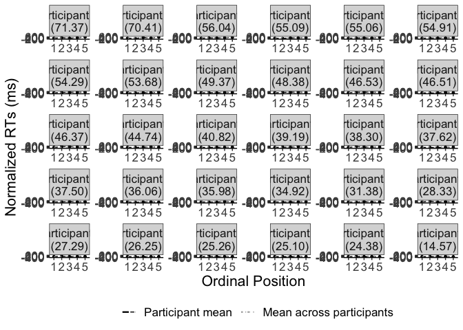<!-- -->

``` r
#plot_rt <- lemon::reposition_legend(plot_rt, "bott1.1.om right",panel='panel-5-5')

filename <- "CSI_online_typing_effect_by_participant.pdf"
ggsave(plot_rt_subject, filename = 
         here::here("results", "figures", filename),
       width = 26, height = 21.5, units = "cm", 
       dpi = 300, device = cairo_pdf)
embedFonts(file = here::here("results", "figures", filename))
```

### Line graph of RT effects for each category:

``` r
modeloutput <- coef(m1)$category
(means_final_category <- df_valid %>% 
   summarySEwithin(.,"timing.01",withinvars = c("category","PosOr")))
```

    ## Automatically converting the following non-factors to factors: category

    ##         category PosOr  N timing.01       sd        se        ci
    ## 1   Aufbewahrung     1 26 1192.9615 623.9423 122.36515 252.01575
    ## 2   Aufbewahrung     2 27 1572.5556 833.3113 160.37084 329.64698
    ## 3   Aufbewahrung     3 28 1205.2143 380.5502  71.91723 147.56197
    ## 4   Aufbewahrung     4 27 1389.1852 591.9064 113.91245 234.15039
    ## 5   Aufbewahrung     5 27 1272.7778 509.5369  98.06042 201.56607
    ## 6      Bauernhof     1 28 1011.5714 278.5495  52.64090 108.01020
    ## 7      Bauernhof     2 28 1015.5000 241.1117  45.56583  93.49337
    ## 8      Bauernhof     3 27 1071.2593 299.1940  57.57990 118.35719
    ## 9      Bauernhof     4 25 1312.9600 784.3853 156.87707 323.77836
    ## 10     Bauernhof     5 27 1115.3704 406.9487  78.31731 160.98353
    ## 11        Blumen     1 23 1217.5652 394.3808  82.23408 170.54304
    ## 12        Blumen     2 20 1249.3000 435.5876  97.40034 203.86125
    ## 13        Blumen     3 26 1387.0000 436.6923  85.64242 176.38386
    ## 14        Blumen     4 25 1243.3600 229.7629  45.95258  94.84147
    ## 15        Blumen     5 22 1536.5455 641.0819 136.67912 284.23979
    ## 16          Büro     1 27 1127.7407 418.2432  80.49094 165.45151
    ## 17          Büro     2 26 1127.8462 323.4831  63.44026 130.65767
    ## 18          Büro     3 28 1165.6071 353.8415  66.86977 137.20543
    ## 19          Büro     4 28 1210.0357 444.4254  83.98850 172.33017
    ## 20          Büro     5 28 1329.8929 703.8991 133.02444 272.94360
    ## 21        Fische     1 26 1225.9615 348.8290  68.41099 140.89507
    ## 22        Fische     2 29 1077.2414 344.4890  63.97001 131.03662
    ## 23        Fische     3 26 1255.0769 389.0094  76.29103 157.12431
    ## 24        Fische     4 28 1193.9286 337.4044  63.76343 130.83176
    ## 25        Fische     5 28 1253.5357 444.2427  83.95398 172.25934
    ## 26       Gebäude     1 27 1144.5185 216.2198  41.61152  85.53371
    ## 27       Gebäude     2 25 1431.6800 710.7073 142.14147 293.36557
    ## 28       Gebäude     3 27 1376.1481 334.8222  64.43656 132.45124
    ## 29       Gebäude     4 27 1509.3704 380.0385  73.13845 150.33823
    ## 30       Gebäude     5 21 1562.7619 727.0934 158.66479 330.96895
    ## 31        Gemüse     1 29 1085.7241 244.3397  45.37273  92.94183
    ## 32        Gemüse     2 30 1054.8333 263.3790  48.08620  98.34733
    ## 33        Gemüse     3 27 1083.6296 404.9598  77.93456 160.19677
    ## 34        Gemüse     4 28 1153.6786 527.1869  99.62896 204.42175
    ## 35        Gemüse     5 28 1264.5714 543.7257 102.75451 210.83483
    ## 36    Heimwerker     1 26 1383.6538 594.8081 116.65147 240.24820
    ## 37    Heimwerker     2 23 1477.5217 788.1767 164.34620 340.83315
    ## 38    Heimwerker     3 22 1463.6818 689.9859 147.10548 305.92260
    ## 39    Heimwerker     4 26 1350.0385 410.2057  80.44795 165.68565
    ## 40    Heimwerker     5 25 1415.8800 625.0148 125.00297 257.99345
    ## 41      Huftiere     1 27  944.0741 219.4355  42.23039  86.80581
    ## 42      Huftiere     2 30 1053.1667 253.9783  46.36989  94.83707
    ## 43      Huftiere     3 30 1037.6333 263.0063  48.01817  98.20818
    ## 44      Huftiere     4 30 1112.5667 266.7984  48.71049  99.62414
    ## 45      Huftiere     5 27 1268.7407 379.9675  73.12479 150.31015
    ## 46      Insekten     1 27  993.8519 310.6736  59.78916 122.89837
    ## 47      Insekten     2 27 1155.7778 370.4253  71.28837 146.53535
    ## 48      Insekten     3 28 1162.6786 428.1438  80.91157 166.01684
    ## 49      Insekten     4 30 1177.6667 242.4996  44.27417  90.55085
    ## 50      Insekten     5 29 1218.7931 325.2968  60.40609 123.73627
    ## 51   Instrumente     1 27 1349.3704 822.8418 158.35597 325.50536
    ## 52   Instrumente     2 30 1099.0333 302.9109  55.30371 113.10878
    ## 53   Instrumente     3 29 1109.9655 384.5626  71.41148 146.27978
    ## 54   Instrumente     4 23 1224.7391 533.7355 111.29155 230.80455
    ## 55   Instrumente     5 27 1199.0000 295.3496  56.84006 116.83641
    ## 56        Jacken     1 21 1321.5238 366.9505  80.07516 167.03386
    ## 57        Jacken     2 23 1820.8696 732.9945 152.83993 316.97061
    ## 58        Jacken     3 26 1826.8077 820.8188 160.97581 331.53589
    ## 59        Jacken     4 17 1641.4118 672.5180 163.10958 345.77687
    ## 60        Jacken     5 19 1524.3158 467.5361 107.26014 225.34520
    ## 61        Kochen     1 28 1185.2143 336.5198  63.59627 130.48877
    ## 62        Kochen     2 29 1398.4138 547.3992 101.64948 208.21952
    ## 63        Kochen     3 28 1258.0357 586.9165 110.91680 227.58247
    ## 64        Kochen     4 27 1331.3704 493.0610  94.88963 195.04844
    ## 65        Kochen     5 22 1382.4545 520.5007 110.97112 230.77708
    ## 66   Körperteile     1 26  916.8077 168.0343  32.95424  67.87054
    ## 67   Körperteile     2 29 1030.9655 281.0836  52.19592 106.91849
    ## 68   Körperteile     3 28 1054.4286 397.4204  75.10539 154.10354
    ## 69   Körperteile     4 30  979.4000 164.1021  29.96080  61.27672
    ## 70   Körperteile     5 25 1147.6000 414.8853  82.97706 171.25624
    ## 71         Küche     1 27 1261.5926 330.2209  63.55103 130.63102
    ## 72         Küche     2 26 1362.3462 422.2987  82.81959 170.57015
    ## 73         Küche     3 22 1540.3636 640.8073 136.62058 284.11804
    ## 74         Küche     4 26 1357.2308 437.1804  85.73812 176.58097
    ## 75         Küche     5 26 1434.6538 412.6191  80.92127 166.66047
    ## 76          Obst     1 28  926.2500 195.6003  36.96498  75.84587
    ## 77          Obst     2 30  990.2667 362.3860  66.16233 135.31715
    ## 78          Obst     3 27  998.6667 234.7645  45.18045  92.86974
    ## 79          Obst     4 26  912.6923 192.6509  37.78196  77.81340
    ## 80          Obst     5 28 1074.4286 314.4883  59.43270 121.94583
    ## 81     Raubtiere     1 29 1086.9655 237.1137  44.03091  90.19324
    ## 82     Raubtiere     2 25 1323.4000 621.6287 124.32574 256.59573
    ## 83     Raubtiere     3 28 1289.2857 442.8000  83.68134 171.69992
    ## 84     Raubtiere     4 27 1592.3704 886.9629 170.69610 350.87085
    ## 85     Raubtiere     5 26 1358.9231 416.6486  81.71152 168.28802
    ## 86       Schmuck     1 26 1390.1154 569.6844 111.72431 230.10053
    ## 87       Schmuck     2 25 1373.4800 694.5803 138.91607 286.70868
    ## 88       Schmuck     3 27 1462.5926 627.1045 120.68631 248.07427
    ## 89       Schmuck     4 28 1671.8929 938.5372 177.36686 363.92674
    ## 90       Schmuck     5 29 1633.0690 677.6074 125.82854 257.74808
    ## 91        Sitzen     1 26 1174.8462 385.2895  75.56149 155.62180
    ## 92        Sitzen     2 25 1198.2400 343.0608  68.61216 141.60853
    ## 93        Sitzen     3 26 1255.3846 317.8687  62.33917 128.38993
    ## 94        Sitzen     4 24 1503.0833 870.7129 177.73353 367.66981
    ## 95        Sitzen     5 23 1325.1739 323.1439  67.38016 139.73789
    ## 96       Strasse     1 29 1081.2414 346.2019  64.28808 131.68817
    ## 97       Strasse     2 28 1097.8929 301.0715  56.89717 116.74335
    ## 98       Strasse     3 27 1128.7407 405.5436  78.04690 160.42770
    ## 99       Strasse     4 29 1183.5862 416.5231  77.34640 158.43692
    ## 100      Strasse     5 30 1267.8667 669.3890 122.21314 249.95395
    ## 101 Süssigkeiten     1 29 1059.7241 274.9553  51.05792 104.58741
    ## 102 Süssigkeiten     2 27 1107.0000 522.5592 100.56656 206.71753
    ## 103 Süssigkeiten     3 28 1108.8571 414.4040  78.31500 160.68911
    ## 104 Süssigkeiten     4 29 1068.4138 251.3530  46.67507  95.60955
    ## 105 Süssigkeiten     5 29 1101.6897 441.2908  81.94565 167.85806
    ## 106 Trinkgefässe     1 27 1193.2222 487.2165  93.76485 192.73641
    ## 107 Trinkgefässe     2 24 1232.5417 493.8262 100.80185 208.52450
    ## 108 Trinkgefässe     3 24 1345.0833 473.3004  96.61204 199.85724
    ## 109 Trinkgefässe     4 27 1341.1111 546.3273 105.14074 216.11989
    ## 110 Trinkgefässe     5 28 1454.2500 654.9252 123.76923 253.95349
    ## 111        Vögel     1 29 1148.9655 466.7598  86.67512 177.54593
    ## 112        Vögel     2 28 1153.2500 546.6510 103.30733 211.96913
    ## 113        Vögel     3 27 1094.7407 462.7642  89.05901 183.06342
    ## 114        Vögel     4 27 1167.2222 384.8087  74.05646 152.22523
    ## 115        Vögel     5 29 1196.2759 335.8257  62.36126 127.74126
    ## 116       Wasser     1 27 1344.1111 400.3888  77.05486 158.38853
    ## 117       Wasser     2 19 1365.8421 443.8917 101.83573 213.94893
    ## 118       Wasser     3 22 1444.5909 443.2733  94.50618 196.53636
    ## 119       Wasser     4 23 1484.4783 475.6548  99.18088 205.68855
    ## 120       Wasser     5 22 1546.8636 597.8447 127.46093 265.06950

``` r
(means_final<- df_valid %>%  
   Rmisc::summarySEwithin(.,"timing.01",idvar = "category",
                          withinvars = "PosOr", na.rm = T))
```

    ##   PosOr   N timing.01       sd       se       ci
    ## 1     1 645  1150.122 453.7537 17.86654 35.08370
    ## 2     2 633  1231.018 544.5825 21.64521 42.50524
    ## 3     3 638  1243.083 505.9424 20.03045 39.33370
    ## 4     4 637  1286.604 573.9345 22.74011 44.65478
    ## 5     5 625  1320.310 562.7194 22.50878 44.20213

``` r
for(i in 1:nrow(means_final_category)) {
  means_final_category$grandmean[i] <- means_final$timing.01[means_final$PosOr == means_final_category$PosOr[i]] - means_final$timing.01[means_final$PosOr== 1]
  means_final_category$normalizedRT[i] <- means_final_category$timing.01[i] -
    means_final_category$timing.01[means_final_category$category == means_final_category$category[i] & means_final_category$PosOr == 1]
  # prepare for ordering
  means_final_category$effect[i] <- modeloutput$PosOr.cont[means_final_category$category[i]] 
}
#means_final_category$order <-order(means_final_category$effect)-1
#means_final_category$order <- means_final_category$order %/% 5
means_final_category <- means_final_category[
  order(desc(means_final_category$effect)),] 
means_final_category$effect <- as.factor(
  round(means_final_category$effect, 2))
means_final_category$effect <- factor(
  means_final_category$effect, levels=rev(levels(means_final_category$effect )))

# order category levels by effect size
means_final_category$category <- factor(
  means_final_category$category, levels=c(
    "Gebäude","Schmuck","Raubtiere","Sitzen","Jacken",
    "Blumen","Huftiere","Wasser","Trinkgefässe","Küche",
    "Insekten","Büro","Bauernhof","Strasse","Kochen",
    "Gemüse","Körperteile","Fische","Heimwerker","Aufbewahrung",
    "Obst","Vögel","Instrumente","Süssigkeiten"))
# give categories English names and combine with effect size
means_final_category <- means_final_category %>% 
  mutate(category_en = case_when(
    category == "Aufbewahrung" ~ paste0(
      "Storage\n\n(", effect, ")", sep=''), 
    category == "Bauernhof" ~ paste0(
      "Farming\ntools\n(", effect, ")", sep=''), 
    category == "Blumen" ~ paste0(
      "Flowers\n\n(", effect, ")", sep=''),
    category == "Büro" ~ paste0(
      "Office\ntools\n(", effect, ")", sep=''),
    category == "Fische" ~ paste0(
      "Fish\n\n(", effect, ")", sep=''),
    category == "Gebäude" ~ paste0(
      "Buildings\n\n(", effect, ")", sep=''),
    category == "Gemüse" ~ paste0(
      "Vegetables\n\n(", effect, ")", sep=''),
    category == "Heimwerker" ~ paste0(
      "Carpenter.s\ntools\n(", effect, ")", sep=''),
    category == "Huftiere" ~ paste0(
      "Hoofed\nanimals\n(", effect, ")", sep=''),
    category == "Insekten" ~ paste0(
      "Insects\n\n(", effect, ")", sep=''),
    category == "Instrumente" ~ paste0(
      "Instruments\n\n(", effect, ")", sep=''),
    category == "Jacken" ~ paste0(
      "Jackets\n\n(", effect, ")", sep=''),
    category == "Kochen" ~ paste0(
      "Cooking\nequipment\n(", effect, ")", sep=''),
    category == "Körperteile" ~ paste0(
      "Body parts\n\n(", effect, ")", sep=''),
    category == "Küche" ~ paste0(
      "Kitchen\nfurniture\n(", effect, ")", sep=''),
    category == "Obst" ~ paste0(
      "Fruits\n\n(", effect, ")", sep=''),
    category == "Raubtiere" ~ paste0(
      "Predators\n\n(", effect, ")", sep=''),
    category == "Schmuck" ~ paste0(
      "Jewelry\n\n(", effect, ")", sep=''),
    category == "Sitzen" ~ paste0(
      "Seating\nfurniture\n(", effect, ")", sep=''),
    category == "Strasse" ~ paste0(
      "Street\nvehicles\n(", effect, ")", sep=''),
    category == "Süssigkeiten" ~ paste0(
      "Sweets\n\n(", effect, ")", sep=''),
    category == "Trinkgefässe" ~ paste0(
      "Drinking\nvessels\n(", effect, ")", sep=''),
    category == "Vögel" ~ paste0(
      "Birds\n\n(", effect, ")", sep=''),
    category == "Wasser" ~ paste0(
      "Water\nvehicles\n(", effect, ")", sep=''))) %>%
  mutate(category_en = case_when(category_en=="Instruments\n\n(18.3)" ~
                                    "Instruments\n\n(18.30)",
                                  category_en=="Body parts\n\n(35.4)" ~
                                    "Body parts\n\n(35.40)",
                                  TRUE~category_en)) %>%
  mutate(category_en=factor(category_en,levels=c(
    "Buildings\n\n(62.56)","Jewelry\n\n(58.25)","Predators\n\n(57.34)",
    "Seating\nfurniture\n(52.51)","Jackets\n\n(49.58)","Flowers\n\n(49.31)",
    "Hoofed\nanimals\n(48.91)","Water\nvehicles\n(48.51)",
    "Drinking\nvessels\n(48.06)",
    "Kitchen\nfurniture\n(44.31)","Insects\n\n(41.84)","Office\ntools\n(41.73)",
    "Farming\ntools\n(41.72)","Street\nvehicles\n(39.31)",
    "Cooking\nequipment\n(38.79)",
    "Vegetables\n\n(37.66)","Body parts\n\n(35.40)","Fish\n\n(29.99)",
    "Carpenter.s\ntools\n(28.45)","Storage\n\n(27.63)","Fruits\n\n(25.41)",
    "Birds\n\n(24.35)","Instruments\n\n(18.30)","Sweets\n\n(17.98)")))

# Plotting
(plot_rt_category <- means_final_category %>% 
    ggplot(., aes(x=PosOr,y=normalizedRT, na.rm=T)) +
    geom_point(size =1, color = 'black') +
    geom_line(aes(x=PosOr,y=normalizedRT, color="a", linetype="c"),
              group = 1,size = 0.5) +
    geom_line(aes(x=PosOr,y=grandmean, color="b", linetype="d"), 
              group = 1,size = 0.8)+
    geom_errorbar(aes(ymin=normalizedRT-se, ymax=normalizedRT+se), width =.1) +
    scale_color_manual(name="",values=c("a"="black","b"="dark gray"),
                       labels=c("Category mean", "Mean across categories"))+
    scale_linetype_manual(name="",values=c("c"="dashed","d"="dotted"),
                          labels=c("Category mean", "Mean across categories"))+
    apatheme+
    labs(x="Ordinal Position",y ="Normalized RTs (ms)") +
    facet_wrap(means_final_category$category_en, scales='free', ncol=6)+
    scale_y_continuous(limits = c(-400, 700), 
                       breaks = c(-400, -200, 0,200,400,600)) + 
    scale_x_discrete(breaks=c(1,2,3,4,5))+
    theme(legend.position = "bottom"))
```

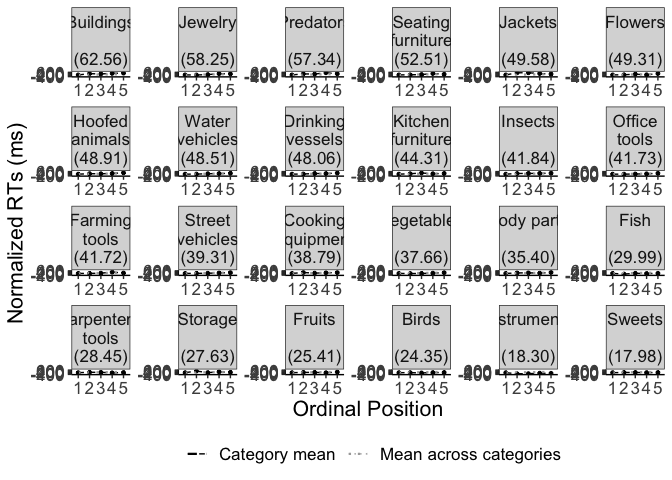<!-- -->

``` r
#plot_rt <- lemon::reposition_legend(plot_rt, "bott1.1.om right",panel='panel-5-5')

filename <- "CSI_online_typing_effect_by_category.pdf"
ggsave(plot_rt_category, filename = 
         here::here("results", "figures", filename),
       width = 26, height = 20, units = "cm", 
       dpi = 300, device = cairo_pdf)
embedFonts(file = here::here("results", "figures", filename))
```

Make plot grid

``` r
# filename <- "CSI_online_typing_effects_by_subject_and_category.pdf"
# cowplot::plot_grid(plot_rt_subject, plot_rt_category,
#           nrow = 2, rel_heights = c(1.1, 0.9), labels = c("A", "B"),
#           label_fontfamily = "Helvetica", label_size=22) %>%
#   ggsave(filename = here::here("results", "figures",filename),
#          width = 26, height = 42, units = "cm", 
#          dpi = 300, device = cairo_pdf)
# embedFonts(file = here::here("results", "figures", filename))
```

### Line graph of errors by subject (across categories):

``` r
modeloutput <- coef(m1_error)$subject
(means_final_subject <- df_errors %>% 
   summarySEwithin(.,"error_sum",withinvars = c("subject","PosOr")))
```

    ## Automatically converting the following non-factors to factors: subject, PosOr

    ##     subject PosOr  N  error_sum        sd         se         ci
    ## 1         1     1 24 0.00000000 0.0000000 0.00000000 0.00000000
    ## 2         1     2 24 0.08333333 0.2832757 0.05782341 0.11961683
    ## 3         1     3 24 0.08333333 0.2832757 0.05782341 0.11961683
    ## 4         1     4 24 0.00000000 0.0000000 0.00000000 0.00000000
    ## 5         1     5 24 0.00000000 0.0000000 0.00000000 0.00000000
    ## 6         2     1 24 0.04166667 0.2048080 0.04180625 0.08648283
    ## 7         2     2 24 0.08333333 0.2832757 0.05782341 0.11961683
    ## 8         2     3 24 0.04166667 0.2048080 0.04180625 0.08648283
    ## 9         2     4 24 0.12500000 0.3389637 0.06919068 0.14313183
    ## 10        2     5 24 0.00000000 0.0000000 0.00000000 0.00000000
    ## 11        3     1 24 0.04166667 0.2048080 0.04180625 0.08648283
    ## 12        3     2 24 0.12500000 0.3389637 0.06919068 0.14313183
    ## 13        3     3 24 0.20833333 0.4162409 0.08496482 0.17576312
    ## 14        3     4 24 0.08333333 0.2832757 0.05782341 0.11961683
    ## 15        3     5 24 0.00000000 0.0000000 0.00000000 0.00000000
    ## 16        4     1 24 0.08333333 0.2832757 0.05782341 0.11961683
    ## 17        4     2 24 0.12500000 0.3389637 0.06919068 0.14313183
    ## 18        4     3 24 0.20833333 0.4162409 0.08496482 0.17576312
    ## 19        4     4 24 0.08333333 0.2832757 0.05782341 0.11961683
    ## 20        4     5 24 0.16666667 0.3819689 0.07796907 0.16129130
    ## 21        5     1 24 0.29166667 0.4658611 0.09509350 0.19671589
    ## 22        5     2 24 0.08333333 0.2832757 0.05782341 0.11961683
    ## 23        5     3 24 0.16666667 0.3819689 0.07796907 0.16129130
    ## 24        5     4 24 0.04166667 0.2048080 0.04180625 0.08648283
    ## 25        5     5 24 0.00000000 0.0000000 0.00000000 0.00000000
    ## 26        6     1 24 0.04166667 0.2048080 0.04180625 0.08648283
    ## 27        6     2 24 0.12500000 0.3389637 0.06919068 0.14313183
    ## 28        6     3 24 0.16666667 0.3819689 0.07796907 0.16129130
    ## 29        6     4 24 0.12500000 0.3389637 0.06919068 0.14313183
    ## 30        6     5 24 0.12500000 0.3389637 0.06919068 0.14313183
    ## 31        7     1 24 0.04166667 0.2048080 0.04180625 0.08648283
    ## 32        7     2 24 0.08333333 0.2832757 0.05782341 0.11961683
    ## 33        7     3 24 0.04166667 0.2048080 0.04180625 0.08648283
    ## 34        7     4 24 0.00000000 0.0000000 0.00000000 0.00000000
    ## 35        7     5 24 0.00000000 0.0000000 0.00000000 0.00000000
    ## 36        8     1 24 0.16666667 0.3819689 0.07796907 0.16129130
    ## 37        8     2 24 0.08333333 0.2832757 0.05782341 0.11961683
    ## 38        8     3 24 0.12500000 0.3389637 0.06919068 0.14313183
    ## 39        8     4 24 0.20833333 0.4162409 0.08496482 0.17576312
    ## 40        8     5 24 0.33333333 0.4831566 0.09862393 0.20401915
    ## 41        9     1 24 0.29166667 0.4658611 0.09509350 0.19671589
    ## 42        9     2 24 0.16666667 0.3819689 0.07796907 0.16129130
    ## 43        9     3 24 0.29166667 0.4658611 0.09509350 0.19671589
    ## 44        9     4 24 0.20833333 0.4162409 0.08496482 0.17576312
    ## 45        9     5 24 0.16666667 0.3819689 0.07796907 0.16129130
    ## 46       10     1 24 0.16666667 0.3819689 0.07796907 0.16129130
    ## 47       10     2 24 0.12500000 0.3389637 0.06919068 0.14313183
    ## 48       10     3 24 0.08333333 0.2832757 0.05782341 0.11961683
    ## 49       10     4 24 0.16666667 0.3819689 0.07796907 0.16129130
    ## 50       10     5 24 0.20833333 0.4162409 0.08496482 0.17576312
    ## 51       11     1 24 0.00000000 0.0000000 0.00000000 0.00000000
    ## 52       11     2 24 0.08333333 0.2832757 0.05782341 0.11961683
    ## 53       11     3 24 0.00000000 0.0000000 0.00000000 0.00000000
    ## 54       11     4 24 0.00000000 0.0000000 0.00000000 0.00000000
    ## 55       11     5 24 0.25000000 0.4438077 0.09059187 0.18740356
    ## 56       12     1 24 0.00000000 0.0000000 0.00000000 0.00000000
    ## 57       12     2 24 0.04166667 0.2048080 0.04180625 0.08648283
    ## 58       12     3 24 0.04166667 0.2048080 0.04180625 0.08648283
    ## 59       12     4 24 0.04166667 0.2048080 0.04180625 0.08648283
    ## 60       12     5 24 0.12500000 0.3389637 0.06919068 0.14313183
    ## 61       13     1 24 0.12500000 0.3389637 0.06919068 0.14313183
    ## 62       13     2 24 0.12500000 0.3389637 0.06919068 0.14313183
    ## 63       13     3 24 0.20833333 0.4162409 0.08496482 0.17576312
    ## 64       13     4 24 0.33333333 0.4831566 0.09862393 0.20401915
    ## 65       13     5 24 0.25000000 0.4438077 0.09059187 0.18740356
    ## 66       14     1 24 0.25000000 0.4438077 0.09059187 0.18740356
    ## 67       14     2 24 0.12500000 0.3389637 0.06919068 0.14313183
    ## 68       14     3 24 0.08333333 0.2832757 0.05782341 0.11961683
    ## 69       14     4 24 0.12500000 0.3389637 0.06919068 0.14313183
    ## 70       14     5 24 0.41666667 0.5052973 0.10314338 0.21336834
    ## 71       15     1 24 0.08333333 0.2832757 0.05782341 0.11961683
    ## 72       15     2 24 0.00000000 0.0000000 0.00000000 0.00000000
    ## 73       15     3 24 0.00000000 0.0000000 0.00000000 0.00000000
    ## 74       15     4 24 0.04166667 0.2048080 0.04180625 0.08648283
    ## 75       15     5 24 0.12500000 0.3389637 0.06919068 0.14313183
    ## 76       16     1 24 0.12500000 0.3389637 0.06919068 0.14313183
    ## 77       16     2 24 0.12500000 0.3389637 0.06919068 0.14313183
    ## 78       16     3 24 0.04166667 0.2048080 0.04180625 0.08648283
    ## 79       16     4 24 0.12500000 0.3389637 0.06919068 0.14313183
    ## 80       16     5 24 0.16666667 0.3819689 0.07796907 0.16129130
    ## 81       17     1 24 0.04166667 0.2048080 0.04180625 0.08648283
    ## 82       17     2 24 0.08333333 0.2832757 0.05782341 0.11961683
    ## 83       17     3 24 0.04166667 0.2048080 0.04180625 0.08648283
    ## 84       17     4 24 0.00000000 0.0000000 0.00000000 0.00000000
    ## 85       17     5 24 0.04166667 0.2048080 0.04180625 0.08648283
    ## 86       18     1 24 0.12500000 0.3389637 0.06919068 0.14313183
    ## 87       18     2 24 0.25000000 0.4438077 0.09059187 0.18740356
    ## 88       18     3 24 0.00000000 0.0000000 0.00000000 0.00000000
    ## 89       18     4 24 0.00000000 0.0000000 0.00000000 0.00000000
    ## 90       18     5 24 0.33333333 0.4831566 0.09862393 0.20401915
    ## 91       19     1 24 0.04166667 0.2048080 0.04180625 0.08648283
    ## 92       19     2 24 0.16666667 0.3819689 0.07796907 0.16129130
    ## 93       19     3 24 0.16666667 0.3819689 0.07796907 0.16129130
    ## 94       19     4 24 0.04166667 0.2048080 0.04180625 0.08648283
    ## 95       19     5 24 0.12500000 0.3389637 0.06919068 0.14313183
    ## 96       20     1 24 0.08333333 0.2832757 0.05782341 0.11961683
    ## 97       20     2 24 0.16666667 0.3819689 0.07796907 0.16129130
    ## 98       20     3 24 0.16666667 0.3819689 0.07796907 0.16129130
    ## 99       20     4 24 0.16666667 0.3819689 0.07796907 0.16129130
    ## 100      20     5 24 0.08333333 0.2832757 0.05782341 0.11961683
    ## 101      21     1 24 0.25000000 0.4438077 0.09059187 0.18740356
    ## 102      21     2 24 0.25000000 0.4438077 0.09059187 0.18740356
    ## 103      21     3 24 0.04166667 0.2048080 0.04180625 0.08648283
    ## 104      21     4 24 0.08333333 0.2832757 0.05782341 0.11961683
    ## 105      21     5 24 0.12500000 0.3389637 0.06919068 0.14313183
    ## 106      22     1 24 0.00000000 0.0000000 0.00000000 0.00000000
    ## 107      22     2 24 0.12500000 0.3389637 0.06919068 0.14313183
    ## 108      22     3 24 0.12500000 0.3389637 0.06919068 0.14313183
    ## 109      22     4 24 0.20833333 0.4162409 0.08496482 0.17576312
    ## 110      22     5 24 0.16666667 0.3819689 0.07796907 0.16129130
    ## 111      23     1 24 0.08333333 0.2832757 0.05782341 0.11961683
    ## 112      23     2 24 0.04166667 0.2048080 0.04180625 0.08648283
    ## 113      23     3 24 0.00000000 0.0000000 0.00000000 0.00000000
    ## 114      23     4 24 0.08333333 0.2832757 0.05782341 0.11961683
    ## 115      23     5 24 0.00000000 0.0000000 0.00000000 0.00000000
    ## 116      24     1 24 0.04166667 0.2048080 0.04180625 0.08648283
    ## 117      24     2 24 0.16666667 0.3819689 0.07796907 0.16129130
    ## 118      24     3 24 0.12500000 0.3389637 0.06919068 0.14313183
    ## 119      24     4 24 0.20833333 0.4162409 0.08496482 0.17576312
    ## 120      24     5 24 0.04166667 0.2048080 0.04180625 0.08648283
    ## 121      25     1 24 0.08333333 0.2832757 0.05782341 0.11961683
    ## 122      25     2 24 0.08333333 0.2832757 0.05782341 0.11961683
    ## 123      25     3 24 0.12500000 0.3389637 0.06919068 0.14313183
    ## 124      25     4 24 0.16666667 0.3819689 0.07796907 0.16129130
    ## 125      25     5 24 0.08333333 0.2832757 0.05782341 0.11961683
    ## 126      26     1 24 0.16666667 0.3819689 0.07796907 0.16129130
    ## 127      26     2 24 0.16666667 0.3819689 0.07796907 0.16129130
    ## 128      26     3 24 0.12500000 0.3389637 0.06919068 0.14313183
    ## 129      26     4 24 0.20833333 0.4162409 0.08496482 0.17576312
    ## 130      26     5 24 0.08333333 0.2832757 0.05782341 0.11961683
    ## 131      27     1 24 0.04166667 0.2048080 0.04180625 0.08648283
    ## 132      27     2 24 0.12500000 0.3389637 0.06919068 0.14313183
    ## 133      27     3 24 0.04166667 0.2048080 0.04180625 0.08648283
    ## 134      27     4 24 0.20833333 0.4162409 0.08496482 0.17576312
    ## 135      27     5 24 0.12500000 0.3389637 0.06919068 0.14313183
    ## 136      28     1 24 0.08333333 0.2832757 0.05782341 0.11961683
    ## 137      28     2 24 0.29166667 0.4658611 0.09509350 0.19671589
    ## 138      28     3 24 0.29166667 0.4658611 0.09509350 0.19671589
    ## 139      28     4 24 0.12500000 0.3389637 0.06919068 0.14313183
    ## 140      28     5 24 0.08333333 0.2832757 0.05782341 0.11961683
    ## 141      29     1 24 0.29166667 0.4658611 0.09509350 0.19671589
    ## 142      29     2 24 0.12500000 0.3389637 0.06919068 0.14313183
    ## 143      29     3 24 0.25000000 0.4438077 0.09059187 0.18740356
    ## 144      29     4 24 0.16666667 0.3819689 0.07796907 0.16129130
    ## 145      29     5 24 0.16666667 0.3819689 0.07796907 0.16129130
    ## 146      30     1 24 0.04166667 0.2048080 0.04180625 0.08648283
    ## 147      30     2 24 0.00000000 0.0000000 0.00000000 0.00000000
    ## 148      30     3 24 0.12500000 0.3389637 0.06919068 0.14313183
    ## 149      30     4 24 0.08333333 0.2832757 0.05782341 0.11961683
    ## 150      30     5 24 0.16666667 0.3819689 0.07796907 0.16129130

``` r
(means_final<- df_errors%>%  
   Rmisc::summarySEwithin(.,"error_sum",idvar = "subject",
                          withinvars = "PosOr", na.rm = T))
```

    ## Automatically converting the following non-factors to factors: PosOr

    ##   PosOr   N error_sum        sd         se         ci
    ## 1     1 720 0.1041667 0.3344948 0.01246589 0.02447389
    ## 2     2 720 0.1208333 0.3628653 0.01352319 0.02654966
    ## 3     3 720 0.1138889 0.3503972 0.01305853 0.02563741
    ## 4     4 720 0.1152778 0.3518543 0.01311284 0.02574402
    ## 5     5 720 0.1319444 0.3722542 0.01387309 0.02723661

``` r
for(i in 1:nrow(means_final_subject)) {
  means_final_subject$grandmean[i] <- 
    means_final$error_sum[means_final$PosOr == means_final_subject$PosOr[i]] -
    means_final$error_sum[means_final$PosOr== "1"]
  means_final_subject$normalized_errors[i] <-
    means_final_subject$error_sum[i] - means_final_subject$error_sum[
      means_final_subject$subject == means_final_subject$subject[i] &
        means_final_subject$PosOr == "1"]
  # prepare for ordering
   means_final_subject$error_effect[i] <-
     modeloutput$PosOr.cont[means_final_subject$subject[i]] 
}
means_final_subject$error_effect <- as.factor(round(means_final_subject$error_effect, 2))

# add participant number
means_final_subject <- means_final_subject %>% 
  mutate(subject_en = factor(paste0("Participant ",subject, sep=''))) %>%
  mutate(subject_en=factor(subject_en,levels=c(
    "Participant 1","Participant 2","Participant 3", 
    "Participant 4", "Participant 5",
    "Participant 6","Participant 7","Participant 8", 
    "Participant 9", "Participant 10",
    "Participant 11","Participant 12","Participant 13", 
    "Participant 14", "Participant 15",
    "Participant 16","Participant 17",
    "Participant 18","Participant 19", 
    "Participant 20", "Participant 21",
    "Participant 22","Participant 23",
    "Participant 24","Participant 25", 
    "Participant 26","Participant 27",
    "Participant 28","Participant 29", "Participant 30")))
# Plotting
(plot_error_subject <- means_final_subject %>% 
    ggplot(., aes(x=PosOr,y=normalized_errors, na.rm=T)) +
    geom_point(size =1, color = 'black') +
    geom_line(aes(x=PosOr,y=normalized_errors, color="a", linetype="c"),
              group = 1,size = 0.5) +
    geom_line(aes(x=PosOr,y=grandmean, color="b", linetype="d"), 
              group = 1,size = 0.8)+
    geom_errorbar(aes(ymin=normalized_errors-se, ymax=normalized_errors+se), 
                  width =.1) +
    scale_color_manual(name="",values=c("a"="black","b"="dark gray"),
                       labels=c("Participant mean", "Mean across participants"))+
    scale_linetype_manual(name="",values=c("c"="dashed","d"="dotted"),
                          labels=c("Participant mean", 
                                   "Mean across participants"))+
    apatheme+
    labs(x="Ordinal Position",y ="Normalized No. of Errors") +
    facet_wrap(means_final_subject$subject_en, scales='free', ncol=6)+
    scale_y_continuous(limits = c(-0.35, 0.4), 
                       breaks = c(-0.30,-0.20, -0.10, 0, 0.10, 0.20, 0.3, 0.4)) + 
    scale_x_discrete(breaks=c(1,2,3,4,5))+
    theme(legend.position = "bottom"))
```

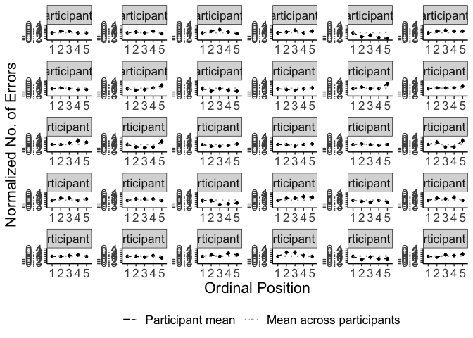<!-- -->

``` r
#plot_rt <- lemon::reposition_legend(plot_rt, "bott1.1.om right",panel='panel-5-5')

filename <- "CSI_online_typing_errors_by_participant.pdf"
ggsave(plot_error_subject, filename = 
         here::here("results", "figures",filename),
       width = 26, height = 22, units = "cm", 
       dpi = 300, device = cairo_pdf)
embedFonts(file = here::here("results", "figures",filename))
```

### Line graph of errors for each category:

``` r
modeloutput <- coef(m1_error)$category
(means_final_category <- df_errors %>% 
   summarySEwithin(.,"error_sum",withinvars = c("category","PosOr")))
```

    ## Automatically converting the following non-factors to factors: category, PosOr

    ##         category PosOr  N  error_sum        sd         se         ci
    ## 1   Aufbewahrung     1 30 0.13333333 0.3471956 0.06338895 0.12964496
    ## 2   Aufbewahrung     2 30 0.10000000 0.3064079 0.05594218 0.11441461
    ## 3   Aufbewahrung     3 30 0.06666667 0.2547719 0.04651477 0.09513339
    ## 4   Aufbewahrung     4 30 0.10000000 0.3064079 0.05594218 0.11441461
    ## 5   Aufbewahrung     5 30 0.10000000 0.3064079 0.05594218 0.11441461
    ## 6      Bauernhof     1 30 0.06666667 0.2547719 0.04651477 0.09513339
    ## 7      Bauernhof     2 30 0.06666667 0.2547719 0.04651477 0.09513339
    ## 8      Bauernhof     3 30 0.10000000 0.3064079 0.05594218 0.11441461
    ## 9      Bauernhof     4 30 0.16666667 0.3806383 0.06949473 0.14213269
    ## 10     Bauernhof     5 30 0.10000000 0.3064079 0.05594218 0.11441461
    ## 11        Blumen     1 30 0.23333333 0.4319868 0.07886963 0.16130651
    ## 12        Blumen     2 30 0.33333333 0.4814736 0.08790466 0.17978521
    ## 13        Blumen     3 30 0.13333333 0.3471956 0.06338895 0.12964496
    ## 14        Blumen     4 30 0.16666667 0.3806383 0.06949473 0.14213269
    ## 15        Blumen     5 30 0.26666667 0.4516623 0.08246188 0.16865348
    ## 16          Büro     1 30 0.10000000 0.3064079 0.05594218 0.11441461
    ## 17          Büro     2 30 0.13333333 0.3471956 0.06338895 0.12964496
    ## 18          Büro     3 30 0.06666667 0.2547719 0.04651477 0.09513339
    ## 19          Büro     4 30 0.06666667 0.2547719 0.04651477 0.09513339
    ## 20          Büro     5 30 0.06666667 0.2547719 0.04651477 0.09513339
    ## 21        Fische     1 30 0.13333333 0.3471956 0.06338895 0.12964496
    ## 22        Fische     2 30 0.03333333 0.1833397 0.03347310 0.06846017
    ## 23        Fische     3 30 0.13333333 0.3471956 0.06338895 0.12964496
    ## 24        Fische     4 30 0.06666667 0.2547719 0.04651477 0.09513339
    ## 25        Fische     5 30 0.06666667 0.2547719 0.04651477 0.09513339
    ## 26       Gebäude     1 30 0.10000000 0.3064079 0.05594218 0.11441461
    ## 27       Gebäude     2 30 0.16666667 0.3806383 0.06949473 0.14213269
    ## 28       Gebäude     3 30 0.10000000 0.3064079 0.05594218 0.11441461
    ## 29       Gebäude     4 30 0.10000000 0.3064079 0.05594218 0.11441461
    ## 30       Gebäude     5 30 0.30000000 0.4680459 0.08545309 0.17477120
    ## 31        Gemüse     1 30 0.03333333 0.1833397 0.03347310 0.06846017
    ## 32        Gemüse     2 30 0.00000000 0.0000000 0.00000000 0.00000000
    ## 33        Gemüse     3 30 0.10000000 0.3064079 0.05594218 0.11441461
    ## 34        Gemüse     4 30 0.06666667 0.2547719 0.04651477 0.09513339
    ## 35        Gemüse     5 30 0.06666667 0.2547719 0.04651477 0.09513339
    ## 36    Heimwerker     1 30 0.13333333 0.3471956 0.06338895 0.12964496
    ## 37    Heimwerker     2 30 0.23333333 0.4319868 0.07886963 0.16130651
    ## 38    Heimwerker     3 30 0.26666667 0.4516623 0.08246188 0.16865348
    ## 39    Heimwerker     4 30 0.13333333 0.3471956 0.06338895 0.12964496
    ## 40    Heimwerker     5 30 0.16666667 0.3806383 0.06949473 0.14213269
    ## 41      Huftiere     1 30 0.10000000 0.3064079 0.05594218 0.11441461
    ## 42      Huftiere     2 30 0.00000000 0.0000000 0.00000000 0.00000000
    ## 43      Huftiere     3 30 0.00000000 0.0000000 0.00000000 0.00000000
    ## 44      Huftiere     4 30 0.00000000 0.0000000 0.00000000 0.00000000
    ## 45      Huftiere     5 30 0.10000000 0.3064079 0.05594218 0.11441461
    ## 46      Insekten     1 30 0.10000000 0.3064079 0.05594218 0.11441461
    ## 47      Insekten     2 30 0.10000000 0.3064079 0.05594218 0.11441461
    ## 48      Insekten     3 30 0.06666667 0.2547719 0.04651477 0.09513339
    ## 49      Insekten     4 30 0.00000000 0.0000000 0.00000000 0.00000000
    ## 50      Insekten     5 30 0.03333333 0.1833397 0.03347310 0.06846017
    ## 51   Instrumente     1 30 0.10000000 0.3064079 0.05594218 0.11441461
    ## 52   Instrumente     2 30 0.00000000 0.0000000 0.00000000 0.00000000
    ## 53   Instrumente     3 30 0.03333333 0.1833397 0.03347310 0.06846017
    ## 54   Instrumente     4 30 0.23333333 0.4319868 0.07886963 0.16130651
    ## 55   Instrumente     5 30 0.10000000 0.3064079 0.05594218 0.11441461
    ## 56        Jacken     1 30 0.30000000 0.4680459 0.08545309 0.17477120
    ## 57        Jacken     2 30 0.23333333 0.4319868 0.07886963 0.16130651
    ## 58        Jacken     3 30 0.13333333 0.3471956 0.06338895 0.12964496
    ## 59        Jacken     4 30 0.43333333 0.5061202 0.09240448 0.18898838
    ## 60        Jacken     5 30 0.36666667 0.4921876 0.08986075 0.18378587
    ## 61        Kochen     1 30 0.06666667 0.2547719 0.04651477 0.09513339
    ## 62        Kochen     2 30 0.03333333 0.1833397 0.03347310 0.06846017
    ## 63        Kochen     3 30 0.06666667 0.2547719 0.04651477 0.09513339
    ## 64        Kochen     4 30 0.10000000 0.3064079 0.05594218 0.11441461
    ## 65        Kochen     5 30 0.26666667 0.4516623 0.08246188 0.16865348
    ## 66   Körperteile     1 30 0.13333333 0.3471956 0.06338895 0.12964496
    ## 67   Körperteile     2 30 0.03333333 0.1833397 0.03347310 0.06846017
    ## 68   Körperteile     3 30 0.06666667 0.2547719 0.04651477 0.09513339
    ## 69   Körperteile     4 30 0.00000000 0.0000000 0.00000000 0.00000000
    ## 70   Körperteile     5 30 0.16666667 0.3806383 0.06949473 0.14213269
    ## 71         Küche     1 30 0.10000000 0.3064079 0.05594218 0.11441461
    ## 72         Küche     2 30 0.13333333 0.3471956 0.06338895 0.12964496
    ## 73         Küche     3 30 0.26666667 0.4516623 0.08246188 0.16865348
    ## 74         Küche     4 30 0.13333333 0.3471956 0.06338895 0.12964496
    ## 75         Küche     5 30 0.13333333 0.3471956 0.06338895 0.12964496
    ## 76          Obst     1 30 0.06666667 0.2547719 0.04651477 0.09513339
    ## 77          Obst     2 30 0.00000000 0.0000000 0.00000000 0.00000000
    ## 78          Obst     3 30 0.10000000 0.3064079 0.05594218 0.11441461
    ## 79          Obst     4 30 0.13333333 0.3471956 0.06338895 0.12964496
    ## 80          Obst     5 30 0.06666667 0.2547719 0.04651477 0.09513339
    ## 81     Raubtiere     1 30 0.03333333 0.1833397 0.03347310 0.06846017
    ## 82     Raubtiere     2 30 0.16666667 0.3806383 0.06949473 0.14213269
    ## 83     Raubtiere     3 30 0.06666667 0.2547719 0.04651477 0.09513339
    ## 84     Raubtiere     4 30 0.10000000 0.3064079 0.05594218 0.11441461
    ## 85     Raubtiere     5 30 0.13333333 0.3471956 0.06338895 0.12964496
    ## 86       Schmuck     1 30 0.13333333 0.3471956 0.06338895 0.12964496
    ## 87       Schmuck     2 30 0.16666667 0.3806383 0.06949473 0.14213269
    ## 88       Schmuck     3 30 0.10000000 0.3064079 0.05594218 0.11441461
    ## 89       Schmuck     4 30 0.06666667 0.2547719 0.04651477 0.09513339
    ## 90       Schmuck     5 30 0.03333333 0.1833397 0.03347310 0.06846017
    ## 91        Sitzen     1 30 0.13333333 0.3471956 0.06338895 0.12964496
    ## 92        Sitzen     2 30 0.16666667 0.3806383 0.06949473 0.14213269
    ## 93        Sitzen     3 30 0.13333333 0.3471956 0.06338895 0.12964496
    ## 94        Sitzen     4 30 0.20000000 0.4085439 0.07458958 0.15255281
    ## 95        Sitzen     5 30 0.23333333 0.4319868 0.07886963 0.16130651
    ## 96       Strasse     1 30 0.03333333 0.1833397 0.03347310 0.06846017
    ## 97       Strasse     2 30 0.06666667 0.2547719 0.04651477 0.09513339
    ## 98       Strasse     3 30 0.10000000 0.3064079 0.05594218 0.11441461
    ## 99       Strasse     4 30 0.03333333 0.1833397 0.03347310 0.06846017
    ## 100      Strasse     5 30 0.00000000 0.0000000 0.00000000 0.00000000
    ## 101 Süssigkeiten     1 30 0.03333333 0.1833397 0.03347310 0.06846017
    ## 102 Süssigkeiten     2 30 0.10000000 0.3064079 0.05594218 0.11441461
    ## 103 Süssigkeiten     3 30 0.06666667 0.2547719 0.04651477 0.09513339
    ## 104 Süssigkeiten     4 30 0.03333333 0.1833397 0.03347310 0.06846017
    ## 105 Süssigkeiten     5 30 0.03333333 0.1833397 0.03347310 0.06846017
    ## 106 Trinkgefässe     1 30 0.10000000 0.3064079 0.05594218 0.11441461
    ## 107 Trinkgefässe     2 30 0.20000000 0.4085439 0.07458958 0.15255281
    ## 108 Trinkgefässe     3 30 0.20000000 0.4085439 0.07458958 0.15255281
    ## 109 Trinkgefässe     4 30 0.10000000 0.3064079 0.05594218 0.11441461
    ## 110 Trinkgefässe     5 30 0.06666667 0.2547719 0.04651477 0.09513339
    ## 111        Vögel     1 30 0.03333333 0.1833397 0.03347310 0.06846017
    ## 112        Vögel     2 30 0.06666667 0.2547719 0.04651477 0.09513339
    ## 113        Vögel     3 30 0.10000000 0.3064079 0.05594218 0.11441461
    ## 114        Vögel     4 30 0.10000000 0.3064079 0.05594218 0.11441461
    ## 115        Vögel     5 30 0.03333333 0.1833397 0.03347310 0.06846017
    ## 116       Wasser     1 30 0.10000000 0.3064079 0.05594218 0.11441461
    ## 117       Wasser     2 30 0.36666667 0.4921876 0.08986075 0.18378587
    ## 118       Wasser     3 30 0.26666667 0.4516623 0.08246188 0.16865348
    ## 119       Wasser     4 30 0.23333333 0.4319868 0.07886963 0.16130651
    ## 120       Wasser     5 30 0.26666667 0.4516623 0.08246188 0.16865348

``` r
(means_final<- df %>%  
   Rmisc::summarySEwithin(.,"error_sum",idvar = "category",
                          withinvars = "PosOr", na.rm = T))
```

    ##   PosOr   N error_sum sd se ci
    ## 1     1 868         0  0  0  0
    ## 2     2 845         0  0  0  0
    ## 3     3 865         0  0  0  0
    ## 4     4 855         0  0  0  0
    ## 5     5 846         0  0  0  0

``` r
for(i in 1:nrow(means_final_category)) {
  means_final_category$grandmean[i] <- means_final$error[
    means_final$PosOr == means_final_category$PosOr[i]] -
    means_final$error[means_final$PosOr== "1"]
  means_final_category$normalizederror[i] <- means_final_category$error_sum[i] -
    means_final_category$error_sum[means_final_category$category ==
                             means_final_category$category[i] &
                             means_final_category$PosOr == "1"]
  # prepare for ordering
  means_final_category$effect[i] <-
    modeloutput$PosOr.cont[means_final_category$category[i]] 
}
means_final_category <- means_final_category[
  order(desc(means_final_category$effect)),] 
means_final_category$effect <- as.factor(
  round(means_final_category$effect, 2))
means_final_category$effect <- factor(
  means_final_category$effect, levels=rev(levels(means_final_category$effect )))

# give categories English names and combine with effect size
means_final_category <- means_final_category %>% 
  mutate(category_en = case_when(
    category == "Gebäude" ~ paste0(
      "Buildings\n\n(", effect, ")", sep=''),
    category == "Huftiere" ~ paste0(
      "Hoofed\nanimals\n(", effect, ")", sep=''),
    category == "Jacken" ~ paste0(
      "Jackets\n\n(", effect, ")", sep=''),
    category == "Aufbewahrung" ~ paste0(
      "Storage\n\n(", effect, ")", sep=''),
    category == "Instrumente" ~ paste0(
      "Instruments\n\n(", effect, ")", sep=''),
    category == "Blumen" ~ paste0(
      "Flowers\n\n(", effect, ")", sep=''),
    category == "Körperteile" ~ paste0(
      "Body parts\n\n(", effect, ")", sep=''),
    category == "Obst" ~ paste0(
      "Fruits\n\n(", effect, ")", sep=''),
    category == "Süssigkeiten" ~ paste0(
      "Sweets\n\n(", effect, ")", sep=''),
    category == "Küche" ~ paste0(
      "Kitchen\nfurniture\n(", effect, ")", sep=''),
    category == "Trinkgefässe" ~ paste0(
      "Drinking\nvessels\n(", effect, ")", sep=''),
    category == "Vögel" ~ paste0(
      "Birds\n\n(", effect, ")", sep=''),
    category == "Bauernhof" ~ paste0(
      "Farming\ntools\n(", effect, ")", sep=''), 
    category == "Strasse" ~ paste0(
      "Street\nvehicles\n(", effect, ")", sep=''),
    category == "Gemüse" ~ paste0(
      "Vegetables\n\n(", effect, ")", sep=''),
    category == "Büro" ~ paste0(
      "Office\ntools\n(", effect, ")", sep=''),
    category == "Heimwerker" ~ paste0(
      "Carpenter.s\ntools\n(", effect, ")", sep=''),
    category == "Insekten" ~ paste0(
      "Insects\n\n(", effect, ")", sep=''),
    category == "Raubtiere" ~ paste0(
      "Predators\n\n(", effect, ")", sep=''),
    category == "Kochen" ~ paste0(
      "Cooking\nequipment\n(", effect, ")", sep=''),
    category == "Schmuck" ~ paste0(
      "Jewelry\n\n(", effect, ")", sep=''),
    category == "Sitzen" ~ paste0(
      "Seating\nfurniture\n(", effect, ")", sep=''),
    category == "Fische" ~ paste0(
      "Fish\n\n(", effect, ")", sep=''),
    category == "Wasser" ~ paste0(
      "Water\nvehicles\n(", effect, ")", sep=''))) %>%
  mutate(category_en=factor(category_en,levels=c(
    "Cooking\nequipment\n(0.07)", "Buildings\n\n(0.06)","Jackets\n\n(0.06)",
    "Instruments\n\n(0.06)","Seating\nfurniture\n(0.06)","Farming\ntools\n(0.06)",
    "Water\nvehicles\n(0.06)","Vegetables\n\n(0.06)","Fruits\n\n(0.06)",
    "Predators\n\n(0.05)","Kitchen\nfurniture\n(0.05)","Birds\n\n(0.05)",
    "Body parts\n\n(0.05)","Hoofed\nanimals\n(0.05)","Sweets\n\n(0.05)",
    "Carpenter.s\ntools\n(0.05)","Storage\n\n(0.05)","Street\nvehicles\n(0.05)",
    "Fish\n\n(0.05)","Office\ntools\n(0.04)","Flowers\n\n(0.04)",
    "Drinking\nvessels\n(0.04)","Insects\n\n(0.04)","Jewelry\n\n(0.04)")))
    

# Plotting
(plot_error_category <- means_final_category %>% 
    ggplot(., aes(x=PosOr,y=normalizederror, na.rm=T)) +
    geom_point(size =1, color = 'black') +
    geom_line(aes(x=PosOr,y=normalizederror, color="a", linetype="c"),
              group = 1,size = 0.5) +
    geom_line(aes(x=PosOr,y=grandmean, color="b", linetype="d"), 
              group = 1,size = 0.8)+
    geom_errorbar(aes(ymin=normalizederror-se, ymax=normalizederror+se), width =.1) +
    scale_color_manual(name="",values=c("a"="black","b"="dark gray"),
                       labels=c("Category mean", "Mean across categories"))+
    scale_linetype_manual(name="",values=c("c"="dashed","d"="dotted"),
                          labels=c("Category mean", "Mean across categories"))+
    apatheme+
    labs(x="Ordinal Position",y ="Normalized RTs (ms)") +
    facet_wrap(means_final_category$category_en, scales='free', ncol=6)+
    scale_y_continuous(limits = c(-0.35, 0.40), 
                       breaks = c(-0.3,-0.20, -0.10, 0, 0.10, 0.20, 0.3, 0.4)) + 
    scale_x_discrete(breaks=c(1,2,3,4,5))+
    theme(legend.position = "bottom"))
```

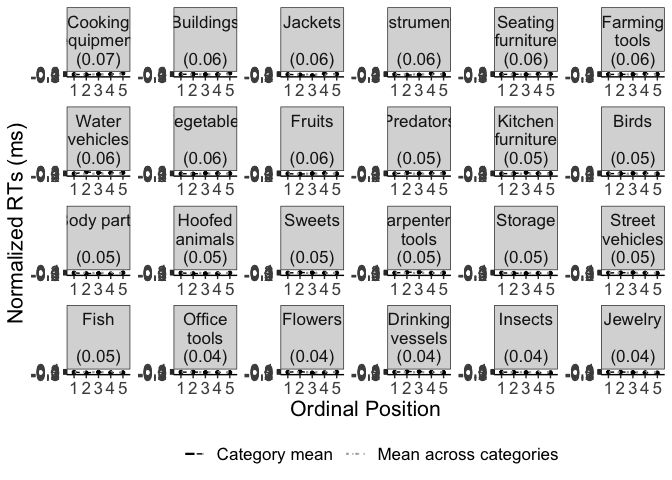<!-- -->

``` r
#plot_rt <- lemon::reposition_legend(plot_rt, "bott1.1.om right",panel='panel-5-5')

filename <- "CSI_online_typing_errors_by_subcat.pdf"
ggsave(plot_error_category, filename = 
         here::here("results", "figures",filename),
       width = 26, height = 23, units = "cm", 
       dpi = 300, device = cairo_pdf)
embedFonts(file = here::here("results", "figures",filename))
```

Make plot grid

# ———————————————

# Additional analyses

Additional exploratory models to control for covariates.

### … with trial as a covariate

``` r
# center trial
df_valid$trial_cont <- scale(as.numeric(as.character(df_valid$trial)), 
                               center = T, scale = T)
#compute model
# m1_trial <- glmer(timing.01 ~ PosOr.cont*trial_cont + 
#                (PosOr.cont|subject) +(PosOr.cont|category),
#              data = df_valid, 
#             family =Gamma(link ="identity"), 
#             control=glmerControl(optimizer = "bobyqa"))
# m1_trial <- glmer(timing.01 ~ PosOr.cont*trial_cont +
#                (PosOr.cont|subject) +(PosOr.cont|category),
#              data = df_valid,
#             family =Gamma(link ="identity"),
#             control=glmerControl(optimizer = "bobyqa",optCtrl = list(maxfun = 2e5)))
m1_trial <- glmer(timing.01 ~ PosOr.cont*trial_cont +
               (PosOr.cont||subject) +(PosOr.cont||category),
             data = df_valid,family =Gamma(link ="identity"),
            control=glmerControl(optimizer = "bobyqa", 
                                 optCtrl = list(maxfun = 2e5)))
summary(m1_trial)
```

    ## Generalized linear mixed model fit by maximum likelihood (Laplace
    ##   Approximation) [glmerMod]
    ##  Family: Gamma  ( identity )
    ## Formula: timing.01 ~ PosOr.cont * trial_cont + (PosOr.cont || subject) +  
    ##     (PosOr.cont || category)
    ##    Data: df_valid
    ## Control: glmerControl(optimizer = "bobyqa", optCtrl = list(maxfun = 200000))
    ## 
    ##      AIC      BIC   logLik deviance df.resid 
    ##  46558.5  46613.1 -23270.3  46540.5     3169 
    ## 
    ## Scaled residuals: 
    ##     Min      1Q  Median      3Q     Max 
    ## -1.5088 -0.5923 -0.2619  0.2532  8.4898 
    ## 
    ## Random effects:
    ##  Groups     Name        Variance  Std.Dev.
    ##  subject    (Intercept) 8163.4874 90.3520 
    ##  subject.1  PosOr.cont   665.7211 25.8016 
    ##  category   (Intercept) 9871.8976 99.3574 
    ##  category.1 PosOr.cont   495.8193 22.2670 
    ##  Residual                  0.1284  0.3583 
    ## Number of obs: 3178, groups:  subject, 30; category, 24
    ## 
    ## Fixed effects:
    ##                        Estimate Std. Error t value             Pr(>|z|)    
    ## (Intercept)           1298.1831     9.3388 139.009 < 0.0000000000000002 ***
    ## PosOr.cont              38.3126     6.2612   6.119       0.000000000942 ***
    ## trial_cont              15.3784     5.6086   2.742              0.00611 ** 
    ## PosOr.cont:trial_cont   -0.2344     4.7710  -0.049              0.96082    
    ## ---
    ## Signif. codes:  0 '***' 0.001 '**' 0.01 '*' 0.05 '.' 0.1 ' ' 1
    ## 
    ## Correlation of Fixed Effects:
    ##             (Intr) PsOr.c trl_cn
    ## PosOr.cont   0.081              
    ## trial_cont  -0.095  0.050       
    ## PsOr.cnt:t_ -0.203 -0.009  0.097

``` r
sjPlot::tab_model(m1_trial,transform = NULL,pred.labels = 
            c("Intercept","Ordinal Position", "Trial", 
              "Ordinal Position x Trial"),
          show.re.var = F, show.stat = T, string.stat = "t-Value", 
          show.se = T, show.r2 = F,show.icc = F)
```

<table style="border-collapse:collapse; border:none;">

<tr>

<th style="border-top: double; text-align:center; font-style:normal; font-weight:bold; padding:0.2cm;  text-align:left; ">

 

</th>

<th colspan="5" style="border-top: double; text-align:center; font-style:normal; font-weight:bold; padding:0.2cm; ">

timing.01

</th>

</tr>

<tr>

<td style=" text-align:center; border-bottom:1px solid; font-style:italic; font-weight:normal;  text-align:left; ">

Predictors

</td>

<td style=" text-align:center; border-bottom:1px solid; font-style:italic; font-weight:normal;  ">

Estimates

</td>

<td style=" text-align:center; border-bottom:1px solid; font-style:italic; font-weight:normal;  ">

std. Error

</td>

<td style=" text-align:center; border-bottom:1px solid; font-style:italic; font-weight:normal;  ">

CI

</td>

<td style=" text-align:center; border-bottom:1px solid; font-style:italic; font-weight:normal;  ">

t-Value

</td>

<td style=" text-align:center; border-bottom:1px solid; font-style:italic; font-weight:normal;  ">

p

</td>

</tr>

<tr>

<td style=" padding:0.2cm; text-align:left; vertical-align:top; text-align:left; ">

Intercept

</td>

<td style=" padding:0.2cm; text-align:left; vertical-align:top; text-align:center;  ">

1298.18

</td>

<td style=" padding:0.2cm; text-align:left; vertical-align:top; text-align:center;  ">

9.34

</td>

<td style=" padding:0.2cm; text-align:left; vertical-align:top; text-align:center;  ">

1279.88 – 1316.49

</td>

<td style=" padding:0.2cm; text-align:left; vertical-align:top; text-align:center;  ">

139.01

</td>

<td style=" padding:0.2cm; text-align:left; vertical-align:top; text-align:center;  ">

<strong>\<0.001

</td>

</tr>

<tr>

<td style=" padding:0.2cm; text-align:left; vertical-align:top; text-align:left; ">

Ordinal Position

</td>

<td style=" padding:0.2cm; text-align:left; vertical-align:top; text-align:center;  ">

38.31

</td>

<td style=" padding:0.2cm; text-align:left; vertical-align:top; text-align:center;  ">

6.26

</td>

<td style=" padding:0.2cm; text-align:left; vertical-align:top; text-align:center;  ">

26.04 – 50.58

</td>

<td style=" padding:0.2cm; text-align:left; vertical-align:top; text-align:center;  ">

6.12

</td>

<td style=" padding:0.2cm; text-align:left; vertical-align:top; text-align:center;  ">

<strong>\<0.001

</td>

</tr>

<tr>

<td style=" padding:0.2cm; text-align:left; vertical-align:top; text-align:left; ">

Trial

</td>

<td style=" padding:0.2cm; text-align:left; vertical-align:top; text-align:center;  ">

15.38

</td>

<td style=" padding:0.2cm; text-align:left; vertical-align:top; text-align:center;  ">

5.61

</td>

<td style=" padding:0.2cm; text-align:left; vertical-align:top; text-align:center;  ">

4.39 – 26.37

</td>

<td style=" padding:0.2cm; text-align:left; vertical-align:top; text-align:center;  ">

2.74

</td>

<td style=" padding:0.2cm; text-align:left; vertical-align:top; text-align:center;  ">

<strong>0.006</strong>

</td>

</tr>

<tr>

<td style=" padding:0.2cm; text-align:left; vertical-align:top; text-align:left; ">

Ordinal Position x Trial

</td>

<td style=" padding:0.2cm; text-align:left; vertical-align:top; text-align:center;  ">

\-0.23

</td>

<td style=" padding:0.2cm; text-align:left; vertical-align:top; text-align:center;  ">

4.77

</td>

<td style=" padding:0.2cm; text-align:left; vertical-align:top; text-align:center;  ">

\-9.59 – 9.12

</td>

<td style=" padding:0.2cm; text-align:left; vertical-align:top; text-align:center;  ">

\-0.05

</td>

<td style=" padding:0.2cm; text-align:left; vertical-align:top; text-align:center;  ">

0.961

</td>

</tr>

<tr>

<td style=" padding:0.2cm; text-align:left; vertical-align:top; text-align:left; padding-top:0.1cm; padding-bottom:0.1cm;">

N <sub>subject</sub>

</td>

<td style=" padding:0.2cm; text-align:left; vertical-align:top; padding-top:0.1cm; padding-bottom:0.1cm; text-align:left;" colspan="5">

30

</td>

<tr>

<td style=" padding:0.2cm; text-align:left; vertical-align:top; text-align:left; padding-top:0.1cm; padding-bottom:0.1cm;">

N <sub>category</sub>

</td>

<td style=" padding:0.2cm; text-align:left; vertical-align:top; padding-top:0.1cm; padding-bottom:0.1cm; text-align:left;" colspan="5">

24

</td>

<tr>

<td style=" padding:0.2cm; text-align:left; vertical-align:top; text-align:left; padding-top:0.1cm; padding-bottom:0.1cm; border-top:1px solid;">

Observations

</td>

<td style=" padding:0.2cm; text-align:left; vertical-align:top; padding-top:0.1cm; padding-bottom:0.1cm; text-align:left; border-top:1px solid;" colspan="5">

3178

</td>

</tr>

</table>

``` r
# compare to the original model
anova(m1,m1_trial)
```

    ## Data: df_valid
    ## Models:
    ## m1: timing.01 ~ PosOr.cont + (PosOr.cont | subject) + (PosOr.cont | 
    ## m1:     category)
    ## m1_trial: timing.01 ~ PosOr.cont * trial_cont + (PosOr.cont || subject) + 
    ## m1_trial:     (PosOr.cont || category)
    ##          npar   AIC   BIC logLik deviance  Chisq Df            Pr(>Chisq)    
    ## m1          9 46561 46616 -23272    46543                                    
    ## m1_trial    9 46559 46613 -23270    46541 2.6552  0 < 0.00000000000000022 ***
    ## ---
    ## Signif. codes:  0 '***' 0.001 '**' 0.01 '*' 0.05 '.' 0.1 ' ' 1

### … with superordinate category as additional random effects level

``` r
m1_supercat <- glmer(timing.01 ~ PosOr.cont +
                          (PosOr.cont|subject) +(PosOr.cont|category/supercategory) +
                       (1|supercategory),
                 data =df_valid, family =Gamma(link ="identity"),
                 control=glmerControl(optimizer = "bobyqa"))
summary(m1_supercat)
```

    ## Generalized linear mixed model fit by maximum likelihood (Laplace
    ##   Approximation) [glmerMod]
    ##  Family: Gamma  ( identity )
    ## Formula: timing.01 ~ PosOr.cont + (PosOr.cont | subject) + (PosOr.cont |  
    ##     category/supercategory) + (1 | supercategory)
    ##    Data: df_valid
    ## Control: glmerControl(optimizer = "bobyqa")
    ## 
    ##      AIC      BIC   logLik deviance df.resid 
    ##  46566.4  46645.2 -23270.2  46540.4     3165 
    ## 
    ## Scaled residuals: 
    ##     Min      1Q  Median      3Q     Max 
    ## -1.5446 -0.5862 -0.2608  0.2555  8.3329 
    ## 
    ## Random effects:
    ##  Groups                 Name        Variance  Std.Dev. Corr 
    ##  subject                (Intercept) 8201.5985 90.5627       
    ##                         PosOr.cont   662.4212 25.7375  -0.02
    ##  supercategory:category (Intercept) 1710.4903 41.3581       
    ##                         PosOr.cont   150.2636 12.2582  0.93 
    ##  category               (Intercept) 4042.6328 63.5817       
    ##                         PosOr.cont   358.6782 18.9388  -0.29
    ##  supercategory          (Intercept) 4003.4282 63.2726       
    ##  Residual                              0.1284  0.3583       
    ## Number of obs: 3178, groups:  
    ## subject, 30; supercategory:category, 24; category, 24; supercategory, 8
    ## 
    ## Fixed effects:
    ##             Estimate Std. Error t value             Pr(>|z|)    
    ## (Intercept) 1318.665     10.668 123.610 < 0.0000000000000002 ***
    ## PosOr.cont    40.172      5.621   7.147    0.000000000000889 ***
    ## ---
    ## Signif. codes:  0 '***' 0.001 '**' 0.01 '*' 0.05 '.' 0.1 ' ' 1
    ## 
    ## Correlation of Fixed Effects:
    ##            (Intr)
    ## PosOr.cont -0.178

``` r
sjPlot::tab_model(m1_supercat,transform = NULL,pred.labels = 
            c("Intercept","Ordinal Position"),
          show.re.var = F, show.stat = T, string.stat = "t-Value", 
          show.se = T, show.r2 = F,show.icc = F)
```

<table style="border-collapse:collapse; border:none;">

<tr>

<th style="border-top: double; text-align:center; font-style:normal; font-weight:bold; padding:0.2cm;  text-align:left; ">

 

</th>

<th colspan="5" style="border-top: double; text-align:center; font-style:normal; font-weight:bold; padding:0.2cm; ">

timing.01

</th>

</tr>

<tr>

<td style=" text-align:center; border-bottom:1px solid; font-style:italic; font-weight:normal;  text-align:left; ">

Predictors

</td>

<td style=" text-align:center; border-bottom:1px solid; font-style:italic; font-weight:normal;  ">

Estimates

</td>

<td style=" text-align:center; border-bottom:1px solid; font-style:italic; font-weight:normal;  ">

std. Error

</td>

<td style=" text-align:center; border-bottom:1px solid; font-style:italic; font-weight:normal;  ">

CI

</td>

<td style=" text-align:center; border-bottom:1px solid; font-style:italic; font-weight:normal;  ">

t-Value

</td>

<td style=" text-align:center; border-bottom:1px solid; font-style:italic; font-weight:normal;  ">

p

</td>

</tr>

<tr>

<td style=" padding:0.2cm; text-align:left; vertical-align:top; text-align:left; ">

Intercept

</td>

<td style=" padding:0.2cm; text-align:left; vertical-align:top; text-align:center;  ">

1318.66

</td>

<td style=" padding:0.2cm; text-align:left; vertical-align:top; text-align:center;  ">

10.67

</td>

<td style=" padding:0.2cm; text-align:left; vertical-align:top; text-align:center;  ">

1297.76 – 1339.57

</td>

<td style=" padding:0.2cm; text-align:left; vertical-align:top; text-align:center;  ">

123.61

</td>

<td style=" padding:0.2cm; text-align:left; vertical-align:top; text-align:center;  ">

<strong>\<0.001

</td>

</tr>

<tr>

<td style=" padding:0.2cm; text-align:left; vertical-align:top; text-align:left; ">

Ordinal Position

</td>

<td style=" padding:0.2cm; text-align:left; vertical-align:top; text-align:center;  ">

40.17

</td>

<td style=" padding:0.2cm; text-align:left; vertical-align:top; text-align:center;  ">

5.62

</td>

<td style=" padding:0.2cm; text-align:left; vertical-align:top; text-align:center;  ">

29.16 – 51.19

</td>

<td style=" padding:0.2cm; text-align:left; vertical-align:top; text-align:center;  ">

7.15

</td>

<td style=" padding:0.2cm; text-align:left; vertical-align:top; text-align:center;  ">

<strong>\<0.001

</td>

</tr>

<tr>

<td style=" padding:0.2cm; text-align:left; vertical-align:top; text-align:left; padding-top:0.1cm; padding-bottom:0.1cm;">

N <sub>subject</sub>

</td>

<td style=" padding:0.2cm; text-align:left; vertical-align:top; padding-top:0.1cm; padding-bottom:0.1cm; text-align:left;" colspan="5">

30

</td>

<tr>

<td style=" padding:0.2cm; text-align:left; vertical-align:top; text-align:left; padding-top:0.1cm; padding-bottom:0.1cm;">

N <sub>supercategory</sub>

</td>

<td style=" padding:0.2cm; text-align:left; vertical-align:top; padding-top:0.1cm; padding-bottom:0.1cm; text-align:left;" colspan="5">

8

</td>

<tr>

<td style=" padding:0.2cm; text-align:left; vertical-align:top; text-align:left; padding-top:0.1cm; padding-bottom:0.1cm;">

N <sub>category</sub>

</td>

<td style=" padding:0.2cm; text-align:left; vertical-align:top; padding-top:0.1cm; padding-bottom:0.1cm; text-align:left;" colspan="5">

24

</td>

<tr>

<td style=" padding:0.2cm; text-align:left; vertical-align:top; text-align:left; padding-top:0.1cm; padding-bottom:0.1cm; border-top:1px solid;">

Observations

</td>

<td style=" padding:0.2cm; text-align:left; vertical-align:top; padding-top:0.1cm; padding-bottom:0.1cm; text-align:left; border-top:1px solid;" colspan="5">

3178

</td>

</tr>

</table>

### …with lag as a covariate

``` r
# compute lag for ordinal positions 2-5
df_full <- read.csv(here::here("data", input))
categories <- unique(df_full$category)
subjects <- unique(df_full$subject)
df_full$lag <- NA
for(i in 1:length(unique(df_full$subject))) {
  for(j in 1:length(unique(df_full$category))){
    for(k in 2:length(unique(df_full$PosOr))){
      lag2 <- df_full$trial[df_full$subject==subjects[i] & 
                                   df_full$category == categories[j] &
                                   df_full$PosOr == k]
      lag1 <- df_full$trial[df_full$subject==subjects[i] & 
                                   df_full$category == categories[j] &
                                   df_full$PosOr == k-1]
      df_full$lag[df_full$subject==subjects[i] & 
                    df_full$category == categories[j] &
                        df_full$PosOr == k] <- lag2 - lag1
    }
  }
}
for(i in 1:nrow(df_valid)){
  df_valid$lag[i] <- df_full$lag[df_full$subject == df_valid$subject[i] &
                                   df_full$trial == df_valid$trial[i]]
}
table(df_valid$lag)
```

    ## 
    ##    3    4    5    6    7    8    9 
    ## 1577  346  223  198  107   51   31

``` r
df_lag <- df_valid[df_valid$PosOr != 1,]
#center lag
df_lag$lag_cont <- scale(as.numeric(as.character(df_lag$lag)), 
                               center = T, scale = T)
#center ordinal position
df_lag$PosOr.cont <- scale(as.numeric(as.character(df_lag$PosOr)), 
                               center = T, scale = T)
# compute a model with lag as additional predictor
m1_lag <- glmer(timing.01 ~ PosOr.cont*lag_cont + (PosOr.cont|subject) +
                  (PosOr.cont|category) ,
            data =df_lag, family =Gamma(link ="identity"),
            control=glmerControl(optimizer = "bobyqa"))
summary(m1_lag)
```

    ## Generalized linear mixed model fit by maximum likelihood (Laplace
    ##   Approximation) [glmerMod]
    ##  Family: Gamma  ( identity )
    ## Formula: timing.01 ~ PosOr.cont * lag_cont + (PosOr.cont | subject) +  
    ##     (PosOr.cont | category)
    ##    Data: df_lag
    ## Control: glmerControl(optimizer = "bobyqa")
    ## 
    ##      AIC      BIC   logLik deviance df.resid 
    ##  37304.1  37368.3 -18641.0  37282.1     2522 
    ## 
    ## Scaled residuals: 
    ##     Min      1Q  Median      3Q     Max 
    ## -1.4957 -0.5962 -0.2621  0.2792  8.2196 
    ## 
    ## Random effects:
    ##  Groups   Name        Variance   Std.Dev. Corr 
    ##  subject  (Intercept)  9012.0262  94.9317      
    ##           PosOr.cont   2062.1446  45.4108 -0.06
    ##  category (Intercept) 11803.0927 108.6420      
    ##           PosOr.cont   1568.5049  39.6044 -0.16
    ##  Residual                 0.1312   0.3623      
    ## Number of obs: 2533, groups:  subject, 30; category, 24
    ## 
    ## Fixed effects:
    ##                     Estimate Std. Error t value             Pr(>|z|)    
    ## (Intercept)         1324.784      9.454 140.123 < 0.0000000000000002 ***
    ## PosOr.cont            31.775      9.233   3.441             0.000579 ***
    ## lag_cont              18.435      6.106   3.019             0.002532 ** 
    ## PosOr.cont:lag_cont   -4.871      5.890  -0.827             0.408212    
    ## ---
    ## Signif. codes:  0 '***' 0.001 '**' 0.01 '*' 0.05 '.' 0.1 ' ' 1
    ## 
    ## Correlation of Fixed Effects:
    ##             (Intr) PsOr.c lg_cnt
    ## PosOr.cont  -0.239              
    ## lag_cont     0.134 -0.161       
    ## PsOr.cnt:l_  0.065  0.024  0.053

``` r
sjPlot::tab_model(m1_lag,transform = NULL,pred.labels = 
                    c("Intercept","Ordinal Position", 
                      "Lag", "Ordinal position*Lag"),
          show.re.var = F, show.stat = T, string.stat = "t-Value", 
          show.se = T, show.r2 = F,show.icc = F)
```

<table style="border-collapse:collapse; border:none;">

<tr>

<th style="border-top: double; text-align:center; font-style:normal; font-weight:bold; padding:0.2cm;  text-align:left; ">

 

</th>

<th colspan="5" style="border-top: double; text-align:center; font-style:normal; font-weight:bold; padding:0.2cm; ">

timing.01

</th>

</tr>

<tr>

<td style=" text-align:center; border-bottom:1px solid; font-style:italic; font-weight:normal;  text-align:left; ">

Predictors

</td>

<td style=" text-align:center; border-bottom:1px solid; font-style:italic; font-weight:normal;  ">

Estimates

</td>

<td style=" text-align:center; border-bottom:1px solid; font-style:italic; font-weight:normal;  ">

std. Error

</td>

<td style=" text-align:center; border-bottom:1px solid; font-style:italic; font-weight:normal;  ">

CI

</td>

<td style=" text-align:center; border-bottom:1px solid; font-style:italic; font-weight:normal;  ">

t-Value

</td>

<td style=" text-align:center; border-bottom:1px solid; font-style:italic; font-weight:normal;  ">

p

</td>

</tr>

<tr>

<td style=" padding:0.2cm; text-align:left; vertical-align:top; text-align:left; ">

Intercept

</td>

<td style=" padding:0.2cm; text-align:left; vertical-align:top; text-align:center;  ">

1324.78

</td>

<td style=" padding:0.2cm; text-align:left; vertical-align:top; text-align:center;  ">

9.45

</td>

<td style=" padding:0.2cm; text-align:left; vertical-align:top; text-align:center;  ">

1306.25 – 1343.31

</td>

<td style=" padding:0.2cm; text-align:left; vertical-align:top; text-align:center;  ">

140.12

</td>

<td style=" padding:0.2cm; text-align:left; vertical-align:top; text-align:center;  ">

<strong>\<0.001

</td>

</tr>

<tr>

<td style=" padding:0.2cm; text-align:left; vertical-align:top; text-align:left; ">

Ordinal Position

</td>

<td style=" padding:0.2cm; text-align:left; vertical-align:top; text-align:center;  ">

31.78

</td>

<td style=" padding:0.2cm; text-align:left; vertical-align:top; text-align:center;  ">

9.23

</td>

<td style=" padding:0.2cm; text-align:left; vertical-align:top; text-align:center;  ">

13.68 – 49.87

</td>

<td style=" padding:0.2cm; text-align:left; vertical-align:top; text-align:center;  ">

3.44

</td>

<td style=" padding:0.2cm; text-align:left; vertical-align:top; text-align:center;  ">

<strong>0.001</strong>

</td>

</tr>

<tr>

<td style=" padding:0.2cm; text-align:left; vertical-align:top; text-align:left; ">

Lag

</td>

<td style=" padding:0.2cm; text-align:left; vertical-align:top; text-align:center;  ">

18.44

</td>

<td style=" padding:0.2cm; text-align:left; vertical-align:top; text-align:center;  ">

6.11

</td>

<td style=" padding:0.2cm; text-align:left; vertical-align:top; text-align:center;  ">

6.47 – 30.40

</td>

<td style=" padding:0.2cm; text-align:left; vertical-align:top; text-align:center;  ">

3.02

</td>

<td style=" padding:0.2cm; text-align:left; vertical-align:top; text-align:center;  ">

<strong>0.003</strong>

</td>

</tr>

<tr>

<td style=" padding:0.2cm; text-align:left; vertical-align:top; text-align:left; ">

Ordinal position\*Lag

</td>

<td style=" padding:0.2cm; text-align:left; vertical-align:top; text-align:center;  ">

\-4.87

</td>

<td style=" padding:0.2cm; text-align:left; vertical-align:top; text-align:center;  ">

5.89

</td>

<td style=" padding:0.2cm; text-align:left; vertical-align:top; text-align:center;  ">

\-16.42 – 6.67

</td>

<td style=" padding:0.2cm; text-align:left; vertical-align:top; text-align:center;  ">

\-0.83

</td>

<td style=" padding:0.2cm; text-align:left; vertical-align:top; text-align:center;  ">

0.408

</td>

</tr>

<tr>

<td style=" padding:0.2cm; text-align:left; vertical-align:top; text-align:left; padding-top:0.1cm; padding-bottom:0.1cm;">

N <sub>subject</sub>

</td>

<td style=" padding:0.2cm; text-align:left; vertical-align:top; padding-top:0.1cm; padding-bottom:0.1cm; text-align:left;" colspan="5">

30

</td>

<tr>

<td style=" padding:0.2cm; text-align:left; vertical-align:top; text-align:left; padding-top:0.1cm; padding-bottom:0.1cm;">

N <sub>category</sub>

</td>

<td style=" padding:0.2cm; text-align:left; vertical-align:top; padding-top:0.1cm; padding-bottom:0.1cm; text-align:left;" colspan="5">

24

</td>

<tr>

<td style=" padding:0.2cm; text-align:left; vertical-align:top; text-align:left; padding-top:0.1cm; padding-bottom:0.1cm; border-top:1px solid;">

Observations

</td>

<td style=" padding:0.2cm; text-align:left; vertical-align:top; padding-top:0.1cm; padding-bottom:0.1cm; text-align:left; border-top:1px solid;" colspan="5">

2533

</td>

</tr>

</table>

``` r
# distribution of lag by ordinal position
table(df_full$lag[df_full$category != "Filler"], 
      df_full$PosOr[df_full$category != "Filler"])
```

    ##    
    ##       1   2   3   4   5
    ##   3   0 455 433 423 485
    ##   4   0  92 105 108  85
    ##   5   0  68  67  63  58
    ##   6   0  46  65  54  59
    ##   7   0  26  29  44  24
    ##   8   0  22  10  19   5
    ##   9   0  11  11   9   4

``` r
table(df_valid$lag[df_valid$category != "Filler"], 
      df_valid$PosOr[df_valid$category != "Filler"])
```

    ##    
    ##       1   2   3   4   5
    ##   3   0 398 386 368 425
    ##   4   0  79  90 101  76
    ##   5   0  61  58  57  47
    ##   6   0  44  58  46  50
    ##   7   0  23  26  39  19
    ##   8   0  20   9  18   4
    ##   9   0   8  11   8   4

### … Evidence for (ir)regularity of outliers in our browser-based within-subjects study?

``` r
# df_full <- read.csv(here::here("data", input))
# plot(df_full$trial[df_full$subject ==1& df_full$trial <=30],
#      df_full$timing.01[df_full$subject ==1 & df_full$trial <= 30])
# boxplot(df_full$timing.01[df_full$subject ==1 & df_full$trial <= 30])
# boxplot(df_full$timing.01[df_full$subject ==1 & df_full$trial > 30 & df_full$trial <= 60])
# boxplot(df_full$timing.01[df_full$subject ==1 & df_full$trial > 60 & df_full$trial <= 90])
# boxplot(df_full$timing.01[df_full$subject ==1 & df_full$trial > 90 & df_full$trial <= 120])
# boxplot(df_full$timing.01[df_full$subject ==1 & df_full$trial > 120 & df_full$trial <= 150])
# 
# outlier_df <- as.data.frame(cbind(subject=rep(seq(1:30),each=4), 
#                             block = rep(seq(1:4), times = 30), 
#                             no_outliers=rep(NA, times=4*30)))
# for (i in 1:length(unique(df_full$subject))){
#   for (j in 1:(160/40)) {
#     outlier_df$no_outliers[4*(i-1)+j] <- length(boxplot.stats(df_full$timing.01[
#       df_full$subject ==i &df_full$trial > (j-1)*40 & df_full$trial <= j*40])$out)
#   }
# }
# table(outlier_df$no_outliers)
# table(outlier_df$subject,outlier_df$no_outliers )
# psych::alpha(subset(outlier_df, select=c(subject, no_outliers)))
# 
# ## quantizing?
# df_quantizing <- as.data.frame(cbind(subject = df_full$subject, div_eight = df_full$timing.01%%8))
# hist(df_quantizing$div_eight)
# # no evidence for overall quantizing!
```

# ———————————————

# Additional analyses: Comparison to lab-based results

Export data in order to plot them together with lab-based results

``` r
# means_final<- df %>% 
#    Rmisc::summarySEwithin(.,"timing.01",idvar = "subject",
#                           withinvars = "PosOr", na.rm = T)
# means_final<- df_full %>% 
#   filter(category=="Filler") %>%
#    Rmisc::summarySEwithin(.,"timing.01",idvar = "subject",
#                           withinvars = "PosOr", na.rm = T)
# (typing_data <- data.frame(Ord.Pos = means_final$PosOr, 
#                            RT = means_final$timing.01,
#                           CI_RT = means_final$ci, method_CI_RT = "Morey,2008",
#                           errors = means_errors_final$error_sum, 
#                           ci_errors = means_errors_final$ci, 
#                           method_CI_erros = "Morey,2008"))
# write.csv2(typing_data, file = here::here("results", "tables",
#                                           "typing_data_for_lab_comparison.csv"))
# 
# summary(m1)
```
