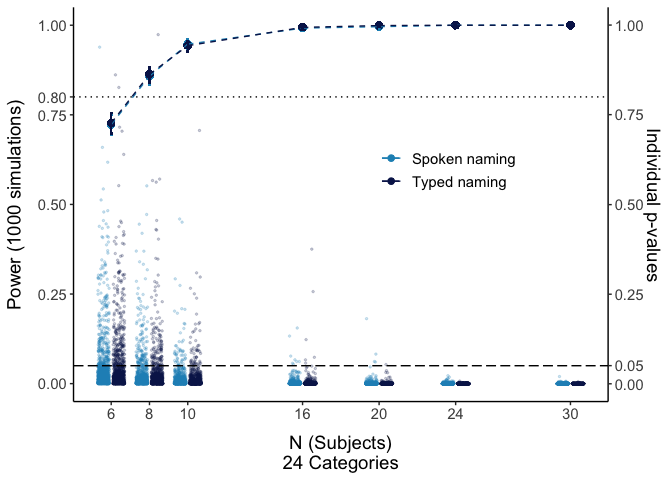
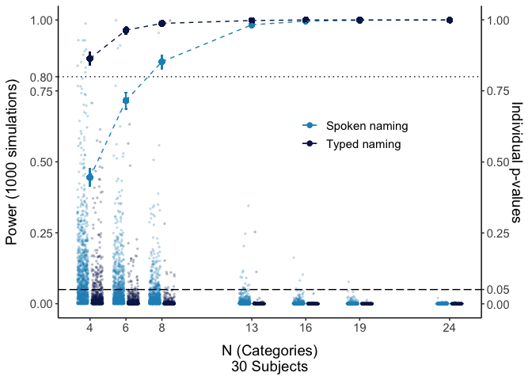

07b CSI online: Post-hoc power plotting
================
Kirsten Stark
26 Mai, 2021

# Load packages

``` r
library(dplyr)
```

    ## 
    ## Attaching package: 'dplyr'

    ## The following objects are masked from 'package:stats':
    ## 
    ##     filter, lag

    ## The following objects are masked from 'package:base':
    ## 
    ##     intersect, setdiff, setequal, union

``` r
library(tidyr)
library(lme4)
```

    ## Loading required package: Matrix

    ## 
    ## Attaching package: 'Matrix'

    ## The following objects are masked from 'package:tidyr':
    ## 
    ##     expand, pack, unpack

``` r
library(lmerTest)
```

    ## 
    ## Attaching package: 'lmerTest'

    ## The following object is masked from 'package:lme4':
    ## 
    ##     lmer

    ## The following object is masked from 'package:stats':
    ## 
    ##     step

``` r
library(Rmisc)
```

    ## Loading required package: lattice

    ## Loading required package: plyr

    ## ------------------------------------------------------------------------------

    ## You have loaded plyr after dplyr - this is likely to cause problems.
    ## If you need functions from both plyr and dplyr, please load plyr first, then dplyr:
    ## library(plyr); library(dplyr)

    ## ------------------------------------------------------------------------------

    ## 
    ## Attaching package: 'plyr'

    ## The following objects are masked from 'package:dplyr':
    ## 
    ##     arrange, count, desc, failwith, id, mutate, rename, summarise,
    ##     summarize

``` r
library(Cairo)
#library(strengejacke)
library(ggplot2)
library(sjPlot)

options(scipen=999)

rm(list = ls())
options( "encoding" = "UTF-8" )
```

``` r
powersim <- read.csv(here::here("results", "power_sim", "posthoc_powersim.csv"))
```

Verbal - different subject sizes

Make plots suitable for APA format, font sizes can be adjusted

``` r
apatheme <- theme_bw()+
  theme(plot.title=element_text(family="Arial",size=20,hjust = .5),
        panel.grid.major=element_blank(), panel.grid.minor=element_blank(),
        panel.border=element_blank(),axis.line=element_line(),
        text=element_text(family="Arial",size=14))
condition.colors <- RColorBrewer::brewer.pal(9, name = "YlGnBu")[c(6, 9)]
names(condition.colors) <- c("Spoken naming", "Typed naming")
```

## Different sample sizes (24 categories)

``` r
df <- powersim %>% filter(name == "verbal_s30_t_around109" |
                            name == "verbal_s24_t_around109" |
                            name == "verbal_s20_t_around109" |
                            name == "verbal_s16_t_around109" |
                            name == "verbal_s10_t_around109" |
                            name == "verbal_s8_t_around109" |
                            name == "verbal_s6_t_around109" |
                            name == "typing_s30_t_around109" |
                            name == "typing_s24_t_around109" |
                            name == "typing_s20_t_around109" |
                            name == "typing_s16_t_around109" |
                            name == "typing_s10_t_around109" |
                            name == "typing_s8_t_around109" |
                            # here the name in the powesim file is erroneous.
                            # It's indeed 6 subjects
                            name == "typing_s5_t_around109" |
                            name == "typing_s6_t_around109") %>% 
  mutate(Experiment = case_when(startsWith(name,"verbal") ~ "Spoken naming",
                                startsWith(name,"typing") ~ 
                                  "Typed naming")) %>%
  mutate(Experiment = as.factor(Experiment)) %>%
  mutate(nsubjects_p = case_when(Experiment ==
                                   "Spoken naming" ~ nsubjects-0.4, 
                                 Experiment ==
                                   "Typed naming" ~ nsubjects+0.4)) %>%
  droplevels()


(plot_subj <- df %>% 
    ggplot(., aes(x=nsubjects, group = Experiment)) +
    geom_point(aes(y = mean, color = Experiment), size = 2)+
    geom_line(aes(y = mean, color = Experiment),
              size = 0.5, linetype = "dashed")+
    geom_errorbar(aes(ymin=lower, ymax=upper, 
                      color=Experiment ), width =.1) +
    geom_jitter(aes(x=nsubjects_p, y=pval, group=Experiment, color=Experiment), 
                size = 0.5, width = 0.3,  alpha = 0.2)+
    geom_hline(yintercept=0.05, linetype = "longdash")+
    geom_hline(yintercept=0.80, linetype = "dotted")+
    apatheme+
    scale_x_continuous(breaks = c(6, 8, 10, 16, 20, 24, 30))+
    scale_y_continuous(name = "Power (1000 simulations)", 
                      breaks=c(0.00, 0.25, 0.50, 0.75, 0.80, 1.00),
                       sec.axis = 
                         sec_axis(~., name = 
                                    "Individual p-values", 
                                  breaks=c(0.00, 0.05, 0.25, 0.50, 
                                           0.75, 1.00)))+
    scale_color_manual(values = condition.colors) +
    labs(x="N (Subjects)\n24 Categories")+
    theme(legend.position = c(0.7, 0.6), legend.title= element_blank()) +
    theme(
    axis.title.y = element_text(margin = margin(0,10,0,0)),
    axis.title.x = element_text(margin = margin(10,0,0,0))))
```

<!-- -->

``` r
as.data.frame(table(df$name, df$mean)) %>% filter(Freq > 0)
```

    ##                      Var1  Var2 Freq
    ## 1   verbal_s6_t_around109 0.723 1000
    ## 2   typing_s5_t_around109 0.727 1000
    ## 3   verbal_s8_t_around109 0.858 1000
    ## 4   typing_s8_t_around109 0.863 1000
    ## 5  typing_s10_t_around109 0.943 1000
    ## 6  verbal_s10_t_around109 0.947 1000
    ## 7  verbal_s16_t_around109 0.992 1000
    ## 8  typing_s16_t_around109 0.994 1000
    ## 9  verbal_s20_t_around109 0.996 1000
    ## 10 typing_s20_t_around109 0.999 1000
    ## 11 typing_s24_t_around109     1 1000
    ## 12 typing_s30_t_around109     1 1000
    ## 13 verbal_s24_t_around109     1 1000
    ## 14 verbal_s30_t_around109     1 1000

## Different numbers of categories (30 participants)

``` r
df <- powersim %>% filter(name == "verbal_s30_t_around109" |
                            name == "verbal_s30_cat19" |
                            name == "verbal_s30_cat16" |
                            name == "verbal_s30_cat13" |
                            name == "verbal_s30_cat8" |
                            name == "verbal_s30_cat6" |
                            name == "verbal_s30_cat4" |
                            name == "typing_s30_t_around109" |
                            name == "typing_s30_cat19" |
                            name == "typing_s30_cat16" |
                            name == "typing_s30_cat13" |
                            name == "typing_s30_cat8" |
                            name == "typing_s30_cat6" |
                            name == "typing_s30_cat4") %>% 
  mutate(Experiment = case_when(startsWith(name,"verbal") ~ "Spoken naming",
                                startsWith(name,"typing") ~ 
                                  "Typed naming")) %>%
  mutate(Experiment = as.factor(Experiment)) %>%
  mutate(ncat = case_when(name == "verbal_s30_t_around109" ~24,
                            name == "verbal_s30_cat19" ~19,
                            name == "verbal_s30_cat16" ~16,
                            name == "verbal_s30_cat13" ~13,
                            name == "verbal_s30_cat8" ~8,
                            name == "verbal_s30_cat6" ~6,
                            name == "verbal_s30_cat4" ~4,
                            name == "typing_s30_t_around109" ~24,
                            name == "typing_s30_cat19" ~19,
                            name == "typing_s30_cat16" ~16,
                            name == "typing_s30_cat13" ~13,
                            name == "typing_s30_cat8" ~8,
                            name == "typing_s30_cat6" ~6,
                            name == "typing_s30_cat4" ~4)) %>%
  mutate(ncat_p = case_when(Experiment =="Spoken naming" ~ ncat-0.4, 
                                 Experiment =="Typed naming" ~ ncat+0.4)) %>%
  droplevels()

as.data.frame(table(df$name, df$mean)) %>% filter(Freq > 0)
```

    ##                      Var1  Var2 Freq
    ## 1         verbal_s30_cat4 0.445 1000
    ## 2         verbal_s30_cat6 0.716 1000
    ## 3         verbal_s30_cat8 0.853 1000
    ## 4         typing_s30_cat4 0.864 1000
    ## 5         typing_s30_cat6 0.964 1000
    ## 6        verbal_s30_cat13 0.983 1000
    ## 7         typing_s30_cat8 0.988 1000
    ## 8        verbal_s30_cat16 0.996 1000
    ## 9        typing_s30_cat13 0.998 1000
    ## 10       verbal_s30_cat19 0.999 1000
    ## 11       typing_s30_cat16     1 1000
    ## 12       typing_s30_cat19     1 1000
    ## 13 typing_s30_t_around109     1 1000
    ## 14 verbal_s30_t_around109     1 1000

``` r
(plot_cat <- df %>% 
    ggplot(., aes(x=ncat, group = Experiment)) +
    geom_point(aes(y = mean, colour = Experiment), size = 2)+
    geom_line(aes(y = mean, colour = Experiment),
              size = 0.5, linetype = "dashed")+
    geom_errorbar(aes(ymin=lower, ymax=upper, 
                      group=Experiment, color = Experiment), 
                  width =.1) +
    geom_jitter(aes(x=ncat_p, y=pval, group=Experiment, color=Experiment), 
                size = 0.5, width = 0.3,  alpha = 0.2)+
    geom_hline(yintercept=0.05, linetype = "longdash")+
    geom_hline(yintercept=0.80, linetype = "dotted")+
    apatheme+
    scale_x_continuous(breaks = c(4,6, 8, 13, 16, 19, 24))+
    scale_color_manual(values = condition.colors) +
    scale_y_continuous(name = "Power (1000 simulations)", 
                      breaks=c(0.00, 0.25, 0.50, 0.75, 0.80, 1.00),
                       sec.axis = 
                         sec_axis(~., name = 
                                    "Individual p-values", 
                                  breaks=c(0.00, 0.05, 0.25, 0.50, 
                                           0.75, 1.00)))+
    labs(x="N (Categories)\n30 Subjects")+
    theme(legend.position = c(0.7, 0.6), legend.title= element_blank()) +
    theme(
    axis.title.y = element_text(margin = margin(0,10,0,0)),
    axis.title.x = element_text(margin = margin(10,0,0,0))))
```

<!-- -->

## Combined plot

``` r
(cowplot::plot_grid(plot_subj, plot_cat,
          nrow = 1, labels = c("A", "B"), label_fontfamily = "Helvetica") %>% 
  ggsave(filename = here::here("results","figures",
                               "CSI_online_posthoc_power"),
         width = 20, height = 13, units = "cm", dpi = 300, 
         device = cairo_pdf))
```

    ## Warning in grid.Call(C_stringMetric, as.graphicsAnnot(x$label)):
    ## Zeichensatzfamilie 'Arial' in der PostScript-Zeichensatzdatenbank nicht gefunden
    
    ## Warning in grid.Call(C_stringMetric, as.graphicsAnnot(x$label)):
    ## Zeichensatzfamilie 'Arial' in der PostScript-Zeichensatzdatenbank nicht gefunden
    
    ## Warning in grid.Call(C_stringMetric, as.graphicsAnnot(x$label)):
    ## Zeichensatzfamilie 'Arial' in der PostScript-Zeichensatzdatenbank nicht gefunden
    
    ## Warning in grid.Call(C_stringMetric, as.graphicsAnnot(x$label)):
    ## Zeichensatzfamilie 'Arial' in der PostScript-Zeichensatzdatenbank nicht gefunden
    
    ## Warning in grid.Call(C_stringMetric, as.graphicsAnnot(x$label)):
    ## Zeichensatzfamilie 'Arial' in der PostScript-Zeichensatzdatenbank nicht gefunden
    
    ## Warning in grid.Call(C_stringMetric, as.graphicsAnnot(x$label)):
    ## Zeichensatzfamilie 'Arial' in der PostScript-Zeichensatzdatenbank nicht gefunden
    
    ## Warning in grid.Call(C_stringMetric, as.graphicsAnnot(x$label)):
    ## Zeichensatzfamilie 'Arial' in der PostScript-Zeichensatzdatenbank nicht gefunden
    
    ## Warning in grid.Call(C_stringMetric, as.graphicsAnnot(x$label)):
    ## Zeichensatzfamilie 'Arial' in der PostScript-Zeichensatzdatenbank nicht gefunden
    
    ## Warning in grid.Call(C_stringMetric, as.graphicsAnnot(x$label)):
    ## Zeichensatzfamilie 'Arial' in der PostScript-Zeichensatzdatenbank nicht gefunden
    
    ## Warning in grid.Call(C_stringMetric, as.graphicsAnnot(x$label)):
    ## Zeichensatzfamilie 'Arial' in der PostScript-Zeichensatzdatenbank nicht gefunden
    
    ## Warning in grid.Call(C_stringMetric, as.graphicsAnnot(x$label)):
    ## Zeichensatzfamilie 'Arial' in der PostScript-Zeichensatzdatenbank nicht gefunden
    
    ## Warning in grid.Call(C_stringMetric, as.graphicsAnnot(x$label)):
    ## Zeichensatzfamilie 'Arial' in der PostScript-Zeichensatzdatenbank nicht gefunden
    
    ## Warning in grid.Call(C_stringMetric, as.graphicsAnnot(x$label)):
    ## Zeichensatzfamilie 'Arial' in der PostScript-Zeichensatzdatenbank nicht gefunden
    
    ## Warning in grid.Call(C_stringMetric, as.graphicsAnnot(x$label)):
    ## Zeichensatzfamilie 'Arial' in der PostScript-Zeichensatzdatenbank nicht gefunden
    
    ## Warning in grid.Call(C_stringMetric, as.graphicsAnnot(x$label)):
    ## Zeichensatzfamilie 'Arial' in der PostScript-Zeichensatzdatenbank nicht gefunden
    
    ## Warning in grid.Call(C_stringMetric, as.graphicsAnnot(x$label)):
    ## Zeichensatzfamilie 'Arial' in der PostScript-Zeichensatzdatenbank nicht gefunden
    
    ## Warning in grid.Call(C_stringMetric, as.graphicsAnnot(x$label)):
    ## Zeichensatzfamilie 'Arial' in der PostScript-Zeichensatzdatenbank nicht gefunden
    
    ## Warning in grid.Call(C_stringMetric, as.graphicsAnnot(x$label)):
    ## Zeichensatzfamilie 'Arial' in der PostScript-Zeichensatzdatenbank nicht gefunden
    
    ## Warning in grid.Call(C_stringMetric, as.graphicsAnnot(x$label)):
    ## Zeichensatzfamilie 'Arial' in der PostScript-Zeichensatzdatenbank nicht gefunden
    
    ## Warning in grid.Call(C_stringMetric, as.graphicsAnnot(x$label)):
    ## Zeichensatzfamilie 'Arial' in der PostScript-Zeichensatzdatenbank nicht gefunden
    
    ## Warning in grid.Call(C_stringMetric, as.graphicsAnnot(x$label)):
    ## Zeichensatzfamilie 'Arial' in der PostScript-Zeichensatzdatenbank nicht gefunden
    
    ## Warning in grid.Call(C_stringMetric, as.graphicsAnnot(x$label)):
    ## Zeichensatzfamilie 'Arial' in der PostScript-Zeichensatzdatenbank nicht gefunden
    
    ## Warning in grid.Call(C_stringMetric, as.graphicsAnnot(x$label)):
    ## Zeichensatzfamilie 'Arial' in der PostScript-Zeichensatzdatenbank nicht gefunden
    
    ## Warning in grid.Call(C_stringMetric, as.graphicsAnnot(x$label)):
    ## Zeichensatzfamilie 'Arial' in der PostScript-Zeichensatzdatenbank nicht gefunden
    
    ## Warning in grid.Call(C_stringMetric, as.graphicsAnnot(x$label)):
    ## Zeichensatzfamilie 'Arial' in der PostScript-Zeichensatzdatenbank nicht gefunden
    
    ## Warning in grid.Call(C_stringMetric, as.graphicsAnnot(x$label)):
    ## Zeichensatzfamilie 'Arial' in der PostScript-Zeichensatzdatenbank nicht gefunden
    
    ## Warning in grid.Call(C_stringMetric, as.graphicsAnnot(x$label)):
    ## Zeichensatzfamilie 'Arial' in der PostScript-Zeichensatzdatenbank nicht gefunden
    
    ## Warning in grid.Call(C_stringMetric, as.graphicsAnnot(x$label)):
    ## Zeichensatzfamilie 'Arial' in der PostScript-Zeichensatzdatenbank nicht gefunden

    ## Warning in grid.Call(C_textBounds, as.graphicsAnnot(x$label), x$x, x$y, :
    ## Zeichensatzfamilie 'Arial' in der PostScript-Zeichensatzdatenbank nicht gefunden
    
    ## Warning in grid.Call(C_textBounds, as.graphicsAnnot(x$label), x$x, x$y, :
    ## Zeichensatzfamilie 'Arial' in der PostScript-Zeichensatzdatenbank nicht gefunden
    
    ## Warning in grid.Call(C_textBounds, as.graphicsAnnot(x$label), x$x, x$y, :
    ## Zeichensatzfamilie 'Arial' in der PostScript-Zeichensatzdatenbank nicht gefunden
    
    ## Warning in grid.Call(C_textBounds, as.graphicsAnnot(x$label), x$x, x$y, :
    ## Zeichensatzfamilie 'Arial' in der PostScript-Zeichensatzdatenbank nicht gefunden
    
    ## Warning in grid.Call(C_textBounds, as.graphicsAnnot(x$label), x$x, x$y, :
    ## Zeichensatzfamilie 'Arial' in der PostScript-Zeichensatzdatenbank nicht gefunden
    
    ## Warning in grid.Call(C_textBounds, as.graphicsAnnot(x$label), x$x, x$y, :
    ## Zeichensatzfamilie 'Arial' in der PostScript-Zeichensatzdatenbank nicht gefunden
    
    ## Warning in grid.Call(C_textBounds, as.graphicsAnnot(x$label), x$x, x$y, :
    ## Zeichensatzfamilie 'Arial' in der PostScript-Zeichensatzdatenbank nicht gefunden
    
    ## Warning in grid.Call(C_textBounds, as.graphicsAnnot(x$label), x$x, x$y, :
    ## Zeichensatzfamilie 'Arial' in der PostScript-Zeichensatzdatenbank nicht gefunden
    
    ## Warning in grid.Call(C_textBounds, as.graphicsAnnot(x$label), x$x, x$y, :
    ## Zeichensatzfamilie 'Arial' in der PostScript-Zeichensatzdatenbank nicht gefunden
    
    ## Warning in grid.Call(C_textBounds, as.graphicsAnnot(x$label), x$x, x$y, :
    ## Zeichensatzfamilie 'Arial' in der PostScript-Zeichensatzdatenbank nicht gefunden
    
    ## Warning in grid.Call(C_textBounds, as.graphicsAnnot(x$label), x$x, x$y, :
    ## Zeichensatzfamilie 'Arial' in der PostScript-Zeichensatzdatenbank nicht gefunden
    
    ## Warning in grid.Call(C_textBounds, as.graphicsAnnot(x$label), x$x, x$y, :
    ## Zeichensatzfamilie 'Arial' in der PostScript-Zeichensatzdatenbank nicht gefunden
    
    ## Warning in grid.Call(C_textBounds, as.graphicsAnnot(x$label), x$x, x$y, :
    ## Zeichensatzfamilie 'Arial' in der PostScript-Zeichensatzdatenbank nicht gefunden
    
    ## Warning in grid.Call(C_textBounds, as.graphicsAnnot(x$label), x$x, x$y, :
    ## Zeichensatzfamilie 'Arial' in der PostScript-Zeichensatzdatenbank nicht gefunden
    
    ## Warning in grid.Call(C_textBounds, as.graphicsAnnot(x$label), x$x, x$y, :
    ## Zeichensatzfamilie 'Arial' in der PostScript-Zeichensatzdatenbank nicht gefunden
    
    ## Warning in grid.Call(C_textBounds, as.graphicsAnnot(x$label), x$x, x$y, :
    ## Zeichensatzfamilie 'Arial' in der PostScript-Zeichensatzdatenbank nicht gefunden
    
    ## Warning in grid.Call(C_textBounds, as.graphicsAnnot(x$label), x$x, x$y, :
    ## Zeichensatzfamilie 'Arial' in der PostScript-Zeichensatzdatenbank nicht gefunden
    
    ## Warning in grid.Call(C_textBounds, as.graphicsAnnot(x$label), x$x, x$y, :
    ## Zeichensatzfamilie 'Arial' in der PostScript-Zeichensatzdatenbank nicht gefunden
    
    ## Warning in grid.Call(C_textBounds, as.graphicsAnnot(x$label), x$x, x$y, :
    ## Zeichensatzfamilie 'Arial' in der PostScript-Zeichensatzdatenbank nicht gefunden
    
    ## Warning in grid.Call(C_textBounds, as.graphicsAnnot(x$label), x$x, x$y, :
    ## Zeichensatzfamilie 'Arial' in der PostScript-Zeichensatzdatenbank nicht gefunden
    
    ## Warning in grid.Call(C_textBounds, as.graphicsAnnot(x$label), x$x, x$y, :
    ## Zeichensatzfamilie 'Arial' in der PostScript-Zeichensatzdatenbank nicht gefunden
    
    ## Warning in grid.Call(C_textBounds, as.graphicsAnnot(x$label), x$x, x$y, :
    ## Zeichensatzfamilie 'Arial' in der PostScript-Zeichensatzdatenbank nicht gefunden
    
    ## Warning in grid.Call(C_textBounds, as.graphicsAnnot(x$label), x$x, x$y, :
    ## Zeichensatzfamilie 'Arial' in der PostScript-Zeichensatzdatenbank nicht gefunden
    
    ## Warning in grid.Call(C_textBounds, as.graphicsAnnot(x$label), x$x, x$y, :
    ## Zeichensatzfamilie 'Arial' in der PostScript-Zeichensatzdatenbank nicht gefunden
    
    ## Warning in grid.Call(C_textBounds, as.graphicsAnnot(x$label), x$x, x$y, :
    ## Zeichensatzfamilie 'Arial' in der PostScript-Zeichensatzdatenbank nicht gefunden
    
    ## Warning in grid.Call(C_textBounds, as.graphicsAnnot(x$label), x$x, x$y, :
    ## Zeichensatzfamilie 'Arial' in der PostScript-Zeichensatzdatenbank nicht gefunden
    
    ## Warning in grid.Call(C_textBounds, as.graphicsAnnot(x$label), x$x, x$y, :
    ## Zeichensatzfamilie 'Arial' in der PostScript-Zeichensatzdatenbank nicht gefunden
    
    ## Warning in grid.Call(C_textBounds, as.graphicsAnnot(x$label), x$x, x$y, :
    ## Zeichensatzfamilie 'Arial' in der PostScript-Zeichensatzdatenbank nicht gefunden
    
    ## Warning in grid.Call(C_textBounds, as.graphicsAnnot(x$label), x$x, x$y, :
    ## Zeichensatzfamilie 'Arial' in der PostScript-Zeichensatzdatenbank nicht gefunden
    
    ## Warning in grid.Call(C_textBounds, as.graphicsAnnot(x$label), x$x, x$y, :
    ## Zeichensatzfamilie 'Arial' in der PostScript-Zeichensatzdatenbank nicht gefunden
    
    ## Warning in grid.Call(C_textBounds, as.graphicsAnnot(x$label), x$x, x$y, :
    ## Zeichensatzfamilie 'Arial' in der PostScript-Zeichensatzdatenbank nicht gefunden
    
    ## Warning in grid.Call(C_textBounds, as.graphicsAnnot(x$label), x$x, x$y, :
    ## Zeichensatzfamilie 'Arial' in der PostScript-Zeichensatzdatenbank nicht gefunden
    
    ## Warning in grid.Call(C_textBounds, as.graphicsAnnot(x$label), x$x, x$y, :
    ## Zeichensatzfamilie 'Arial' in der PostScript-Zeichensatzdatenbank nicht gefunden
    
    ## Warning in grid.Call(C_textBounds, as.graphicsAnnot(x$label), x$x, x$y, :
    ## Zeichensatzfamilie 'Arial' in der PostScript-Zeichensatzdatenbank nicht gefunden
    
    ## Warning in grid.Call(C_textBounds, as.graphicsAnnot(x$label), x$x, x$y, :
    ## Zeichensatzfamilie 'Arial' in der PostScript-Zeichensatzdatenbank nicht gefunden
    
    ## Warning in grid.Call(C_textBounds, as.graphicsAnnot(x$label), x$x, x$y, :
    ## Zeichensatzfamilie 'Arial' in der PostScript-Zeichensatzdatenbank nicht gefunden
    
    ## Warning in grid.Call(C_textBounds, as.graphicsAnnot(x$label), x$x, x$y, :
    ## Zeichensatzfamilie 'Arial' in der PostScript-Zeichensatzdatenbank nicht gefunden
    
    ## Warning in grid.Call(C_textBounds, as.graphicsAnnot(x$label), x$x, x$y, :
    ## Zeichensatzfamilie 'Arial' in der PostScript-Zeichensatzdatenbank nicht gefunden
    
    ## Warning in grid.Call(C_textBounds, as.graphicsAnnot(x$label), x$x, x$y, :
    ## Zeichensatzfamilie 'Arial' in der PostScript-Zeichensatzdatenbank nicht gefunden
    
    ## Warning in grid.Call(C_textBounds, as.graphicsAnnot(x$label), x$x, x$y, :
    ## Zeichensatzfamilie 'Arial' in der PostScript-Zeichensatzdatenbank nicht gefunden
    
    ## Warning in grid.Call(C_textBounds, as.graphicsAnnot(x$label), x$x, x$y, :
    ## Zeichensatzfamilie 'Arial' in der PostScript-Zeichensatzdatenbank nicht gefunden
    
    ## Warning in grid.Call(C_textBounds, as.graphicsAnnot(x$label), x$x, x$y, :
    ## Zeichensatzfamilie 'Arial' in der PostScript-Zeichensatzdatenbank nicht gefunden

    ## NULL

``` r
#embedFonts(file = here::here("figures", "CSI_online_posthoc_power"))
```
