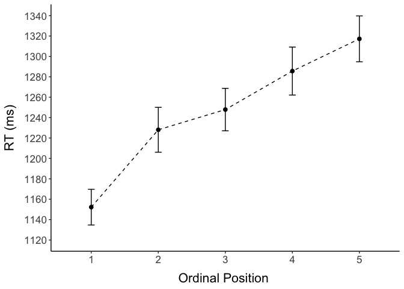
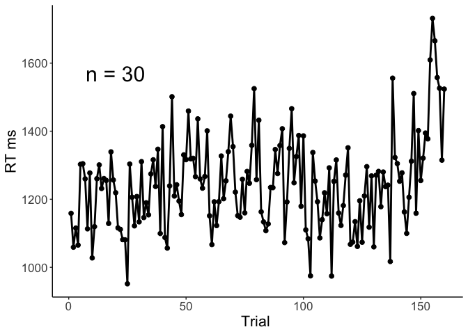
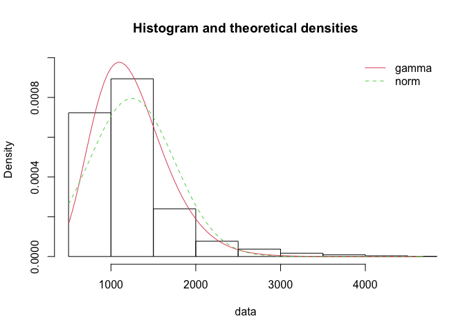

05 CSI online typing: Plotting and analysis
================
Kirsten Stark
22 Mai, 2021

## Load packages

``` r
library(dplyr)
```

    ## 
    ## Attaching package: 'dplyr'

    ## The following objects are masked from 'package:stats':
    ## 
    ##     filter, lag

    ## The following objects are masked from 'package:base':
    ## 
    ##     intersect, setdiff, setequal, union

``` r
library(tidyr)
library(lme4)
```

    ## Loading required package: Matrix

    ## 
    ## Attaching package: 'Matrix'

    ## The following objects are masked from 'package:tidyr':
    ## 
    ##     expand, pack, unpack

``` r
library(lmerTest)
```

    ## 
    ## Attaching package: 'lmerTest'

    ## The following object is masked from 'package:lme4':
    ## 
    ##     lmer

    ## The following object is masked from 'package:stats':
    ## 
    ##     step

``` r
library(Rmisc)
```

    ## Loading required package: lattice

    ## Loading required package: plyr

    ## ------------------------------------------------------------------------------

    ## You have loaded plyr after dplyr - this is likely to cause problems.
    ## If you need functions from both plyr and dplyr, please load plyr first, then dplyr:
    ## library(plyr); library(dplyr)

    ## ------------------------------------------------------------------------------

    ## 
    ## Attaching package: 'plyr'

    ## The following objects are masked from 'package:dplyr':
    ## 
    ##     arrange, count, desc, failwith, id, mutate, rename, summarise,
    ##     summarize

``` r
library(Cairo)
#library(strengejacke)
library(ggplot2)
library(sjPlot)

options(scipen=999)

rm(list = ls())
options( "encoding" = "UTF-8" )
set.seed(99)
```

## Load and preprocess data

``` r
# input 
#input = "data_long_final.csv"
input = "data_long_anonymous.csv"
classification_type = "automatic" # select "manual" or "automatic"

# load data
df <- read.csv(here::here("data", input))
```

Check amount of participants and trials

``` r
# no. of participants: 
length(unique(df$subject))
```

    ## [1] 30

``` r
# no. of trials is 160 per participant? 
nrow(df) == 160 * length(unique(df$subject))
```

    ## [1] TRUE

Factorize columns

``` r
# factorize columns
is.numeric(df$timing.01)
```

    ## [1] TRUE

``` r
df$PosOr <- as.factor(df$PosOr)
df$subject <- as.factor(df$subject)
```

# Select correct classification column

``` r
if(classification_type == "automatic") {
  df$answercode <- df$answer_auto_jaro
  df$correct <- df$correct_auto_jaro
} else if(classification_type == "manual") {
  df$answercode <- df$answercode
  df$correct <- df$correct_manual
} else {
  print("Select a correct type!")
}
```

``` r
as.data.frame(table(df$correct, df$answercode)) %>% filter(Freq != 0) 
```

    ##    Var1                  Var2 Freq
    ## 1     1 alternative_corrected  302
    ## 2     1    approx_alternative   24
    ## 3     1        approx_correct  133
    ## 4     0 backspace_space_enter   25
    ## 5     1               correct 3519
    ## 6     1    correctedtocorrect  301
    ## 7     0  distance_based_error   12
    ## 8     0    first_letter_error  231
    ## 9     0                  isna  153
    ## 10    0           not_correct   90
    ## 11    0           shift_start   10

``` r
as.data.frame(table(df$correct, df$answercode)) %>% filter(Freq != 0) %>% 
  mutate(Percentage = case_when(Var1 == 1 ~ Freq/sum(df$correct == 1),
                                Var1 == 0 ~ Freq/sum(df$correct == 0)))
```

    ##    Var1                  Var2 Freq  Percentage
    ## 1     1 alternative_corrected  302 0.070577238
    ## 2     1    approx_alternative   24 0.005608787
    ## 3     1        approx_correct  133 0.031082029
    ## 4     0 backspace_space_enter   25 0.047984645
    ## 5     1               correct 3519 0.822388409
    ## 6     1    correctedtocorrect  301 0.070343538
    ## 7     0  distance_based_error   12 0.023032630
    ## 8     0    first_letter_error  231 0.443378119
    ## 9     0                  isna  153 0.293666027
    ## 10    0           not_correct   90 0.172744722
    ## 11    0           shift_start   10 0.019193858

``` r
# raw
table(df$correct)
```

    ## 
    ##    0    1 
    ##  521 4279

``` r
# in percent
round(table(df$correct)/nrow(df)*100,2)
```

    ## 
    ##     0     1 
    ## 10.85 89.15

``` r
## How many correct/incorrect non-filler trials?
table(df$correct[df$category != "Filler"])
```

    ## 
    ##    0    1 
    ##  422 3178

Show amount of incorrect trials per ordinal position (excluding
fillers):

``` r
## How many correct/incorrect non-filler trials per ordinal position?
table(df$PosOr[df$category != "Filler" & df$correct == 0], 
      df$correct[df$category != "Filler" & df$correct == 0])
```

    ##    
    ##      0
    ##   1 75
    ##   2 87
    ##   3 82
    ##   4 83
    ##   5 95

Drop incorrect trials:

``` r
df <- df %>% filter(df$correct == 1)
```

# Plotting

Make plots suitable for APA format, font sizes can be adjusted

``` r
apatheme <- theme_bw()+
  theme(plot.title=element_text(family="Arial",size=22,hjust = .5),
        panel.grid.major=element_blank(), panel.grid.minor=element_blank(),
        panel.border=element_blank(),axis.line=element_line(),
        text=element_text(family="Arial",size=16))
```

### Descriptives

``` r
(means_final<- df %>% 
   filter(category != "Filler") %>% 
   Rmisc::summarySEwithin(.,"timing.01",idvar = "subject",
                          withinvars = "PosOr", na.rm = T))
```

    ##   PosOr   N timing.01       sd       se       ci
    ## 1     1 645  1152.220 444.1659 17.48902 34.34238
    ## 2     2 633  1228.071 553.3236 21.99264 43.18749
    ## 3     3 638  1247.875 525.8232 20.81754 40.87930
    ## 4     4 637  1285.638 593.4891 23.51489 46.17622
    ## 5     5 625  1317.224 562.0187 22.48075 44.14708

``` r
# Export as word file
library(flextable)
huxt_word <- huxtable::huxtable(means_final)
huxt_word <- huxtable::set_number_format(huxt_word, round(2))
huxtable::quick_docx(huxt_word, 
                     file = here::here("results", "tables",
                                       "CSI_online_typing_RT_summary.docx"), 
                                       open = FALSE)
```

### RTs by ordinal position

Line graph (only correct trials, without fillers)

``` r
(plot_rt <- means_final %>% 
    ggplot(., aes(x=PosOr, y=timing.01)) +
    geom_point(size = 2)+
    stat_summary(fun=mean,  geom="line", size = 0.5, group = 1, linetype = "dashed") +
    geom_errorbar(aes(ymin=timing.01-se, ymax=timing.01+se), width =.1) +
    apatheme+
    scale_y_continuous(limits = c(1120, 1340), breaks =seq(1120,1340, by = 20)) +
                       #breaks = c(1100, 1150, 1200, 1250, 1300, 1350)) + 
    labs(x="Ordinal Position ",y ="RT (ms)") + #+
  # annotate(geom="text", x=1.5, y=1330, label="n = 30", 
  #         color="black", size = 8))
    theme(
    axis.title.y = element_text(margin = margin(0,10,0,0)),
    axis.title.x = element_text(margin = margin(10,0,0,0))))
```

<!-- -->

``` r
filename <- "CSI_online_typing_plot_rt.pdf"
ggsave(plot_rt, filename = 
         here::here("results", "figures", filename),
       width = 18, height = 13, units = "cm", 
       dpi = 300, device = cairo_pdf)
embedFonts(file = here::here("results", "figures", filename))
```

Normalized boxplot

``` r
means_subject <- df %>% 
   filter(category != "Filler") %>% 
   summarySEwithin(.,"timing.01",withinvars = c("subject","PosOr"))
(means_subject <- means_subject %>%
  group_by(subject) %>%
  dplyr::mutate(timing.01_norm = timing.01 - first(timing.01)))
```

    ## # A tibble: 150 x 8
    ## # Groups:   subject [30]
    ##    subject PosOr     N timing.01    sd    se    ci timing.01_norm
    ##    <fct>   <fct> <dbl>     <dbl> <dbl> <dbl> <dbl>          <dbl>
    ##  1 1       1        24     1127.  250.  51.1  106.            0  
    ##  2 1       2        22     1269.  325.  69.3  144.          142. 
    ##  3 1       3        22     1240.  277.  59.1  123.          113. 
    ##  4 1       4        24     1348.  491. 100.   207.          221. 
    ##  5 1       5        24     1526.  586. 120.   247.          399. 
    ##  6 2       1        23     1030   332.  69.2  144.            0  
    ##  7 2       2        22     1073.  478. 102.   212.           42.5
    ##  8 2       3        23     1087.  470.  97.9  203.           56.7
    ##  9 2       4        21     1098.  538. 117.   245.           68.3
    ## 10 2       5        24      962.  260.  53.0  110.          -68.1
    ## # … with 140 more rows

``` r
(boxplot <- 
  ggplot() + 
  
  ## boxplot
  geom_boxplot(data=means_subject, aes(x = PosOr,y =timing.01_norm),
               colour = "grey", width = 0.3,fatten = 1)+
  ### individual means
  geom_jitter(data=means_subject, aes(x = PosOr,y =timing.01_norm),
              position = position_dodge(0.6),
              shape=19,color = "dark grey", size=2)+
  ### group means
  stat_summary(data=means_subject, aes(x = PosOr,y =timing.01_norm),
               fun=mean, geom="point",colour = "black", shape=18, size=5)+
  ### line
  stat_summary(data=means_subject, aes(x = PosOr,y =timing.01_norm),
               fun=mean, geom="line",colour = "black", linetype = "longdash", group = 1)+
  
  ## other stuff
  #scale_y_continuous(breaks = seq(600, 1300, by = 50))+
  labs(x="Ordinal Position",y ="Normalized RTs (ms)")+
  apatheme +
  theme(
    axis.title.y = element_text(margin = margin(0,10,0,0)),
    axis.title.x = element_text(margin = margin(10,0,0,0))) +
  coord_equal(ratio = 1/100))
```

<!-- -->

``` r
filename <- "CSI_online_typing_boxplot.pdf"
ggsave(boxplot, filename = 
         here::here("results", "figures", filename),
       width = 13, height = 18, units = "cm", 
       dpi = 300, device = cairo_pdf)
embedFonts(file = here::here("results", "figures", filename))
```

### Export plot grid

``` r
cowplot::plot_grid(plot_rt, boxplot,
          nrow = 1, labels = c("A", "B"), label_fontfamily = "Arial") %>%
  ggsave(filename = here::here("results", "figures",
                               "CSI_online_typing_RTs_and_normalized_RTs"),
         width = 18, height = 13, units = "cm", dpi = 300, 
         device = cairo_pdf)
```

    ## Warning in grid.Call(C_stringMetric, as.graphicsAnnot(x$label)):
    ## Zeichensatzfamilie 'Arial' in der PostScript-Zeichensatzdatenbank nicht gefunden
    
    ## Warning in grid.Call(C_stringMetric, as.graphicsAnnot(x$label)):
    ## Zeichensatzfamilie 'Arial' in der PostScript-Zeichensatzdatenbank nicht gefunden
    
    ## Warning in grid.Call(C_stringMetric, as.graphicsAnnot(x$label)):
    ## Zeichensatzfamilie 'Arial' in der PostScript-Zeichensatzdatenbank nicht gefunden
    
    ## Warning in grid.Call(C_stringMetric, as.graphicsAnnot(x$label)):
    ## Zeichensatzfamilie 'Arial' in der PostScript-Zeichensatzdatenbank nicht gefunden
    
    ## Warning in grid.Call(C_stringMetric, as.graphicsAnnot(x$label)):
    ## Zeichensatzfamilie 'Arial' in der PostScript-Zeichensatzdatenbank nicht gefunden
    
    ## Warning in grid.Call(C_stringMetric, as.graphicsAnnot(x$label)):
    ## Zeichensatzfamilie 'Arial' in der PostScript-Zeichensatzdatenbank nicht gefunden
    
    ## Warning in grid.Call(C_stringMetric, as.graphicsAnnot(x$label)):
    ## Zeichensatzfamilie 'Arial' in der PostScript-Zeichensatzdatenbank nicht gefunden
    
    ## Warning in grid.Call(C_stringMetric, as.graphicsAnnot(x$label)):
    ## Zeichensatzfamilie 'Arial' in der PostScript-Zeichensatzdatenbank nicht gefunden
    
    ## Warning in grid.Call(C_stringMetric, as.graphicsAnnot(x$label)):
    ## Zeichensatzfamilie 'Arial' in der PostScript-Zeichensatzdatenbank nicht gefunden
    
    ## Warning in grid.Call(C_stringMetric, as.graphicsAnnot(x$label)):
    ## Zeichensatzfamilie 'Arial' in der PostScript-Zeichensatzdatenbank nicht gefunden
    
    ## Warning in grid.Call(C_stringMetric, as.graphicsAnnot(x$label)):
    ## Zeichensatzfamilie 'Arial' in der PostScript-Zeichensatzdatenbank nicht gefunden
    
    ## Warning in grid.Call(C_stringMetric, as.graphicsAnnot(x$label)):
    ## Zeichensatzfamilie 'Arial' in der PostScript-Zeichensatzdatenbank nicht gefunden
    
    ## Warning in grid.Call(C_stringMetric, as.graphicsAnnot(x$label)):
    ## Zeichensatzfamilie 'Arial' in der PostScript-Zeichensatzdatenbank nicht gefunden
    
    ## Warning in grid.Call(C_stringMetric, as.graphicsAnnot(x$label)):
    ## Zeichensatzfamilie 'Arial' in der PostScript-Zeichensatzdatenbank nicht gefunden
    
    ## Warning in grid.Call(C_stringMetric, as.graphicsAnnot(x$label)):
    ## Zeichensatzfamilie 'Arial' in der PostScript-Zeichensatzdatenbank nicht gefunden
    
    ## Warning in grid.Call(C_stringMetric, as.graphicsAnnot(x$label)):
    ## Zeichensatzfamilie 'Arial' in der PostScript-Zeichensatzdatenbank nicht gefunden
    
    ## Warning in grid.Call(C_stringMetric, as.graphicsAnnot(x$label)):
    ## Zeichensatzfamilie 'Arial' in der PostScript-Zeichensatzdatenbank nicht gefunden
    
    ## Warning in grid.Call(C_stringMetric, as.graphicsAnnot(x$label)):
    ## Zeichensatzfamilie 'Arial' in der PostScript-Zeichensatzdatenbank nicht gefunden
    
    ## Warning in grid.Call(C_stringMetric, as.graphicsAnnot(x$label)):
    ## Zeichensatzfamilie 'Arial' in der PostScript-Zeichensatzdatenbank nicht gefunden
    
    ## Warning in grid.Call(C_stringMetric, as.graphicsAnnot(x$label)):
    ## Zeichensatzfamilie 'Arial' in der PostScript-Zeichensatzdatenbank nicht gefunden
    
    ## Warning in grid.Call(C_stringMetric, as.graphicsAnnot(x$label)):
    ## Zeichensatzfamilie 'Arial' in der PostScript-Zeichensatzdatenbank nicht gefunden
    
    ## Warning in grid.Call(C_stringMetric, as.graphicsAnnot(x$label)):
    ## Zeichensatzfamilie 'Arial' in der PostScript-Zeichensatzdatenbank nicht gefunden
    
    ## Warning in grid.Call(C_stringMetric, as.graphicsAnnot(x$label)):
    ## Zeichensatzfamilie 'Arial' in der PostScript-Zeichensatzdatenbank nicht gefunden
    
    ## Warning in grid.Call(C_stringMetric, as.graphicsAnnot(x$label)):
    ## Zeichensatzfamilie 'Arial' in der PostScript-Zeichensatzdatenbank nicht gefunden
    
    ## Warning in grid.Call(C_stringMetric, as.graphicsAnnot(x$label)):
    ## Zeichensatzfamilie 'Arial' in der PostScript-Zeichensatzdatenbank nicht gefunden
    
    ## Warning in grid.Call(C_stringMetric, as.graphicsAnnot(x$label)):
    ## Zeichensatzfamilie 'Arial' in der PostScript-Zeichensatzdatenbank nicht gefunden
    
    ## Warning in grid.Call(C_stringMetric, as.graphicsAnnot(x$label)):
    ## Zeichensatzfamilie 'Arial' in der PostScript-Zeichensatzdatenbank nicht gefunden
    
    ## Warning in grid.Call(C_stringMetric, as.graphicsAnnot(x$label)):
    ## Zeichensatzfamilie 'Arial' in der PostScript-Zeichensatzdatenbank nicht gefunden

``` r
#embedFonts(file = here::here("results", "figures", "CSI_online_typing_RTs_and_normalized_RTs"))
```

### … with fillers for control

``` r
(plot_rt_fillers <- df %>% 
    mutate(kind = case_when(category == "Filler" ~"Filler",
                          category != "Filler" ~"Experimental")) %>%
    ggplot(., aes(x=PosOr, y=timing.01, group=kind, color=kind)) +
    stat_summary(fun=mean,  geom="point", size = 2)+
    stat_summary(fun=mean,  geom="line", size = 1) +
    apatheme+
    labs(x="Ordinal Position ",y ="RT (ms)", color = "Trial type")+
  annotate(geom="text", x=1.5, y=1350, label="n = 30", 
           color="black", size = 8))
```

<!-- -->

``` r
filename <- "CSI_online_typing_plot_rt_with_fillers.pdf"
ggsave(plot_rt_fillers, filename = 
         here::here("results", "figures", filename),
       width = 18, height = 13, units = "cm", 
       dpi = 300, device = cairo_pdf)
embedFonts(file = here::here("results", "figures", filename))
```

### Plot by subcategory

``` r
(plot_rt_by_cat <- df %>%  
   filter(category != "Filler") %>% 
    ggplot(., aes(x=PosOr, y=timing.01)) +
    stat_summary(fun=mean,  geom="point", size = 2)+
    stat_summary(fun=mean,  geom="line", size = 1) +
    facet_wrap(~category) +
    apatheme+
    labs(x="Ordinal Position ",y ="RT (ms)"))
```

    ## geom_path: Each group consists of only one observation. Do you need to adjust
    ## the group aesthetic?
    ## geom_path: Each group consists of only one observation. Do you need to adjust
    ## the group aesthetic?
    ## geom_path: Each group consists of only one observation. Do you need to adjust
    ## the group aesthetic?
    ## geom_path: Each group consists of only one observation. Do you need to adjust
    ## the group aesthetic?
    ## geom_path: Each group consists of only one observation. Do you need to adjust
    ## the group aesthetic?
    ## geom_path: Each group consists of only one observation. Do you need to adjust
    ## the group aesthetic?
    ## geom_path: Each group consists of only one observation. Do you need to adjust
    ## the group aesthetic?
    ## geom_path: Each group consists of only one observation. Do you need to adjust
    ## the group aesthetic?
    ## geom_path: Each group consists of only one observation. Do you need to adjust
    ## the group aesthetic?
    ## geom_path: Each group consists of only one observation. Do you need to adjust
    ## the group aesthetic?
    ## geom_path: Each group consists of only one observation. Do you need to adjust
    ## the group aesthetic?
    ## geom_path: Each group consists of only one observation. Do you need to adjust
    ## the group aesthetic?
    ## geom_path: Each group consists of only one observation. Do you need to adjust
    ## the group aesthetic?
    ## geom_path: Each group consists of only one observation. Do you need to adjust
    ## the group aesthetic?
    ## geom_path: Each group consists of only one observation. Do you need to adjust
    ## the group aesthetic?
    ## geom_path: Each group consists of only one observation. Do you need to adjust
    ## the group aesthetic?
    ## geom_path: Each group consists of only one observation. Do you need to adjust
    ## the group aesthetic?
    ## geom_path: Each group consists of only one observation. Do you need to adjust
    ## the group aesthetic?
    ## geom_path: Each group consists of only one observation. Do you need to adjust
    ## the group aesthetic?
    ## geom_path: Each group consists of only one observation. Do you need to adjust
    ## the group aesthetic?
    ## geom_path: Each group consists of only one observation. Do you need to adjust
    ## the group aesthetic?
    ## geom_path: Each group consists of only one observation. Do you need to adjust
    ## the group aesthetic?
    ## geom_path: Each group consists of only one observation. Do you need to adjust
    ## the group aesthetic?
    ## geom_path: Each group consists of only one observation. Do you need to adjust
    ## the group aesthetic?

<!-- -->

``` r
filename <- "CSI_online_typing_plot_rt_by_category.pdf"
ggsave(plot_rt_by_cat, filename = 
         here::here("results", "figures", filename),
       width = 18, height = 19, units = "cm", 
       dpi = 300, device = cairo_pdf)
```

    ## geom_path: Each group consists of only one observation. Do you need to adjust
    ## the group aesthetic?
    ## geom_path: Each group consists of only one observation. Do you need to adjust
    ## the group aesthetic?
    ## geom_path: Each group consists of only one observation. Do you need to adjust
    ## the group aesthetic?
    ## geom_path: Each group consists of only one observation. Do you need to adjust
    ## the group aesthetic?
    ## geom_path: Each group consists of only one observation. Do you need to adjust
    ## the group aesthetic?
    ## geom_path: Each group consists of only one observation. Do you need to adjust
    ## the group aesthetic?
    ## geom_path: Each group consists of only one observation. Do you need to adjust
    ## the group aesthetic?
    ## geom_path: Each group consists of only one observation. Do you need to adjust
    ## the group aesthetic?
    ## geom_path: Each group consists of only one observation. Do you need to adjust
    ## the group aesthetic?
    ## geom_path: Each group consists of only one observation. Do you need to adjust
    ## the group aesthetic?
    ## geom_path: Each group consists of only one observation. Do you need to adjust
    ## the group aesthetic?
    ## geom_path: Each group consists of only one observation. Do you need to adjust
    ## the group aesthetic?
    ## geom_path: Each group consists of only one observation. Do you need to adjust
    ## the group aesthetic?
    ## geom_path: Each group consists of only one observation. Do you need to adjust
    ## the group aesthetic?
    ## geom_path: Each group consists of only one observation. Do you need to adjust
    ## the group aesthetic?
    ## geom_path: Each group consists of only one observation. Do you need to adjust
    ## the group aesthetic?
    ## geom_path: Each group consists of only one observation. Do you need to adjust
    ## the group aesthetic?
    ## geom_path: Each group consists of only one observation. Do you need to adjust
    ## the group aesthetic?
    ## geom_path: Each group consists of only one observation. Do you need to adjust
    ## the group aesthetic?
    ## geom_path: Each group consists of only one observation. Do you need to adjust
    ## the group aesthetic?
    ## geom_path: Each group consists of only one observation. Do you need to adjust
    ## the group aesthetic?
    ## geom_path: Each group consists of only one observation. Do you need to adjust
    ## the group aesthetic?
    ## geom_path: Each group consists of only one observation. Do you need to adjust
    ## the group aesthetic?
    ## geom_path: Each group consists of only one observation. Do you need to adjust
    ## the group aesthetic?

``` r
embedFonts(file = here::here("results", "figures", filename))
```

### Plot by subject

``` r
(plot_rt_by_subject <- df %>% 
   filter(category != "Filler") %>% 
    ggplot(., aes(x=PosOr, y=timing.01)) +
    stat_summary(fun=mean,  geom="point", size = 2) +  
    stat_summary(fun=mean,  geom="line", size = 1) +  
    facet_wrap(~subject) +
    apatheme+
    labs(x="Ordinal Position ",y ="RT (ms)"))
```

    ## geom_path: Each group consists of only one observation. Do you need to adjust
    ## the group aesthetic?
    ## geom_path: Each group consists of only one observation. Do you need to adjust
    ## the group aesthetic?
    ## geom_path: Each group consists of only one observation. Do you need to adjust
    ## the group aesthetic?
    ## geom_path: Each group consists of only one observation. Do you need to adjust
    ## the group aesthetic?
    ## geom_path: Each group consists of only one observation. Do you need to adjust
    ## the group aesthetic?
    ## geom_path: Each group consists of only one observation. Do you need to adjust
    ## the group aesthetic?
    ## geom_path: Each group consists of only one observation. Do you need to adjust
    ## the group aesthetic?
    ## geom_path: Each group consists of only one observation. Do you need to adjust
    ## the group aesthetic?
    ## geom_path: Each group consists of only one observation. Do you need to adjust
    ## the group aesthetic?
    ## geom_path: Each group consists of only one observation. Do you need to adjust
    ## the group aesthetic?
    ## geom_path: Each group consists of only one observation. Do you need to adjust
    ## the group aesthetic?
    ## geom_path: Each group consists of only one observation. Do you need to adjust
    ## the group aesthetic?
    ## geom_path: Each group consists of only one observation. Do you need to adjust
    ## the group aesthetic?
    ## geom_path: Each group consists of only one observation. Do you need to adjust
    ## the group aesthetic?
    ## geom_path: Each group consists of only one observation. Do you need to adjust
    ## the group aesthetic?
    ## geom_path: Each group consists of only one observation. Do you need to adjust
    ## the group aesthetic?
    ## geom_path: Each group consists of only one observation. Do you need to adjust
    ## the group aesthetic?
    ## geom_path: Each group consists of only one observation. Do you need to adjust
    ## the group aesthetic?
    ## geom_path: Each group consists of only one observation. Do you need to adjust
    ## the group aesthetic?
    ## geom_path: Each group consists of only one observation. Do you need to adjust
    ## the group aesthetic?
    ## geom_path: Each group consists of only one observation. Do you need to adjust
    ## the group aesthetic?
    ## geom_path: Each group consists of only one observation. Do you need to adjust
    ## the group aesthetic?
    ## geom_path: Each group consists of only one observation. Do you need to adjust
    ## the group aesthetic?
    ## geom_path: Each group consists of only one observation. Do you need to adjust
    ## the group aesthetic?
    ## geom_path: Each group consists of only one observation. Do you need to adjust
    ## the group aesthetic?
    ## geom_path: Each group consists of only one observation. Do you need to adjust
    ## the group aesthetic?
    ## geom_path: Each group consists of only one observation. Do you need to adjust
    ## the group aesthetic?
    ## geom_path: Each group consists of only one observation. Do you need to adjust
    ## the group aesthetic?
    ## geom_path: Each group consists of only one observation. Do you need to adjust
    ## the group aesthetic?
    ## geom_path: Each group consists of only one observation. Do you need to adjust
    ## the group aesthetic?

<!-- -->

``` r
filename <- "CSI_online_typing_plot_rt_by_subject.pdf"
ggsave(plot_rt_by_subject, filename = 
         here::here("results", "figures", filename),
       width = 18, height = 19, units = "cm", 
       dpi = 300, device = cairo_pdf)
```

    ## geom_path: Each group consists of only one observation. Do you need to adjust
    ## the group aesthetic?
    ## geom_path: Each group consists of only one observation. Do you need to adjust
    ## the group aesthetic?
    ## geom_path: Each group consists of only one observation. Do you need to adjust
    ## the group aesthetic?
    ## geom_path: Each group consists of only one observation. Do you need to adjust
    ## the group aesthetic?
    ## geom_path: Each group consists of only one observation. Do you need to adjust
    ## the group aesthetic?
    ## geom_path: Each group consists of only one observation. Do you need to adjust
    ## the group aesthetic?
    ## geom_path: Each group consists of only one observation. Do you need to adjust
    ## the group aesthetic?
    ## geom_path: Each group consists of only one observation. Do you need to adjust
    ## the group aesthetic?
    ## geom_path: Each group consists of only one observation. Do you need to adjust
    ## the group aesthetic?
    ## geom_path: Each group consists of only one observation. Do you need to adjust
    ## the group aesthetic?
    ## geom_path: Each group consists of only one observation. Do you need to adjust
    ## the group aesthetic?
    ## geom_path: Each group consists of only one observation. Do you need to adjust
    ## the group aesthetic?
    ## geom_path: Each group consists of only one observation. Do you need to adjust
    ## the group aesthetic?
    ## geom_path: Each group consists of only one observation. Do you need to adjust
    ## the group aesthetic?
    ## geom_path: Each group consists of only one observation. Do you need to adjust
    ## the group aesthetic?
    ## geom_path: Each group consists of only one observation. Do you need to adjust
    ## the group aesthetic?
    ## geom_path: Each group consists of only one observation. Do you need to adjust
    ## the group aesthetic?
    ## geom_path: Each group consists of only one observation. Do you need to adjust
    ## the group aesthetic?
    ## geom_path: Each group consists of only one observation. Do you need to adjust
    ## the group aesthetic?
    ## geom_path: Each group consists of only one observation. Do you need to adjust
    ## the group aesthetic?
    ## geom_path: Each group consists of only one observation. Do you need to adjust
    ## the group aesthetic?
    ## geom_path: Each group consists of only one observation. Do you need to adjust
    ## the group aesthetic?
    ## geom_path: Each group consists of only one observation. Do you need to adjust
    ## the group aesthetic?
    ## geom_path: Each group consists of only one observation. Do you need to adjust
    ## the group aesthetic?
    ## geom_path: Each group consists of only one observation. Do you need to adjust
    ## the group aesthetic?
    ## geom_path: Each group consists of only one observation. Do you need to adjust
    ## the group aesthetic?
    ## geom_path: Each group consists of only one observation. Do you need to adjust
    ## the group aesthetic?
    ## geom_path: Each group consists of only one observation. Do you need to adjust
    ## the group aesthetic?
    ## geom_path: Each group consists of only one observation. Do you need to adjust
    ## the group aesthetic?
    ## geom_path: Each group consists of only one observation. Do you need to adjust
    ## the group aesthetic?

``` r
embedFonts(file = here::here("results", "figures", filename))
```

### Control: Plot RTs accross the experiment

All trials correct trials

``` r
(plot_RTs_all <- ggplot(data=df, aes(x=trial, y=timing.01)) +
  stat_summary(fun=mean,  geom="point", size = 2)+
  stat_summary(fun=mean,  geom="line", size = 1) +
  apatheme+
  labs(x="Trial ",y ="RT (ms)")+
  annotate(geom="text", x=20, y=1570, label="n = 30", 
           color="black", size = 8))
```

<!-- -->

``` r
filename <- "CSI_online_typing_plot_rts_across_experiment.pdf"
ggsave(plot_RTs_all, filename = 
         here::here("results", "figures", filename),
       width = 18, height = 13, units = "cm", 
       dpi = 300, device = cairo_pdf)
embedFonts(file = here::here("results", "figures", filename))
```

Correct non-filler trials only:

``` r
(plot_RTs_correct <- df %>% 
   filter(category != "Filler") %>% 
    ggplot(., aes(x=trial, y=timing.01)) +
    stat_summary(fun=mean,  geom="point", size = 2)+
    stat_summary(fun=mean,  geom="line", size = 1) +
    apatheme+
    labs(x="Trial ",y ="RT ms")+
    annotate(geom="text", x=20, y=1570, label="n = 30", 
             color="black", size = 8))
```

<!-- -->

``` r
filename <- "CSI_online_typing_plot_rts_across_experiment_correct_experimental_trials.pdf"
ggsave(plot_RTs_correct, filename = 
         here::here("results", "figures", filename),
       width = 18, height = 13, units = "cm", 
       dpi = 300, device = cairo_pdf)
embedFonts(file = here::here("results", "figures", filename))
```

# Check distribution of data

Are the data normally distributed or does a gamma distribution fit the
data better?  
*Subset data to correct trials only and exclude fillers*

``` r
df_valid <- df %>% filter(category != "Filler") %>% 
  filter(correct == 1) %>% droplevels()
```

*Center predictor variable*

``` r
df_valid$PosOr.cont <- scale(as.numeric(as.character(df_valid$PosOr)),
                                        center = T, scale = F)
# table(df_valid$PosOr.cont)
# mean(df_valid$PosOr.cont)
```

*Histogram of the reaction time data*

``` r
hist(df_valid$timing.01)
```

<!-- -->

*Check fit of normal vs gamma distribution in histograms, q-q-plots and
using objective criteria:*  
1\) Fit normal and gamma distributions to the reaction time data

``` r
library(fitdistrplus)
```

    ## Loading required package: MASS

    ## 
    ## Attaching package: 'MASS'

    ## The following object is masked from 'package:dplyr':
    ## 
    ##     select

    ## Loading required package: survival

``` r
fit.normal<- fitdist(df_valid$timing.01, distr = "norm", method = "mle")
summary(fit.normal)
```

    ## Fitting of the distribution ' norm ' by maximum likelihood 
    ## Parameters : 
    ##       estimate Std. Error
    ## mean 1245.7240   8.896466
    ## sd    501.5297   6.290638
    ## Loglikelihood:  -24269.12   AIC:  48542.24   BIC:  48554.37 
    ## Correlation matrix:
    ##      mean sd
    ## mean    1  0
    ## sd      0  1

``` r
#plot(fit.normal)
```

``` r
fit.gamma <- fitdist(df_valid$timing.01, distr = "gamma", method = "mle")
summary(fit.gamma)
```

    ## Fitting of the distribution ' gamma ' by maximum likelihood 
    ## Parameters : 
    ##          estimate   Std. Error
    ## shape 8.393507247 0.1690773662
    ## rate  0.006738114 0.0001367073
    ## Loglikelihood:  -23650.2   AIC:  47304.39   BIC:  47316.52 
    ## Correlation matrix:
    ##           shape      rate
    ## shape 1.0000000 0.9555099
    ## rate  0.9555099 1.0000000

``` r
#plot(fit.gamma)
```

2)  Compare the fit of the two distributions  
    Visually compare fit of both distributions in histogram

<!-- end list -->

``` r
denscomp(list(fit.gamma, fit.normal))
```

<!-- -->

Visually compare fit of both distributions in Q-Q-plots

``` r
qqcomp(list(fit.gamma, fit.normal))
```

<!-- -->

Compare information criteria

``` r
gofstat(list(fit.gamma, fit.normal),
        fitnames = c("Gamma", "Normal"))
```

    ## Goodness-of-fit statistics
    ##                                  Gamma      Normal
    ## Kolmogorov-Smirnov statistic  0.096902   0.1443542
    ## Cramer-von Mises statistic   11.704816  27.3854717
    ## Anderson-Darling statistic   70.527683 158.4631104
    ## 
    ## Goodness-of-fit criteria
    ##                                   Gamma   Normal
    ## Akaike's Information Criterion 47304.39 48542.24
    ## Bayesian Information Criterion 47316.52 48554.37

**Conclusion:** Both the visual inspection and the objective criteria
suggest that a gamma distribution fits the data better (although not
that well). Therefore, we fit a Gamma distribution in a GLMM with the
continuous predictor ordinal position (Pos.cont), the factorial
predictor (experiment), and their interaction. We compute the maximal
random effects structure.

# Inferential analyses: GLMM (Gamma distribution) with ordinal position as a continuous predictor

``` r
m1 <- glmer(timing.01 ~ PosOr.cont + 
               (PosOr.cont|subject) +(PosOr.cont|category),
             data = df_valid, 
            family =Gamma(link ="identity"), 
            control=glmerControl(optimizer = "bobyqa"))
summary(m1)
```

    ## Generalized linear mixed model fit by maximum likelihood (Laplace
    ##   Approximation) [glmerMod]
    ##  Family: Gamma  ( identity )
    ## Formula: timing.01 ~ PosOr.cont + (PosOr.cont | subject) + (PosOr.cont |  
    ##     category)
    ##    Data: df_valid
    ## Control: glmerControl(optimizer = "bobyqa")
    ## 
    ##      AIC      BIC   logLik deviance df.resid 
    ##  46561.2  46615.7 -23271.6  46543.2     3169 
    ## 
    ## Scaled residuals: 
    ##     Min      1Q  Median      3Q     Max 
    ## -1.5333 -0.5849 -0.2585  0.2562  8.4387 
    ## 
    ## Random effects:
    ##  Groups   Name        Variance  Std.Dev. Corr 
    ##  subject  (Intercept) 8171.0578  90.3939      
    ##           PosOr.cont   661.5039  25.7197 -0.02
    ##  category (Intercept) 9999.1073  99.9955      
    ##           PosOr.cont   491.0824  22.1604 0.22 
    ##  Residual                0.1286   0.3586      
    ## Number of obs: 3178, groups:  subject, 30; category, 24
    ## 
    ## Fixed effects:
    ##             Estimate Std. Error t value             Pr(>|z|)    
    ## (Intercept) 1298.489     11.434 113.561 < 0.0000000000000002 ***
    ## PosOr.cont    41.678      6.829   6.103        0.00000000104 ***
    ## ---
    ## Signif. codes:  0 '***' 0.001 '**' 0.01 '*' 0.05 '.' 0.1 ' ' 1
    ## 
    ## Correlation of Fixed Effects:
    ##            (Intr)
    ## PosOr.cont -0.072

``` r
# save model output
tab_model(m1,transform = NULL,
          show.re.var = F, show.stat = T,show.r2 = F,show.icc = F,
          title = "GLMM (Gamma distribution) with continuous predictor",
          pred.labels = c("(Intercept)", "Ordinal Position"),
          dv.labels = "Typing Onset Latency",
          #string.pred = "",
          string.stat = "t-Value",
          file = here::here("results", "tables", "CSI_online_typing_glmm_cont.html"))
```

<table style="border-collapse:collapse; border:none;">

<caption style="font-weight: bold; text-align:left;">

GLMM (Gamma distribution) with continuous predictor

</caption>

<tr>

<th style="border-top: double; text-align:center; font-style:normal; font-weight:bold; padding:0.2cm;  text-align:left; ">

 

</th>

<th colspan="4" style="border-top: double; text-align:center; font-style:normal; font-weight:bold; padding:0.2cm; ">

Typing Onset Latency

</th>

</tr>

<tr>

<td style=" text-align:center; border-bottom:1px solid; font-style:italic; font-weight:normal;  text-align:left; ">

Predictors

</td>

<td style=" text-align:center; border-bottom:1px solid; font-style:italic; font-weight:normal;  ">

Estimates

</td>

<td style=" text-align:center; border-bottom:1px solid; font-style:italic; font-weight:normal;  ">

CI

</td>

<td style=" text-align:center; border-bottom:1px solid; font-style:italic; font-weight:normal;  ">

t-Value

</td>

<td style=" text-align:center; border-bottom:1px solid; font-style:italic; font-weight:normal;  ">

p

</td>

</tr>

<tr>

<td style=" padding:0.2cm; text-align:left; vertical-align:top; text-align:left; ">

(Intercept)

</td>

<td style=" padding:0.2cm; text-align:left; vertical-align:top; text-align:center;  ">

1298.49

</td>

<td style=" padding:0.2cm; text-align:left; vertical-align:top; text-align:center;  ">

1276.08 – 1320.90

</td>

<td style=" padding:0.2cm; text-align:left; vertical-align:top; text-align:center;  ">

113.56

</td>

<td style=" padding:0.2cm; text-align:left; vertical-align:top; text-align:center;  ">

<strong>\<0.001

</td>

</tr>

<tr>

<td style=" padding:0.2cm; text-align:left; vertical-align:top; text-align:left; ">

Ordinal Position

</td>

<td style=" padding:0.2cm; text-align:left; vertical-align:top; text-align:center;  ">

41.68

</td>

<td style=" padding:0.2cm; text-align:left; vertical-align:top; text-align:center;  ">

28.29 – 55.06

</td>

<td style=" padding:0.2cm; text-align:left; vertical-align:top; text-align:center;  ">

6.10

</td>

<td style=" padding:0.2cm; text-align:left; vertical-align:top; text-align:center;  ">

<strong>\<0.001

</td>

</tr>

<tr>

<td style=" padding:0.2cm; text-align:left; vertical-align:top; text-align:left; padding-top:0.1cm; padding-bottom:0.1cm;">

N <sub>subject</sub>

</td>

<td style=" padding:0.2cm; text-align:left; vertical-align:top; padding-top:0.1cm; padding-bottom:0.1cm; text-align:left;" colspan="4">

30

</td>

<tr>

<td style=" padding:0.2cm; text-align:left; vertical-align:top; text-align:left; padding-top:0.1cm; padding-bottom:0.1cm;">

N <sub>category</sub>

</td>

<td style=" padding:0.2cm; text-align:left; vertical-align:top; padding-top:0.1cm; padding-bottom:0.1cm; text-align:left;" colspan="4">

24

</td>

<tr>

<td style=" padding:0.2cm; text-align:left; vertical-align:top; text-align:left; padding-top:0.1cm; padding-bottom:0.1cm; border-top:1px solid;">

Observations

</td>

<td style=" padding:0.2cm; text-align:left; vertical-align:top; padding-top:0.1cm; padding-bottom:0.1cm; text-align:left; border-top:1px solid;" colspan="4">

3178

</td>

</tr>

</table>

# ———————————————

# Appendix

Line graph for each participant:

``` r
modeloutput <- coef(m1)$subject
(means_final_subject <- df_valid %>% 
   summarySEwithin(.,"timing.01",withinvars = c("subject","PosOr")))
```

    ##     subject PosOr  N timing.01       sd        se        ci
    ## 1         1     1 24 1127.1667 250.2039  51.07267 105.65186
    ## 2         1     2 22 1269.1818 324.9635  69.28246 144.08077
    ## 3         1     3 22 1240.1364 276.9747  59.05120 122.80370
    ## 4         1     4 24 1347.7917 490.7232 100.16846 207.21425
    ## 5         1     5 24 1526.1250 585.5397 119.52280 247.25175
    ## 6         2     1 23 1030.0000 332.0367  69.23443 143.58342
    ## 7         2     2 22 1072.5455 477.6513 101.83560 211.77873
    ## 8         2     3 23 1086.6522 469.7399  97.94753 203.13075
    ## 9         2     4 21 1098.3333 537.7769 117.35253 244.79310
    ## 10        2     5 24  961.8750 259.8432  53.04027 109.72217
    ## 11        3     1 23 1125.1304 396.1648  82.60606 171.31449
    ## 12        3     2 21 1087.6190 345.5195  75.39854 157.27860
    ## 13        3     3 19 1206.1053 530.3574 121.67233 255.62408
    ## 14        3     4 22 1170.1364 362.0938  77.19866 160.54340
    ## 15        3     5 24 1397.9167 470.2449  95.98834 198.56701
    ## 16        4     1 22 1253.0455 801.1153 170.79835 355.19461
    ## 17        4     2 21 1449.0476 787.0680 171.75231 358.26904
    ## 18        4     3 19 1271.8421 391.0446  89.71179 188.47748
    ## 19        4     4 22 1296.0455 440.3326  93.87922 195.23252
    ## 20        4     5 20 1330.0000 577.6966 129.17688 270.37031
    ## 21        5     1 17 1096.5882 359.7010  87.24031 184.94120
    ## 22        5     2 22 1094.4091 412.6754  87.98270 182.97004
    ## 23        5     3 20 1214.2000 423.1116  94.61064 198.02234
    ## 24        5     4 23 1348.6957 714.6734 149.01971 309.04796
    ## 25        5     5 24 1209.4583 366.0924  74.72830 154.58727
    ## 26        6     1 23 1364.5652 443.6025  92.49751 191.82809
    ## 27        6     2 21 1733.6667 849.1712 185.30435 386.53809
    ## 28        6     3 20 1336.3500 516.1572 115.41626 241.56901
    ## 29        6     4 21 1533.0476 761.7156 166.21997 346.72877
    ## 30        6     5 21 1482.1905 601.5430 131.26745 273.81911
    ## 31        7     1 23 1178.7391 209.3755  43.65781  90.54075
    ## 32        7     2 22 1147.5455 282.3848  60.20465 125.20243
    ## 33        7     3 23 1272.6087 384.0194  80.07359 166.06246
    ## 34        7     4 24 1244.7917 295.0707  60.23105 124.59742
    ## 35        7     5 24 1331.2500 292.3937  59.68461 123.46703
    ## 36        8     1 20 1027.0500 409.8643  91.64843 191.82238
    ## 37        8     2 22 1157.8182 726.3557 154.85955 322.04807
    ## 38        8     3 21 1108.6667 404.8430  88.34399 184.28234
    ## 39        8     4 19 1426.4737 971.5644 222.89216 468.27906
    ## 40        8     5 16 1016.5625 234.7102  58.67754 125.06821
    ## 41        9     1 17 1155.5294 348.1504  84.43887 179.00242
    ## 42        9     2 20 1145.9500 325.6807  72.82441 152.42325
    ## 43        9     3 17 1094.3529 242.7330  58.87139 124.80177
    ## 44        9     4 19 1453.3158 918.6585 210.75472 442.77923
    ## 45        9     5 20 1166.6000 351.2462  78.54104 164.38829
    ## 46       10     1 20  932.1000 136.9993  30.63397  64.11763
    ## 47       10     2 21 1193.9524 498.7240 108.83050 227.01644
    ## 48       10     3 22 1227.8182 345.6020  73.68258 153.23132
    ## 49       10     4 20 1207.8500 552.8266 123.61579 258.73082
    ## 50       10     5 19 1148.4211 221.7982  50.88400 106.90331
    ## 51       11     1 24  918.5417 209.2004  42.70285  88.33758
    ## 52       11     2 22 1172.4545 538.2818 114.76207 238.66080
    ## 53       11     3 24  920.5000 319.5387  65.22556 134.92935
    ## 54       11     4 24 1150.2083 478.8484  97.74452 202.19994
    ## 55       11     5 18 1510.6111 891.7547 210.18860 443.45919
    ## 56       12     1 24 1005.4167 201.0847  41.04623  84.91060
    ## 57       12     2 23 1354.5217 743.0699 154.94079 321.32753
    ## 58       12     3 23 1204.7391 402.5269  83.93267 174.06570
    ## 59       12     4 23 1165.0435 281.4450  58.68534 121.70595
    ## 60       12     5 21 1181.1905 409.4767  89.35514 186.39156
    ## 61       13     1 21 1344.7143 330.8071  72.18804 150.58161
    ## 62       13     2 21 1282.9048 375.6417  81.97174 170.99006
    ## 63       13     3 19 1313.1053 372.2789  85.40664 179.43270
    ## 64       13     4 16 1306.7500 383.3903  95.84757 204.29427
    ## 65       13     5 18 1302.6111 277.3390  65.36943 137.91743
    ## 66       14     1 18 1161.0556 211.5563  49.86430 105.20448
    ## 67       14     2 21 1236.5714 426.3008  93.02647 194.04982
    ## 68       14     3 22 1346.4545 450.0219  95.94499 199.52854
    ## 69       14     4 21 1228.6190 446.2716  97.38445 203.14041
    ## 70       14     5 14 1594.2857 955.7842 255.44407 551.85337
    ## 71       15     1 22 1027.5909 157.5616  33.59225  69.85891
    ## 72       15     2 24 1194.9167 444.9102  90.81692 187.86911
    ## 73       15     3 24 1301.4583 443.2788  90.48390 187.18020
    ## 74       15     4 23 1350.0870 333.4309  69.52515 144.18633
    ## 75       15     5 21 1181.4762 288.1033  62.86930 131.14306
    ## 76       16     1 21 1143.5714 165.0154  36.00932  75.11412
    ## 77       16     2 21 1296.3333 372.2194  81.22493 169.43224
    ## 78       16     3 23 1394.3913 621.6564 129.62431 268.82437
    ## 79       16     4 21 1383.8571 521.3832 113.77513 237.33077
    ## 80       16     5 20 1446.6500 277.8183  62.12206 130.02296
    ## 81       17     1 23 1029.2174 355.9347  74.21751 153.91770
    ## 82       17     2 22 1021.2273 370.5137  78.99380 164.27659
    ## 83       17     3 23 1026.3913 320.2372  66.77406 138.48093
    ## 84       17     4 24 1088.0000 446.6923  91.18069 188.62164
    ## 85       17     5 23 1194.7826 688.4576 143.55334 297.71141
    ## 86       18     1 21 1262.0476 610.2313 133.16338 277.77394
    ## 87       18     2 18 1146.7778 331.1965  78.06376 164.70013
    ## 88       18     3 24 1264.2083 438.2897  89.46551 185.07351
    ## 89       18     4 24 1485.2500 724.4612 147.88002 305.91313
    ## 90       18     5 16 1342.5000 429.0580 107.26449 228.62885
    ## 91       19     1 23 1210.3913 335.3167  69.91836 145.00181
    ## 92       19     2 20 1254.0500 365.6284  81.75699 171.11935
    ## 93       19     3 20 1412.4000 552.1191 123.45759 258.39971
    ## 94       19     4 23 1270.4348 369.6068  77.06834 159.82995
    ## 95       19     5 21 1353.9524 437.2338  95.41225 199.02646
    ## 96       20     1 22 1466.8182 587.8706 125.33443 260.64721
    ## 97       20     2 20 1451.9000 318.5293  71.22532 149.07631
    ## 98       20     3 20 1405.4000 366.4308  81.93641 171.49487
    ## 99       20     4 20 1534.8000 412.0346  92.13374 192.83813
    ## 100      20     5 22 1602.1364 439.1023  93.61693 194.68707
    ## 101      21     1 18 1141.6111 362.6397  85.47500 180.33648
    ## 102      21     2 18 1051.6667 196.3987  46.29161  97.66677
    ## 103      21     3 23 1274.0435 473.7208  98.77761 204.85223
    ## 104      21     4 22 1305.2727 492.6619 105.03587 218.43405
    ## 105      21     5 21 1409.0952 706.5518 154.18225 321.61854
    ## 106      22     1 24  984.6250 377.8534  77.12900 159.55350
    ## 107      22     2 21 1338.0000 833.0148 181.77872 379.18377
    ## 108      22     3 21 1309.0476 807.2226 176.15042 367.44334
    ## 109      22     4 19 1202.8421 583.4950 133.86292 281.23557
    ## 110      22     5 20 1218.3000 370.5427  82.85586 173.41932
    ## 111      23     1 22 1028.2727 642.6689 137.01747 284.94343
    ## 112      23     2 23 1001.3043 510.6175 106.47111 220.80757
    ## 113      23     3 24  971.1250 298.5011  60.93129 126.04597
    ## 114      23     4 22 1044.0000 440.0478  93.81851 195.10628
    ## 115      23     5 24 1005.2500 227.4543  46.42891  96.04552
    ## 116      24     1 23 1191.0870 396.2152  82.61658 171.33630
    ## 117      24     2 20 1084.8000 201.6264  45.08503  94.36404
    ## 118      24     3 21 1365.8095 736.3058 160.67510 335.16239
    ## 119      24     4 19 1129.1053 203.3442  46.65036  98.00877
    ## 120      24     5 23 1247.3913 261.3268  54.49041 113.00619
    ## 121      25     1 22 1456.2273 524.3499 111.79178 232.48374
    ## 122      25     2 22 1664.2727 604.9429 128.97426 268.21666
    ## 123      25     3 21 1487.5238 410.5383  89.58680 186.87478
    ## 124      25     4 20 1459.9000 486.0652 108.68748 227.48551
    ## 125      25     5 22 1452.6818 343.8970  73.31908 152.47538
    ## 126      26     1 20 1492.0500 503.8785 112.67065 235.82238
    ## 127      26     2 20 1574.1000 539.1449 120.55646 252.32757
    ## 128      26     3 21 1498.9048 644.0032 140.53302 293.14674
    ## 129      26     4 19 1502.2105 481.4382 110.44949 232.04578
    ## 130      26     5 22 1461.3182 430.7701  91.84048 190.99274
    ## 131      27     1 23 1014.1304 305.9043  63.78545 132.28293
    ## 132      27     2 21 1094.7619 492.1216 107.38973 224.01106
    ## 133      27     3 23 1049.0435 351.7792  73.35103 152.12072
    ## 134      27     4 19 1163.0000 774.6531 177.71760 373.37082
    ## 135      27     5 21 1235.3810 641.2629 139.93504 291.89937
    ## 136      28     1 22 1119.5455 391.8398  83.54052 173.73203
    ## 137      28     2 17  995.5882 137.4164  33.32838  70.65300
    ## 138      28     3 17 1468.2353 707.7288 171.64944 363.88056
    ## 139      28     4 21 1194.9048 452.0555  98.64659 205.77318
    ## 140      28     5 22 1674.4545 833.5255 177.70824 369.56451
    ## 141      29     1 17 1241.3529 372.8605  90.43195 191.70718
    ## 142      29     2 21 1278.4286 536.2322 117.01545 244.08995
    ## 143      29     3 18 1322.7222 541.8283 127.71015 269.44486
    ## 144      29     4 20 1326.1500 423.6310  94.72676 198.26539
    ## 145      29     5 20 1586.7500 735.6691 164.50061 344.30373
    ## 146      30     1 23 1138.4783 394.3009  82.21742 170.50850
    ## 147      30     2 24  972.7917 294.8757  60.19125 124.51509
    ## 148      30     3 21 1145.2381 542.8572 118.46115 247.10563
    ## 149      30     4 22 1231.6818 606.4584 129.29737 268.88859
    ## 150      30     5 20 1066.9500 362.4705  81.05088 169.64144

``` r
(means_final<- df_valid %>%  
   Rmisc::summarySEwithin(.,"timing.01",idvar = "subject",
                          withinvars = "PosOr", na.rm = T))
```

    ##   PosOr   N timing.01       sd       se       ci
    ## 1     1 645  1152.220 444.1659 17.48902 34.34238
    ## 2     2 633  1228.071 553.3236 21.99264 43.18749
    ## 3     3 638  1247.875 525.8232 20.81754 40.87930
    ## 4     4 637  1285.638 593.4891 23.51489 46.17622
    ## 5     5 625  1317.224 562.0187 22.48075 44.14708

``` r
for(i in 1:nrow(means_final_subject)) {
  means_final_subject$grandmean[i] <- means_final$timing.01[means_final$PosOr == means_final_subject$PosOr[i]] - means_final$timing.01[means_final$PosOr== 1]
  means_final_subject$normalizedRT[i] <- means_final_subject$timing.01[i] -
    means_final_subject$timing.01[means_final_subject$subject == means_final_subject$subject[i] & means_final_subject$PosOr == 1]
  # prepare for ordering
  means_final_subject$effect[i] <- modeloutput$PosOr.cont[means_final_subject$subject[i]] 
}
#means_final_subject$order <-order(means_final_subject$effect)-1
#means_final_subject$order <- means_final_subject$order %/% 5
means_final_subject <- means_final_subject[order(desc(means_final_subject$effect)),] 
means_final_subject$effect <- as.factor(round(means_final_subject$effect, 2))
means_final_subject$effect <- factor(means_final_subject$effect, levels=rev(levels(means_final_subject$effect )))

(plot_rt <- means_final_subject %>% 
    ggplot(., aes(x=PosOr,y=normalizedRT, na.rm=T)) +
    #geom_point(aes(x=PosOr,y=grandmean), size = 0.5, color = 'gray')+
    geom_line(aes(x=PosOr,y=grandmean), group = 1,size = 0.8, color = 'dark gray', linetype = 3)+
    geom_point(size =1, color = 'black') +
    geom_line(group = 1,size = 0.5, color = 'black', linetype = "dashed") +
    #geom_errorbar(aes(ymin=timing.01-se, ymax=timing.01+se), width =.1) +
    apatheme+
    scale_y_continuous(limits = c(-200, 600), 
                       breaks = c(-200, 0,200,400,600)) + 
    labs(x="Ordinal Position",y ="Normalized RTs (ms)") +
    facet_wrap(means_final_subject$effect))
```

<!-- -->

``` r
filename <- "CSI_online_typing_effect_by_participant.pdf"
ggsave(plot_rt, filename = 
         here::here("results", "figures", filename),
       width = 13, height = 18, units = "cm", 
       dpi = 300, device = cairo_pdf)
embedFonts(file = here::here("results", "figures", filename))
```
