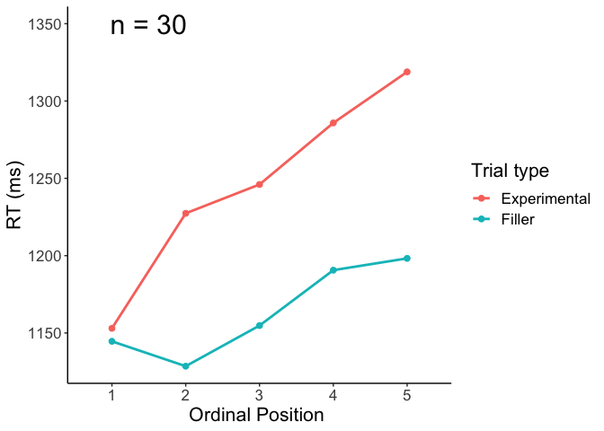
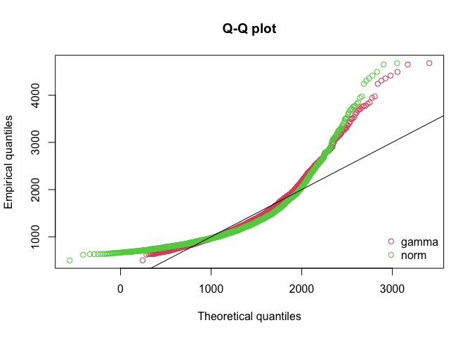

05 CSI online typing: Plotting and analysis
================
Kirsten Stark
01 November, 2021

## Load packages

``` r
library(dplyr)
```

    ## 
    ## Attaching package: 'dplyr'

    ## The following objects are masked from 'package:stats':
    ## 
    ##     filter, lag

    ## The following objects are masked from 'package:base':
    ## 
    ##     intersect, setdiff, setequal, union

``` r
library(tidyr)
library(lme4)
```

    ## Loading required package: Matrix

    ## 
    ## Attaching package: 'Matrix'

    ## The following objects are masked from 'package:tidyr':
    ## 
    ##     expand, pack, unpack

``` r
#library(lmerTest)
library(Rmisc)
```

    ## Loading required package: lattice

    ## Loading required package: plyr

    ## ------------------------------------------------------------------------------

    ## You have loaded plyr after dplyr - this is likely to cause problems.
    ## If you need functions from both plyr and dplyr, please load plyr first, then dplyr:
    ## library(plyr); library(dplyr)

    ## ------------------------------------------------------------------------------

    ## 
    ## Attaching package: 'plyr'

    ## The following objects are masked from 'package:dplyr':
    ## 
    ##     arrange, count, desc, failwith, id, mutate, rename, summarise,
    ##     summarize

``` r
library(Cairo)
#library(strengejacke)
library(ggplot2)
library(sjPlot)

options(scipen=999)

rm(list = ls())
options( "encoding" = "UTF-8" )
set.seed(99)
```

## Load and preprocess data

``` r
# input 
#input = "data_long_final.csv"
input = "data_long_anonymous.csv"
classification_type = "automatic" # select "manual" or "automatic"

# load data
df <- read.csv(here::here("data", input))
```

Check amount of participants and trials

``` r
# no. of participants: 
length(unique(df$subject))
```

    ## [1] 30

``` r
# no. of trials is 160 per participant? 
nrow(df) == 160 * length(unique(df$subject))
```

    ## [1] TRUE

Factorize columns

``` r
# factorize columns
is.numeric(df$timing.01)
```

    ## [1] TRUE

``` r
df$PosOr <- as.factor(df$PosOr)
df$subject <- as.factor(df$subject)
```

# Select correct classification column

``` r
if(classification_type == "automatic") {
  df$answercode <- df$answer_auto_jaro
  df$correct <- df$correct_auto_jaro
} else if(classification_type == "manual") {
  df$answercode <- df$answercode
  df$correct <- df$correct_manual
} else {
  print("Select a correct type!")
}
```

``` r
as.data.frame(table(df$correct, df$answercode)) %>% filter(Freq != 0) 
```

    ##    Var1                  Var2 Freq
    ## 1     1 alternative_corrected  302
    ## 2     1    approx_alternative   24
    ## 3     1        approx_correct  133
    ## 4     0 backspace_space_enter   25
    ## 5     1               correct 3519
    ## 6     1    correctedtocorrect  301
    ## 7     0  distance_based_error   12
    ## 8     0    first_letter_error  231
    ## 9     0                  isna  153
    ## 10    0           not_correct   90
    ## 11    0           shift_start   10

``` r
as.data.frame(table(df$correct, df$answercode)) %>% filter(Freq != 0) %>% 
  mutate(Percentage = case_when(Var1 == 1 ~ Freq/sum(df$correct == 1),
                                Var1 == 0 ~ Freq/sum(df$correct == 0)))
```

    ##    Var1                  Var2 Freq  Percentage
    ## 1     1 alternative_corrected  302 0.070577238
    ## 2     1    approx_alternative   24 0.005608787
    ## 3     1        approx_correct  133 0.031082029
    ## 4     0 backspace_space_enter   25 0.047984645
    ## 5     1               correct 3519 0.822388409
    ## 6     1    correctedtocorrect  301 0.070343538
    ## 7     0  distance_based_error   12 0.023032630
    ## 8     0    first_letter_error  231 0.443378119
    ## 9     0                  isna  153 0.293666027
    ## 10    0           not_correct   90 0.172744722
    ## 11    0           shift_start   10 0.019193858

``` r
# raw
table(df$correct)
```

    ## 
    ##    0    1 
    ##  521 4279

``` r
# in percent
round(table(df$correct)/nrow(df)*100,2)
```

    ## 
    ##     0     1 
    ## 10.85 89.15

``` r
## How many correct/incorrect non-filler trials?
table(df$correct[df$category != "Filler"])
```

    ## 
    ##    0    1 
    ##  422 3178

Show amount of incorrect trials per ordinal position (excluding
fillers):

``` r
## How many correct/incorrect non-filler trials per ordinal position?
table(df$PosOr[df$category != "Filler" & df$correct == 0], 
      df$correct[df$category != "Filler" & df$correct == 0])
```

    ##    
    ##      0
    ##   1 75
    ##   2 87
    ##   3 82
    ##   4 83
    ##   5 95

Mean and SD by participant:

``` r
# error sum including fillers: 
df <- df %>% 
    mutate(error_sum = (correct-1)*(-1))
correctness_by_ppt <- summarySE(df, measurevar="error_sum", groupvars="subject")$error_sum
print("Mean:"); round(mean(correctness_by_ppt)*100,2)
```

    ## [1] "Mean:"

    ## [1] 10.85

``` r
print("Subject:"); round(sd(correctness_by_ppt)*100,2)
```

    ## [1] "Subject:"

    ## [1] 4.73

Drop incorrect trials:

``` r
df <- df %>% filter(df$correct == 1)
```

# Plotting

Make plots suitable for APA format, font sizes can be adjusted

``` r
apatheme <- theme_bw()+
  theme(plot.title=element_text(family="Arial",size=22,hjust = .5),
        panel.grid.major=element_blank(), panel.grid.minor=element_blank(),
        panel.border=element_blank(),axis.line=element_line(),
        text=element_text(family="Arial",size=16))
```

### Descriptives

``` r
(means_final<- df %>% 
   filter(category != "Filler") %>% 
   Rmisc::summarySEwithin(.,"timing.01",idvar = "subject",
                          withinvars = "PosOr", na.rm = T))
```

    ##   PosOr   N timing.01       sd       se       ci
    ## 1     1 645  1152.220 444.1659 17.48902 34.34238
    ## 2     2 633  1228.071 553.3236 21.99264 43.18749
    ## 3     3 638  1247.875 525.8232 20.81754 40.87930
    ## 4     4 637  1285.638 593.4891 23.51489 46.17622
    ## 5     5 625  1317.224 562.0187 22.48075 44.14708

``` r
(means_final_cat<- df %>% 
   filter(category != "Filler") %>% 
   Rmisc::summarySEwithin(.,"timing.01",idvar = "category",
                          withinvars = "PosOr", na.rm = T))
```

    ##   PosOr   N timing.01       sd       se       ci
    ## 1     1 645  1150.122 453.7537 17.86654 35.08370
    ## 2     2 633  1231.018 544.5825 21.64521 42.50524
    ## 3     3 638  1243.083 505.9424 20.03045 39.33370
    ## 4     4 637  1286.604 573.9345 22.74011 44.65478
    ## 5     5 625  1320.310 562.7194 22.50878 44.20213

``` r
# Export as word file
library(flextable)
huxt_word <- huxtable::huxtable(means_final)
huxt_word <- huxtable::set_number_format(huxt_word, round(2))
huxtable::quick_docx(huxt_word, 
                     file = here::here("results", "tables",
                                       "CSI_online_typing_RT_summary.docx"), 
                                       open = FALSE)
```

### RTs by ordinal position

Line graph (only correct trials, without fillers)

``` r
(plot_rt <- means_final %>%
    ggplot(., aes(x=PosOr, y=timing.01)) +
    geom_point(size = 2)+
    stat_summary(fun=mean,  geom="line", size = 0.5, group = 1,
                 linetype = "dashed") +
    geom_errorbar(aes(ymin=timing.01-se, ymax=timing.01+se), width =.1) +
    apatheme+
    scale_y_continuous(limits = c(1120, 1340), breaks =seq(1120,1340, by = 20)) +
                       #breaks = c(1100, 1150, 1200, 1250, 1300, 1350)) +
    labs(x="Ordinal Position ",y ="RT (ms)") + #+
  # annotate(geom="text", x=1.5, y=1330, label="n = 30",
  #         color="black", size = 8))
    theme(
    axis.title.y = element_text(margin = margin(0,10,0,0)),
    axis.title.x = element_text(margin = margin(10,0,0,0))))
```

<!-- -->

``` r
filename <- "CSI_online_typing_plot_rt.pdf"
ggsave(plot_rt, filename =
         here::here("results", "figures", filename),
       width = 18, height = 13, units = "cm",
       dpi = 300, device = cairo_pdf)
embedFonts(file = here::here("results", "figures", filename))
```

Normalized boxplot

``` r
means_subject <- df %>%
   filter(category != "Filler") %>%
   summarySEwithin(.,"timing.01",withinvars = c("subject","PosOr"))
(means_subject <- means_subject %>%
  group_by(subject) %>%
  dplyr::mutate(timing.01_norm = timing.01 - first(timing.01)))
```

    ## # A tibble: 150 x 8
    ## # Groups:   subject [30]
    ##    subject PosOr     N timing.01    sd    se    ci timing.01_norm
    ##    <fct>   <fct> <dbl>     <dbl> <dbl> <dbl> <dbl>          <dbl>
    ##  1 1       1        24     1127.  250.  51.1  106.            0  
    ##  2 1       2        22     1269.  325.  69.3  144.          142. 
    ##  3 1       3        22     1240.  277.  59.1  123.          113. 
    ##  4 1       4        24     1348.  491. 100.   207.          221. 
    ##  5 1       5        24     1526.  586. 120.   247.          399. 
    ##  6 2       1        23     1030   332.  69.2  144.            0  
    ##  7 2       2        22     1073.  478. 102.   212.           42.5
    ##  8 2       3        23     1087.  470.  97.9  203.           56.7
    ##  9 2       4        21     1098.  538. 117.   245.           68.3
    ## 10 2       5        24      962.  260.  53.0  110.          -68.1
    ## # … with 140 more rows

``` r
(boxplot <-
  ggplot() +

  ## boxplot
  geom_boxplot(data=means_subject, aes(x = PosOr,y =timing.01_norm),
               colour = "grey", width = 0.3,fatten = 1)+
  ### individual means
  geom_jitter(data=means_subject, aes(x = PosOr,y =timing.01_norm),
              position = position_dodge(0.6),
              shape=19,color = "dark grey", size=2)+
  ### group means
  stat_summary(data=means_subject, aes(x = PosOr,y =timing.01_norm),
               fun=mean, geom="point",colour = "black", shape=18, size=5)+
  ### line
  stat_summary(data=means_subject, aes(x = PosOr,y =timing.01_norm),
               fun=mean, geom="line",colour = "black", linetype = "longdash", group = 1)+

  ## other stuff
  #scale_y_continuous(breaks = seq(600, 1300, by = 50))+
  labs(x="Ordinal Position",y ="Normalized RTs (ms)")+
  apatheme +
  theme(
    axis.title.y = element_text(margin = margin(0,10,0,0)),
    axis.title.x = element_text(margin = margin(10,0,0,0))) +
  coord_equal(ratio = 1/100))
```

<!-- -->

``` r
filename <- "CSI_online_typing_boxplot.pdf"
ggsave(boxplot, filename =
         here::here("results", "figures", filename),
       width = 13, height = 18, units = "cm",
       dpi = 300, device = cairo_pdf)
embedFonts(file = here::here("results", "figures", filename))
```

### Export plot grid

``` r
# cowplot::plot_grid(plot_rt, boxplot,
#           nrow = 1, labels = c("A", "B")) %>%
#   ggsave(filename = here::here("results", "figures",
#                                "CSI_online_typing_RTs_and_normalized_RTs"),
#          width = 18, height = 13, units = "cm", dpi = 300,
#          device = cairo_pdf)
# #embedFonts(file = here::here("results", "figures", "CSI_online_typing_RTs_and_normalized_RTs"))
```

### … with fillers for control

``` r
(plot_rt_fillers <- df %>%
    mutate(kind = case_when(category == "Filler" ~"Filler",
                          category != "Filler" ~"Experimental")) %>%
    ggplot(., aes(x=PosOr, y=timing.01, group=kind, color=kind)) +
    stat_summary(fun=mean,  geom="point", size = 2)+
    stat_summary(fun=mean,  geom="line", size = 1) +
    apatheme+
    labs(x="Ordinal Position ",y ="RT (ms)", color = "Trial type")+
  annotate(geom="text", x=1.5, y=1350, label="n = 30",
           color="black", size = 8))
```

<!-- -->

``` r
filename <- "CSI_online_typing_plot_rt_with_fillers.pdf"
ggsave(plot_rt_fillers, filename =
         here::here("results", "figures", filename),
       width = 18, height = 13, units = "cm",
       dpi = 300, device = cairo_pdf)
embedFonts(file = here::here("results", "figures", filename))
```

### Plot by subcategory

See nicer plot below

``` r
# (plot_rt_by_cat <- df %>%  
#    filter(category != "Filler") %>% 
#     ggplot(., aes(x=PosOr, y=timing.01)) +
#     stat_summary(fun=mean,  geom="point", size = 2)+
#     stat_summary(fun=mean,  geom="line", size = 1) +
#     facet_wrap(~category) +
#     apatheme+
#     labs(x="Ordinal Position ",y ="RT (ms)"))
# 
# filename <- "CSI_online_typing_plot_rt_by_category.pdf"
# ggsave(plot_rt_by_cat, filename = 
#          here::here("results", "figures", filename),
#        width = 18, height = 19, units = "cm", 
#        dpi = 300, device = cairo_pdf)
# embedFonts(file = here::here("results", "figures", filename))
```

### Plot by subject

See nicer plot below

``` r
# (plot_rt_by_subject <- df %>% 
#    filter(category != "Filler") %>% 
#     ggplot(., aes(x=PosOr, y=timing.01)) +
#     stat_summary(fun=mean,  geom="point", size = 2) +  
#     stat_summary(fun=mean,  geom="line", size = 1) +  
#     facet_wrap(~subject) +
#     apatheme+
#     labs(x="Ordinal Position ",y ="RT (ms)"))
# 
# filename <- "CSI_online_typing_plot_rt_by_subject.pdf"
# ggsave(plot_rt_by_subject, filename = 
#          here::here("results", "figures", filename),
#        width = 18, height = 19, units = "cm", 
#        dpi = 300, device = cairo_pdf)
# embedFonts(file = here::here("results", "figures", filename))
```

### Control: Plot RTs accross the experiment

All trials correct trials

``` r
(plot_RTs_all <- ggplot(data=df, aes(x=trial, y=timing.01)) +
  stat_summary(fun=mean,  geom="point", size = 2)+
  stat_summary(fun=mean,  geom="line", size = 1) +
  apatheme+
  labs(x="Trial ",y ="RT (ms)")+
  annotate(geom="text", x=20, y=1570, label="n = 30",
           color="black", size = 8))
```

<!-- -->

``` r
filename <- "CSI_online_typing_plot_rts_across_experiment.pdf"
ggsave(plot_RTs_all, filename =
         here::here("results", "figures", filename),
       width = 18, height = 13, units = "cm",
       dpi = 300, device = cairo_pdf)
embedFonts(file = here::here("results", "figures", filename))
```

Correct non-filler trials only:

``` r
(plot_RTs_correct <- df %>%
   filter(category != "Filler") %>%
    ggplot(., aes(x=trial, y=timing.01)) +
    stat_summary(fun=mean,  geom="point", size = 2)+
    stat_summary(fun=mean,  geom="line", size = 1) +
    apatheme+
    labs(x="Trial ",y ="RT ms")+
    annotate(geom="text", x=20, y=1570, label="n = 30",
             color="black", size = 8))
```

<!-- -->

``` r
filename <- "CSI_online_typing_plot_rts_across_experiment_correct_experimental_trials.pdf"
ggsave(plot_RTs_correct, filename =
         here::here("results", "figures", filename),
       width = 18, height = 13, units = "cm",
       dpi = 300, device = cairo_pdf)
embedFonts(file = here::here("results", "figures", filename))
```

# Check distribution of data

Are the data normally distributed or does a gamma distribution fit the
data better?  
*Subset data to correct trials only and exclude fillers*

``` r
df_valid <- df %>% filter(category != "Filler") %>% 
  filter(correct == 1) %>% droplevels()
```

*Center predictor variable*

``` r
df_valid$PosOr.cont <- scale(as.numeric(as.character(df_valid$PosOr)),
                                        center = T, scale = F)
# table(df_valid$PosOr.cont)
# mean(df_valid$PosOr.cont)
```

*Histogram of the reaction time data*

``` r
hist(df_valid$timing.01)
```

<!-- -->

*Check fit of normal vs gamma distribution in histograms, q-q-plots and
using objective criteria:*  
1\) Fit normal and gamma distributions to the reaction time data

``` r
library(fitdistrplus)
```

    ## Loading required package: MASS

    ## 
    ## Attaching package: 'MASS'

    ## The following object is masked from 'package:dplyr':
    ## 
    ##     select

    ## Loading required package: survival

``` r
fit.normal<- fitdist(df_valid$timing.01, distr = "norm", method = "mle")
summary(fit.normal)
```

    ## Fitting of the distribution ' norm ' by maximum likelihood 
    ## Parameters : 
    ##       estimate Std. Error
    ## mean 1245.7240   8.896466
    ## sd    501.5297   6.290638
    ## Loglikelihood:  -24269.12   AIC:  48542.24   BIC:  48554.37 
    ## Correlation matrix:
    ##      mean sd
    ## mean    1  0
    ## sd      0  1

``` r
#plot(fit.normal)
```

``` r
fit.gamma <- fitdist(df_valid$timing.01, distr = "gamma", method = "mle")
summary(fit.gamma)
```

    ## Fitting of the distribution ' gamma ' by maximum likelihood 
    ## Parameters : 
    ##          estimate   Std. Error
    ## shape 8.393507247 0.1690773662
    ## rate  0.006738114 0.0001367073
    ## Loglikelihood:  -23650.2   AIC:  47304.39   BIC:  47316.52 
    ## Correlation matrix:
    ##           shape      rate
    ## shape 1.0000000 0.9555099
    ## rate  0.9555099 1.0000000

``` r
#plot(fit.gamma)
```

2)  Compare the fit of the two distributions  
    Visually compare fit of both distributions in histogram

<!-- end list -->

``` r
denscomp(list(fit.gamma, fit.normal))
```

<!-- -->

Visually compare fit of both distributions in Q-Q-plots

``` r
qqcomp(list(fit.gamma, fit.normal))
```

<!-- -->

Compare information criteria

``` r
gofstat(list(fit.gamma, fit.normal),
        fitnames = c("Gamma", "Normal"))
```

    ## Goodness-of-fit statistics
    ##                                  Gamma      Normal
    ## Kolmogorov-Smirnov statistic  0.096902   0.1443542
    ## Cramer-von Mises statistic   11.704816  27.3854717
    ## Anderson-Darling statistic   70.527683 158.4631104
    ## 
    ## Goodness-of-fit criteria
    ##                                   Gamma   Normal
    ## Akaike's Information Criterion 47304.39 48542.24
    ## Bayesian Information Criterion 47316.52 48554.37

**Conclusion:** Both the visual inspection and the objective criteria
suggest that a gamma distribution fits the data better (although not
that well). Therefore, we fit a Gamma distribution in a GLMM with the
continuous predictor ordinal position (Pos.cont), the factorial
predictor (experiment), and their interaction. We compute the maximal
random effects structure.

# Inferential analyses: GLMM (Gamma distribution) with ordinal position as a continuous predictor

``` r
m1 <- glmer(timing.01 ~ PosOr.cont + 
               (PosOr.cont|subject) +(PosOr.cont|category),
             data = df_valid, 
            family =Gamma(link ="identity"), 
            control=glmerControl(optimizer = "bobyqa"))
summary(m1)
```

    ## Generalized linear mixed model fit by maximum likelihood (Laplace
    ##   Approximation) [glmerMod]
    ##  Family: Gamma  ( identity )
    ## Formula: timing.01 ~ PosOr.cont + (PosOr.cont | subject) + (PosOr.cont |  
    ##     category)
    ##    Data: df_valid
    ## Control: glmerControl(optimizer = "bobyqa")
    ## 
    ##      AIC      BIC   logLik deviance df.resid 
    ##  46561.2  46615.7 -23271.6  46543.2     3169 
    ## 
    ## Scaled residuals: 
    ##     Min      1Q  Median      3Q     Max 
    ## -1.5333 -0.5849 -0.2585  0.2562  8.4387 
    ## 
    ## Random effects:
    ##  Groups   Name        Variance  Std.Dev. Corr 
    ##  subject  (Intercept) 8171.0578  90.3939      
    ##           PosOr.cont   661.5039  25.7197 -0.02
    ##  category (Intercept) 9999.1073  99.9955      
    ##           PosOr.cont   491.0824  22.1604 0.22 
    ##  Residual                0.1286   0.3586      
    ## Number of obs: 3178, groups:  subject, 30; category, 24
    ## 
    ## Fixed effects:
    ##             Estimate Std. Error t value             Pr(>|z|)    
    ## (Intercept) 1298.489     11.434 113.561 < 0.0000000000000002 ***
    ## PosOr.cont    41.678      6.829   6.103        0.00000000104 ***
    ## ---
    ## Signif. codes:  0 '***' 0.001 '**' 0.01 '*' 0.05 '.' 0.1 ' ' 1
    ## 
    ## Correlation of Fixed Effects:
    ##            (Intr)
    ## PosOr.cont -0.072

``` r
# save model output
tab_model(m1,transform = NULL,
          show.re.var = T, show.stat = T,show.r2 = F,show.icc = F,
          title = "GLMM (Gamma distribution) with continuous predictor",
          pred.labels = c("(Intercept)", "Ordinal Position"),
          dv.labels = "Typing Onset Latency",
          #string.pred = "",
          string.stat = "t-Value",
          file = here::here("results", "tables", "CSI_online_typing_glmm_cont.html"))
```

<table style="border-collapse:collapse; border:none;">

<caption style="font-weight: bold; text-align:left;">

GLMM (Gamma distribution) with continuous predictor

</caption>

<tr>

<th style="border-top: double; text-align:center; font-style:normal; font-weight:bold; padding:0.2cm;  text-align:left; ">

 

</th>

<th colspan="4" style="border-top: double; text-align:center; font-style:normal; font-weight:bold; padding:0.2cm; ">

Typing Onset Latency

</th>

</tr>

<tr>

<td style=" text-align:center; border-bottom:1px solid; font-style:italic; font-weight:normal;  text-align:left; ">

Predictors

</td>

<td style=" text-align:center; border-bottom:1px solid; font-style:italic; font-weight:normal;  ">

Estimates

</td>

<td style=" text-align:center; border-bottom:1px solid; font-style:italic; font-weight:normal;  ">

CI

</td>

<td style=" text-align:center; border-bottom:1px solid; font-style:italic; font-weight:normal;  ">

t-Value

</td>

<td style=" text-align:center; border-bottom:1px solid; font-style:italic; font-weight:normal;  ">

p

</td>

</tr>

<tr>

<td style=" padding:0.2cm; text-align:left; vertical-align:top; text-align:left; ">

(Intercept)

</td>

<td style=" padding:0.2cm; text-align:left; vertical-align:top; text-align:center;  ">

1298.49

</td>

<td style=" padding:0.2cm; text-align:left; vertical-align:top; text-align:center;  ">

1276.08 – 1320.90

</td>

<td style=" padding:0.2cm; text-align:left; vertical-align:top; text-align:center;  ">

113.56

</td>

<td style=" padding:0.2cm; text-align:left; vertical-align:top; text-align:center;  ">

<strong>\<0.001

</td>

</tr>

<tr>

<td style=" padding:0.2cm; text-align:left; vertical-align:top; text-align:left; ">

Ordinal Position

</td>

<td style=" padding:0.2cm; text-align:left; vertical-align:top; text-align:center;  ">

41.68

</td>

<td style=" padding:0.2cm; text-align:left; vertical-align:top; text-align:center;  ">

28.29 – 55.06

</td>

<td style=" padding:0.2cm; text-align:left; vertical-align:top; text-align:center;  ">

6.10

</td>

<td style=" padding:0.2cm; text-align:left; vertical-align:top; text-align:center;  ">

<strong>\<0.001

</td>

</tr>

<tr>

<td colspan="5" style="font-weight:bold; text-align:left; padding-top:.8em;">

Random Effects

</td>

</tr>

<tr>

<td style=" padding:0.2cm; text-align:left; vertical-align:top; text-align:left; padding-top:0.1cm; padding-bottom:0.1cm;">

σ<sup>2</sup>

</td>

<td style=" padding:0.2cm; text-align:left; vertical-align:top; padding-top:0.1cm; padding-bottom:0.1cm; text-align:left;" colspan="4">

0.13

</td>

<tr>

<td style=" padding:0.2cm; text-align:left; vertical-align:top; text-align:left; padding-top:0.1cm; padding-bottom:0.1cm;">

τ<sub>00</sub> <sub>subject</sub>

</td>

<td style=" padding:0.2cm; text-align:left; vertical-align:top; padding-top:0.1cm; padding-bottom:0.1cm; text-align:left;" colspan="4">

8171.06

</td>

<tr>

<td style=" padding:0.2cm; text-align:left; vertical-align:top; text-align:left; padding-top:0.1cm; padding-bottom:0.1cm;">

τ<sub>00</sub> <sub>category</sub>

</td>

<td style=" padding:0.2cm; text-align:left; vertical-align:top; padding-top:0.1cm; padding-bottom:0.1cm; text-align:left;" colspan="4">

9999.11

</td>

<tr>

<td style=" padding:0.2cm; text-align:left; vertical-align:top; text-align:left; padding-top:0.1cm; padding-bottom:0.1cm;">

τ<sub>11</sub> <sub>subject.PosOr.cont</sub>

</td>

<td style=" padding:0.2cm; text-align:left; vertical-align:top; padding-top:0.1cm; padding-bottom:0.1cm; text-align:left;" colspan="4">

661.50

</td>

<tr>

<td style=" padding:0.2cm; text-align:left; vertical-align:top; text-align:left; padding-top:0.1cm; padding-bottom:0.1cm;">

τ<sub>11</sub> <sub>category.PosOr.cont</sub>

</td>

<td style=" padding:0.2cm; text-align:left; vertical-align:top; padding-top:0.1cm; padding-bottom:0.1cm; text-align:left;" colspan="4">

491.08

</td>

<tr>

<td style=" padding:0.2cm; text-align:left; vertical-align:top; text-align:left; padding-top:0.1cm; padding-bottom:0.1cm;">

ρ<sub>01</sub> <sub>subject</sub>

</td>

<td style=" padding:0.2cm; text-align:left; vertical-align:top; padding-top:0.1cm; padding-bottom:0.1cm; text-align:left;" colspan="4">

\-0.02

</td>

<tr>

<td style=" padding:0.2cm; text-align:left; vertical-align:top; text-align:left; padding-top:0.1cm; padding-bottom:0.1cm;">

ρ<sub>01</sub> <sub>category</sub>

</td>

<td style=" padding:0.2cm; text-align:left; vertical-align:top; padding-top:0.1cm; padding-bottom:0.1cm; text-align:left;" colspan="4">

0.22

</td>

<tr>

<td style=" padding:0.2cm; text-align:left; vertical-align:top; text-align:left; padding-top:0.1cm; padding-bottom:0.1cm;">

N <sub>subject</sub>

</td>

<td style=" padding:0.2cm; text-align:left; vertical-align:top; padding-top:0.1cm; padding-bottom:0.1cm; text-align:left;" colspan="4">

30

</td>

<tr>

<td style=" padding:0.2cm; text-align:left; vertical-align:top; text-align:left; padding-top:0.1cm; padding-bottom:0.1cm;">

N <sub>category</sub>

</td>

<td style=" padding:0.2cm; text-align:left; vertical-align:top; padding-top:0.1cm; padding-bottom:0.1cm; text-align:left;" colspan="4">

24

</td>

<tr>

<td style=" padding:0.2cm; text-align:left; vertical-align:top; text-align:left; padding-top:0.1cm; padding-bottom:0.1cm; border-top:1px solid;">

Observations

</td>

<td style=" padding:0.2cm; text-align:left; vertical-align:top; padding-top:0.1cm; padding-bottom:0.1cm; text-align:left; border-top:1px solid;" colspan="4">

3178

</td>

</tr>

</table>

Just for control reasosns: Additionally, as the p-value based on the
Wald-Z statistic is only partly reliable, we estimate the significance
using likelikood ratio tests

``` r
# Step 1: Compute a reduced model without the fixed predictor variable PosOr.cont,
#         the random effects structure being kept identical
m1_red <- glmer(timing.01 ~ 1 + 
               (PosOr.cont|subject) +(PosOr.cont|category),
             data = df_valid, 
            family =Gamma(link ="identity"), 
            control=glmerControl(optimizer = "bobyqa"))
summary(m1_red)
```

    ## Generalized linear mixed model fit by maximum likelihood (Laplace
    ##   Approximation) [glmerMod]
    ##  Family: Gamma  ( identity )
    ## Formula: timing.01 ~ 1 + (PosOr.cont | subject) + (PosOr.cont | category)
    ##    Data: df_valid
    ## Control: glmerControl(optimizer = "bobyqa")
    ## 
    ##      AIC      BIC   logLik deviance df.resid 
    ##  46570.1  46618.6 -23277.1  46554.1     3170 
    ## 
    ## Scaled residuals: 
    ##     Min      1Q  Median      3Q     Max 
    ## -1.5179 -0.5830 -0.2562  0.2474  8.4759 
    ## 
    ## Random effects:
    ##  Groups   Name        Variance  Std.Dev. Corr 
    ##  subject  (Intercept) 8213.3914 90.6278       
    ##           PosOr.cont  1008.0384 31.7496  -0.10
    ##  category (Intercept) 9887.8670 99.4378       
    ##           PosOr.cont   870.4076 29.5027  0.09 
    ##  Residual                0.1289  0.3591       
    ## Number of obs: 3178, groups:  subject, 30; category, 24
    ## 
    ## Fixed effects:
    ##             Estimate Std. Error t value            Pr(>|z|)    
    ## (Intercept) 1300.769      8.869   146.7 <0.0000000000000002 ***
    ## ---
    ## Signif. codes:  0 '***' 0.001 '**' 0.01 '*' 0.05 '.' 0.1 ' ' 1

``` r
(tab <- tab_model(m1_red,transform = NULL,
          show.re.var = F, show.stat = T,show.r2 = F,show.icc = F,
          title = "GLMM (Gamma distribution) with continuous predictor",
          pred.labels = c("(Intercept)"),
          dv.labels = "Typing Onset Latency",
          #string.pred = "",
          string.stat = "t-Value"))
```

<table style="border-collapse:collapse; border:none;">

<caption style="font-weight: bold; text-align:left;">

GLMM (Gamma distribution) with continuous predictor

</caption>

<tr>

<th style="border-top: double; text-align:center; font-style:normal; font-weight:bold; padding:0.2cm;  text-align:left; ">

 

</th>

<th colspan="4" style="border-top: double; text-align:center; font-style:normal; font-weight:bold; padding:0.2cm; ">

Typing Onset Latency

</th>

</tr>

<tr>

<td style=" text-align:center; border-bottom:1px solid; font-style:italic; font-weight:normal;  text-align:left; ">

Predictors

</td>

<td style=" text-align:center; border-bottom:1px solid; font-style:italic; font-weight:normal;  ">

Estimates

</td>

<td style=" text-align:center; border-bottom:1px solid; font-style:italic; font-weight:normal;  ">

CI

</td>

<td style=" text-align:center; border-bottom:1px solid; font-style:italic; font-weight:normal;  ">

t-Value

</td>

<td style=" text-align:center; border-bottom:1px solid; font-style:italic; font-weight:normal;  ">

p

</td>

</tr>

<tr>

<td style=" padding:0.2cm; text-align:left; vertical-align:top; text-align:left; ">

(Intercept)

</td>

<td style=" padding:0.2cm; text-align:left; vertical-align:top; text-align:center;  ">

1300.77

</td>

<td style=" padding:0.2cm; text-align:left; vertical-align:top; text-align:center;  ">

1283.39 – 1318.15

</td>

<td style=" padding:0.2cm; text-align:left; vertical-align:top; text-align:center;  ">

146.67

</td>

<td style=" padding:0.2cm; text-align:left; vertical-align:top; text-align:center;  ">

<strong>\<0.001

</td>

</tr>

<tr>

<td style=" padding:0.2cm; text-align:left; vertical-align:top; text-align:left; padding-top:0.1cm; padding-bottom:0.1cm;">

N <sub>subject</sub>

</td>

<td style=" padding:0.2cm; text-align:left; vertical-align:top; padding-top:0.1cm; padding-bottom:0.1cm; text-align:left;" colspan="4">

30

</td>

<tr>

<td style=" padding:0.2cm; text-align:left; vertical-align:top; text-align:left; padding-top:0.1cm; padding-bottom:0.1cm;">

N <sub>category</sub>

</td>

<td style=" padding:0.2cm; text-align:left; vertical-align:top; padding-top:0.1cm; padding-bottom:0.1cm; text-align:left;" colspan="4">

24

</td>

<tr>

<td style=" padding:0.2cm; text-align:left; vertical-align:top; text-align:left; padding-top:0.1cm; padding-bottom:0.1cm; border-top:1px solid;">

Observations

</td>

<td style=" padding:0.2cm; text-align:left; vertical-align:top; padding-top:0.1cm; padding-bottom:0.1cm; text-align:left; border-top:1px solid;" colspan="4">

3178

</td>

</tr>

</table>

``` r
# Step 2: Compare the two models using LRT based on the Chi^2 statistic
anova(m1, m1_red)
```

    ## Data: df_valid
    ## Models:
    ## m1_red: timing.01 ~ 1 + (PosOr.cont | subject) + (PosOr.cont | category)
    ## m1: timing.01 ~ PosOr.cont + (PosOr.cont | subject) + (PosOr.cont | 
    ## m1:     category)
    ##        npar   AIC   BIC logLik deviance  Chisq Df Pr(>Chisq)    
    ## m1_red    8 46570 46619 -23277    46554                         
    ## m1        9 46561 46616 -23272    46543 10.978  1  0.0009218 ***
    ## ---
    ## Signif. codes:  0 '***' 0.001 '**' 0.01 '*' 0.05 '.' 0.1 ' ' 1

# ———————————————

# Exploratory analyses: Error rates per ordinal position

Get errors by ordinal position:

``` r
df_full <- read.csv(here::here("data", input))
df_errors <- df_full %>% filter(category != "Filler")
df_errors <- df_errors %>% 
  mutate(error_sum = (correct_auto_jaro-1)*(-1))
(means_error_subject <- df_errors %>% 
   summarySEwithin(.,"error_sum",withinvars = c("PosOr"), idvar="subject"))
```

    ## Automatically converting the following non-factors to factors: PosOr

    ##   PosOr   N error_sum        sd         se         ci
    ## 1     1 720 0.1041667 0.3344948 0.01246589 0.02447389
    ## 2     2 720 0.1208333 0.3628653 0.01352319 0.02654966
    ## 3     3 720 0.1138889 0.3503972 0.01305853 0.02563741
    ## 4     4 720 0.1152778 0.3518543 0.01311284 0.02574402
    ## 5     5 720 0.1319444 0.3722542 0.01387309 0.02723661

``` r
summarySE( df_errors, "error_sum")
```

    ##    .id    N error_sum        sd         se         ci
    ## 1 <NA> 3600 0.1172222 0.3217296 0.00536216 0.01051318

Mean and SD per subject:

``` r
# error sum including fillers: 
df_full <- df_full %>% 
    mutate(error_sum = (correct_auto_jaro-1)*(-1))
correctness_by_ppt <- summarySE(df_full, measurevar="error_sum", groupvars="subject")$error_sum
print("Mean:"); round(mean(correctness_by_ppt)*100,2)
```

    ## [1] "Mean:"

    ## [1] 10.85

``` r
print("Subject:"); round(sd(correctness_by_ppt)*100,2)
```

    ## [1] "Subject:"

    ## [1] 4.73

By ordinal position

``` r
correctness_by_ppt_and_ord_pos <- 
  summarySE(df_full[df_full$category != "Filler",],
            measurevar="error_sum",groupvars=c("subject","PosOr")) %>%
  dplyr::select(c("subject", "PosOr", "error_sum")) %>% 
  mutate(error_sum = error_sum*100)
(means_errors_final <- summarySEwithin(correctness_by_ppt_and_ord_pos, 
                      measurevar="error_sum", withinvars = "PosOr",
                      idvar="subject") %>% 
    mutate(error_sum = round(error_sum,2)) %>%
    mutate(sd = round(sd,2)))
```

    ## Automatically converting the following non-factors to factors: PosOr

    ##   PosOr  N error_sum   sd       se       ci
    ## 1     1 30     10.42 7.32 1.336176 2.732788
    ## 2     2 30     12.08 6.40 1.168037 2.388904
    ## 3     3 30     11.39 7.39 1.348749 2.758502
    ## 4     4 30     11.53 6.92 1.264036 2.585244
    ## 5     5 30     13.19 9.71 1.772661 3.625499

Plotting

``` r
(plot <- ggplot(data=means_error_subject, aes(x=PosOr, y=error_sum)) +
  geom_point( size = 2)+
  geom_errorbar(aes(ymin=error_sum-se, ymax=error_sum+se), width =.1) +
  stat_summary(fun=mean,  geom="line", size = 0.5, group = 1, linetype = "dashed") +
  apatheme+
  scale_y_continuous(breaks = seq(0.06, 0.14, by = 0.02), limits = c(0.055, 0.15))+
  labs(x="Ordinal Position ",y ="Percentage of errors"))
```

<!-- -->

``` r
filename <- "CSI_online_typing_errors.pdf"
ggsave(plot, filename =
         here::here("results", "figures", filename),
       width = 18, height = 13, units = "cm",
       dpi = 300, device = cairo_pdf)
embedFonts(file = here::here("results", "figures", filename))
```

Analyse whether amount of errors differs between ordinal positions

``` r
# center ordinal position
df_errors$PosOr.cont <- scale(as.numeric(as.character(df_errors$PosOr)), 
                     center = T, scale = F)

# m1_error <- glmer(error_sum ~ PosOr.cont + 
#                     (PosOr.cont|subject) +(PosOr.cont|category) ,
#                   data =df_errors, family = "binomial",
#                   control=glmerControl(optimizer = "bobyqa"))
# model has singular fit --> Increase number of iterations
# m1_error <- glmer(error_sum ~ PosOr.cont +
#                     (PosOr.cont|subject) +(PosOr.cont|category) ,
#                   data =df_errors, family = "binomial",
#                   control=glmerControl(optimizer = "bobyqa",
#                                        optCtrl = list(maxfun = 2e5)))
# model still has singular fit --> delete correlation parameters
m1_error <- glmer(error_sum ~ PosOr.cont +
                    (PosOr.cont||subject) +(PosOr.cont||category) ,
                  data =df_errors, family = "binomial",
                  control=glmerControl(optimizer = "bobyqa",
                                       optCtrl = list(maxfun = 2e5)))
summary(m1_error)
```

    ## Generalized linear mixed model fit by maximum likelihood (Laplace
    ##   Approximation) [glmerMod]
    ##  Family: binomial  ( logit )
    ## Formula: error_sum ~ PosOr.cont + (PosOr.cont || subject) + (PosOr.cont ||  
    ##     category)
    ##    Data: df_errors
    ## Control: glmerControl(optimizer = "bobyqa", optCtrl = list(maxfun = 200000))
    ## 
    ##      AIC      BIC   logLik deviance df.resid 
    ##   2493.4   2530.6  -1240.7   2481.4     3594 
    ## 
    ## Scaled residuals: 
    ##     Min      1Q  Median      3Q     Max 
    ## -0.9135 -0.3831 -0.3040 -0.2276  6.0085 
    ## 
    ## Random effects:
    ##  Groups     Name        Variance Std.Dev.
    ##  subject    (Intercept) 0.261649 0.51152 
    ##  subject.1  PosOr.cont  0.024429 0.15630 
    ##  category   (Intercept) 0.324093 0.56929 
    ##  category.1 PosOr.cont  0.001412 0.03758 
    ## Number of obs: 3600, groups:  subject, 30; category, 24
    ## 
    ## Fixed effects:
    ##             Estimate Std. Error z value            Pr(>|z|)    
    ## (Intercept) -2.24942    0.16196 -13.889 <0.0000000000000002 ***
    ## PosOr.cont   0.05119    0.04849   1.056               0.291    
    ## ---
    ## Signif. codes:  0 '***' 0.001 '**' 0.01 '*' 0.05 '.' 0.1 ' ' 1
    ## 
    ## Correlation of Fixed Effects:
    ##            (Intr)
    ## PosOr.cont -0.011

``` r
(tab <- tab_model(m1_error,transform = NULL,
          show.re.var = T, show.stat = T,show.r2 = F,show.icc = F,
          title = "GLMM (Binomial distribution) with continuous predictor",
          pred.labels = c("(Intercept)", "Ordinal position"),
          dv.labels = "Error rate",
          #string.pred = "",
          string.stat = "z-Value"
          ))
```

<table style="border-collapse:collapse; border:none;">

<caption style="font-weight: bold; text-align:left;">

GLMM (Binomial distribution) with continuous predictor

</caption>

<tr>

<th style="border-top: double; text-align:center; font-style:normal; font-weight:bold; padding:0.2cm;  text-align:left; ">

 

</th>

<th colspan="4" style="border-top: double; text-align:center; font-style:normal; font-weight:bold; padding:0.2cm; ">

Error rate

</th>

</tr>

<tr>

<td style=" text-align:center; border-bottom:1px solid; font-style:italic; font-weight:normal;  text-align:left; ">

Predictors

</td>

<td style=" text-align:center; border-bottom:1px solid; font-style:italic; font-weight:normal;  ">

Log-Odds

</td>

<td style=" text-align:center; border-bottom:1px solid; font-style:italic; font-weight:normal;  ">

CI

</td>

<td style=" text-align:center; border-bottom:1px solid; font-style:italic; font-weight:normal;  ">

z-Value

</td>

<td style=" text-align:center; border-bottom:1px solid; font-style:italic; font-weight:normal;  ">

p

</td>

</tr>

<tr>

<td style=" padding:0.2cm; text-align:left; vertical-align:top; text-align:left; ">

(Intercept)

</td>

<td style=" padding:0.2cm; text-align:left; vertical-align:top; text-align:center;  ">

\-2.25

</td>

<td style=" padding:0.2cm; text-align:left; vertical-align:top; text-align:center;  ">

\-2.57 – -1.93

</td>

<td style=" padding:0.2cm; text-align:left; vertical-align:top; text-align:center;  ">

\-13.89

</td>

<td style=" padding:0.2cm; text-align:left; vertical-align:top; text-align:center;  ">

<strong>\<0.001

</td>

</tr>

<tr>

<td style=" padding:0.2cm; text-align:left; vertical-align:top; text-align:left; ">

Ordinal position

</td>

<td style=" padding:0.2cm; text-align:left; vertical-align:top; text-align:center;  ">

0.05

</td>

<td style=" padding:0.2cm; text-align:left; vertical-align:top; text-align:center;  ">

\-0.04 – 0.15

</td>

<td style=" padding:0.2cm; text-align:left; vertical-align:top; text-align:center;  ">

1.06

</td>

<td style=" padding:0.2cm; text-align:left; vertical-align:top; text-align:center;  ">

0.291

</td>

</tr>

<tr>

<td colspan="5" style="font-weight:bold; text-align:left; padding-top:.8em;">

Random Effects

</td>

</tr>

<tr>

<td style=" padding:0.2cm; text-align:left; vertical-align:top; text-align:left; padding-top:0.1cm; padding-bottom:0.1cm;">

σ<sup>2</sup>

</td>

<td style=" padding:0.2cm; text-align:left; vertical-align:top; padding-top:0.1cm; padding-bottom:0.1cm; text-align:left;" colspan="4">

3.29

</td>

<tr>

<td style=" padding:0.2cm; text-align:left; vertical-align:top; text-align:left; padding-top:0.1cm; padding-bottom:0.1cm;">

τ<sub>00</sub> <sub>subject</sub>

</td>

<td style=" padding:0.2cm; text-align:left; vertical-align:top; padding-top:0.1cm; padding-bottom:0.1cm; text-align:left;" colspan="4">

0.26

</td>

<tr>

<td style=" padding:0.2cm; text-align:left; vertical-align:top; text-align:left; padding-top:0.1cm; padding-bottom:0.1cm;">

τ<sub>00</sub> <sub>category</sub>

</td>

<td style=" padding:0.2cm; text-align:left; vertical-align:top; padding-top:0.1cm; padding-bottom:0.1cm; text-align:left;" colspan="4">

0.32

</td>

<tr>

<td style=" padding:0.2cm; text-align:left; vertical-align:top; text-align:left; padding-top:0.1cm; padding-bottom:0.1cm;">

τ<sub>11</sub> <sub>subject.PosOr.cont</sub>

</td>

<td style=" padding:0.2cm; text-align:left; vertical-align:top; padding-top:0.1cm; padding-bottom:0.1cm; text-align:left;" colspan="4">

0.02

</td>

<tr>

<td style=" padding:0.2cm; text-align:left; vertical-align:top; text-align:left; padding-top:0.1cm; padding-bottom:0.1cm;">

τ<sub>11</sub> <sub>category.PosOr.cont</sub>

</td>

<td style=" padding:0.2cm; text-align:left; vertical-align:top; padding-top:0.1cm; padding-bottom:0.1cm; text-align:left;" colspan="4">

0.00

</td>

<tr>

<td style=" padding:0.2cm; text-align:left; vertical-align:top; text-align:left; padding-top:0.1cm; padding-bottom:0.1cm;">

ρ<sub>01</sub>

</td>

<td style=" padding:0.2cm; text-align:left; vertical-align:top; padding-top:0.1cm; padding-bottom:0.1cm; text-align:left;" colspan="4">

 

</td>

<tr>

<td style=" padding:0.2cm; text-align:left; vertical-align:top; text-align:left; padding-top:0.1cm; padding-bottom:0.1cm;">

ρ<sub>01</sub>

</td>

<td style=" padding:0.2cm; text-align:left; vertical-align:top; padding-top:0.1cm; padding-bottom:0.1cm; text-align:left;" colspan="4">

 

</td>

<tr>

<td style=" padding:0.2cm; text-align:left; vertical-align:top; text-align:left; padding-top:0.1cm; padding-bottom:0.1cm;">

N <sub>subject</sub>

</td>

<td style=" padding:0.2cm; text-align:left; vertical-align:top; padding-top:0.1cm; padding-bottom:0.1cm; text-align:left;" colspan="4">

30

</td>

<tr>

<td style=" padding:0.2cm; text-align:left; vertical-align:top; text-align:left; padding-top:0.1cm; padding-bottom:0.1cm;">

N <sub>category</sub>

</td>

<td style=" padding:0.2cm; text-align:left; vertical-align:top; padding-top:0.1cm; padding-bottom:0.1cm; text-align:left;" colspan="4">

24

</td>

<tr>

<td style=" padding:0.2cm; text-align:left; vertical-align:top; text-align:left; padding-top:0.1cm; padding-bottom:0.1cm; border-top:1px solid;">

Observations

</td>

<td style=" padding:0.2cm; text-align:left; vertical-align:top; padding-top:0.1cm; padding-bottom:0.1cm; text-align:left; border-top:1px solid;" colspan="4">

3600

</td>

</tr>

</table>

``` r
# Additional model with trial
  # center trial
# df_errors$trial_cont <- scale(as.numeric(as.character(df_errors$trial)), 
#                               center = T, scale = T)
# m1_error_trial <- m1_error <- glmer(error_sum ~ PosOr.cont*trial_cont +
#                     (PosOr.cont||subject) +(PosOr.cont||category) ,
#                   data =df_errors, family = "binomial",
#                   control=glmerControl(optimizer = "bobyqa",
#                                        optCtrl = list(maxfun = 2e5)))
# summary(m1_error_trial)
```

# ———————————————

# Appendix

### Line graph of RT effects for each participant:

``` r
modeloutput <- coef(m1)$subject
means_final_subject <- df_valid %>%
   summarySEwithin(.,"timing.01",withinvars = c("subject","PosOr"))
(means_final<- df_valid %>%
   Rmisc::summarySEwithin(.,"timing.01",idvar = "subject",
                          withinvars = "PosOr", na.rm = T))
```

    ##   PosOr   N timing.01       sd       se       ci
    ## 1     1 645  1152.220 444.1659 17.48902 34.34238
    ## 2     2 633  1228.071 553.3236 21.99264 43.18749
    ## 3     3 638  1247.875 525.8232 20.81754 40.87930
    ## 4     4 637  1285.638 593.4891 23.51489 46.17622
    ## 5     5 625  1317.224 562.0187 22.48075 44.14708

``` r
for(i in 1:nrow(means_final_subject)) {
  means_final_subject$grandmean[i] <- means_final$timing.01[means_final$PosOr == means_final_subject$PosOr[i]] - means_final$timing.01[means_final$PosOr== 1]
  means_final_subject$normalizedRT[i] <- means_final_subject$timing.01[i] -
    means_final_subject$timing.01[means_final_subject$subject == means_final_subject$subject[i] & means_final_subject$PosOr == 1]
  # prepare for ordering
  means_final_subject$effect[i] <- modeloutput$PosOr.cont[means_final_subject$subject[i]] 
}
#means_final_subject$order <-order(means_final_subject$effect)-1
#means_final_subject$order <- means_final_subject$order %/% 5
means_final_subject <- means_final_subject[order(desc(means_final_subject$effect)),] 
means_final_subject$effect <- as.factor(round(means_final_subject$effect, 2))
means_final_subject$effect <- factor(means_final_subject$effect, levels=rev(levels(means_final_subject$effect )))

# add participant number
means_final_subject <- means_final_subject %>% 
  mutate(subject_en = paste0("Participant ",subject,"\n(",effect,")",sep=''))  %>%
  mutate(subject_en = case_when(subject_en=="Participant 23\n(25.1)" ~
                                    "Participant 23\n(25.10)",
                                  subject_en=="Participant 19\n(37.5)" ~
                                    "Participant 19\n(37.50)",
                                  subject_en=="Participant 12\n(38.3)" ~
                                    "Participant 12\n(38.30)",
                                  TRUE~subject_en)) %>%
  mutate(subject_en=factor(subject_en,levels=c(
    "Participant 11\n(71.37)","Participant 28\n(70.41)", 
    "Participant 1\n(56.04)","Participant 21\n(55.09)",
    "Participant 14\n(55.06)","Participant 29\n(54.91)",
    "Participant 16\n(54.29)","Participant 3\n(53.68)",
    "Participant 27\n(49.37)","Participant 15\n(48.38)",
    "Participant 10\n(46.53)","Participant 18\n(46.51)",
    "Participant 22\n(46.37)","Participant 5\n(44.74)",
    "Participant 7\n(40.82)","Participant 8\n(39.19)",
    "Participant 12\n(38.30)","Participant 20\n(37.62)",
    "Participant 19\n(37.50)","Participant 30\n(36.06)",
    "Participant 9\n(35.98)","Participant 17\n(34.92)",
    "Participant 24\n(31.38)","Participant 6\n(28.33)",
    "Participant 4\n(27.29)","Participant 13\n(26.25)",
    "Participant 25\n(25.26)","Participant 23\n(25.10)",
    "Participant 26\n(24.38)","Participant 2\n(14.57)")))

# Plotting
(plot_rt_subject <- means_final_subject %>%
    ggplot(., aes(x=PosOr,y=normalizedRT, na.rm=T)) +
    geom_point(size =1, color = 'black') +
    geom_line(aes(x=PosOr,y=normalizedRT, color="a", linetype="c"),
              group = 1,size = 0.5) +
    geom_line(aes(x=PosOr,y=grandmean, color="b", linetype="d"),
              group = 1,size = 0.8)+
    geom_errorbar(aes(ymin=normalizedRT-se, ymax=normalizedRT+se), width =.1) +
    scale_color_manual(name="",values=c("a"="black","b"="dark gray"),
                       labels=c("Participant mean", "Mean across participants"))+
    scale_linetype_manual(name="",values=c("c"="dashed","d"="dotted"),
                          labels=c("Participant mean",
                                   "Mean across participants"))+
    apatheme+
    labs(x="Ordinal Position",y ="Normalized RTs (ms)") +
    facet_wrap(means_final_subject$subject_en, scales='free', ncol=6)+
    scale_y_continuous(limits = c(-400, 700),
                       breaks = c(-400,-200,0,200,400,600)) +
    scale_x_discrete(breaks=c(1,2,3,4,5))+
    theme(legend.position = "bottom"))
```

<!-- -->

``` r
#plot_rt <- lemon::reposition_legend(plot_rt, "bott1.1.om right",panel='panel-5-5')

filename <- "CSI_online_typing_effect_by_participant.pdf"
ggsave(plot_rt_subject, filename =
         here::here("results", "figures", filename),
       width = 26, height = 21.5, units = "cm",
       dpi = 300, device = cairo_pdf)
embedFonts(file = here::here("results", "figures", filename))
```

### Line graph of RT effects for each category:

``` r
modeloutput <- coef(m1)$category
means_final_category <- df_valid %>% 
   summarySEwithin(.,"timing.01",withinvars = c("category","PosOr"))
```

    ## Automatically converting the following non-factors to factors: category

``` r
(means_final<- df_valid %>%
   Rmisc::summarySEwithin(.,"timing.01",idvar = "category",
                          withinvars = "PosOr", na.rm = T))
```

    ##   PosOr   N timing.01       sd       se       ci
    ## 1     1 645  1150.122 453.7537 17.86654 35.08370
    ## 2     2 633  1231.018 544.5825 21.64521 42.50524
    ## 3     3 638  1243.083 505.9424 20.03045 39.33370
    ## 4     4 637  1286.604 573.9345 22.74011 44.65478
    ## 5     5 625  1320.310 562.7194 22.50878 44.20213

``` r
for(i in 1:nrow(means_final_category)) {
  means_final_category$grandmean[i] <- means_final$timing.01[means_final$PosOr == means_final_category$PosOr[i]] - means_final$timing.01[means_final$PosOr== 1]
  means_final_category$normalizedRT[i] <- means_final_category$timing.01[i] -
    means_final_category$timing.01[means_final_category$category == means_final_category$category[i] & means_final_category$PosOr == 1]
  # prepare for ordering
  means_final_category$effect[i] <- modeloutput$PosOr.cont[means_final_category$category[i]] 
}
#means_final_category$order <-order(means_final_category$effect)-1
#means_final_category$order <- means_final_category$order %/% 5
means_final_category <- means_final_category[
  order(desc(means_final_category$effect)),] 
means_final_category$effect <- as.factor(
  round(means_final_category$effect, 2))
means_final_category$effect <- factor(
  means_final_category$effect, levels=rev(levels(means_final_category$effect )))

# order category levels by effect size
means_final_category$category <- factor(
  means_final_category$category, levels=c(
    "Gebäude","Schmuck","Raubtiere","Sitzen","Jacken",
    "Blumen","Huftiere","Wasser","Trinkgefässe","Küche",
    "Insekten","Büro","Bauernhof","Strasse","Kochen",
    "Gemüse","Körperteile","Fische","Heimwerker","Aufbewahrung",
    "Obst","Vögel","Instrumente","Süssigkeiten"))
# give categories English names and combine with effect size
means_final_category <- means_final_category %>% 
  mutate(category_en = case_when(
    category == "Aufbewahrung" ~ paste0(
      "Storage\n\n(", effect, ")", sep=''), 
    category == "Bauernhof" ~ paste0(
      "Farming\ntools\n(", effect, ")", sep=''), 
    category == "Blumen" ~ paste0(
      "Flowers\n\n(", effect, ")", sep=''),
    category == "Büro" ~ paste0(
      "Office\ntools\n(", effect, ")", sep=''),
    category == "Fische" ~ paste0(
      "Fish\n\n(", effect, ")", sep=''),
    category == "Gebäude" ~ paste0(
      "Buildings\n\n(", effect, ")", sep=''),
    category == "Gemüse" ~ paste0(
      "Vegetables\n\n(", effect, ")", sep=''),
    category == "Heimwerker" ~ paste0(
      "Carpenter.s\ntools\n(", effect, ")", sep=''),
    category == "Huftiere" ~ paste0(
      "Hoofed\nanimals\n(", effect, ")", sep=''),
    category == "Insekten" ~ paste0(
      "Insects\n\n(", effect, ")", sep=''),
    category == "Instrumente" ~ paste0(
      "Instruments\n\n(", effect, ")", sep=''),
    category == "Jacken" ~ paste0(
      "Jackets\n\n(", effect, ")", sep=''),
    category == "Kochen" ~ paste0(
      "Cooking\nequipment\n(", effect, ")", sep=''),
    category == "Körperteile" ~ paste0(
      "Body parts\n\n(", effect, ")", sep=''),
    category == "Küche" ~ paste0(
      "Kitchen\nfurniture\n(", effect, ")", sep=''),
    category == "Obst" ~ paste0(
      "Fruits\n\n(", effect, ")", sep=''),
    category == "Raubtiere" ~ paste0(
      "Predators\n\n(", effect, ")", sep=''),
    category == "Schmuck" ~ paste0(
      "Jewelry\n\n(", effect, ")", sep=''),
    category == "Sitzen" ~ paste0(
      "Seating\nfurniture\n(", effect, ")", sep=''),
    category == "Strasse" ~ paste0(
      "Street\nvehicles\n(", effect, ")", sep=''),
    category == "Süssigkeiten" ~ paste0(
      "Sweets\n\n(", effect, ")", sep=''),
    category == "Trinkgefässe" ~ paste0(
      "Drinking\nvessels\n(", effect, ")", sep=''),
    category == "Vögel" ~ paste0(
      "Birds\n\n(", effect, ")", sep=''),
    category == "Wasser" ~ paste0(
      "Water\nvehicles\n(", effect, ")", sep=''))) %>%
  mutate(category_en = case_when(category_en=="Instruments\n\n(18.3)" ~
                                    "Instruments\n\n(18.30)",
                                  category_en=="Body parts\n\n(35.4)" ~
                                    "Body parts\n\n(35.40)",
                                  TRUE~category_en)) %>%
  mutate(category_en=factor(category_en,levels=c(
    "Buildings\n\n(62.56)","Jewelry\n\n(58.25)","Predators\n\n(57.34)",
    "Seating\nfurniture\n(52.51)","Jackets\n\n(49.58)","Flowers\n\n(49.31)",
    "Hoofed\nanimals\n(48.91)","Water\nvehicles\n(48.51)",
    "Drinking\nvessels\n(48.06)",
    "Kitchen\nfurniture\n(44.31)","Insects\n\n(41.84)","Office\ntools\n(41.73)",
    "Farming\ntools\n(41.72)","Street\nvehicles\n(39.31)",
    "Cooking\nequipment\n(38.79)",
    "Vegetables\n\n(37.66)","Body parts\n\n(35.40)","Fish\n\n(29.99)",
    "Carpenter.s\ntools\n(28.45)","Storage\n\n(27.63)","Fruits\n\n(25.41)",
    "Birds\n\n(24.35)","Instruments\n\n(18.30)","Sweets\n\n(17.98)")))

# Plotting
(plot_rt_category <- means_final_category %>%
    ggplot(., aes(x=PosOr,y=normalizedRT, na.rm=T)) +
    geom_point(size =1, color = 'black') +
    geom_line(aes(x=PosOr,y=normalizedRT, color="a", linetype="c"),
              group = 1,size = 0.5) +
    geom_line(aes(x=PosOr,y=grandmean, color="b", linetype="d"),
              group = 1,size = 0.8)+
    geom_errorbar(aes(ymin=normalizedRT-se, ymax=normalizedRT+se), width =.1) +
    scale_color_manual(name="",values=c("a"="black","b"="dark gray"),
                       labels=c("Category mean", "Mean across categories"))+
    scale_linetype_manual(name="",values=c("c"="dashed","d"="dotted"),
                          labels=c("Category mean", "Mean across categories"))+
    apatheme+
    labs(x="Ordinal Position",y ="Normalized RTs (ms)") +
    facet_wrap(means_final_category$category_en, scales='free', ncol=6)+
    scale_y_continuous(limits = c(-400, 700),
                       breaks = c(-400, -200, 0,200,400,600)) +
    scale_x_discrete(breaks=c(1,2,3,4,5))+
    theme(legend.position = "bottom"))
```

<!-- -->

``` r
#plot_rt <- lemon::reposition_legend(plot_rt, "bott1.1.om right",panel='panel-5-5')

filename <- "CSI_online_typing_effect_by_category.pdf"
ggsave(plot_rt_category, filename =
         here::here("results", "figures", filename),
       width = 26, height = 20, units = "cm",
       dpi = 300, device = cairo_pdf)
embedFonts(file = here::here("results", "figures", filename))
```

Make plot grid

``` r
# filename <- "CSI_online_typing_effects_by_subject_and_category.pdf"
# cowplot::plot_grid(plot_rt_subject, plot_rt_category,
#           nrow = 2, rel_heights = c(1.1, 0.9), labels = c("A", "B"),
#           label_fontfamily = "Helvetica", label_size=22) %>%
#   ggsave(filename = here::here("results", "figures",filename),
#          width = 26, height = 42, units = "cm", 
#          dpi = 300, device = cairo_pdf)
# embedFonts(file = here::here("results", "figures", filename))
```

### Line graph of errors by subject (across categories):

``` r
modeloutput <- coef(m1_error)$subject
means_final_subject <- df_errors %>%
   summarySEwithin(.,"error_sum",withinvars = c("subject","PosOr"))
```

    ## Automatically converting the following non-factors to factors: subject, PosOr

``` r
(means_final<- df_errors%>%
   Rmisc::summarySEwithin(.,"error_sum",idvar = "subject",
                          withinvars = "PosOr", na.rm = T))
```

    ## Automatically converting the following non-factors to factors: PosOr

    ##   PosOr   N error_sum        sd         se         ci
    ## 1     1 720 0.1041667 0.3344948 0.01246589 0.02447389
    ## 2     2 720 0.1208333 0.3628653 0.01352319 0.02654966
    ## 3     3 720 0.1138889 0.3503972 0.01305853 0.02563741
    ## 4     4 720 0.1152778 0.3518543 0.01311284 0.02574402
    ## 5     5 720 0.1319444 0.3722542 0.01387309 0.02723661

``` r
for(i in 1:nrow(means_final_subject)) {
  means_final_subject$grandmean[i] <- 
    means_final$error_sum[means_final$PosOr == means_final_subject$PosOr[i]] -
    means_final$error_sum[means_final$PosOr== "1"]
  means_final_subject$normalized_errors[i] <-
    means_final_subject$error_sum[i] - means_final_subject$error_sum[
      means_final_subject$subject == means_final_subject$subject[i] &
        means_final_subject$PosOr == "1"]
  # prepare for ordering
   means_final_subject$error_effect[i] <-
     modeloutput$PosOr.cont[means_final_subject$subject[i]] 
}
means_final_subject$error_effect <- as.factor(round(means_final_subject$error_effect, 2))

# add participant number
means_final_subject <- means_final_subject %>% 
  mutate(subject_en = factor(paste0("Participant ",subject, sep=''))) %>%
  mutate(subject_en=factor(subject_en,levels=c(
    "Participant 1","Participant 2","Participant 3", 
    "Participant 4", "Participant 5",
    "Participant 6","Participant 7","Participant 8", 
    "Participant 9", "Participant 10",
    "Participant 11","Participant 12","Participant 13", 
    "Participant 14", "Participant 15",
    "Participant 16","Participant 17",
    "Participant 18","Participant 19", 
    "Participant 20", "Participant 21",
    "Participant 22","Participant 23",
    "Participant 24","Participant 25", 
    "Participant 26","Participant 27",
    "Participant 28","Participant 29", "Participant 30")))
# Plotting
(plot_error_subject <- means_final_subject %>%
    ggplot(., aes(x=PosOr,y=normalized_errors, na.rm=T)) +
    geom_point(size =1, color = 'black') +
    geom_line(aes(x=PosOr,y=normalized_errors, color="a", linetype="c"),
              group = 1,size = 0.5) +
    geom_line(aes(x=PosOr,y=grandmean, color="b", linetype="d"),
              group = 1,size = 0.8)+
    geom_errorbar(aes(ymin=normalized_errors-se, ymax=normalized_errors+se),
                  width =.1) +
    scale_color_manual(name="",values=c("a"="black","b"="dark gray"),
                       labels=c("Participant mean", "Mean across participants"))+
    scale_linetype_manual(name="",values=c("c"="dashed","d"="dotted"),
                          labels=c("Participant mean",
                                   "Mean across participants"))+
    apatheme+
    labs(x="Ordinal Position",y ="Normalized No. of Errors") +
    facet_wrap(means_final_subject$subject_en, scales='free', ncol=6)+
    scale_y_continuous(limits = c(-0.35, 0.4),
                       breaks = c(-0.30,-0.20, -0.10, 0, 0.10, 0.20, 0.3, 0.4)) +
    scale_x_discrete(breaks=c(1,2,3,4,5))+
    theme(legend.position = "bottom"))
```

<!-- -->

``` r
#plot_rt <- lemon::reposition_legend(plot_rt, "bott1.1.om right",panel='panel-5-5')

filename <- "CSI_online_typing_errors_by_participant.pdf"
ggsave(plot_error_subject, filename =
         here::here("results", "figures",filename),
       width = 26, height = 22, units = "cm",
       dpi = 300, device = cairo_pdf)
embedFonts(file = here::here("results", "figures",filename))
```

### Line graph of errors for each category:

``` r
modeloutput <- coef(m1_error)$category
means_final_category <- df_errors %>%
   summarySEwithin(.,"error_sum",withinvars = c("category","PosOr"))
```

    ## Automatically converting the following non-factors to factors: category, PosOr

``` r
(means_final<- df %>%  
   Rmisc::summarySEwithin(.,"error_sum",idvar = "category",
                          withinvars = "PosOr", na.rm = T))
```

    ##   PosOr   N error_sum sd se ci
    ## 1     1 868         0  0  0  0
    ## 2     2 845         0  0  0  0
    ## 3     3 865         0  0  0  0
    ## 4     4 855         0  0  0  0
    ## 5     5 846         0  0  0  0

``` r
for(i in 1:nrow(means_final_category)) {
  means_final_category$grandmean[i] <- means_final$error[
    means_final$PosOr == means_final_category$PosOr[i]] -
    means_final$error[means_final$PosOr== "1"]
  means_final_category$normalizederror[i] <- means_final_category$error_sum[i] -
    means_final_category$error_sum[means_final_category$category ==
                             means_final_category$category[i] &
                             means_final_category$PosOr == "1"]
  # prepare for ordering
  means_final_category$effect[i] <-
    modeloutput$PosOr.cont[means_final_category$category[i]] 
}
means_final_category <- means_final_category[
  order(desc(means_final_category$effect)),] 
means_final_category$effect <- as.factor(
  round(means_final_category$effect, 2))
means_final_category$effect <- factor(
  means_final_category$effect, levels=rev(levels(means_final_category$effect )))

# give categories English names and combine with effect size
means_final_category <- means_final_category %>% 
  mutate(category_en = case_when(
    category == "Gebäude" ~ paste0(
      "Buildings\n\n(", effect, ")", sep=''),
    category == "Huftiere" ~ paste0(
      "Hoofed\nanimals\n(", effect, ")", sep=''),
    category == "Jacken" ~ paste0(
      "Jackets\n\n(", effect, ")", sep=''),
    category == "Aufbewahrung" ~ paste0(
      "Storage\n\n(", effect, ")", sep=''),
    category == "Instrumente" ~ paste0(
      "Instruments\n\n(", effect, ")", sep=''),
    category == "Blumen" ~ paste0(
      "Flowers\n\n(", effect, ")", sep=''),
    category == "Körperteile" ~ paste0(
      "Body parts\n\n(", effect, ")", sep=''),
    category == "Obst" ~ paste0(
      "Fruits\n\n(", effect, ")", sep=''),
    category == "Süssigkeiten" ~ paste0(
      "Sweets\n\n(", effect, ")", sep=''),
    category == "Küche" ~ paste0(
      "Kitchen\nfurniture\n(", effect, ")", sep=''),
    category == "Trinkgefässe" ~ paste0(
      "Drinking\nvessels\n(", effect, ")", sep=''),
    category == "Vögel" ~ paste0(
      "Birds\n\n(", effect, ")", sep=''),
    category == "Bauernhof" ~ paste0(
      "Farming\ntools\n(", effect, ")", sep=''), 
    category == "Strasse" ~ paste0(
      "Street\nvehicles\n(", effect, ")", sep=''),
    category == "Gemüse" ~ paste0(
      "Vegetables\n\n(", effect, ")", sep=''),
    category == "Büro" ~ paste0(
      "Office\ntools\n(", effect, ")", sep=''),
    category == "Heimwerker" ~ paste0(
      "Carpenter.s\ntools\n(", effect, ")", sep=''),
    category == "Insekten" ~ paste0(
      "Insects\n\n(", effect, ")", sep=''),
    category == "Raubtiere" ~ paste0(
      "Predators\n\n(", effect, ")", sep=''),
    category == "Kochen" ~ paste0(
      "Cooking\nequipment\n(", effect, ")", sep=''),
    category == "Schmuck" ~ paste0(
      "Jewelry\n\n(", effect, ")", sep=''),
    category == "Sitzen" ~ paste0(
      "Seating\nfurniture\n(", effect, ")", sep=''),
    category == "Fische" ~ paste0(
      "Fish\n\n(", effect, ")", sep=''),
    category == "Wasser" ~ paste0(
      "Water\nvehicles\n(", effect, ")", sep=''))) %>%
  mutate(category_en=factor(category_en,levels=c(
    "Cooking\nequipment\n(0.07)", "Buildings\n\n(0.06)","Jackets\n\n(0.06)",
    "Instruments\n\n(0.06)","Seating\nfurniture\n(0.06)","Farming\ntools\n(0.06)",
    "Water\nvehicles\n(0.06)","Vegetables\n\n(0.06)","Fruits\n\n(0.06)",
    "Predators\n\n(0.05)","Kitchen\nfurniture\n(0.05)","Birds\n\n(0.05)",
    "Body parts\n\n(0.05)","Hoofed\nanimals\n(0.05)","Sweets\n\n(0.05)",
    "Carpenter.s\ntools\n(0.05)","Storage\n\n(0.05)","Street\nvehicles\n(0.05)",
    "Fish\n\n(0.05)","Office\ntools\n(0.04)","Flowers\n\n(0.04)",
    "Drinking\nvessels\n(0.04)","Insects\n\n(0.04)","Jewelry\n\n(0.04)")))
    

# Plotting
(plot_error_category <- means_final_category %>%
    ggplot(., aes(x=PosOr,y=normalizederror, na.rm=T)) +
    geom_point(size =1, color = 'black') +
    geom_line(aes(x=PosOr,y=normalizederror, color="a", linetype="c"),
              group = 1,size = 0.5) +
    geom_line(aes(x=PosOr,y=grandmean, color="b", linetype="d"),
              group = 1,size = 0.8)+
    geom_errorbar(aes(ymin=normalizederror-se, ymax=normalizederror+se), width =.1) +
    scale_color_manual(name="",values=c("a"="black","b"="dark gray"),
                       labels=c("Category mean", "Mean across categories"))+
    scale_linetype_manual(name="",values=c("c"="dashed","d"="dotted"),
                          labels=c("Category mean", "Mean across categories"))+
    apatheme+
    labs(x="Ordinal Position",y ="Normalized RTs (ms)") +
    facet_wrap(means_final_category$category_en, scales='free', ncol=6)+
    scale_y_continuous(limits = c(-0.35, 0.40),
                       breaks = c(-0.3,-0.20, -0.10, 0, 0.10, 0.20, 0.3, 0.4)) +
    scale_x_discrete(breaks=c(1,2,3,4,5))+
    theme(legend.position = "bottom"))
```

<!-- -->

``` r
#plot_rt <- lemon::reposition_legend(plot_rt, "bott1.1.om right",panel='panel-5-5')

filename <- "CSI_online_typing_errors_by_subcat.pdf"
ggsave(plot_error_category, filename =
         here::here("results", "figures",filename),
       width = 26, height = 23, units = "cm",
       dpi = 300, device = cairo_pdf)
embedFonts(file = here::here("results", "figures",filename))
```

Make plot grid

# ———————————————

# Additional analyses

Additional exploratory models to control for covariates.

### … with trial as a covariate

``` r
# center trial
df_valid$trial_cont <- scale(as.numeric(as.character(df_valid$trial)), 
                               center = T, scale = T)
#compute model
# m1_trial <- glmer(timing.01 ~ PosOr.cont*trial_cont + 
#                (PosOr.cont|subject) +(PosOr.cont|category),
#              data = df_valid, 
#             family =Gamma(link ="identity"), 
#             control=glmerControl(optimizer = "bobyqa"))
# m1_trial <- glmer(timing.01 ~ PosOr.cont*trial_cont +
#                (PosOr.cont|subject) +(PosOr.cont|category),
#              data = df_valid,
#             family =Gamma(link ="identity"),
#             control=glmerControl(optimizer = "bobyqa",optCtrl = list(maxfun = 2e5)))
m1_trial <- glmer(timing.01 ~ PosOr.cont*trial_cont +
               (PosOr.cont||subject) +(PosOr.cont||category),
             data = df_valid,family =Gamma(link ="identity"),
            control=glmerControl(optimizer = "bobyqa", 
                                 optCtrl = list(maxfun = 2e5)))
summary(m1_trial)
```

    ## Generalized linear mixed model fit by maximum likelihood (Laplace
    ##   Approximation) [glmerMod]
    ##  Family: Gamma  ( identity )
    ## Formula: timing.01 ~ PosOr.cont * trial_cont + (PosOr.cont || subject) +  
    ##     (PosOr.cont || category)
    ##    Data: df_valid
    ## Control: glmerControl(optimizer = "bobyqa", optCtrl = list(maxfun = 200000))
    ## 
    ##      AIC      BIC   logLik deviance df.resid 
    ##  46558.5  46613.1 -23270.3  46540.5     3169 
    ## 
    ## Scaled residuals: 
    ##     Min      1Q  Median      3Q     Max 
    ## -1.5088 -0.5923 -0.2619  0.2532  8.4898 
    ## 
    ## Random effects:
    ##  Groups     Name        Variance  Std.Dev.
    ##  subject    (Intercept) 8163.4874 90.3520 
    ##  subject.1  PosOr.cont   665.7211 25.8016 
    ##  category   (Intercept) 9871.8976 99.3574 
    ##  category.1 PosOr.cont   495.8193 22.2670 
    ##  Residual                  0.1284  0.3583 
    ## Number of obs: 3178, groups:  subject, 30; category, 24
    ## 
    ## Fixed effects:
    ##                        Estimate Std. Error t value             Pr(>|z|)    
    ## (Intercept)           1298.1831     9.3388 139.009 < 0.0000000000000002 ***
    ## PosOr.cont              38.3126     6.2612   6.119       0.000000000942 ***
    ## trial_cont              15.3784     5.6086   2.742              0.00611 ** 
    ## PosOr.cont:trial_cont   -0.2344     4.7710  -0.049              0.96082    
    ## ---
    ## Signif. codes:  0 '***' 0.001 '**' 0.01 '*' 0.05 '.' 0.1 ' ' 1
    ## 
    ## Correlation of Fixed Effects:
    ##             (Intr) PsOr.c trl_cn
    ## PosOr.cont   0.081              
    ## trial_cont  -0.095  0.050       
    ## PsOr.cnt:t_ -0.203 -0.009  0.097

``` r
sjPlot::tab_model(m1_trial,transform = NULL,pred.labels = 
            c("Intercept","Ordinal Position", "Trial", 
              "Ordinal Position x Trial"),
          show.re.var = F, show.stat = T, string.stat = "t-Value", 
          show.se = T, show.r2 = F,show.icc = F)
```

<table style="border-collapse:collapse; border:none;">

<tr>

<th style="border-top: double; text-align:center; font-style:normal; font-weight:bold; padding:0.2cm;  text-align:left; ">

 

</th>

<th colspan="5" style="border-top: double; text-align:center; font-style:normal; font-weight:bold; padding:0.2cm; ">

timing.01

</th>

</tr>

<tr>

<td style=" text-align:center; border-bottom:1px solid; font-style:italic; font-weight:normal;  text-align:left; ">

Predictors

</td>

<td style=" text-align:center; border-bottom:1px solid; font-style:italic; font-weight:normal;  ">

Estimates

</td>

<td style=" text-align:center; border-bottom:1px solid; font-style:italic; font-weight:normal;  ">

std. Error

</td>

<td style=" text-align:center; border-bottom:1px solid; font-style:italic; font-weight:normal;  ">

CI

</td>

<td style=" text-align:center; border-bottom:1px solid; font-style:italic; font-weight:normal;  ">

t-Value

</td>

<td style=" text-align:center; border-bottom:1px solid; font-style:italic; font-weight:normal;  ">

p

</td>

</tr>

<tr>

<td style=" padding:0.2cm; text-align:left; vertical-align:top; text-align:left; ">

Intercept

</td>

<td style=" padding:0.2cm; text-align:left; vertical-align:top; text-align:center;  ">

1298.18

</td>

<td style=" padding:0.2cm; text-align:left; vertical-align:top; text-align:center;  ">

9.34

</td>

<td style=" padding:0.2cm; text-align:left; vertical-align:top; text-align:center;  ">

1279.88 – 1316.49

</td>

<td style=" padding:0.2cm; text-align:left; vertical-align:top; text-align:center;  ">

139.01

</td>

<td style=" padding:0.2cm; text-align:left; vertical-align:top; text-align:center;  ">

<strong>\<0.001

</td>

</tr>

<tr>

<td style=" padding:0.2cm; text-align:left; vertical-align:top; text-align:left; ">

Ordinal Position

</td>

<td style=" padding:0.2cm; text-align:left; vertical-align:top; text-align:center;  ">

38.31

</td>

<td style=" padding:0.2cm; text-align:left; vertical-align:top; text-align:center;  ">

6.26

</td>

<td style=" padding:0.2cm; text-align:left; vertical-align:top; text-align:center;  ">

26.04 – 50.58

</td>

<td style=" padding:0.2cm; text-align:left; vertical-align:top; text-align:center;  ">

6.12

</td>

<td style=" padding:0.2cm; text-align:left; vertical-align:top; text-align:center;  ">

<strong>\<0.001

</td>

</tr>

<tr>

<td style=" padding:0.2cm; text-align:left; vertical-align:top; text-align:left; ">

Trial

</td>

<td style=" padding:0.2cm; text-align:left; vertical-align:top; text-align:center;  ">

15.38

</td>

<td style=" padding:0.2cm; text-align:left; vertical-align:top; text-align:center;  ">

5.61

</td>

<td style=" padding:0.2cm; text-align:left; vertical-align:top; text-align:center;  ">

4.39 – 26.37

</td>

<td style=" padding:0.2cm; text-align:left; vertical-align:top; text-align:center;  ">

2.74

</td>

<td style=" padding:0.2cm; text-align:left; vertical-align:top; text-align:center;  ">

<strong>0.006</strong>

</td>

</tr>

<tr>

<td style=" padding:0.2cm; text-align:left; vertical-align:top; text-align:left; ">

Ordinal Position x Trial

</td>

<td style=" padding:0.2cm; text-align:left; vertical-align:top; text-align:center;  ">

\-0.23

</td>

<td style=" padding:0.2cm; text-align:left; vertical-align:top; text-align:center;  ">

4.77

</td>

<td style=" padding:0.2cm; text-align:left; vertical-align:top; text-align:center;  ">

\-9.59 – 9.12

</td>

<td style=" padding:0.2cm; text-align:left; vertical-align:top; text-align:center;  ">

\-0.05

</td>

<td style=" padding:0.2cm; text-align:left; vertical-align:top; text-align:center;  ">

0.961

</td>

</tr>

<tr>

<td style=" padding:0.2cm; text-align:left; vertical-align:top; text-align:left; padding-top:0.1cm; padding-bottom:0.1cm;">

N <sub>subject</sub>

</td>

<td style=" padding:0.2cm; text-align:left; vertical-align:top; padding-top:0.1cm; padding-bottom:0.1cm; text-align:left;" colspan="5">

30

</td>

<tr>

<td style=" padding:0.2cm; text-align:left; vertical-align:top; text-align:left; padding-top:0.1cm; padding-bottom:0.1cm;">

N <sub>category</sub>

</td>

<td style=" padding:0.2cm; text-align:left; vertical-align:top; padding-top:0.1cm; padding-bottom:0.1cm; text-align:left;" colspan="5">

24

</td>

<tr>

<td style=" padding:0.2cm; text-align:left; vertical-align:top; text-align:left; padding-top:0.1cm; padding-bottom:0.1cm; border-top:1px solid;">

Observations

</td>

<td style=" padding:0.2cm; text-align:left; vertical-align:top; padding-top:0.1cm; padding-bottom:0.1cm; text-align:left; border-top:1px solid;" colspan="5">

3178

</td>

</tr>

</table>

``` r
# compare to the original model
anova(m1,m1_trial)
```

    ## Data: df_valid
    ## Models:
    ## m1: timing.01 ~ PosOr.cont + (PosOr.cont | subject) + (PosOr.cont | 
    ## m1:     category)
    ## m1_trial: timing.01 ~ PosOr.cont * trial_cont + (PosOr.cont || subject) + 
    ## m1_trial:     (PosOr.cont || category)
    ##          npar   AIC   BIC logLik deviance  Chisq Df            Pr(>Chisq)    
    ## m1          9 46561 46616 -23272    46543                                    
    ## m1_trial    9 46559 46613 -23270    46541 2.6552  0 < 0.00000000000000022 ***
    ## ---
    ## Signif. codes:  0 '***' 0.001 '**' 0.01 '*' 0.05 '.' 0.1 ' ' 1

### … with superordinate category as additional random effects level

``` r
m1_supercat <- glmer(timing.01 ~ PosOr.cont +
                          (PosOr.cont|subject) +(PosOr.cont|category/supercategory) +
                       (1|supercategory),
                 data =df_valid, family =Gamma(link ="identity"),
                 control=glmerControl(optimizer = "bobyqa"))
summary(m1_supercat)
```

    ## Generalized linear mixed model fit by maximum likelihood (Laplace
    ##   Approximation) [glmerMod]
    ##  Family: Gamma  ( identity )
    ## Formula: timing.01 ~ PosOr.cont + (PosOr.cont | subject) + (PosOr.cont |  
    ##     category/supercategory) + (1 | supercategory)
    ##    Data: df_valid
    ## Control: glmerControl(optimizer = "bobyqa")
    ## 
    ##      AIC      BIC   logLik deviance df.resid 
    ##  46566.4  46645.2 -23270.2  46540.4     3165 
    ## 
    ## Scaled residuals: 
    ##     Min      1Q  Median      3Q     Max 
    ## -1.5446 -0.5862 -0.2608  0.2555  8.3329 
    ## 
    ## Random effects:
    ##  Groups                 Name        Variance  Std.Dev. Corr 
    ##  subject                (Intercept) 8201.5985 90.5627       
    ##                         PosOr.cont   662.4212 25.7375  -0.02
    ##  supercategory:category (Intercept) 1710.4903 41.3581       
    ##                         PosOr.cont   150.2636 12.2582  0.93 
    ##  category               (Intercept) 4042.6328 63.5817       
    ##                         PosOr.cont   358.6782 18.9388  -0.29
    ##  supercategory          (Intercept) 4003.4282 63.2726       
    ##  Residual                              0.1284  0.3583       
    ## Number of obs: 3178, groups:  
    ## subject, 30; supercategory:category, 24; category, 24; supercategory, 8
    ## 
    ## Fixed effects:
    ##             Estimate Std. Error t value             Pr(>|z|)    
    ## (Intercept) 1318.665     10.668 123.610 < 0.0000000000000002 ***
    ## PosOr.cont    40.172      5.621   7.147    0.000000000000889 ***
    ## ---
    ## Signif. codes:  0 '***' 0.001 '**' 0.01 '*' 0.05 '.' 0.1 ' ' 1
    ## 
    ## Correlation of Fixed Effects:
    ##            (Intr)
    ## PosOr.cont -0.178

``` r
sjPlot::tab_model(m1_supercat,transform = NULL,pred.labels = 
            c("Intercept","Ordinal Position"),
          show.re.var = F, show.stat = T, string.stat = "t-Value", 
          show.se = T, show.r2 = F,show.icc = F)
```

<table style="border-collapse:collapse; border:none;">

<tr>

<th style="border-top: double; text-align:center; font-style:normal; font-weight:bold; padding:0.2cm;  text-align:left; ">

 

</th>

<th colspan="5" style="border-top: double; text-align:center; font-style:normal; font-weight:bold; padding:0.2cm; ">

timing.01

</th>

</tr>

<tr>

<td style=" text-align:center; border-bottom:1px solid; font-style:italic; font-weight:normal;  text-align:left; ">

Predictors

</td>

<td style=" text-align:center; border-bottom:1px solid; font-style:italic; font-weight:normal;  ">

Estimates

</td>

<td style=" text-align:center; border-bottom:1px solid; font-style:italic; font-weight:normal;  ">

std. Error

</td>

<td style=" text-align:center; border-bottom:1px solid; font-style:italic; font-weight:normal;  ">

CI

</td>

<td style=" text-align:center; border-bottom:1px solid; font-style:italic; font-weight:normal;  ">

t-Value

</td>

<td style=" text-align:center; border-bottom:1px solid; font-style:italic; font-weight:normal;  ">

p

</td>

</tr>

<tr>

<td style=" padding:0.2cm; text-align:left; vertical-align:top; text-align:left; ">

Intercept

</td>

<td style=" padding:0.2cm; text-align:left; vertical-align:top; text-align:center;  ">

1318.66

</td>

<td style=" padding:0.2cm; text-align:left; vertical-align:top; text-align:center;  ">

10.67

</td>

<td style=" padding:0.2cm; text-align:left; vertical-align:top; text-align:center;  ">

1297.76 – 1339.57

</td>

<td style=" padding:0.2cm; text-align:left; vertical-align:top; text-align:center;  ">

123.61

</td>

<td style=" padding:0.2cm; text-align:left; vertical-align:top; text-align:center;  ">

<strong>\<0.001

</td>

</tr>

<tr>

<td style=" padding:0.2cm; text-align:left; vertical-align:top; text-align:left; ">

Ordinal Position

</td>

<td style=" padding:0.2cm; text-align:left; vertical-align:top; text-align:center;  ">

40.17

</td>

<td style=" padding:0.2cm; text-align:left; vertical-align:top; text-align:center;  ">

5.62

</td>

<td style=" padding:0.2cm; text-align:left; vertical-align:top; text-align:center;  ">

29.16 – 51.19

</td>

<td style=" padding:0.2cm; text-align:left; vertical-align:top; text-align:center;  ">

7.15

</td>

<td style=" padding:0.2cm; text-align:left; vertical-align:top; text-align:center;  ">

<strong>\<0.001

</td>

</tr>

<tr>

<td style=" padding:0.2cm; text-align:left; vertical-align:top; text-align:left; padding-top:0.1cm; padding-bottom:0.1cm;">

N <sub>subject</sub>

</td>

<td style=" padding:0.2cm; text-align:left; vertical-align:top; padding-top:0.1cm; padding-bottom:0.1cm; text-align:left;" colspan="5">

30

</td>

<tr>

<td style=" padding:0.2cm; text-align:left; vertical-align:top; text-align:left; padding-top:0.1cm; padding-bottom:0.1cm;">

N <sub>supercategory</sub>

</td>

<td style=" padding:0.2cm; text-align:left; vertical-align:top; padding-top:0.1cm; padding-bottom:0.1cm; text-align:left;" colspan="5">

8

</td>

<tr>

<td style=" padding:0.2cm; text-align:left; vertical-align:top; text-align:left; padding-top:0.1cm; padding-bottom:0.1cm;">

N <sub>category</sub>

</td>

<td style=" padding:0.2cm; text-align:left; vertical-align:top; padding-top:0.1cm; padding-bottom:0.1cm; text-align:left;" colspan="5">

24

</td>

<tr>

<td style=" padding:0.2cm; text-align:left; vertical-align:top; text-align:left; padding-top:0.1cm; padding-bottom:0.1cm; border-top:1px solid;">

Observations

</td>

<td style=" padding:0.2cm; text-align:left; vertical-align:top; padding-top:0.1cm; padding-bottom:0.1cm; text-align:left; border-top:1px solid;" colspan="5">

3178

</td>

</tr>

</table>

### …with lag as a covariate

``` r
# compute lag for ordinal positions 2-5
df_full <- read.csv(here::here("data", input))
categories <- unique(df_full$category)
subjects <- unique(df_full$subject)
df_full$lag <- NA
for(i in 1:length(unique(df_full$subject))) {
  for(j in 1:length(unique(df_full$category))){
    for(k in 2:length(unique(df_full$PosOr))){
      lag2 <- df_full$trial[df_full$subject==subjects[i] & 
                                   df_full$category == categories[j] &
                                   df_full$PosOr == k]
      lag1 <- df_full$trial[df_full$subject==subjects[i] & 
                                   df_full$category == categories[j] &
                                   df_full$PosOr == k-1]
      df_full$lag[df_full$subject==subjects[i] & 
                    df_full$category == categories[j] &
                        df_full$PosOr == k] <- lag2 - lag1
    }
  }
}
for(i in 1:nrow(df_valid)){
  df_valid$lag[i] <- df_full$lag[df_full$subject == df_valid$subject[i] &
                                   df_full$trial == df_valid$trial[i]]
}
table(df_valid$lag)
```

    ## 
    ##    3    4    5    6    7    8    9 
    ## 1577  346  223  198  107   51   31

``` r
df_lag <- df_valid[df_valid$PosOr != 1,]
#center lag
df_lag$lag_cont <- scale(as.numeric(as.character(df_lag$lag)), 
                               center = T, scale = T)
#center ordinal position
df_lag$PosOr.cont <- scale(as.numeric(as.character(df_lag$PosOr)), 
                               center = T, scale = T)
# compute a model with lag as additional predictor
m1_lag <- glmer(timing.01 ~ PosOr.cont*lag_cont + (PosOr.cont|subject) +
                  (PosOr.cont|category) ,
            data =df_lag, family =Gamma(link ="identity"),
            control=glmerControl(optimizer = "bobyqa"))
summary(m1_lag)
```

    ## Generalized linear mixed model fit by maximum likelihood (Laplace
    ##   Approximation) [glmerMod]
    ##  Family: Gamma  ( identity )
    ## Formula: timing.01 ~ PosOr.cont * lag_cont + (PosOr.cont | subject) +  
    ##     (PosOr.cont | category)
    ##    Data: df_lag
    ## Control: glmerControl(optimizer = "bobyqa")
    ## 
    ##      AIC      BIC   logLik deviance df.resid 
    ##  37304.1  37368.3 -18641.0  37282.1     2522 
    ## 
    ## Scaled residuals: 
    ##     Min      1Q  Median      3Q     Max 
    ## -1.4957 -0.5962 -0.2621  0.2792  8.2196 
    ## 
    ## Random effects:
    ##  Groups   Name        Variance   Std.Dev. Corr 
    ##  subject  (Intercept)  9012.0262  94.9317      
    ##           PosOr.cont   2062.1446  45.4108 -0.06
    ##  category (Intercept) 11803.0927 108.6420      
    ##           PosOr.cont   1568.5049  39.6044 -0.16
    ##  Residual                 0.1312   0.3623      
    ## Number of obs: 2533, groups:  subject, 30; category, 24
    ## 
    ## Fixed effects:
    ##                     Estimate Std. Error t value             Pr(>|z|)    
    ## (Intercept)         1324.784      9.454 140.123 < 0.0000000000000002 ***
    ## PosOr.cont            31.775      9.233   3.441             0.000579 ***
    ## lag_cont              18.435      6.106   3.019             0.002532 ** 
    ## PosOr.cont:lag_cont   -4.871      5.890  -0.827             0.408212    
    ## ---
    ## Signif. codes:  0 '***' 0.001 '**' 0.01 '*' 0.05 '.' 0.1 ' ' 1
    ## 
    ## Correlation of Fixed Effects:
    ##             (Intr) PsOr.c lg_cnt
    ## PosOr.cont  -0.239              
    ## lag_cont     0.134 -0.161       
    ## PsOr.cnt:l_  0.065  0.024  0.053

``` r
sjPlot::tab_model(m1_lag,transform = NULL,pred.labels = 
                    c("Intercept","Ordinal Position", 
                      "Lag", "Ordinal position*Lag"),
          show.re.var = F, show.stat = T, string.stat = "t-Value", 
          show.se = T, show.r2 = F,show.icc = F)
```

<table style="border-collapse:collapse; border:none;">

<tr>

<th style="border-top: double; text-align:center; font-style:normal; font-weight:bold; padding:0.2cm;  text-align:left; ">

 

</th>

<th colspan="5" style="border-top: double; text-align:center; font-style:normal; font-weight:bold; padding:0.2cm; ">

timing.01

</th>

</tr>

<tr>

<td style=" text-align:center; border-bottom:1px solid; font-style:italic; font-weight:normal;  text-align:left; ">

Predictors

</td>

<td style=" text-align:center; border-bottom:1px solid; font-style:italic; font-weight:normal;  ">

Estimates

</td>

<td style=" text-align:center; border-bottom:1px solid; font-style:italic; font-weight:normal;  ">

std. Error

</td>

<td style=" text-align:center; border-bottom:1px solid; font-style:italic; font-weight:normal;  ">

CI

</td>

<td style=" text-align:center; border-bottom:1px solid; font-style:italic; font-weight:normal;  ">

t-Value

</td>

<td style=" text-align:center; border-bottom:1px solid; font-style:italic; font-weight:normal;  ">

p

</td>

</tr>

<tr>

<td style=" padding:0.2cm; text-align:left; vertical-align:top; text-align:left; ">

Intercept

</td>

<td style=" padding:0.2cm; text-align:left; vertical-align:top; text-align:center;  ">

1324.78

</td>

<td style=" padding:0.2cm; text-align:left; vertical-align:top; text-align:center;  ">

9.45

</td>

<td style=" padding:0.2cm; text-align:left; vertical-align:top; text-align:center;  ">

1306.25 – 1343.31

</td>

<td style=" padding:0.2cm; text-align:left; vertical-align:top; text-align:center;  ">

140.12

</td>

<td style=" padding:0.2cm; text-align:left; vertical-align:top; text-align:center;  ">

<strong>\<0.001

</td>

</tr>

<tr>

<td style=" padding:0.2cm; text-align:left; vertical-align:top; text-align:left; ">

Ordinal Position

</td>

<td style=" padding:0.2cm; text-align:left; vertical-align:top; text-align:center;  ">

31.78

</td>

<td style=" padding:0.2cm; text-align:left; vertical-align:top; text-align:center;  ">

9.23

</td>

<td style=" padding:0.2cm; text-align:left; vertical-align:top; text-align:center;  ">

13.68 – 49.87

</td>

<td style=" padding:0.2cm; text-align:left; vertical-align:top; text-align:center;  ">

3.44

</td>

<td style=" padding:0.2cm; text-align:left; vertical-align:top; text-align:center;  ">

<strong>0.001</strong>

</td>

</tr>

<tr>

<td style=" padding:0.2cm; text-align:left; vertical-align:top; text-align:left; ">

Lag

</td>

<td style=" padding:0.2cm; text-align:left; vertical-align:top; text-align:center;  ">

18.44

</td>

<td style=" padding:0.2cm; text-align:left; vertical-align:top; text-align:center;  ">

6.11

</td>

<td style=" padding:0.2cm; text-align:left; vertical-align:top; text-align:center;  ">

6.47 – 30.40

</td>

<td style=" padding:0.2cm; text-align:left; vertical-align:top; text-align:center;  ">

3.02

</td>

<td style=" padding:0.2cm; text-align:left; vertical-align:top; text-align:center;  ">

<strong>0.003</strong>

</td>

</tr>

<tr>

<td style=" padding:0.2cm; text-align:left; vertical-align:top; text-align:left; ">

Ordinal position\*Lag

</td>

<td style=" padding:0.2cm; text-align:left; vertical-align:top; text-align:center;  ">

\-4.87

</td>

<td style=" padding:0.2cm; text-align:left; vertical-align:top; text-align:center;  ">

5.89

</td>

<td style=" padding:0.2cm; text-align:left; vertical-align:top; text-align:center;  ">

\-16.42 – 6.67

</td>

<td style=" padding:0.2cm; text-align:left; vertical-align:top; text-align:center;  ">

\-0.83

</td>

<td style=" padding:0.2cm; text-align:left; vertical-align:top; text-align:center;  ">

0.408

</td>

</tr>

<tr>

<td style=" padding:0.2cm; text-align:left; vertical-align:top; text-align:left; padding-top:0.1cm; padding-bottom:0.1cm;">

N <sub>subject</sub>

</td>

<td style=" padding:0.2cm; text-align:left; vertical-align:top; padding-top:0.1cm; padding-bottom:0.1cm; text-align:left;" colspan="5">

30

</td>

<tr>

<td style=" padding:0.2cm; text-align:left; vertical-align:top; text-align:left; padding-top:0.1cm; padding-bottom:0.1cm;">

N <sub>category</sub>

</td>

<td style=" padding:0.2cm; text-align:left; vertical-align:top; padding-top:0.1cm; padding-bottom:0.1cm; text-align:left;" colspan="5">

24

</td>

<tr>

<td style=" padding:0.2cm; text-align:left; vertical-align:top; text-align:left; padding-top:0.1cm; padding-bottom:0.1cm; border-top:1px solid;">

Observations

</td>

<td style=" padding:0.2cm; text-align:left; vertical-align:top; padding-top:0.1cm; padding-bottom:0.1cm; text-align:left; border-top:1px solid;" colspan="5">

2533

</td>

</tr>

</table>

``` r
# distribution of lag by ordinal position
table(df_full$lag[df_full$category != "Filler"], 
      df_full$PosOr[df_full$category != "Filler"])
```

    ##    
    ##       1   2   3   4   5
    ##   3   0 455 433 423 485
    ##   4   0  92 105 108  85
    ##   5   0  68  67  63  58
    ##   6   0  46  65  54  59
    ##   7   0  26  29  44  24
    ##   8   0  22  10  19   5
    ##   9   0  11  11   9   4

``` r
table(df_valid$lag[df_valid$category != "Filler"], 
      df_valid$PosOr[df_valid$category != "Filler"])
```

    ##    
    ##       1   2   3   4   5
    ##   3   0 398 386 368 425
    ##   4   0  79  90 101  76
    ##   5   0  61  58  57  47
    ##   6   0  44  58  46  50
    ##   7   0  23  26  39  19
    ##   8   0  20   9  18   4
    ##   9   0   8  11   8   4

### … Evidence for (ir)regularity of outliers in our browser-based within-subjects study?

``` r
# df_full <- read.csv(here::here("data", input))
# plot(df_full$trial[df_full$subject ==1& df_full$trial <=30],
#      df_full$timing.01[df_full$subject ==1 & df_full$trial <= 30])
# boxplot(df_full$timing.01[df_full$subject ==1 & df_full$trial <= 30])
# boxplot(df_full$timing.01[df_full$subject ==1 & df_full$trial > 30 & df_full$trial <= 60])
# boxplot(df_full$timing.01[df_full$subject ==1 & df_full$trial > 60 & df_full$trial <= 90])
# boxplot(df_full$timing.01[df_full$subject ==1 & df_full$trial > 90 & df_full$trial <= 120])
# boxplot(df_full$timing.01[df_full$subject ==1 & df_full$trial > 120 & df_full$trial <= 150])
# 
# outlier_df <- as.data.frame(cbind(subject=rep(seq(1:30),each=4), 
#                             block = rep(seq(1:4), times = 30), 
#                             no_outliers=rep(NA, times=4*30)))
# for (i in 1:length(unique(df_full$subject))){
#   for (j in 1:(160/40)) {
#     outlier_df$no_outliers[4*(i-1)+j] <- length(boxplot.stats(df_full$timing.01[
#       df_full$subject ==i &df_full$trial > (j-1)*40 & df_full$trial <= j*40])$out)
#   }
# }
# table(outlier_df$no_outliers)
# table(outlier_df$subject,outlier_df$no_outliers )
# psych::alpha(subset(outlier_df, select=c(subject, no_outliers)))
# 
# ## quantizing?
# df_quantizing <- as.data.frame(cbind(subject = df_full$subject, div_eight = df_full$timing.01%%8))
# hist(df_quantizing$div_eight)
# # no evidence for overall quantizing!
```

# ———————————————

# Additional analyses: Comparison to lab-based results

Export data in order to plot them together with lab-based results

``` r
# means_final<- df %>% 
#    Rmisc::summarySEwithin(.,"timing.01",idvar = "subject",
#                           withinvars = "PosOr", na.rm = T)
# means_final<- df_full %>% 
#   filter(category=="Filler") %>%
#    Rmisc::summarySEwithin(.,"timing.01",idvar = "subject",
#                           withinvars = "PosOr", na.rm = T)
# (typing_data <- data.frame(Ord.Pos = means_final$PosOr, 
#                            RT = means_final$timing.01,
#                           CI_RT = means_final$ci, method_CI_RT = "Morey,2008",
#                           errors = means_errors_final$error_sum, 
#                           ci_errors = means_errors_final$ci, 
#                           method_CI_erros = "Morey,2008"))
# write.csv2(typing_data, file = here::here("results", "tables",
#                                           "typing_data_for_lab_comparison.csv"))
# 
# summary(m1)
```
