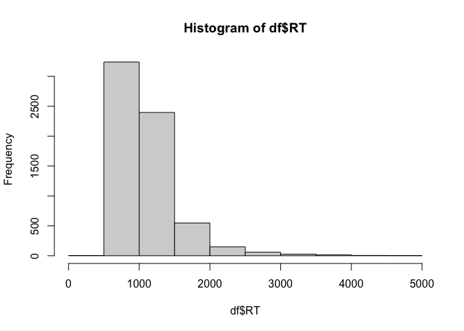
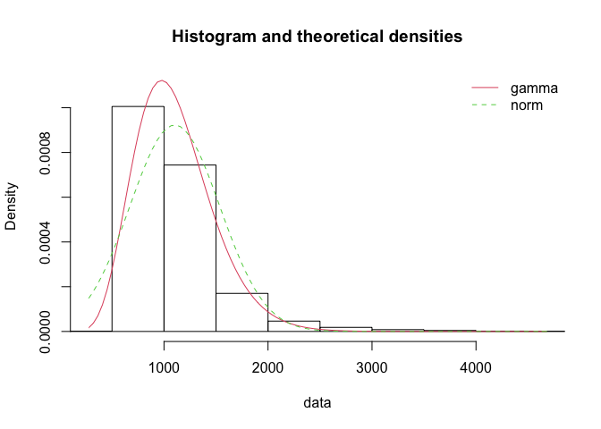

06 CSI online typing: Comparison to verbal naming
================
Kirsten Stark
22 Mai, 2021

# Load packages

``` r
library(dplyr)
```

    ## 
    ## Attaching package: 'dplyr'

    ## The following objects are masked from 'package:stats':
    ## 
    ##     filter, lag

    ## The following objects are masked from 'package:base':
    ## 
    ##     intersect, setdiff, setequal, union

``` r
library(tidyr)
library(lme4)
```

    ## Loading required package: Matrix

    ## 
    ## Attaching package: 'Matrix'

    ## The following objects are masked from 'package:tidyr':
    ## 
    ##     expand, pack, unpack

``` r
library(lmerTest)
```

    ## 
    ## Attaching package: 'lmerTest'

    ## The following object is masked from 'package:lme4':
    ## 
    ##     lmer

    ## The following object is masked from 'package:stats':
    ## 
    ##     step

``` r
library(Rmisc)
```

    ## Loading required package: lattice

    ## Loading required package: plyr

    ## ------------------------------------------------------------------------------

    ## You have loaded plyr after dplyr - this is likely to cause problems.
    ## If you need functions from both plyr and dplyr, please load plyr first, then dplyr:
    ## library(plyr); library(dplyr)

    ## ------------------------------------------------------------------------------

    ## 
    ## Attaching package: 'plyr'

    ## The following objects are masked from 'package:dplyr':
    ## 
    ##     arrange, count, desc, failwith, id, mutate, rename, summarise,
    ##     summarize

``` r
library(Cairo)
#library(strengejacke)
library(ggplot2)
library(sjPlot)

options(scipen=999)

rm(list = ls())
options( "encoding" = "UTF-8" )
set.seed(99)
```

# Load data

Load data from both the verbal online CSI experiment and the typing
online CSI experiment.

Load typing data

``` r
df_typing <- read.csv(here::here("data", "data_long_anonymous.csv"))
```

Select classification type (as in script 05)

``` r
classification_type <- "automatic"
if(classification_type == "automatic") {
  df_typing$answercode <- df_typing$answer_auto_jaro
  df_typing$correct <- df_typing$correct_auto_jaro
} else if(classification_type == "manual") {
  df_typing$answercode <- df_typing$answercode
  df_typing$correct <- df_typing$correct_manual
} else {
  print("Select a correct type!")
}
```

Load verbal data

``` r
load(here::here("data", "verbal_CSI", "CSI_online_verbal_df_full.RData"))
df_verbal <- df_full
```

# Combine both data frames into one

1)  Subset relevant columns and give identical names

<!-- end list -->

``` r
df_typing <- df_typing %>% 
  dplyr::select(subject, item, category, timing.01, PosOr, correct) %>%
  dplyr::rename(RT = timing.01, Pos = PosOr) %>%
  mutate(experiment = "typing")

df_verbal <- df_verbal %>%
  dplyr::select(VP, Item, subcat, VOT, correct, Pos) %>%
  dplyr::rename(subject = VP, item = Item, category = subcat, RT = VOT) %>%
  mutate(experiment = "verbal")
```

2)  Give subjects from both experiments different names

<!-- end list -->

``` r
df_typing <- df_typing %>% mutate(subject = subject + 200)
df_verbal <- df_verbal %>% mutate(subject = subject + 100)
```

3)  Put columns into correct format

<!-- end list -->

``` r
df_typing <- df_typing %>% 
  mutate(subject = as.factor(subject)) %>%
  mutate(item = as.character(item)) %>%
  mutate(category = as.factor(category)) %>% 
  mutate(RT = as.numeric(RT)) %>%
  mutate(Pos = as.numeric(Pos)) %>% 
  mutate(experiment = factor(experiment, levels = c("verbal", "typing")))

df_verbal <- df_verbal %>% 
  mutate(subject = as.factor(subject)) %>%
  mutate(item = as.character(item)) %>%
  mutate(category = as.factor(category)) %>% 
  mutate(RT = as.numeric(RT)) %>%
  mutate(Pos = as.numeric(Pos)) %>% 
  mutate(experiment = factor(experiment, levels = c("verbal", "typing")))
```

4)  Bind both data frames into one

<!-- end list -->

``` r
df <- bind_rows(df_typing, df_verbal)
```

5)  Give identical category names in both experiments

<!-- end list -->

``` r
df <- df %>% dplyr::mutate(category = case_when(category == "Buero" ~ "Büro",
                                  category == "Gebaeude" ~ "Gebäude",
                                  category == "Gemuese" ~ "Gemüse",
                                  category == 
                                    "Koerperteile" ~ "Körperteile",
                                  category == "Kueche" ~ "Küche",
                                  category == 
                                    "Suessigkeiten" ~ "Süssigkeiten",
                                  category == 
                                    "Trinkgefaesse" ~ "Trinkgefässe",
                                  category == "Voegel" ~ "Vögel",
                                  TRUE ~ as.character(category))) %>%
  mutate(category == as.factor(category)) %>% droplevels()
table(df$category)
```

    ## 
    ## Aufbewahrung    Bauernhof       Blumen         Büro       Filler      Filler1 
    ##          300          300          300          300         1200          600 
    ##      Filler2       Fische      Gebäude       Gemüse   Heimwerker     Huftiere 
    ##          600          300          300          300          300          300 
    ##     Insekten  Instrumente       Jacken       Kochen  Körperteile        Küche 
    ##          300          300          300          300          300          300 
    ##         Obst    Raubtiere      Schmuck       Sitzen      Strasse Süssigkeiten 
    ##          300          300          300          300          300          300 
    ## Trinkgefässe        Vögel       Wasser 
    ##          300          300          300

5)  Drop filler trials

<!-- end list -->

``` r
 df <- df %>% filter(category != "Filler" & 
                      category != "Filler1" & category != "Filler2") %>%
  droplevels()
```

6)  Drop incorrect trials

<!-- end list -->

``` r
df <- df %>% filter(!is.na(correct) & correct != 0) %>% 
  dplyr::select(-correct) %>%
  droplevels()
```

7)  Export combined data frame for post-hoc power plot

<!-- end list -->

``` r
write.csv(df, here::here("data", "CSI_online_combined.csv"))
```

# Descriptives

``` r
(descriptives <- df %>% 
   Rmisc::summarySEwithin(.,"RT",idvar = "subject",
                          withinvars = "Pos",
                          betweenvars = "experiment",
                          na.rm = T))
```

    ## Automatically converting the following non-factors to factors: Pos

    ##    experiment Pos   N       RT       sd       se       ci
    ## 1      verbal   1 670 1051.558 273.0161 10.54753 20.71025
    ## 2      verbal   2 651 1078.679 293.7729 11.51387 22.60887
    ## 3      verbal   3 662 1110.344 307.4410 11.94903 23.46264
    ## 4      verbal   4 650 1108.178 308.8411 12.11374 23.78686
    ## 5      verbal   5 631 1172.052 335.0839 13.33948 26.19522
    ## 6      typing   1 645 1009.955 444.1659 17.48902 34.34238
    ## 7      typing   2 633 1085.806 553.3236 21.99264 43.18749
    ## 8      typing   3 638 1105.610 525.8232 20.81754 40.87930
    ## 9      typing   4 637 1143.374 593.4891 23.51489 46.17622
    ## 10     typing   5 625 1174.959 562.0187 22.48075 44.14708

# Plotting

Make plots suitable for APA format

``` r
apatheme <- theme_bw()+
  theme(plot.title=element_text(family="Arial",size=22,hjust = .5),
        panel.grid.major=element_blank(), panel.grid.minor=element_blank(),
        panel.border=element_blank(),axis.line=element_line(),
        text=element_text(family="Arial",size=16))
```

Plot RTs by ordinal position for both experiments

``` r
(plot <- df %>% 
    ggplot(., aes(x=Pos, y=RT, 
                  group=experiment, color=experiment)) +
    stat_summary(fun=mean,  geom="point", size = 2)+
    stat_summary(fun=mean,  geom="line", size = 1) +
    apatheme+
    labs(x="Ordinal Position ",y ="RT (ms)", color = "Experiment"))
```

<!-- -->

``` r
filename <- "CSI_online_exp_comparison_plot_rt.pdf"
ggsave(plot, filename = 
         here::here("results", "figures", filename),
       width = 18, height = 12, units = "cm", 
       dpi = 300, device = cairo_pdf)
embedFonts(file = here::here("results", "figures", filename))
```

# Set contrasts and convert continuous predictor variable

1)  Set contrasts: Sliding difference contrast for factor experiment  
    Subsequent factor levels are being compared to each other,
    i.e. verbal-typing, the intercept being the grand mean.

<!-- end list -->

``` r
# define sliding difference contrast for factor experiment: 
# contrast is verbal - typing, intercept being the grand mean 
levels(df$experiment)
```

    ## [1] "verbal" "typing"

``` r
contrasts(df$experiment) <- MASS::contr.sdif(2)
```

2)  Center the continuous predictor variable position around zero
    (ordinal contrast with five levels)

<!-- end list -->

``` r
df$Pos.cont <- scale(as.numeric(as.character(df$Pos)),
                       center = T, scale = F)
# table(df$Pos.cont)
# mean(df$Pos.cont)
```

# Check distribution of data

Are the data normally distributed or does a gamma distribution fit the
data better?  
*Histogram of the reaction time data*

``` r
hist(df$RT)
```

<!-- -->

*Check fit of normal vs gamma distribution in histograms, q-q-plots and
using objective criteria:*  
1\) Fit normal and gamma distributions to the reaction time data

``` r
library(fitdistrplus)
```

    ## Loading required package: MASS

    ## 
    ## Attaching package: 'MASS'

    ## The following object is masked from 'package:dplyr':
    ## 
    ##     select

    ## Loading required package: survival

``` r
fit.normal<- fitdist(df$RT, distr = "norm", method = "mle")
summary(fit.normal)
```

    ## Fitting of the distribution ' norm ' by maximum likelihood 
    ## Parameters : 
    ##       estimate Std. Error
    ## mean 1103.4596   5.389018
    ## sd    432.5251   3.810561
    ## Loglikelihood:  -48241.43   AIC:  96486.85   BIC:  96500.39 
    ## Correlation matrix:
    ##      mean sd
    ## mean    1  0
    ## sd      0  1

``` r
#plot(fit.normal)
```

``` r
fit.gamma <- fitdist(df$RT, distr = "gamma", method = "mle")
summary(fit.gamma)
```

    ## Fitting of the distribution ' gamma ' by maximum likelihood 
    ## Parameters : 
    ##          estimate   Std. Error
    ## shape 8.714704899 0.1288279543
    ## rate  0.007897942 0.0001182167
    ## Loglikelihood:  -47047.64   AIC:  94099.27   BIC:  94112.81 
    ## Correlation matrix:
    ##           shape      rate
    ## shape 1.0000000 0.9607663
    ## rate  0.9607663 1.0000000

``` r
#plot(fit.gamma)
```

2)  Compare the fit of the two distributions  
    Visually compare fit of both distributions in histogram

<!-- end list -->

``` r
denscomp(list(fit.gamma, fit.normal))
```

<!-- -->
Visually compare fit of both distributions in Q-Q-plots

``` r
qqcomp(list(fit.gamma, fit.normal))
```

<!-- -->

Compare information criteria

``` r
gofstat(list(fit.gamma, fit.normal),
        fitnames = c("Gamma", "Normal"))
```

    ## Goodness-of-fit statistics
    ##                                     Gamma      Normal
    ## Kolmogorov-Smirnov statistic   0.08526673   0.1349558
    ## Cramer-von Mises statistic    16.64374270  45.0123565
    ## Anderson-Darling statistic   100.97376437 263.8788753
    ## 
    ## Goodness-of-fit criteria
    ##                                   Gamma   Normal
    ## Akaike's Information Criterion 94099.27 96486.85
    ## Bayesian Information Criterion 94112.81 96500.39

**Conclusion:** Both the visual inspection and the objective criteria
suggest that a gamma distribution fits the data better. Therefore, we
fit a Gamma distribution in a GLMM with the continuous predictor ordinal
position (Pos.cont), the factorial predictor (experiment), and their
interaction. We compute the maximal random effects structure.

# Interferential statistics: GLMM with predictors Pos.cont and experiment

``` r
m1 <- afex::lmer_alt(RT ~ Pos.cont*experiment +
               (Pos.cont||subject) +(Pos.cont*experiment||category),
             data = df,
            family =Gamma(link ="identity"),
            control=glmerControl(optimizer = "bobyqa", optCtrl = list(maxfun = 2e5)))
```

    ## Registered S3 methods overwritten by 'car':
    ##   method                          from
    ##   influence.merMod                lme4
    ##   cooks.distance.influence.merMod lme4
    ##   dfbeta.influence.merMod         lme4
    ##   dfbetas.influence.merMod        lme4

``` r
summary(m1)
```

    ## Generalized linear mixed model fit by maximum likelihood (Laplace
    ##   Approximation) [glmerMod]
    ##  Family: Gamma  ( identity )
    ## Formula: RT ~ Pos.cont * experiment + (1 + re1.Pos.cont || subject) +  
    ##     (1 + re2.Pos.cont + re2.experiment2.1 + re2.Pos.cont_by_experiment2.1 ||  
    ##         category)
    ##    Data: data
    ## Control: glmerControl(optimizer = "bobyqa", optCtrl = list(maxfun = 200000))
    ## 
    ##      AIC      BIC   logLik deviance df.resid 
    ##  91500.8  91575.3 -45739.4  91478.8     6431 
    ## 
    ## Scaled residuals: 
    ##     Min      1Q  Median      3Q     Max 
    ## -2.0610 -0.6089 -0.2349  0.3176  9.4786 
    ## 
    ## Random effects:
    ##  Groups     Name                          Variance  Std.Dev.
    ##  subject    (Intercept)                   5632.0470 75.0470 
    ##  subject.1  re1.Pos.cont                   418.1712 20.4492 
    ##  category   (Intercept)                   4510.9510 67.1636 
    ##  category.1 re2.Pos.cont                   247.0792 15.7188 
    ##  category.2 re2.experiment2.1             4224.1364 64.9934 
    ##  category.3 re2.Pos.cont_by_experiment2.1  502.1754 22.4093 
    ##  Residual                                    0.0988  0.3143 
    ## Number of obs: 6442, groups:  subject, 60; category, 24
    ## 
    ## Fixed effects:
    ##                        Estimate Std. Error t value             Pr(>|z|)    
    ## (Intercept)            1153.267      4.780 241.287 < 0.0000000000000002 ***
    ## Pos.cont                 34.353      4.735   7.256    0.000000000000399 ***
    ## experiment2-1           289.641      4.839  59.850 < 0.0000000000000002 ***
    ## Pos.cont:experiment2-1   11.365      7.184   1.582                0.114    
    ## ---
    ## Signif. codes:  0 '***' 0.001 '**' 0.01 '*' 0.05 '.' 0.1 ' ' 1
    ## 
    ## Correlation of Fixed Effects:
    ##             (Intr) Ps.cnt exp2-1
    ## Pos.cont     0.177              
    ## expermnt2-1 -0.221 -0.193       
    ## Ps.cnt:x2-1 -0.278 -0.161  0.115

``` r
# save model output
tab_model(m1,transform = NULL,
          show.re.var = F, show.stat = T,show.r2 = F,show.icc = F,
          title = "GLMM (Gamma distribution)",
          pred.labels = c("(Intercept)", "Ordinal Position", 
                          "Experiment", "(Ordinal Position) x 
                          \n (Experiment)"),
          wrap.labels = 10,
          dv.labels = "Typing Onset Latency",
          #string.pred = "",
          string.stat = "t-Value",
          file = here::here("results", "tables",
                            "CSI_online_experiment_comparison_glmm_cont.html"))
```

<table style="border-collapse:collapse; border:none;">

<caption style="font-weight: bold; text-align:left;">

GLMM (Gamma distribution)

</caption>

<tr>

<th style="border-top: double; text-align:center; font-style:normal; font-weight:bold; padding:0.2cm;  text-align:left; ">

 

</th>

<th colspan="4" style="border-top: double; text-align:center; font-style:normal; font-weight:bold; padding:0.2cm; ">

Typing Onset Latency

</th>

</tr>

<tr>

<td style=" text-align:center; border-bottom:1px solid; font-style:italic; font-weight:normal;  text-align:left; ">

Predictors

</td>

<td style=" text-align:center; border-bottom:1px solid; font-style:italic; font-weight:normal;  ">

Estimates

</td>

<td style=" text-align:center; border-bottom:1px solid; font-style:italic; font-weight:normal;  ">

CI

</td>

<td style=" text-align:center; border-bottom:1px solid; font-style:italic; font-weight:normal;  ">

t-Value

</td>

<td style=" text-align:center; border-bottom:1px solid; font-style:italic; font-weight:normal;  ">

p

</td>

</tr>

<tr>

<td style=" padding:0.2cm; text-align:left; vertical-align:top; text-align:left; ">

(Intercept)

</td>

<td style=" padding:0.2cm; text-align:left; vertical-align:top; text-align:center;  ">

1153.27

</td>

<td style=" padding:0.2cm; text-align:left; vertical-align:top; text-align:center;  ">

1143.90 – 1162.64

</td>

<td style=" padding:0.2cm; text-align:left; vertical-align:top; text-align:center;  ">

241.29

</td>

<td style=" padding:0.2cm; text-align:left; vertical-align:top; text-align:center;  ">

<strong>\<0.001

</td>

</tr>

<tr>

<td style=" padding:0.2cm; text-align:left; vertical-align:top; text-align:left; ">

Ordinal Position

</td>

<td style=" padding:0.2cm; text-align:left; vertical-align:top; text-align:center;  ">

34.35

</td>

<td style=" padding:0.2cm; text-align:left; vertical-align:top; text-align:center;  ">

25.07 – 43.63

</td>

<td style=" padding:0.2cm; text-align:left; vertical-align:top; text-align:center;  ">

7.26

</td>

<td style=" padding:0.2cm; text-align:left; vertical-align:top; text-align:center;  ">

<strong>\<0.001

</td>

</tr>

<tr>

<td style=" padding:0.2cm; text-align:left; vertical-align:top; text-align:left; ">

Experiment

</td>

<td style=" padding:0.2cm; text-align:left; vertical-align:top; text-align:center;  ">

289.64

</td>

<td style=" padding:0.2cm; text-align:left; vertical-align:top; text-align:center;  ">

280.16 – 299.13

</td>

<td style=" padding:0.2cm; text-align:left; vertical-align:top; text-align:center;  ">

59.85

</td>

<td style=" padding:0.2cm; text-align:left; vertical-align:top; text-align:center;  ">

<strong>\<0.001

</td>

</tr>

<tr>

<td style=" padding:0.2cm; text-align:left; vertical-align:top; text-align:left; ">

(Ordinal Position) x

(Experiment)

</td>

<td style=" padding:0.2cm; text-align:left; vertical-align:top; text-align:center;  ">

11.37

</td>

<td style=" padding:0.2cm; text-align:left; vertical-align:top; text-align:center;  ">

\-2.71 – 25.44

</td>

<td style=" padding:0.2cm; text-align:left; vertical-align:top; text-align:center;  ">

1.58

</td>

<td style=" padding:0.2cm; text-align:left; vertical-align:top; text-align:center;  ">

0.114

</td>

</tr>

<tr>

<td style=" padding:0.2cm; text-align:left; vertical-align:top; text-align:left; padding-top:0.1cm; padding-bottom:0.1cm;">

N <sub>subject</sub>

</td>

<td style=" padding:0.2cm; text-align:left; vertical-align:top; padding-top:0.1cm; padding-bottom:0.1cm; text-align:left;" colspan="4">

60

</td>

<tr>

<td style=" padding:0.2cm; text-align:left; vertical-align:top; text-align:left; padding-top:0.1cm; padding-bottom:0.1cm;">

N <sub>category</sub>

</td>

<td style=" padding:0.2cm; text-align:left; vertical-align:top; padding-top:0.1cm; padding-bottom:0.1cm; text-align:left;" colspan="4">

24

</td>

<tr>

<td style=" padding:0.2cm; text-align:left; vertical-align:top; text-align:left; padding-top:0.1cm; padding-bottom:0.1cm; border-top:1px solid;">

Observations

</td>

<td style=" padding:0.2cm; text-align:left; vertical-align:top; padding-top:0.1cm; padding-bottom:0.1cm; text-align:left; border-top:1px solid;" colspan="4">

6442

</td>

</tr>

</table>
